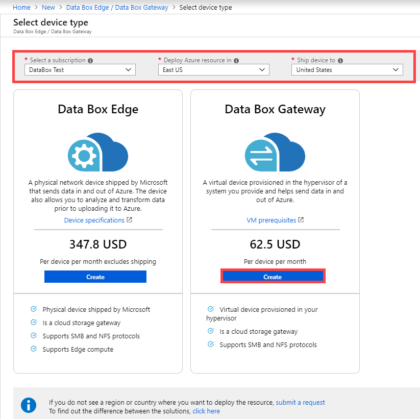
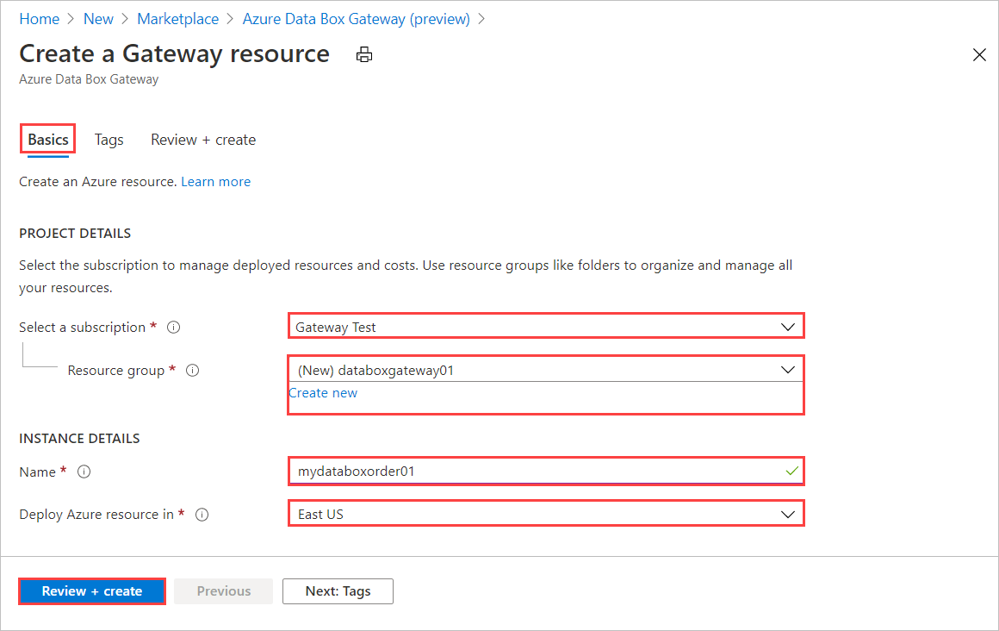
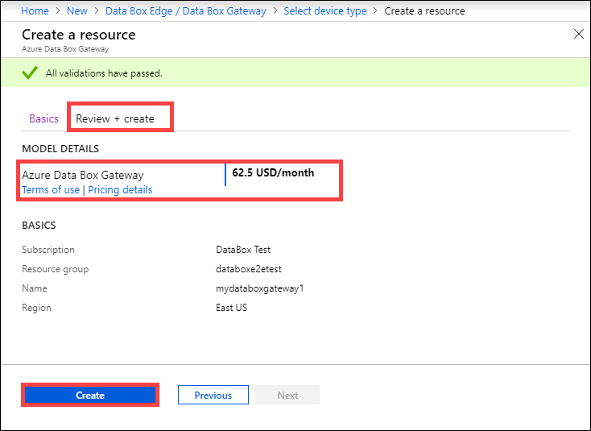
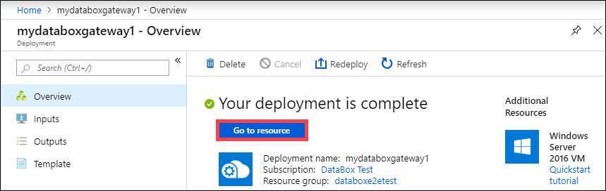
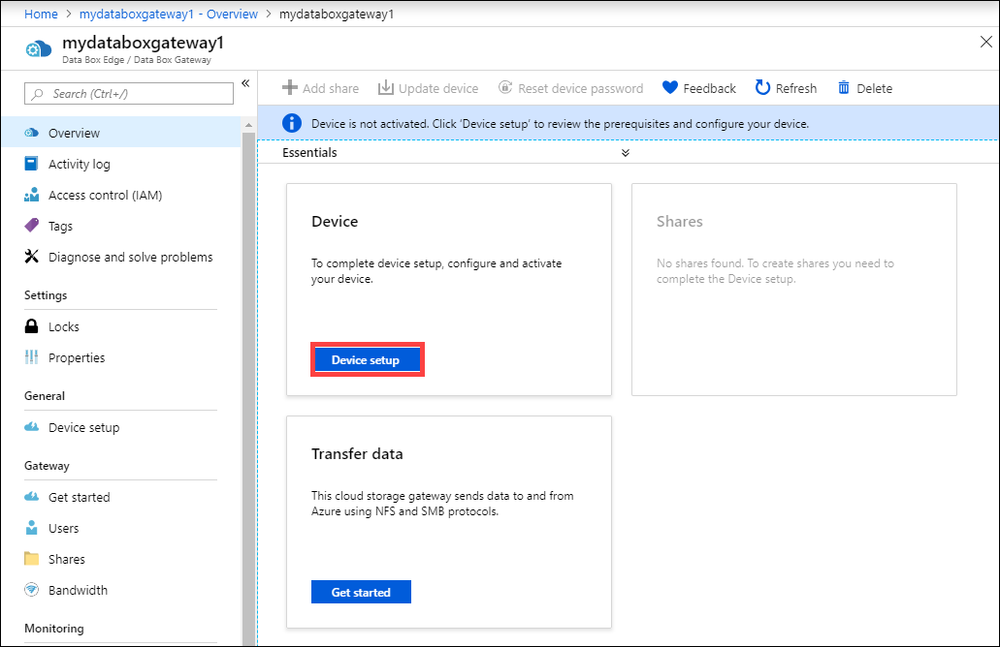
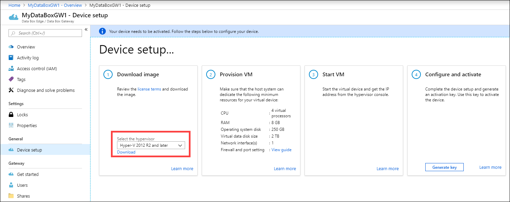
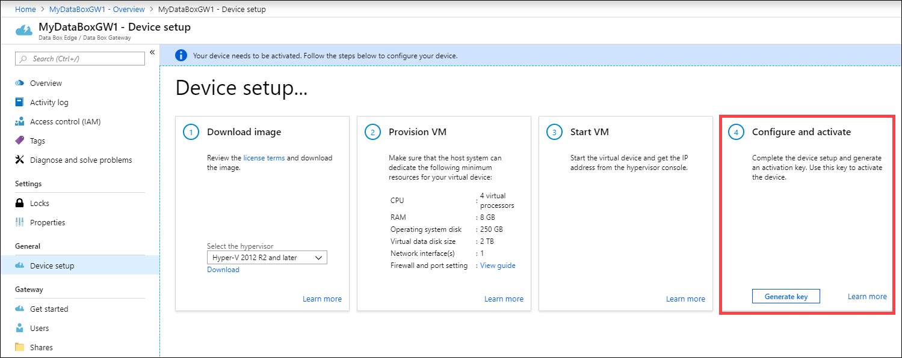
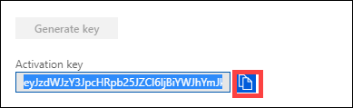

# Tutorial: Prepare to deploy Azure Data Box Gateway

This is the first tutorial in the series of deployment tutorials required to completely deploy your Azure Data Box Gateway. This tutorial describes how to prepare the Azure portal to deploy Data Box Gateway resource. 

You need administrator privileges to complete the setup and configuration process. The portal preparation takes less than 10 minutes.

In this tutorial, you learn how to:

> [!div class="checklist"]
> * Create a new resource
> * Download the virtual device image
> * Get the activation key

## Get started

To deploy your Data Box Gateway, refer to the following tutorials in the prescribed sequence.

| **#** | **In this step** | **Use these documents** |
| --- | --- | --- | 
| 1. |**[Prepare the Azure portal for Data Box Gateway](data-box-gateway-deploy-prep.md)** |Create and configure your Data Box Gateway resource prior to provisioning a Data Box Gateway virtual device. |
| 2. |**[Provision the Data Box Gateway in Hyper-V](data-box-gateway-deploy-provision-hyperv.md)**    **[Provision the Data Box Gateway in VMware](data-box-gateway-deploy-provision-vmware.md)**|For Hyper-V, provision and connect to a Data Box Gateway virtual device on a host system running Hyper-V on Windows Server 2016 or Windows Server 2012 R2.     For VMware, provision and connect to a Data Box Gateway virtual device on a host system running VMware ESXi 6.0, 6.5, or 6.7.   |
| 3. |**[Connect, set up, activate the Data Box Gateway](data-box-gateway-deploy-connect-setup-activate.md)** |Connect to the local web UI, complete the device setup, and activate the device. You can then provision SMB shares.  |
| 4. |**[Transfer data with Data Box Gateway](data-box-gateway-deploy-add-shares.md)** |Add shares, connect to shares via SMB or NFS. |

You can now begin to set up the Azure portal.

## Prerequisites

Here you find the configuration prerequisites for your Data Box Gateway resource, your Data Box Gateway device, and the datacenter network.

### For the Data Box Gateway resource

Before you begin, make sure that:

- Your Microsoft Azure subscription should be supported for Data Box Gateway resource. Pay-as-you-go subscriptions are also supported.
- You have owner or contributor access at resource group level for the Data Box Edge/Data Box Gateway, IoT Hub, and Azure Storage resources.

    - To create any Data Box Edge/ Data Box Gateway resource, you should have permissions as a contributor (or higher) scoped at resource group level. You also need to make sure that the `Microsoft.DataBoxEdge` provider is registered. For information on how to register, go to [Register resource provider](data-box-gateway-manage-access-power-connectivity-mode.md#register-resource-providers).
    - To create a Storage account resource, again you need contributor or higher access scoped at the resource group level. Azure Storage is by default a registered resource provider.
- You have admin or user access to Azure Active Directory Graph API. For more information, see [Azure Active Directory Graph API](https://docs.microsoft.com/previous-versions/azure/ad/graph/howto/azure-ad-graph-api-permission-scopes#default-access-for-administrators-users-and-guest-users-).
- You have your Microsoft Azure storage account with access credentials.

### For the Data Box Gateway device

Before you deploy a virtual device, make sure that:

- You have access to a host system running Hyper-V on Windows Server 2012 R2 or later or VMware (ESXi 6.0, 6.5, or 6.7) that can be used to a provision a device.
- The host system is able to dedicate the following resources to provision your Data Box virtual device:
  
  - A minimum of 4 virtual processors.
  - At least 8 GB of RAM.
  - One network interface.
  - A 250 GB OS disk.
  - A 2 TB virtual disk for system data.

### For the datacenter network

Before you begin, make sure that:

- The network in your datacenter is configured as per the networking requirements for your Data Box Gateway device. For more information, see the [Data Box Gateway system requirements](data-box-gateway-system-requirements.md).

- For normal operating conditions of your Data Box Gateway, you should have a:

    - A minimum of 10-Mbps download bandwidth to ensure the device stays updated.
    - A minimum of 20-Mbps dedicated upload and download bandwidth to transfer files.

## Create a new resource

If you have an existing Data Box Gateway resource to manage your virtual devices, skip this step and go to [Get the activation key](#get-the-activation-key).

To create a Data Box Gateway resource, take the following steps in the Azure portal.

1. Use your Microsoft Azure credentials to sign in to:

    - The Azure portal at this URL: [https://portal.azure.com](https://portal.azure.com).
    - Or, the Azure Government portal at this URL: [https://portal.azure.us](https://portal.azure.us). For more details, go to [Connect to Azure Government using the portal](https://docs.microsoft.com/azure/azure-government/documentation-government-get-started-connect-with-portal).

2. In the left-pane, select **+ Create a resource**. Search for **Data Box Edge / Data Box Gateway**. Select Data Box Edge / Data Box Gateway. Select **Create**.
3. Pick the subscription that you want to use for Data Box Gateway device. Select the region where you want to deploy the Data Box Gateway resource. For this release, East US, South East Asia, and West Europe are available. Choose a location closest to the geographical region where you want to deploy your device. In the **Data Box Gateway** option, select **Create**.

    

4. On the **Basics** tab, enter or select the following **Project details**.
    
    |Setting  |Value  |
    |---------|---------|
    |Subscription    |This is automatically populated based on the earlier selection. Subscription is linked to your billing account. |
    |Resource group  |Select an existing group or create a new group. Learn more about [Azure Resource Groups](../azure-resource-manager/resource-group-overview.md).     |

5. Enter or select the following **Instance details**.

    |Setting  |Value  |
    |---------|---------|
    |Name   | A friendly name to identify the resource. The name has between 2 and 50 characters containing letter, numbers, and hyphens.  Name starts and ends with a letter or a number.        |   
    |Region     |For this release, East US, South East Asia, and West Europe are available to deploy your resource. For the Azure Government, all the government regions listed in the [Azure regions](https://azure.microsoft.com/global-infrastructure/regions/) are available.   Choose a location closest to the geographical region where you want to deploy your device.|
    
    
    
6. Select **Review + create**.
 
7. On the **Review + create** tab, review the **Pricing details**, **Terms of use**, and the details for your resource. Select **Create**.

    

The resource creation takes a few minutes. After the resource is successfully created and deployed, you're notified. Select **Go to resource**.

## Download the virtual device image

After the Data Box Gateway resource is created, download the appropriate virtual device image to provision a virtual device on your host system. The virtual device images are specific to an operating system.

> [!IMPORTANT]
> The software running on the Data Box Gateway may only be used with the Data Box Gateway resource.

Follow these steps in the [Azure portal](https://portal.azure.com/) to download a virtual device image.

1. In the resource that you created and then select **Overview**. If you have an existing Azure Data Box Gateway resource, select the resource and go to **Overview**. Select **Device setup**.

    

2. On the **Download image** tile, select the virtual device image corresponding to the operating system on the host server used to provision the VM. The image files are approximately 5.6 GB.
   
   * [VHDX for Hyper-V on Windows Server 2012 R2 and later](https://aka.ms/dbe-vhdx-2012).
   * [VMDK for VMWare ESXi 6.0, 6.5, or 6.7](https://aka.ms/dbe-vmdk).

    

5. Download and unzip the file to a local drive, making a note of where the unzipped file is located.

## Get the activation key

After the Data Box Gateway resource is up and running, you'll need to get the activation key. This key is used to activate and connect your Data Box Gateway device with the resource. You can get this key now while you are in the Azure portal.

1. Select the resource that you created, and then select **Overview**. In the **Device setup**, go to the **Configure and activate** tile.

    

2. Select **Generate key** to create an activation key. Select the copy icon to copy the key and save it for later use.

    

> [!IMPORTANT]
> - The activation key expires three days after it is generated.
> - If the key has expired, generate a new key. The older key is not valid.

## Next steps

In this tutorial, you learned about Data Box Gateway topics such as:

> [!div class="checklist"]
> * Create a new resource
> * Download the virtual device image
> * Get the activation key

Advance to the next tutorial to learn how to provision a virtual machine for your Data Box Gateway. Depending on your host operating system, see the detailed instructions in:

> [!div class="nextstepaction"]
> [Provision a Data Box Gateway in Hyper-V](./data-box-gateway-deploy-provision-hyperv.md)

OR

> [!div class="nextstepaction"]
> [Provision a Data Box Gateway in VMware](./data-box-gateway-deploy-provision-vmware.md)

