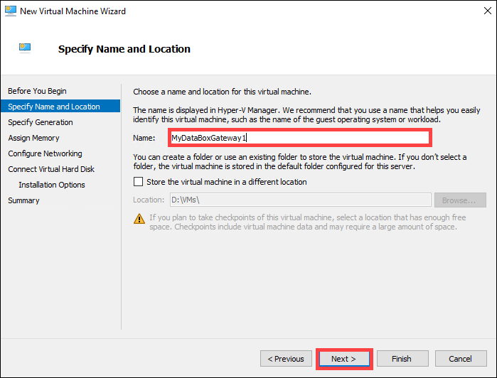
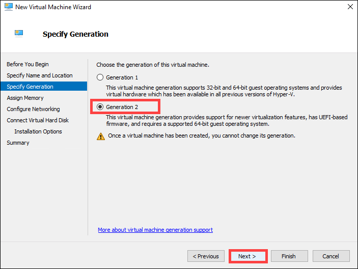
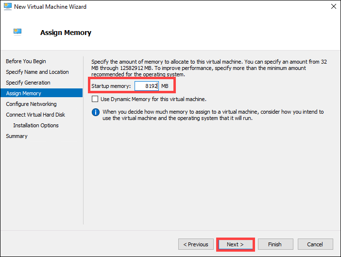
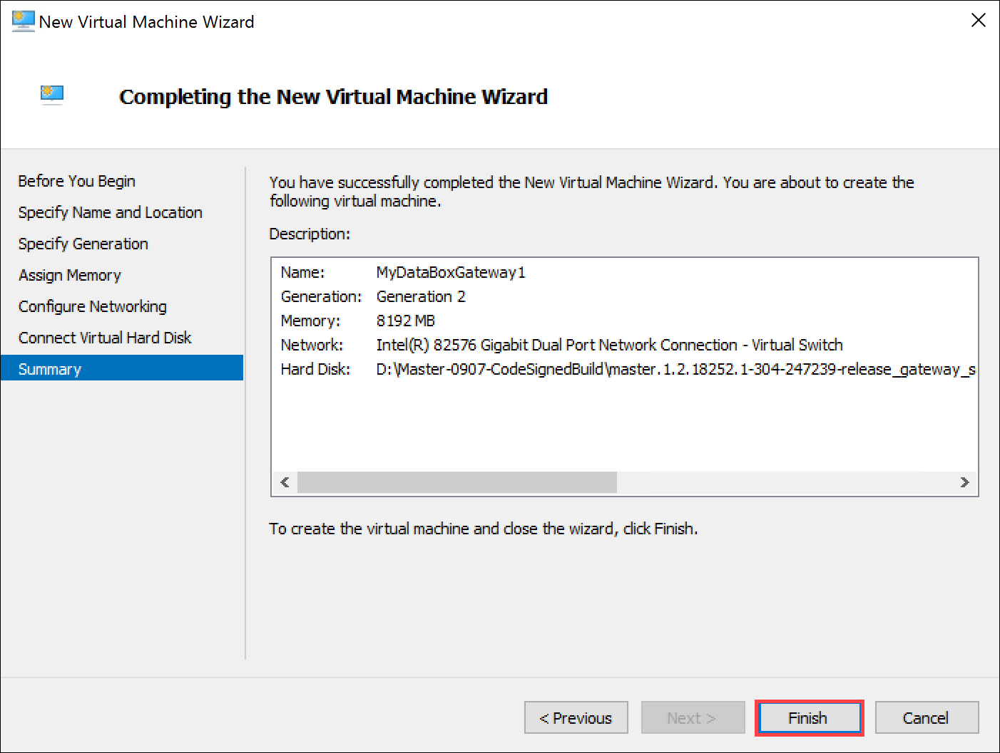
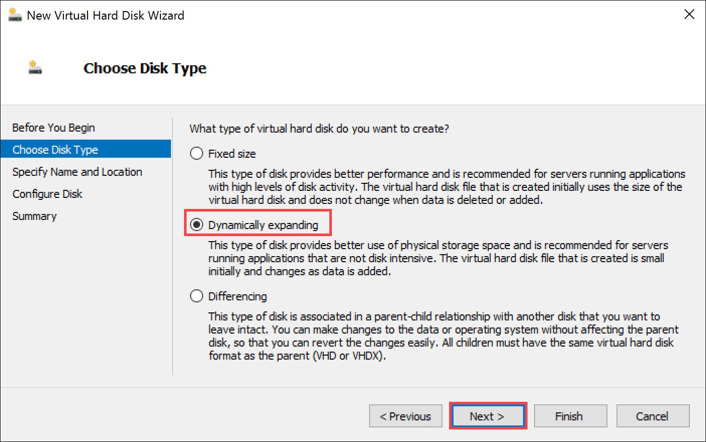
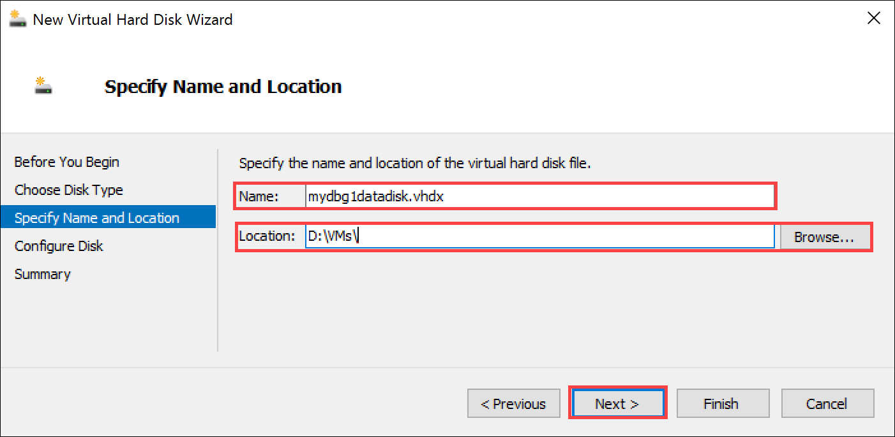
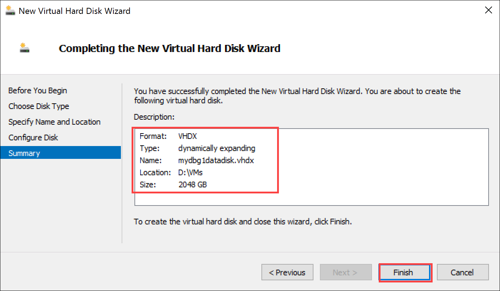
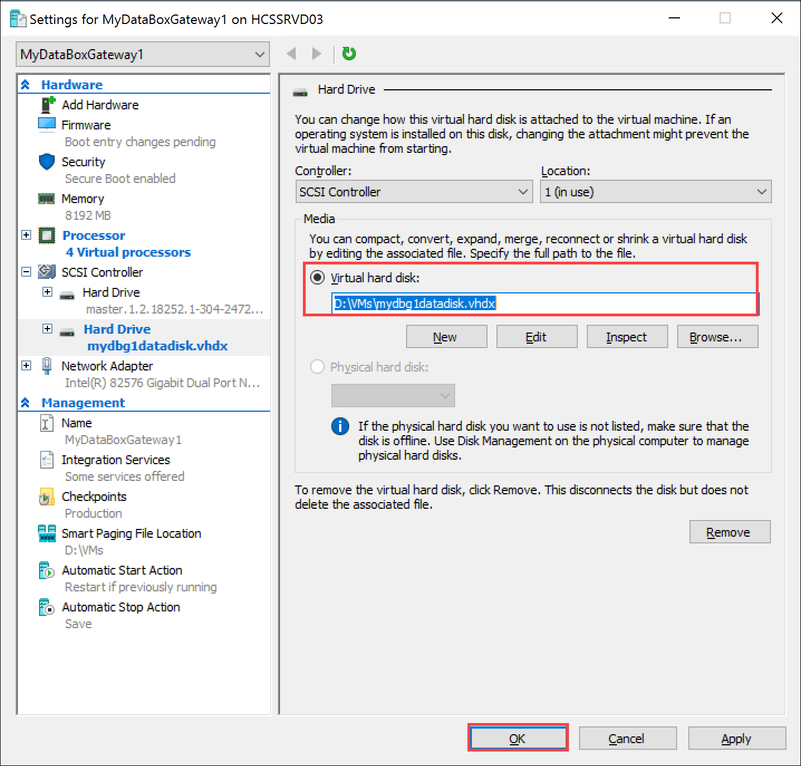
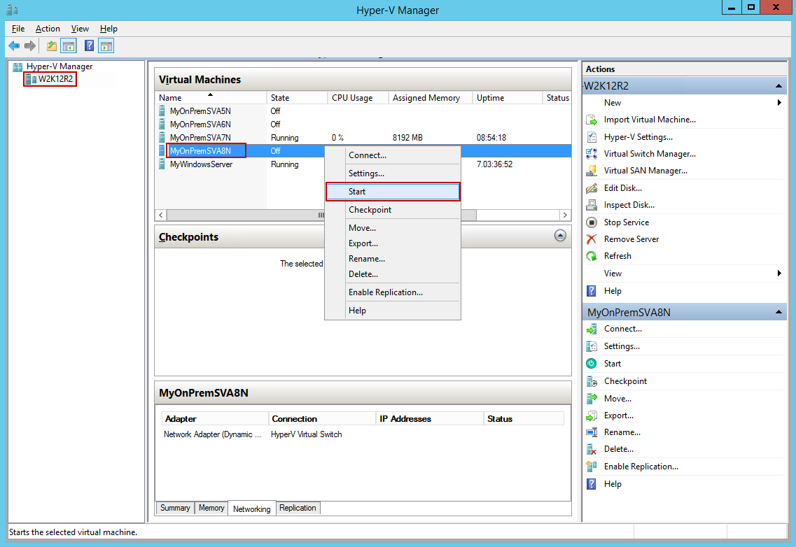
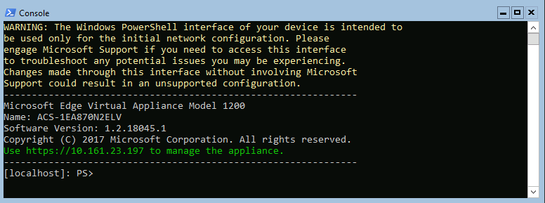

# Tutorial: Provision Azure Data Box Gateway in Hyper-V (Preview)

## Overview

This tutorial describes how to provision a Data Box Gateway on a host system running Hyper-V on Windows Server 2016, Windows Server 2012 R2, or Windows Server 2012. 

You need administrator privileges to provision and configure a virtual device. The provisioning and initial setup can take around 10 minutes to complete.

In this tutorial, you learn how to:

> [!div class="checklist"]
> * Ensure host meets minimum device requirements
> * Provision a virtual device in hypervisor
> * Start the virtual device and get the IP address

If you don't have an Azure subscription, create a [free account](https://azure.microsoft.com/free/?WT.mc_id=A261C142F) before you begin.

> [!IMPORTANT]
> - Data Box Gateway is in preview. Review the [Azure terms of service for preview](https://azure.microsoft.com/support/legal/preview-supplemental-terms/) before you order and deploy this solution.

## Prerequisites

The prerequisites to provision a virtual device on a host system running Hyper-V on Windows Server 2016 or Windows Server 2012 R2, are as follows.

### For the Data Box Gateway resource

Before you begin, make sure that:

* You have completed all the steps in [Prepare the portal for Data Box Gateway](data-box-gateway-deploy-prep.md).
* You have downloaded the virtual device image for Hyper-V from the Azure portal as described in [Prepare the portal for Data Box Gateway](data-box-gateway-deploy-prep.md).

  > [!IMPORTANT]
  > The software running on the Data Box Gateway may only be used with the Data Box Gateway resource.
 
### For the Data Box Gateway virtual device

Before you deploy a device, make sure that:

* You have access to a host system running Hyper-V on Windows Server 2012 R2 or later that can be used to a provision a device.
* The host system is able to dedicate the following resources to provision your virtual device:

  * A minimum of 4 cores.
  * At least 8 GB of RAM. 
  * One network interface.
  * A 250 GB OS disk.
  * A 2 TB virtual disk for data.

### For the network in the datacenter

Before you begin:

- Review the networking requirements to deploy a Data Box Gateway and configure the datacenter network as per the requirements. For more information, see [Data Box Gateway networking requirements](data-box-gateway-system-requirements.md#networking-requirements).
- Make sure that the minimum Internet bandwidth is 20 Mbps to allow for optimal working of the device.

## Check the host system

To create a virtual device, you need:

* The Hyper-V role installed on Windows Server 2016, Windows Server 2012 R2, or Windows Server 2012.
* Microsoft Hyper-V Manager on a Microsoft Windows client connected to the host.
* Make sure that the underlying hardware (host system) on which you are creating the virtual device is able to dedicate the following resources to your virtual device:

    * A minimum of 4 cores.
    * At least 8 GB of RAM.
    * One network interface connected to the network capable of routing traffic to Internet. 
    * A 250 GB OS disk.
    * A 2 TB virtual disk for system data.

## Provision a virtual device in hypervisor

Perform the following steps to provision a device in your hypervisor.

1. On your Windows Server host, copy the virtual device image to a local drive. You downloaded this VHDX image through the Azure portal. Make a note of the location where you copied the image as you are using this image later in the procedure.
2. Open **Server Manager**. In the top right corner, click **Tools** and select **Hyper-V Manager**.

      
  
3. In **Hyper-V Manager**, in the scope pane, right-click your system node to open the context menu, and then click **New** > **Virtual Machine**.

   
4. On the **Before you begin** page of the New Virtual Machine Wizard, click **Next**.
5. On the **Specify name and location** page, provide a **Name** for your virtual device. Click **Next**.

   
6. On the **Specify generation** page, choose **Generation 2** for the .vhdx device image type, and then click **Next**.    

   
7. On the **Assign memory** page, specify a **Startup memory** of at least **8192 MB**, don't enable dynamic memory, and then click **Next**.

    
8. On the **Configure networking** page, specify the virtual switch that is connected to the Internet and then click **Next**.

   
9. On the **Connect virtual hard disk** page, choose **Use an existing virtual hard disk**, specify the location of the virtual device image, and then click **Next**.

   
10. Review the **Summary** and then click **Finish** to create the virtual machine.

    
11. To meet the minimum requirements, you need 4 cores. To add 4 virtual processors, select your host system in the **Hyper-V Manager** window. In the right-pane under the list of **Virtual Machines**, locate the virtual machine you just created. Select and right-click the machine name and select **Settings**.

    
12. On the **Settings** page, in the left-pane, click **Processor**. In the right-pane, set **number of virtual processors** to 4 (or more). Click **Apply**.

    
13. To meet the minimum requirements, you also need to add a 2 TB virtual data disk. In the **Settings** page:

    1. In the left pane, select **SCSI Controller**.
    2. In the right pane, select **Hard Drive,** and click **Add**.

    
14. On the **Hard drive** page, select the **Virtual hard disk** option and click **New**. The **New Virtual Hard Disk Wizard** starts.

    
1. On the **Before you begin** page of the New Virtual Hard Disk Wizard, click **Next**.
2. On the **Choose Disk Format page**, accept the default option of **VHDX** format. Click **Next**.
   
17. On the **Choose Disk Type page**, set virtual hard disk type as **Dynamically expanding** (recommended). **Fixed size** disk would work but you may need to wait a long time. We recommend that you do not use the **Differencing** option. Click **Next**. 

    
18. On the **Specify Name and Location** page, provide a **name** as well as **location** (you can browse to one) for the data disk. Click **Next**.

    
19. On the **Configure Disk** page, select the option **Create a new blank virtual hard disk** and specify the size as **2 TB** (or more). While 2 TB is the minimum requirement, you can always provision a larger disk. Note that you cannot shrink the disk once provisioned.  You can however expand the disk by adding a data disk. Click **Next**.

    
20. On the **Summary** page, review the details of your virtual data disk and if satisfied, click **Finish** to create the disk. The wizard closes and a virtual hard disk is added to your machine.

    
21. Return to the **Settings** page. Click **OK** to close the **Settings** page and return to Hyper-V Manager window.

    

## Start the virtual device and get the IP
Perform the following steps to start your virtual device and connect to it.

#### To start the virtual device
1. Start the virtual device.

   
2. After the device is running, select the device, right click, and select **Connect**.

3. You may have to wait 10-15 minutes for the device to be ready. A status message is displayed on the console to indicate the progress. After the device is ready, go to **Action**. Press `Ctrl + Alt + Delete` to log in to the virtual device. The default user is *EdgeUser* and the default password is *Password1*.

   
   
6. Steps 5-7 only apply when booting up in a non-DHCP environment. If you are in a DHCP environment, then skip these steps. If you booted up your device in non-DHCP environment, you will see a message to the effect.
    
7. To configure the network, use the `Get-HcsIpAddress` command to list the network interfaces enabled on your virtual device. If your device has a single network interface enabled, the default name assigned to this interface is `Ethernet`.

8. Use the `Set-HcsIpAddress` cmdlet to configure the network. See the following example:

    `Set-HcsIpAddress –Name Ethernet –IpAddress 10.161.22.90 –Netmask 255.255.255.0 –Gateway 10.161.22.1`
    
9. After the initial setup is complete and the device has booted up, you will see the device banner text. Make a note of the IP address and the URL displayed in the banner text to manage the device. Use this IP address to connect to the web UI of your virtual device and complete the local setup and activation.

   
      

If your device does not meet the minimum configuration requirements, you see an error in the banner text. Modify the device configuration so that the machine has adequate resources to meet the minimum requirements. You can then restart and connect to the device. Refer to the minimum configuration requirements in [Check the host system meets minimum virtual device requirements](#check-the-host-system).

<!--If you face any other error during the initial configuration using the local web UI, refer to the following workflows:

* Run diagnostic tests to [troubleshoot web UI setup](storsimple-ova-web-ui-admin.md#troubleshoot-web-ui-setup-errors).
* [Generate log package and view log files](storsimple-ova-web-ui-admin.md#generate-a-log-package).-->

## Next steps

In this tutorial, you learned about Data Box Gateway topics such as:

> [!div class="checklist"]
> * Ensure host meets minimum device requirements
> * Provision a virtual device in hypervisor
> * Start the virtual device and get the IP address

Advance to the next tutorial to learn how to connect, set up, and activate your virtual device.

> [!div class="nextstepaction"]
> [Connect and set up your Data Box Gateway](./data-box-gateway-deploy-connect-setup-activate.md)

