# Tutorial: Provision Azure Data Box Gateway in VMware

## Overview

This tutorial describes how to provision a Data Box Gateway on a host system running VMware ESXi 6.0, 6.5, or 6.7. 

You need administrator privileges to provision and connect to a virtual device. The provisioning and initial setup can take around 10 minutes to complete. 

In this tutorial, you learn how to:

> [!div class="checklist"]
> * Ensure host meets minimum device requirements
> * Provision a virtual device in VMware
> * Start the virtual device and get the IP address

If you don't have an Azure subscription, create a [free account](https://azure.microsoft.com/free/?WT.mc_id=A261C142F) before you begin.

## Prerequisites

The prerequisites to provision a virtual device on a host system running VMware ESXi 6.0, 6.5, or 6.7, are as follows.

### For the Data Box Gateway resource

Before you begin, make sure that:

* You have completed all the steps in [Prepare the portal for Data Box Gateway](data-box-gateway-deploy-prep.md).
* You have downloaded the virtual device image for VMware from the Azure portal as described in [Prepare the portal for Data Box Gateway](data-box-gateway-deploy-prep.md).

  > [!IMPORTANT]
  > The software running on the Data Box Gateway may only be used with the Data Box Gateway resource.

### For the Data Box Gateway virtual device

Before you deploy a virtual device, make sure that:

* You have access to a host system running VMware (ESXi 6.0, 6.5, or 6.7) that can be used to a provision a device.
* The host system is able to dedicate the following resources to provision your virtual device:

  * A minimum of 4 cores.
  * At least 8 GB of RAM.
  * One network interface.
  * A 250 GB OS disk.
  * A 2 TB virtual disk for system data.

### For the network in datacenter

Before you begin:

- Review the networking requirements to deploy a Data Box Gateway and configure the datacenter network as per the requirements. For more information, see [Data Box Gateway networking requirements](data-box-gateway-system-requirements.md#networking-port-requirements).
- Make sure that the minimum Internet bandwidth is 20 Mbps to allow for optimal working of the device.

## Check the host system

To create a virtual device, you need:

* Access to a host system running VMware ESXi Server 6.0, 6.5, or 6.7. The host system is able to dedicate the following resources to your virtual device:
 
  * A minimum of 4 virtual processors.
  * At least 8 GB of RAM. 
  * One network interface connected to the network capable of routing traffic to Internet.
  * A 250 GB OS disk.
  * A 2 TB virtual disk for data.
* VMware vSphere client on your system to manage the ESXi host.

## Provision a virtual device in hypervisor

Perform the following steps to provision a virtual device in your hypervisor.

1. Copy the virtual device image on your system. You downloaded this virtual image (two files) through the Azure portal. Make a note of the location where you copied the image as you are using this image later in the procedure.

2. Sign in to the ESXi server via a browser at this URL: `https://<IP address of the ESXi server>`. You need to have administrator privileges to create a virtual machine.

   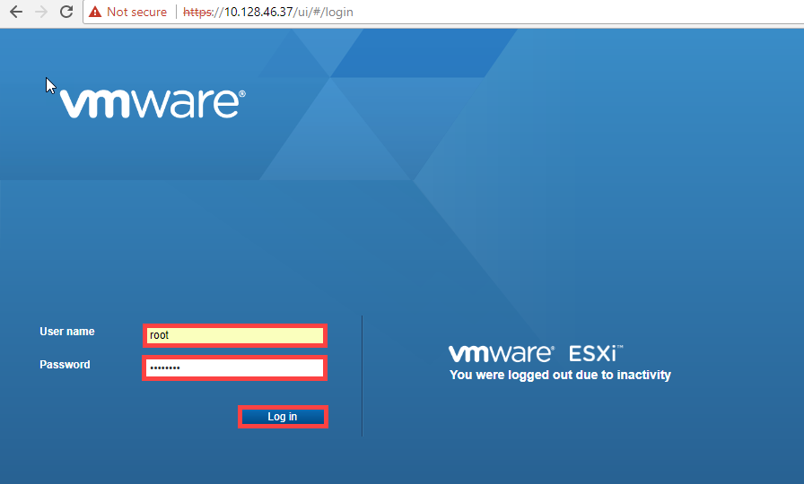
  
3. Upload the VMDK to the ESXi server. In the Navigator pane, select **Storage**.

   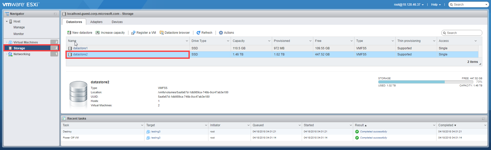

4. In the right pane, under **Datastores**, select the datastore where you want to upload the VMDK. 

    - The datastore must be type VMFS5. 
    - The datastore must also have enough free space for the OS and data disks.
   
5. Right-click and select **Browse Datastore**.

   

6. A **Datastore Browser** window appears.

   

7. In the tool bar, click **Create directory** icon to create a new folder. Specify the folder name and make a note of it. You will use this folder name later when creating a virtual machine (recommended best practice). Click **Create directory**.

   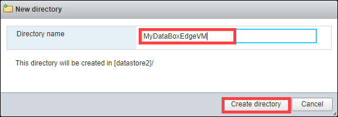

8. The new folder appears in the left pane of the **Datastore Browser**. Click the **Upload** icon and select **Upload File**.

    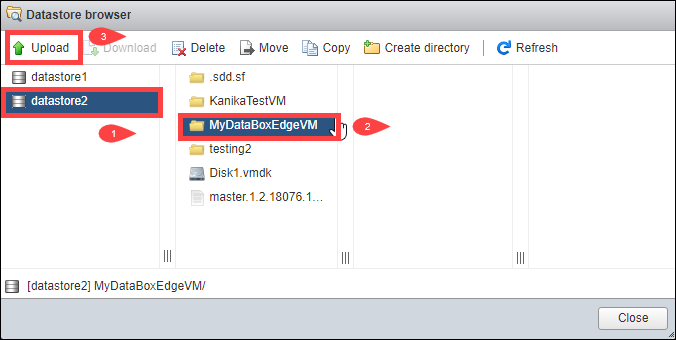

9. Browse and point to the VMDK files that you downloaded. There are two files. Select a file to upload.

    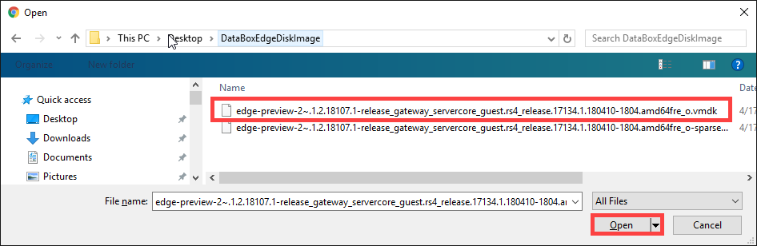

10. Click **Open**. The upload of the VMDK file to the specified datastore starts. It may take several minutes for the file to upload.
11. After the upload is complete, you see the file in the datastore in the folder you created. Now upload the second VMDK file to the same datastore. Once both the files are uploaded, the two files are merged into a single file. You then see a single file in the directory.

    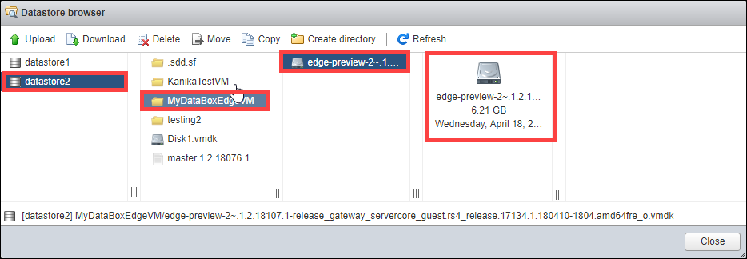

12. Return to the vSphere client window. In the Navigator pane, select **Virtual Machines**. In the right pane, click **Create/Register VM**.

    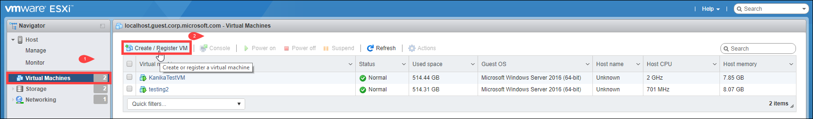

13. A **New Virtual Machine** appears. Under Select creation type, choose **Create a new virtual machine** and click **Next**.
    

14. On **Select a Name and OS Name and Location** page, specify the **Name** of your virtual machine. This name should match the folder name (recommended best practice) you specified earlier in Step 7. Choose **Guest OS family** as Windows and **Guest OS version** as Microsoft Windows Server 2016 (64-bit). Click **Next**.

    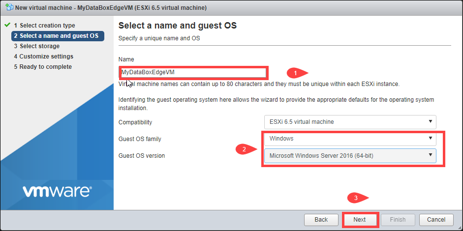

15. On the **Select storage** page, select a datastore you want to use to provision your VM. Click **Next**.

    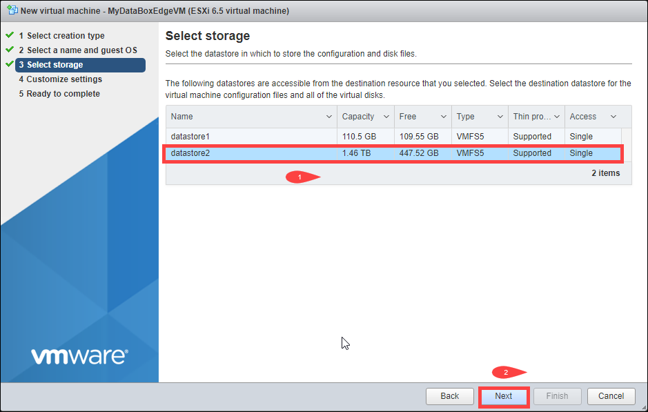
16. On the **Customize settings** page, set the **CPU** to 4, **Memory** to 8192 MB (or more), **Hard disk 1** as 2 TB (or more). Choose **SCSI hard disk** to add. In this case, it was LSI Logic SAS. **The static IDE disks are not supported.** The **Hard disk 1** is the virtual data disk. Note that you cannot shrink the disk once provisioned. Attempting to shrink the disk results in a loss of all the local data on the device. 

    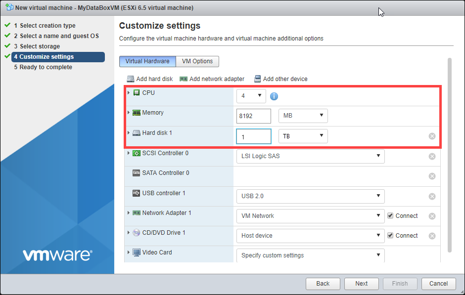

    On the same page, click **Add hard disk** and then select **Existing hard disk**. Select the VMDK file in the datastore. This will add an OS disk. 

     !Customize settings page

    Scroll down until you see the **New hard disk** and expand it to view the settings. Set the **Virtual Device Node** to **IDE controller 0**.

     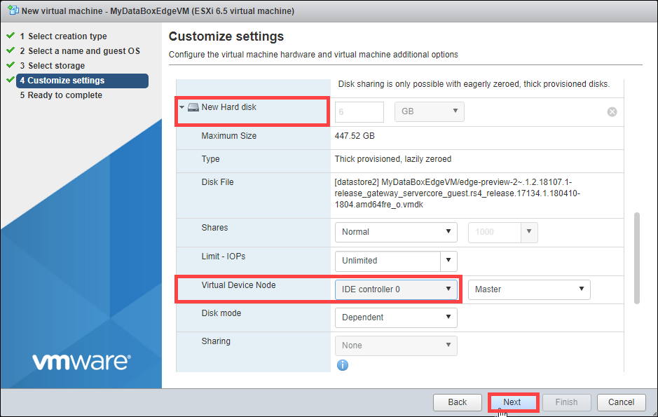

17. (Optional) *Perform this step only if you are running VMware ESXi Server 6.7*. On the **Customize settings** page, click **VM options**. Go to **Boot options > Firmware** and change it to **BIOS**. By default, the value is set to EFI. Click **Next**.

    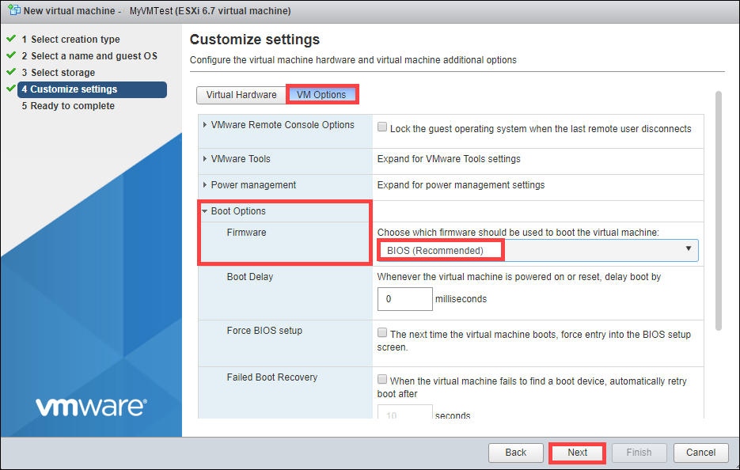

18. On the **Ready to Complete** page, review all the settings associated with the new virtual machine. Verify that CPU is 4, memory is 8192 MB, network interface is 1 and Hard disk 2 has IDE controller 0. Click **Finish**.
   
    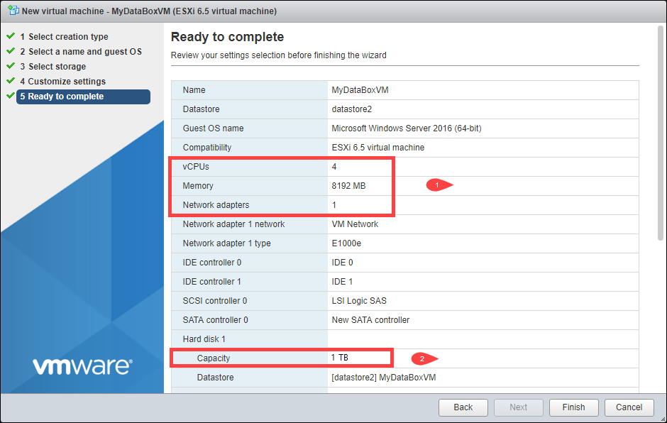
    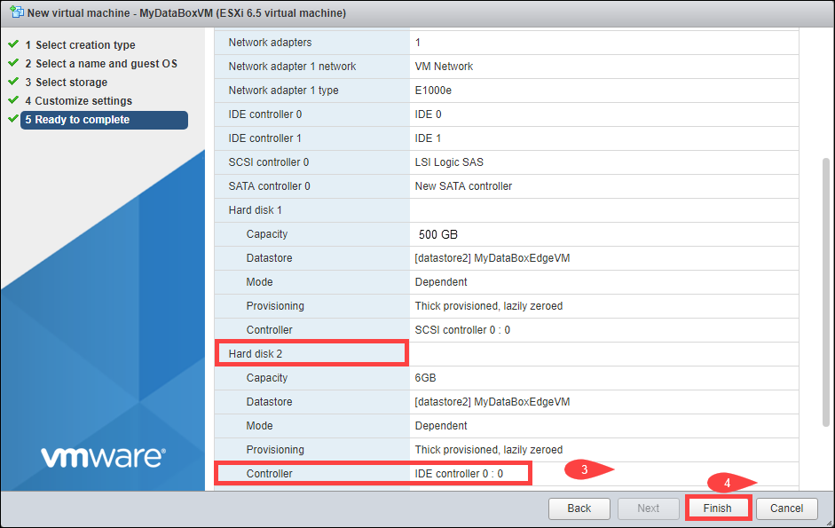

Your virtual machine is now provisioned. You will see a notification to the effect and the new virtual machine is added to the list of VMs.

The next step is to turn on this VM and get the IP address.

> [!NOTE]
> We recommend that you do not install VMware tools on your virtual device (as provisioned above). Installation of VMware tools will result in an unsupported configuration.

## Start the virtual device and get the IP

Perform the following steps to start your virtual device and connect to it.

#### To start the virtual device
1. Start the virtual device. In the right pane, select your device from the list of VMs and right-click to bring up the context menu. Select **Power** and then select **Power on**. This should power on your virtual machine. You can view the status in the bottom  pane of the web client.

    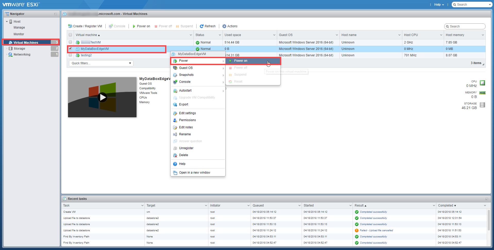

2. Again, select your VM. Right-click and select **Console** and then select **Open in a new window**.

    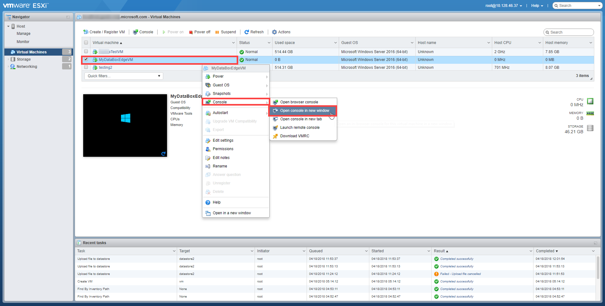

3. The virtual machine console opens up in a new window. 

    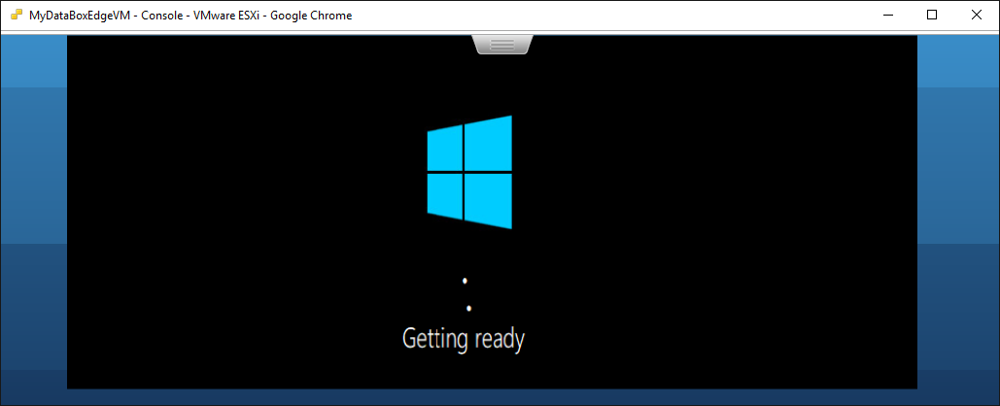

4. Once the device is running, point and click the cursor on the tab in the upper middle part of the console window. Select **Guest OS > Send keys > Ctrl+Alt+Delete**. This will unlock the VM.

   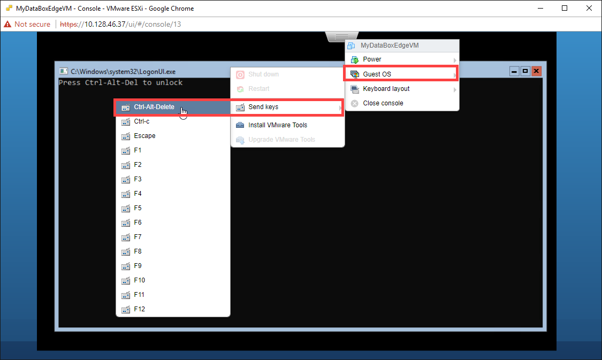

5. Provide the password to sign into the machine. The default password is *Password1*.

   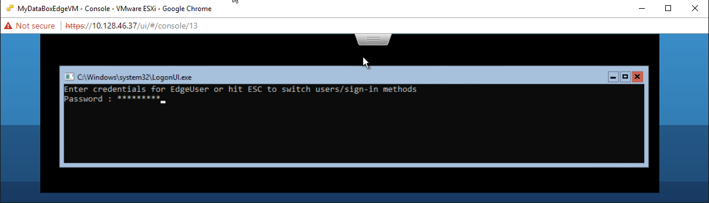

6. Steps 5-7 only apply when booting up in a non-DHCP environment. If you are in a DHCP environment, then skip these steps and go to step 8. If you booted up your device in non-DHCP environment, you will see a message to the effect: **Use the Set-HcsIPAddress cmdlet to configure the network**. 
   
7. To configure the network, at the command prompt, use the `Get-HcsIpAddress` command to list the network interfaces enabled on your virtual device. If your device has a single network interface enabled, the default name assigned to this interface is `Ethernet`.

8. Use the `Set-HcsIpAddress` cmdlet to configure the network. An example is shown below:

    `Set-HcsIpAddress –Name Ethernet –IpAddress 10.161.22.90 –Netmask 255.255.255.0 –Gateway 10.161.22.1`

9. After the initial setup is complete and the device has booted up, you will see the device banner text. Make a note of the IP address and the URL displayed in the banner text to manage the device. You will use this IP address to connect to the web UI of your virtual device and complete the local setup and activation.

   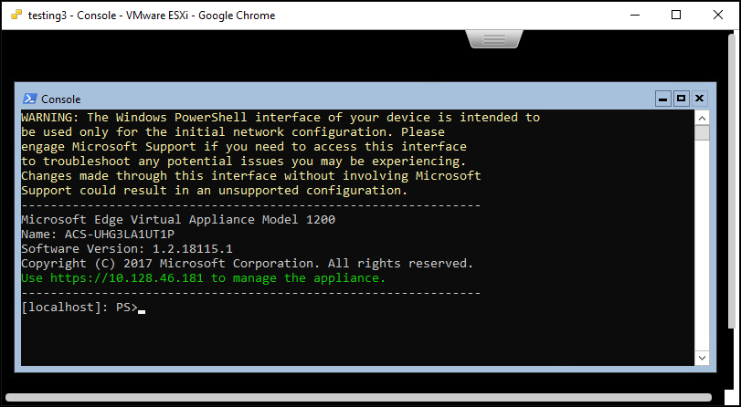

If your device does not meet the minimum configuration requirements, you will see an error in the banner text (shown below). You will need to modify the device configuration so that it has adequate resources to meet the minimum requirements. You can then restart and connect to the device. Refer to the minimum configuration requirements in [check the host system meets minimum virtual device requirements](#check-the-host-system).

If you face any other error during the initial configuration using the local web UI, refer to the following workflows:

- [Run diagnostic tests to troubleshoot web UI setup](data-box-gateway-troubleshoot.md#run-diagnostics).
- [Generate log package and view log files](data-box-gateway-troubleshoot.md#collect-support-package).

## Next steps

In this tutorial, you learned about Data Box Gateway topics such as:

> [!div class="checklist"]
> * Ensure host meets minimum device requirements
> * Provision a virtual device in VMware
> * Start the virtual device and get the IP address

Advance to the next tutorial to learn how to connect, set up, and activate your virtual device.

* [Set up and connect to shares on your Data Box Gateway](data-box-gateway-deploy-connect-setup-activate.md)

