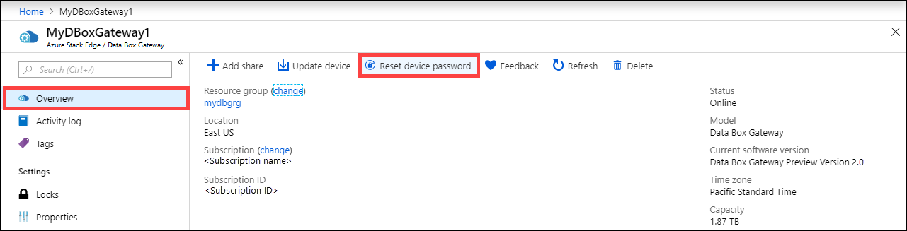
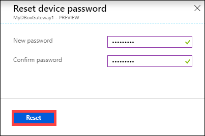
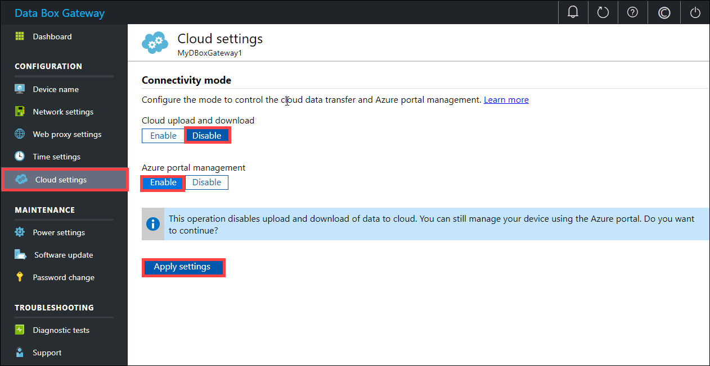

# Manage access, power, and connectivity mode for your Azure Data Box Gateway (preview)

This article describes how to manage the access, power, and connectivity mode for your Azure Data Box Gateway. These operations are performed via the local web UI or the Azure portal.

In this article, you learn how to:

> [!div class="checklist"]
> * Manage device access
> * Manage connectivity mode
> * Manage power

> [!IMPORTANT]
> Data Box Gateway is in preview. Review the [Azure terms of service for preview](https://azure.microsoft.com/support/legal/preview-supplemental-terms/) before you order and deploy this solution.

## Manage device access

The access to your Data Box Gateway device is controlled by the use of a device administrator password. You can change the administrator password via the local web UI. You can also reset the device administrator password in the Azure portal.

### Change device administrator password

If you forgot your password, then you can change the password. Follow these steps in the local UI to change the device administrator password.

1. In the local web UI, go to **Maintenance > Password change**.
2. Enter the current password and then the new password. The supplied password must be between 8 and 16 characters. The password must have 3 of the following characters: uppercase, lowercase, numeric, and special characters. Confirm the new password.

    

3. Click **Change password**.
 
### Reset device administrator password

The reset workflow does not require the user to recall the old password and is useful when the password is lost. This workflow is performed in the Azure portal.

1. In the Azure portal, go to **Overview > Reset admin password**.

    

 
2. Enter the new password and then confirm it. The supplied password must be between 8 and 16 characters. The password must have 3 of the following characters: uppercase, lowercase, numeric, and special characters. Click **Reset**.

    

## Manage connectivity mode

Apart from the default normal mode, your device can also run in partially disconnected, or disconnected mode. Each of these modes is described as below:

- **Partially disconnected** – In this mode, the device cannot upload any data to the shares however can be managed via the Azure portal.

    This mode is typically used when on a metered satellite network and the goal is to minimize network bandwidth consumption. Minimal network consumption may still occur for device monitoring operations.

- **Disconnected** – In this mode, the device is fully disconnected from the cloud and both the cloud uploads and downloads are disabled. The device can only be managed via the local web UI.

    This mode is typically used when you want to take your device offline.

To change device mode, follow these steps:

1. In the local web UI of your device, go to **Configuration > Cloud settings**.
2. Disable the **Cloud upload and download**.
3. To run the device in partially disconnected mode, enable **Azure portal management**.

    
 
4. To run the device in disconnected mode, disable **Azure portal management**. Now the device can only be managed via the local web UI.

    

## Manage power

You can shut down or restart your physical and virtual device using the local web UI. We recommend that before you restart, take the shares offline on the host and then the device. This action minimizes any possibility of data corruption.

1. In the local web UI, go to **Maintenance > Power settings**.
2. Click **Shutdown** or **Restart** depending on what you intend to do.

    

3. When prompted for confirmation, click **Yes** to proceed.

> [!NOTE]
> If you shut down the virtual device, you will need to start the device through the hypervisor management.