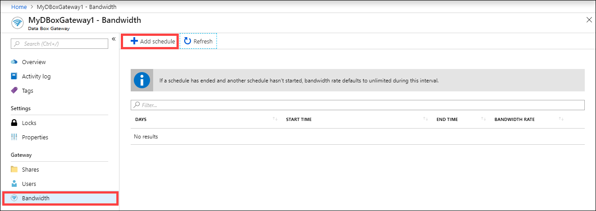
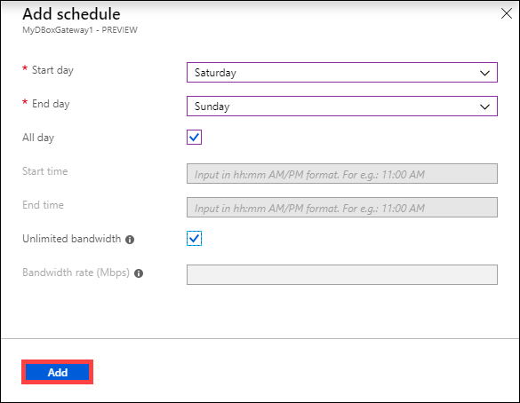
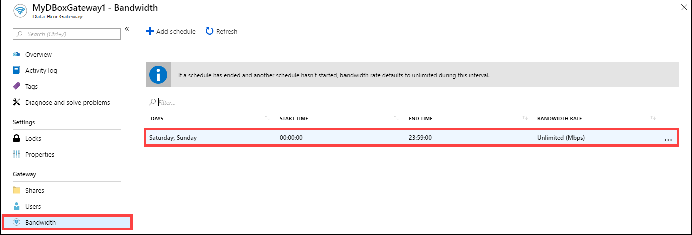
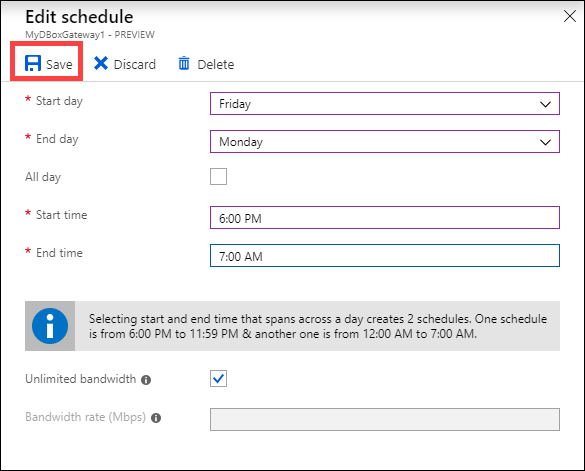
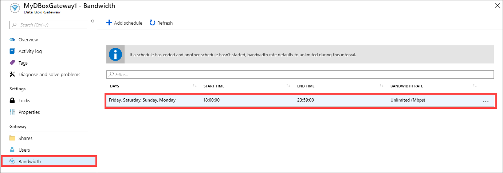
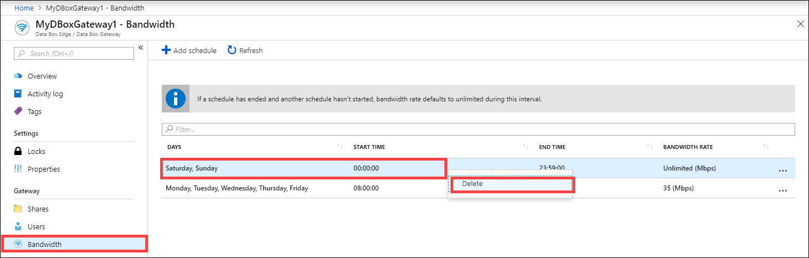

# Use the Azure portal to manage bandwidth schedules on your Azure Data Box Gateway  

This article describes how to manage users on your Azure Data Box Gateway. Bandwidth schedules allow you to configure network bandwidth usage across multiple time-of-day schedules. These schedules can be applied to the upload and download operations from your device to the cloud. 

You can add, modify, or delete the bandwidth schedules for your Data Box Gateway via the Azure portal.

In this article, you learn how to:

> [!div class="checklist"]
> * Add a schedule
> * Modify schedule
> * Delete a schedule 

## Add a schedule

Do the following steps in the Azure portal to add a user.

1. In the Azure portal for your Data Box Gateway resource, go to **Bandwidth**.
2. In the right pane, click **+ Add schedule**.

    

3. In the **Add schedule**: 

   1. Provide the **Start day**, **End day**, **Start time**, and **End time** of the schedule. 
   2. If this schedule runs all day, then you can check the **All day** option. 
   3. **Bandwidth rate** is the bandwidth in Megabits per second (Mbps) used by your device in operations involving the cloud (both uploads and downloads). Supply a number between 1 and 1,000 for this field. 
   4. Check **Unlimited** bandwidth if you do not want to throttle the date upload and download. 
   5. Click **Add**.

      

3. A schedule is created with the specified parameters. This schedule is then displayed in the list of bandwidth schedules in the portal.

## Edit schedule

Do the following steps to edit a bandwidth schedule. 

1. In the Azure portal, go to your Data Box Gateway resource and then go to Bandwidth. 
2. From the list of bandwidth schedules, select and click a schedule that you want to modify.
    

3. Make the desired changes and save the changes.

    

4. After the schedule is modified, the list of schedules is updated to reflect the modified schedule.

    

## Delete a schedule

Do the following steps to delete a bandwidth schedule associated with your Data Box Gateway device.

1. In the Azure portal, go to your Data Box Gateway resource and then go to **Bandwidth**.  

2. From the list of bandwidth schedules, select a schedule that you want to delete. Right-click to display the context menu and click **Delete**. 

   

3.	After the schedule is deleted, the list of schedules is updated.

## Next steps

- Learn how to [Manage bandwidth](data-box-gateway-manage-bandwidth-schedules.md).
