# Use the Azure portal to manage shares on your Azure Data Box Gateway 

This article describes how to manage shares on your Azure Data Box Gateway. You can manage the Azure Data Box Gateway via the Azure portal or via the local web UI. Use the Azure portal to add, delete, refresh shares or sync storage key for storage account associated with the shares.

> [!IMPORTANT]
> - Data Box Gateway is in preview. Review the [Azure terms of service for preview](https://azure.microsoft.com/support/legal/preview-supplemental-terms/) before you order and deploy this solution.

## About shares

To transfer data to Azure, you need to create shares on your Azure Data Box Gateway. The shares that you add on the Data Box Gateway device are cloud shares. The data from these shares is automatically uploaded to the cloud. All the cloud functions such as Refresh and Sync storage keys apply to these shares. Use the cloud shares when you want the device data to be automatically pushed to your storage account in the cloud.

In this article, you learn how to:

> [!div class="checklist"]
> * Add a share
> * Delete a share
> * Refresh shares
> * Sync storage key

## Add a share

Do the following steps in the Azure portal to create a share.

1. In the Azure portal, go to your Data Box Gateway resource and then navigate to **Overview**. Click **+ Add share** on the command bar.
2. In **Add Share**, specify the share settings. Provide a unique name for your share.

    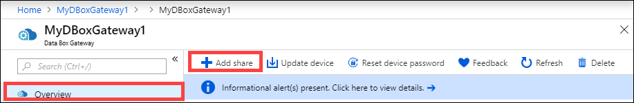

    Share names can only contain numbers, lowercase letters, and hyphens. The share name must be between 3 and 63 characters long and begin with a letter or a number. Each hyphen must be preceded and followed by a non-hyphen character.

3. Select a **Type** for the share. The type can be **SMB** or **NFS**, with SMB being the default. SMB is the standard for Windows clients, and NFS is used for Linux clients. Depending upon whether you choose SMB or NFS shares, options presented are slightly different.

4. Provide a **Storage account** where the share lives. A container is created in the storage account with the share name if the container already does not exist. If the container already exists, then the existing container is used.

5. Choose the **Storage service** from block blob, page blob, or files. The type of the service chosen depends on which format you want the data to reside in Azure. For example, in this instance, we want the data to reside as blob blocks in Azure, hence we select **Block Blob**. If choosing**Page Blob**, you must ensure that your data is 512 bytes aligned. For example, a VHDX is always 512 bytes aligned.

6. This step depends on whether you are creating an SMB or an NFS share.
    - **If creating an SMB share** - In the **All privilege local user** field, choose from **Create new** or **Use existing**. If creating a new local user, provide the **username**, **password**, and then confirm password. This assigns the permissions to the local user. After you have assigned the permissions here, you can then use File Explorer to modify these permissions.

        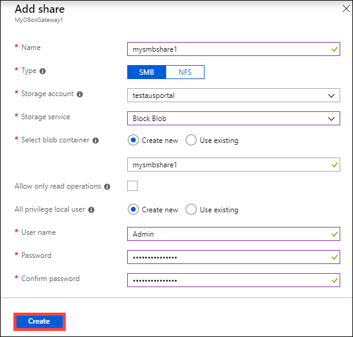

        If you check allow only read operations for this share data, you can specify read-only users.
    - **If creating an NFS share** - You need to supply the **IP addresses of the allowed clients** that can access the share.

        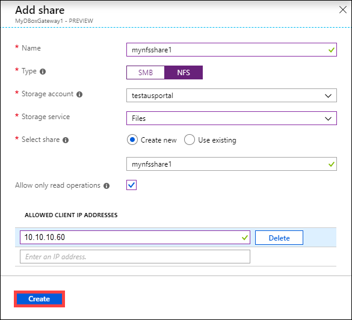

7. Click **Create** to create the share. You are notified that the share creation is in progress. After the share is created with the specified settings, the **Shares** blade updates to reflect the new share.
 
## Delete a share

Do the following steps in the Azure portal to delete a share.

1. From the list of shares, select and click the share that you want to delete.

    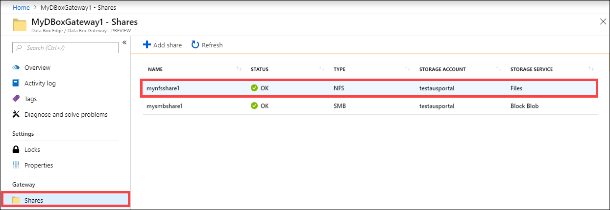

2. Click **Delete**. 

    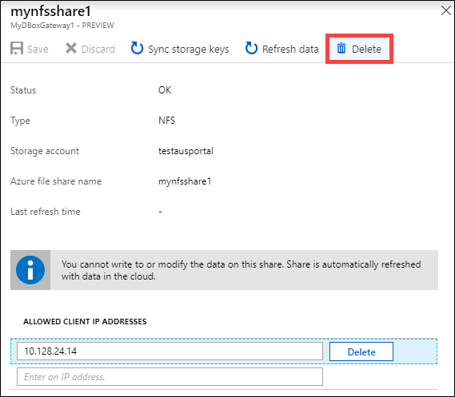

3. When prompted for confirmation, click **Yes**.

    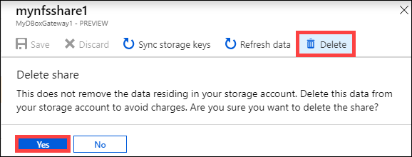

The list of shares is updated to reflect the deletion.

## Refresh shares

The refresh feature allows you to refresh the contents of an on-premises share. When you refresh a share, a search is initiated to find all the Azure objects including blobs and files that were added to the cloud since the last refresh. These additional files are then used to refresh the contents of the on-premises share on the device. 

Do the following steps in the Azure portal to refresh a share.

1.	In the Azure portal, go to **Shares**. Select and click the share that you want to refresh.

    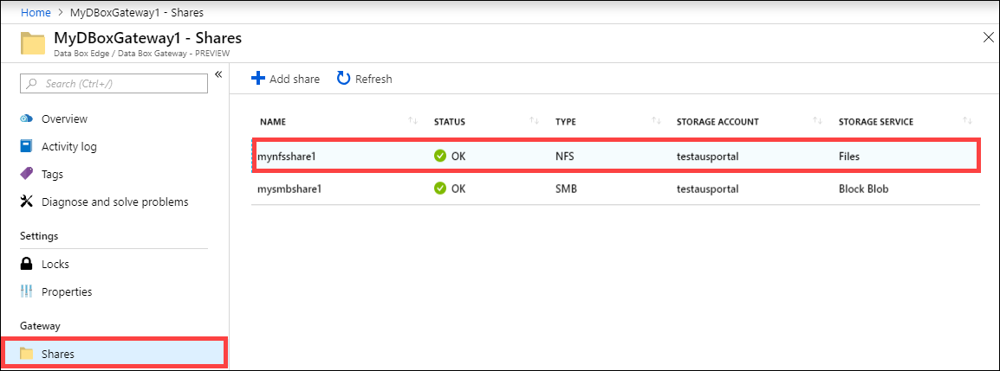

2.	Click **Refresh**. 

    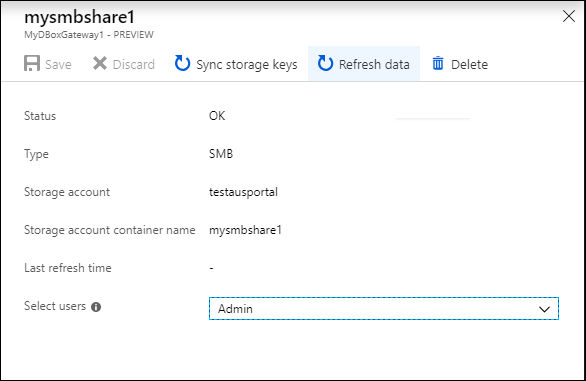
 
3.	When prompted for confirmation, click **Yes**. A job starts to refresh the contents of the on-premises share. 

    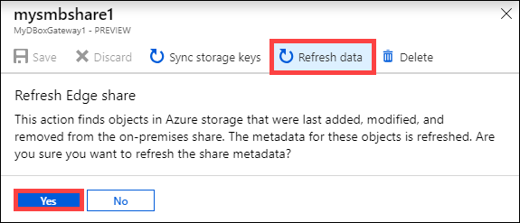
 
4.	While the refresh is in progress, the refresh option is grayed out in the context menu. Click the job notification to view the refresh job status.

5.	The time to refresh depends on the number of files in the Azure container as well as the files on the device. Once the refresh has successfully completed, the share timestamp is updated. Even if the refresh has partial failures, the operation is considered successful and the timestamp is updated. 

    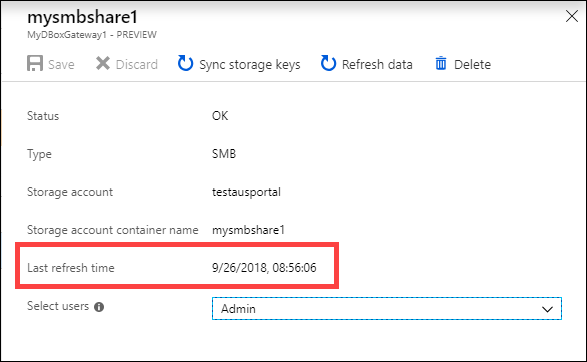
 
If there is a failure, an alert is raised. The alert details the cause and the recommendation to fix the issue. The alert also links to a file that has the complete summary of the failures including the files that failed to update or delete.

>[!IMPORTANT]
> In this preview release, do not refresh more than a single share at a time.

## Sync storage keys

If your storage account keys have been rotated, then you need to sync the storage access keys. The sync helps the device get the latest keys for your storage account.

Do the following steps in the Azure portal to sync your storage access key.

1. Go to **Overview** in your resource. 
2. From the list of shares, choose and click a share associated with the storage account that you need to sync. Click **Sync storage key**. 

     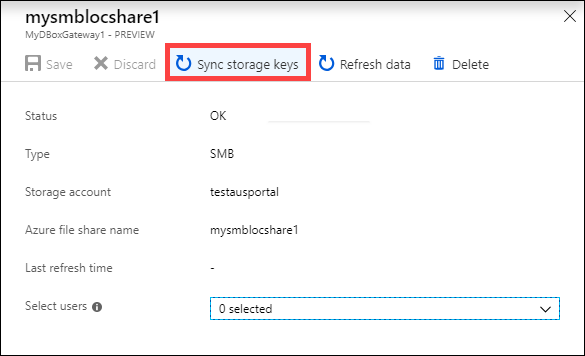

3. Click **Yes** when prompted for confirmation. Exit out of the dialog once the sync is complete.

     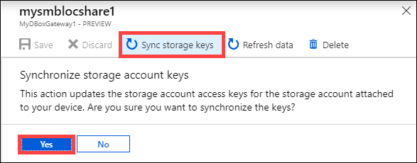

>[!NOTE]
> You only have to do this once for a given storage account. You don't need to repeat this action for all the shares associated with the same storage account.

## Next steps

- Learn how to [Manage users via Azure portal](data-box-gateway-manage-users.md).
