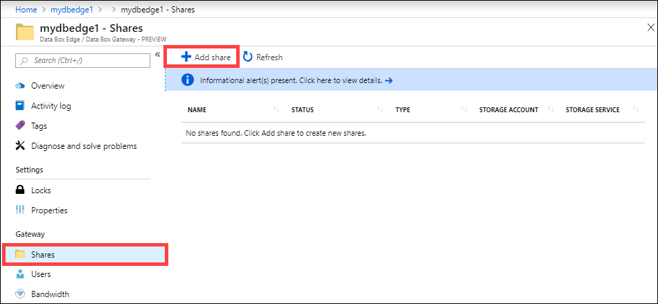
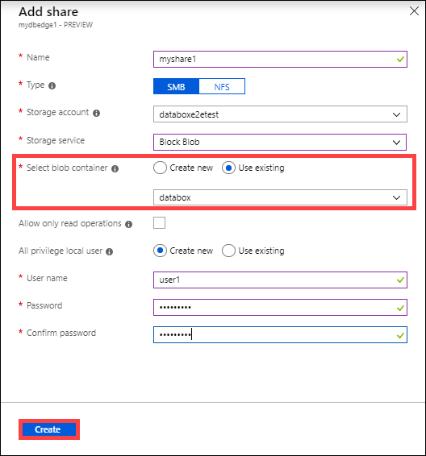

# Use cases for Azure Data Box Gateway

Azure Data Box Gateway is a cloud storage gateway device that resides on your premises and sends your image, media, and other data to Azure. This cloud storage gateway is a virtual machine provisioned in your hypervisor. You write data to this virtual device using the NFS and SMB protocols, which it then sends to Azure. This article provides you a detailed description of the scenarios where you can deploy this device.

Use Data Box Gateway for the following scenarios:

- To continuously ingest massive amounts of data.
- For cloud archival of data in a secure and efficient way.
- For incremental data transfer over the network after the initial bulk transfer is done using Data Box.

Each of these scenarios is described in detail in the subsequent sections.

## Continuous data ingestion

One of the primary advantages of Data Box Gateway is the ability to continuously ingest data into the device to copy to the cloud, regardless of the data size.

As the data is written to the gateway device, the device uploads the data to Azure Storage. The device automatically manages storage by removing the files locally while retaining the metadata when it reaches a certain threshold. Keeping a local copy of the metadata enables the gateway device to only upload the changes when the file is updated. The data uploaded to your gateway device should be as per the guidelines in [Data upload caveats](data-box-gateway-limits.md#data-upload-caveats).

As the device fills up with data, it starts throttling the ingress rate (as needed) to match the rate at which data is uploaded to the cloud. To monitor the continuous ingestion on the device, you use alerts. These alerts are raised once the throttling starts and are cleared once the throttling has stopped.

## Cloud archival of data

Use Data Box Gateway when you want to retain your data for long term in the cloud. You can use the **Archive** tier of storage for long-term retention.

Archive tier is optimized to store rarely accessed data for at least 180 days. The **Archive** tier offers the lowest storage costs but has the highest access costs. For more information, go to [Archive access tier](/azure/storage/blobs/storage-blob-storage-tiers#archive-access-tier).

### Move data to Archive tier

Before you begin, make sure that you have a running Data Box Gateway device. Follow the steps detailed in [Tutorial: Prepare to deploy Azure Data Box Gateway](data-box-gateway-deploy-prep.md) and keep advancing to the next tutorial until you have an operational device.

- Use the Data Box Gateway device to upload data to Azure through the usual transfer procedure as described in [Transfer data via Data Box Gateway](data-box-gateway-deploy-add-shares.md).
- After the data is uploaded, you will need to move it to Archive tier. You can set the blob tier in two ways: Azure PowerShell script or an Azure Storage Lifecycle Management policy.  
    - If using Azure PowerShell, follow these [steps](/azure/databox/data-box-how-to-set-data-tier#use-azure-powershell-to-set-the-blob-tier) to move the data to Archive tier.
    - If using Azure Lifecycle Management, follow these steps to move the data to Archive tier.
        - [Register](/azure/storage/common/storage-lifecycle-management-concepts) for the preview of Blob Lifecycle management service to use Archive tier.
        - Use the following policy to [Archive data on ingest](/azure/storage/blobs/storage-lifecycle-management-concepts#archive-data-after-ingest).
- Once the blobs are marked as Archive, they can no longer be modified by the gateway unless they are moved to hot or cold tier. If the file is in the local storage, any changes made to the local copy (including deletes) are not uploaded to archive tier.
- To read data in Archive storage, it must be rehydrated by changing the blob tier to hot or cool. [Refreshing the share](data-box-gateway-manage-shares.md#refresh-shares) on the gateway does not rehydrate the blob.

For more information, learn more about how to [Manage Azure Blob Storage Lifecycle](/azure/storage/common/storage-lifecycle-management-concepts).

## Initial bulk transfer followed by incremental transfer

Use Data Box and Data Box Gateway together when you want to do a bulk upload of a large amount of data followed by incremental transfers. Use Data Box for the bulk transfer in an offline mode (initial seed) and Data Box Gateway for incremental transfers (ongoing feed) over the network.

### Seed the data with Data Box

Follow these steps to copy the data to Data Box and upload to Azure Storage.

1. [Order your Data Box](/azure/databox/data-box-deploy-ordered).
2. [Set up your Data Box](/azure/databox/data-box-deploy-set-up).
3. [Copy data to Data Box via SMB](/azure/databox/data-box-deploy-copy-data).
4. [Return the Data Box, verify the data upload to Azure](/azure/databox/data-box-deploy-picked-up).
5. Once the data upload to Azure is complete, all the data should be in Azure storage containers. In the storage account for Data Box, go to the Blob (and File) container to make sure that all the data is copied. Make a note of the container name as you will use this name later. For instance, in the following screenshot, `databox` container will be used for the incremental transfer.

    

This bulk transfer completes the initial seeding phase.

### Ongoing feed with Data Box Gateway

Follow these steps for ongoing ingestion by Data Box Gateway. 

1. Create a cloud share on Data Box Gateway. This share automatically uploads any data to the Azure Storage account. Go to **Shares** in your Data Box Gateway resource and click **+ Add share**.

    

2. Make sure this share maps to the container that contains the seeded data. For **Select blob container**, choose **Use existing** and browse to the container where the data from Data Box was transferred.

    

3. After the share is created, refresh the share. This operation refreshes the on-premises share with the content from the Azure.

    

    When the share is synced, the Data Box Gateway will upload the incremental changes if the files were modified on the client.

## Next steps

- Review the [Data Box Gateway system requirements](data-box-gateway-system-requirements.md).
- Understand the [Data Box Gateway limits](data-box-gateway-limits.md).
- Deploy [Azure Data Box Gateway](data-box-gateway-deploy-prep.md) in Azure portal.