# Use your own certificates with Data Box and Data Box Heavy devices

During order processing, self-signed certificates are generated for accessing the local web UI and Blob storage for a Data Box or Data Box Heavy device. If you'd rather communicate with your device over a trusted channel, you can use your own certificates.

The article describes how to install your own certificates and how to revert to the default certificates before returning your device to the datacenter. It also gives a summary of certificate requirements.

## About certificates

A certificate provides a link between a **public key** and an entity (such as domain name) that has been **signed** (verified) by a trusted third party such as a **certificate authority**.  A certificate provides a convenient way of distributing trusted public encryption keys. In this way, certificates ensure your communication is trusted and you're sending encrypted information to the right server.

When your Data Box device is initially configured, self-signed certificates are automatically generated. Optionally, you can bring your own certificates. There are guidelines that you need to follow if you plan to bring your own certificates.

> [!NOTE]
> [!INCLUDE [return-data-box-before-certificates-expire](../../includes/data-box-certificate-expiration.md)]

On a Data Box or Data Box Heavy device, two types of endpoint certificates are used:

- Blob storage certificate
- Local UI certificate

### Certificate requirements

The certificates must meet the following requirements:

- The endpoint certificate needs to be in `.pfx` format with a private key that can be exported.
- You can use an individual certificate for each endpoint, a multidomain certificate for multiple endpoints, or a wildcard endpoint certificate.
- The properties of an endpoint certificate are similar to the properties of a typical SSL certificate.
- A corresponding certificate in DER format (`.cer` filename extension) is required on the client machine.
- After you upload the local UI certificate, you'll need to restart the browser and clear the cache. Refer to specific instructions for your browser.
- The certificates must be changed if the device name or the DNS domain name changes.
- Use the following table when creating endpoint certificates:

  |Type |Subject name (SN)  |Subject alternative name (SAN)  |Subject name example |
  |---------|---------|---------|---------|
  |Local UI| `<DeviceName>.<DNSdomain>`|`<DeviceName>.<DNSdomain>`| `mydevice1.microsoftdatabox.com` |
  |Blob storage|`*.blob.<DeviceName>.<DNSdomain>`|`*.blob.< DeviceName>.<DNSdomain>`|`*.blob.mydevice1.microsoftdatabox.com` |
  |Multi-SAN single certificate|`<DeviceName>.<DNSdomain>`|`<DeviceName>.<DNSdomain>` `*.blob.<DeviceName>.<DNSdomain>`|`mydevice1.microsoftdatabox.com` |

For more information, see [Certificate requirements](../../articles/databox-online/azure-stack-edge-gpu-certificate-requirements.md).

## Add certificates to device

You can use your own certificates for accessing the local web UI and for accessing Blob storage.

> [!IMPORTANT]
> If the device name or DNS domain is changed, new certificates must be created. The client certificates and the device certificates should then be updated with the new device name and DNS domain.

To add your own certificate to your device, follow these steps:

1. Go to **Manage** > **Certificates**.

   **Name** shows the device name. **DNS domain** shows the domain name for the DNS server.

   The bottom of the screen shows the certificates currently in use. For a new device, you'll see the self-signed certificates that were generated during order processing.

   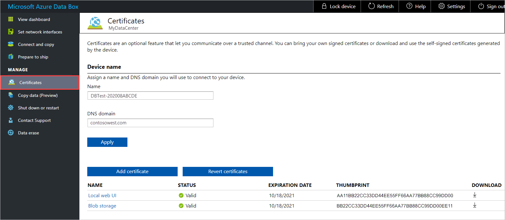

2. If you need to change the **Name** (device name) or **DNS domain** (the domain of the DNS server for the device), do that now, before you add the certificate. Then select **Apply**.

   The certificate must be changed if the device name or the DNS domain name changes.

   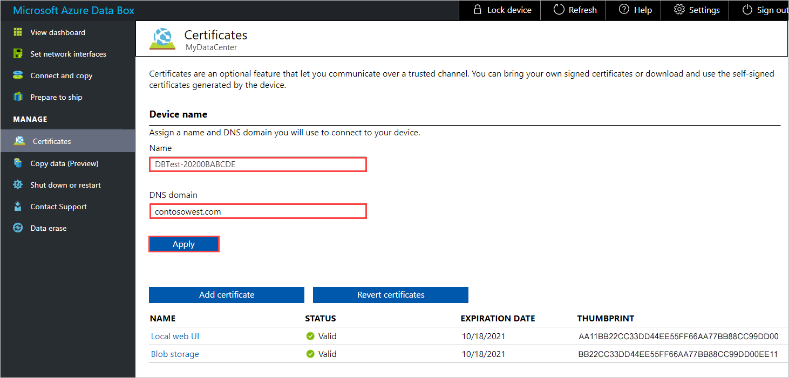

3. To add a certificate, select **Add certificate** to open the **Add certificate** panel. Then select the **Certificate type** - either **Blob storage** or **Local web UI**.

   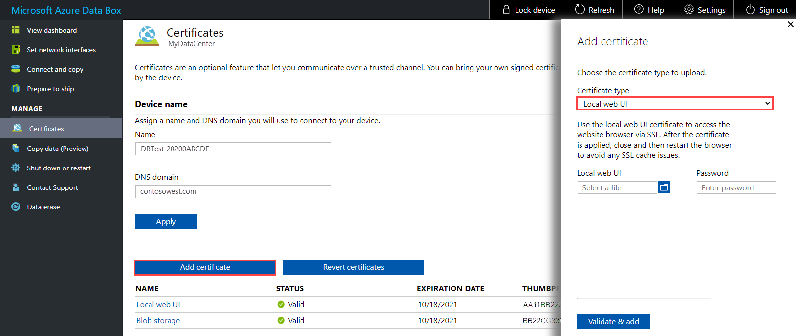

4. Choose the certificate file (in `.pfx` format), and enter that password that was set when the certificate was exported. Then select **Validate & Add**.

   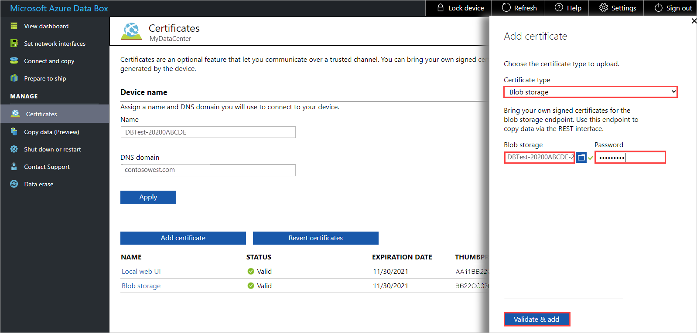

   After the certificate is successfully added, the **Certificates** screen shows the thumbprint for the new certificate. The certificate's status is **Valid**.

   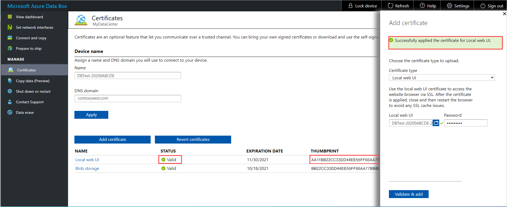

5. To see certificate details, select and click the certificate name. The certificate will expire after a year.

   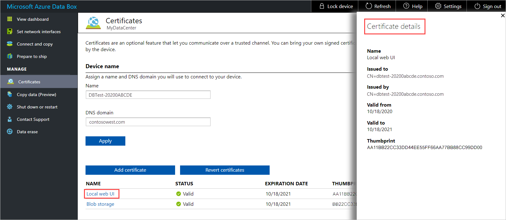

   <!--If you changed the local web UI certificate, you'll see the following error. This error will go away when you install the new certificate on the client computer.

   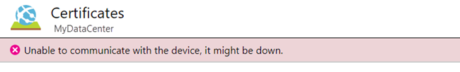 TEST. RESTORE IF ERROR IS REPRODUCED.-->

6. If you changed the certificate for the local Web UI, you need to restart the browser and then the local web UI. This step is needed to avoid any SSL cache issues.

  <!-- TESTING THIS - The communication error should be gone from the **Certificates** screen.-->

7. Install the new certificate on the client computer you're using to access the local web UI. For instructions, see [Import certificates to client](#import-certificates-to-client), below.

## Import certificates to client

After you add a certificate to your Data Box device, you need to import the certificate to the client computer you use to access the device. You'll import the certificate to the Trusted Root Certificate Authority store for Local Machine.

To import a certificate on a Windows client, follow these steps:

1. In File Explorer, right-click the certificate file (with `.cer` format), and select **Install certificate**. This action starts the Certificate Import Wizard.

    

2. For **Store location**, select **Local Machine**, and then select **Next**.

    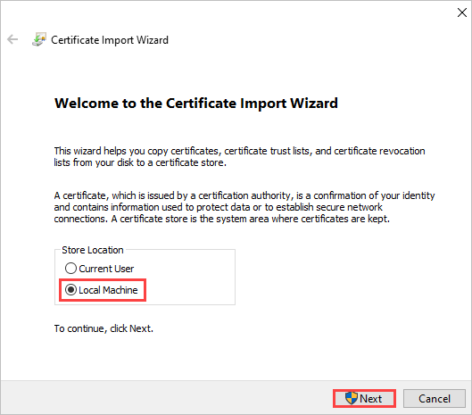

3. Select **Place all certificates in the following store**, select **Trusted Root Certificate Authority**, and then select **Next**.

   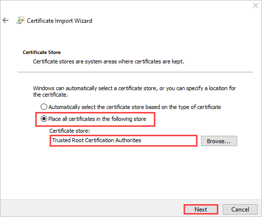

4. Review your settings, and select **Finish**. A message will tell you the import was successful.

   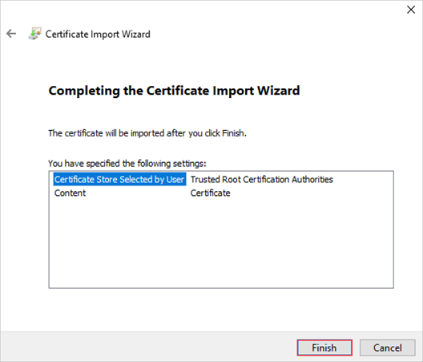

## Revert to default certificates

Before you return your device to the Azure datacenter, you should revert to the original certificates that were generated during order processing.

To revert to the certificates generated during order processing, follow these steps:

1. Go to **Manage** > **Certificates**, and select **Revert certificates**.

   Reverting certificates returns to using the self-signed certificates that were generated during order processing. Your own certificates are removed from the device.

   

2. After certificate reversion completes successfully, go to **Shut down or restart**, and select **Restart**. This step is needed to avoid any SSL cache issues.

   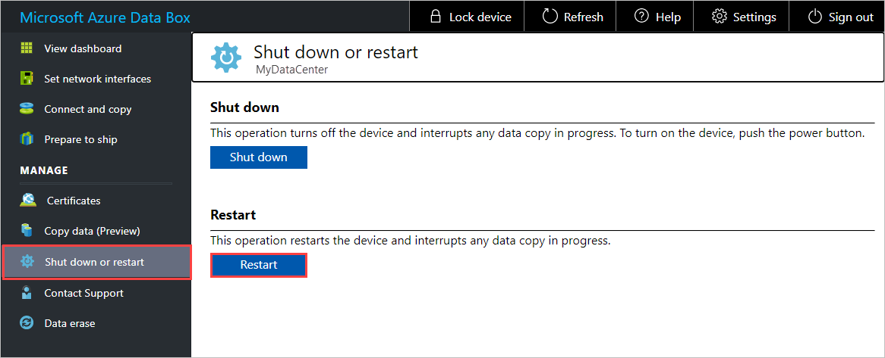

   Wait a few minutes, and then sign in to the local web UI again.
