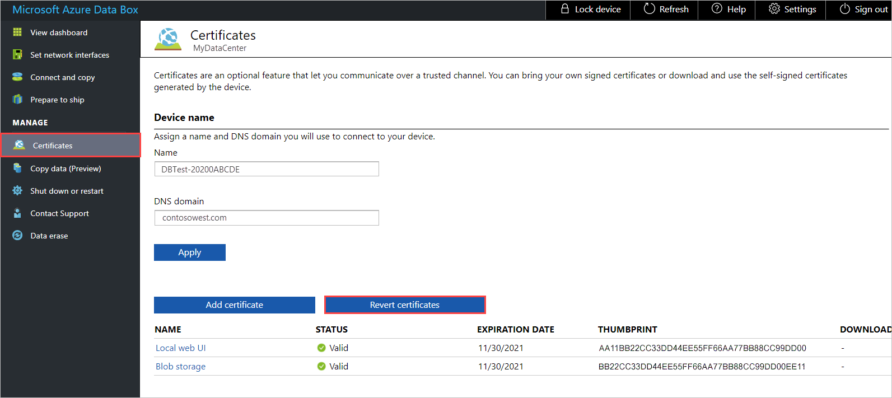

# Use your own certificates with Data Box and Data Box Heavy devices

When an Azure Data Box order is processed, self-signed certificates are generated for accessing the local web UI and blob storage. If you'd rather communicate with your device over a trusted channel, you can use your own certificates.

This article describes how to install your own certificates and how to revert to the default certificates before returning your device to the datacenter. It also gives a summary of basic certificate requirements.

This article applies to both Data Box devices and Data Box Heavy devices.

## About certificates

A certificate provides a link between a **public key** and an entity (such as domain name) that has been **signed** (verified) by a trusted third party (such as a **certificate authority**).  A certificate provides a convenient way of distributing trusted public encryption keys. In this way, certificates ensure that your communication is trusted and that you're sending encrypted information to the right server.

When your Data Box device is initially configured, self-signed certificates are automatically generated. Optionally, you can bring your own certificates. There are guidelines that you need to follow if you plan to bring your own certificates.

On a Data Box or Data Box Heavy device, two types of endpoint certificates are used:

- Blob storage certificate
- Local UI certificate

This section gives a summary of basic requirements for both of these certificates. For more information, see [Certificate requirements](../../articles/databox-online/azure-stack-edge-j-series-certificate-requirements.md).<!--This x-ref seems fairly safe.-->

### Endpoint certificates: blob storage

For any endpoint that the device exposes, a certificate is required for trusted communication. On a Data Box or Data Box Heavy device, an endpoint certificate is required when accessing blob storage via the REST APIs.

For the blob certificate on the device, you'll also need the corresponding certificate on the client machine to authenticate and communicate with the device.<!--This is not included as a requirement for the local web UI certificate - possibly because a signing chain's required for the AZ Stack certs?-->

#### Caveats

- The endpoint certificate needs to be in `.pfx` format with a private key. <!--The signing chain should be in DER format (`.cer` file extension).-->
- You can use an individual certificate for each endpoint, a multidomain certificate for multiple endpoints, or a wildcard endpoint certificate.<!--1) Is there any reason not to include the wildcard endpoint certificate in this list of options? 2) Terminology drift: Is a "multidomain certificate" the same as a "multi-SAN single certificate for more than one endpoint" in the table?-->
- The properties of an endpoint certificate are similar to those of a typical SSL certificate.
<!--- If you are bringing in signing chain, the signing chain certificate must be uploaded before you upload an endpoint certificate.-->
- These certificates must be changed if the device name or the DNS domain name changes.
- Use the following table when creating endpoint certificates:<!--Placeholder text for <dnsdomain> is inconsistent in all tables in the AZ Stack cert topics - 3 variations, at least. Doesn't seem to be consistently inconsistent. Can these be standardized?-->

    |Type |Subject name (SN)  |Subject alternative name (SAN)  |Subject name example |
    |---------|---------|---------|---------|
    |Blob storage|`*.blob.<Device name>.<Dns Domain>`|`*.blob.< Device name>.<DNS Domain>`|`*.blob.mydevice1.microsoftdatabox.com` |
    |Multi-SAN single certificate for more than one endpoint|`<Device name>.<DNS domain>`|`<Device name>.<DNS domain>` `login.<Device name>.<DNS domain>` `management.<Device name>.<DNS domain>` `*.blob.<Device name>.<DNS domain>`|`mydevice1.microsoftdatabox.com` |<!--Not clear: The same cert can be used for the local web UI also? Organization of discussion makes this unclear.-->

### Local UI certificate

You can access the local web UI of your device via a browser. To ensure that this communication is secure, you can upload your own certificate.<!--In "Certificate requirements," Local Web UI is listed with endpoint certificates. In "Bring your own," it's not. Which is correct? If both are endpoint certs, I can make the discussion a lot more sleek and elegant.-->

#### Caveats

- The local UI certificate is also uploaded in a `.pfx` format with a private key that can be exported.<!--Don't they have to upload the complementary .cer certificate on the client computer for the local UI certificate also? Worked that way in testing.-->
- After you upload the local UI certificate, you'll need to restart the browser and clear the cache. Refer to the specific instructions for your browser.
- Use the following table when creating a local web UI certificate:

    |Type |Subject name (SN)  |Subject alternative name (SAN)  |Subject name example |
    |---------|---------|---------|---------|
    |Local UI| `<Device name>.<DNS domain>`|`<Device name>.<DNS domain>`| `mydevice1.microsoftdatabox.com` |

## Add certificates to device

You can use your own certificates for accessing the local web UI and for accessing blob storage.

> [!IMPORTANT]
> If the device name or the DNS domain for the device is changed, new certificates must be created. The client certificates and the device certificates should then be updated with the new device name and DNS domain.

To add your own certificate to your device, follow these steps:

1. In the local web UI, go to **Manage** > **Certificates**.

   **Name** shows the device name. **DNS domain** shows the domain name for the DNS server.

   The bottom of the screen shows the certificates currently in use. For a new device, you'll see the self-signed certificates that were generated during order processing.<!--We discussed including Step 2. However, I think it's a bit off-topic. The scenario would be that the customer needs to change the DNS server or wants to change the device name, and the task would be to change the name and update the certs. I'm including the Important note from AZ Stack as an advisory instead - to give a nod to the fields without doing anything with them.-->

   

<!--2. Optionally, change the **Name** (device name) or **DNS domain**. Then select **Apply**.

   If you want to change either setting, do it before you upload your certificate. The certificates must be changed if the device name or the DNS domain name changes.

   -->

3. To add a certificate, select **Add certificate** to open the **Add certificate** panel. Then select the **Certificate type** - either **Blob storage** or **Local web UI**.

   

4. Select the certificate file (in .pfx format), and enter the password to use for the certificate. Then select **Validate & Add**.

   Choose the certificate file in .pfx format, and enter the password that was set when the certificate was exported.<!--The customer probably will have set the password when they exported their cert in .pfx format? Is this standard? In testing, I just set the password at this point.-->

   

   After the certificate's successfully added, the **Certificates** screen shows the thumbprint for the new certificate. The certificate's status is **Valid**.

   

   If you changed the local web UI certificate, you'll see the following error. This error will go away when you install the new certificate on the client computer you're using to access the local web UI.

   <!--View in build; then reduce size.-->

5. To see certificate details, click the certificate name. The certificate will expire after a year.<!--Is this standard for all certs applied to a device?-->

   

6. Install the new certificate on the client computer you're using to access the local web UI. For instructions, see [Import certificates to client](#import-certificates-to-client), below.

7. If you changed the certificate for the local Web UI, you need to restart the local web UI. Go to **Shut down or restart**, and select **Restart**. This step is needed to avoid any SSL cache issues.

   

   Wait a few minutes, and sign in again.

## Import certificates to client

After you add a certificate to your Data Box device, you need to import the certificate to the client computer you use to access the device. You'll import the certificate to the Trusted Root Certificate Authority store for Local Machine.

To import a certificate on a Windows client, take the following steps:

1. In File Explorer, right-click the certificate file (with .cer format), and select **Install certificate**. This action starts the Certificate Import Wizard.

    

2. For **Store location**, select **Local Machine**, and then select **Next**.

    

3. Select **Place all certificates in the following store**, select **Trusted Root Certificate Authority**, and then select **Next**.

   

4. Review your settings, and select **Finish**. A message will tell you the import was successful.

   

## Revert to default certificates

Before you return your device to the Azure datacenter, you should revert to the original certificates that were generated during order processing. When you revert certificates, your own certificates are removed from the device.

To revert to the certificates generated during order processing,<!--Repeated too many times. Make a choice.--> follow these steps:

1. Go to **Manage** > **Certificates**, and select **Revert certificates**.

   Reverting certificates returns to using the self-signed certificates that were generated during order processing. Your own certificates are removed from the device.

   

2. After certificate reversion completes successfully, go to **Shut down or restart**, and select **Restart**. This step is needed to avoid any SSL cache issues.

   

   Wait a few minutes, and then sign in to the local web UI again.
