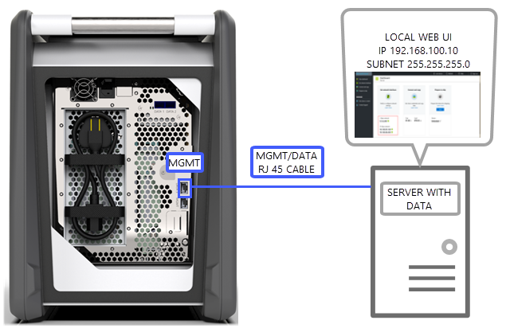
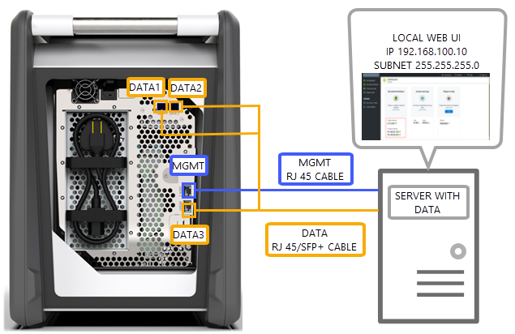
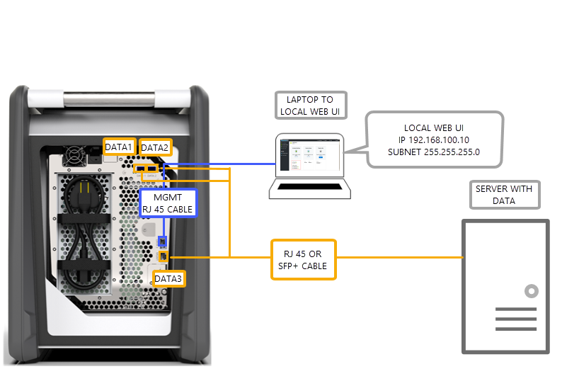
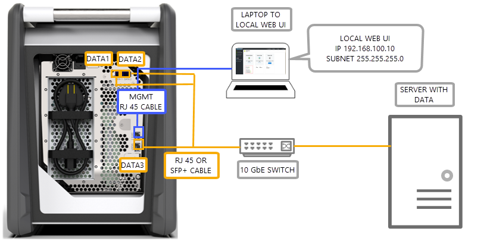
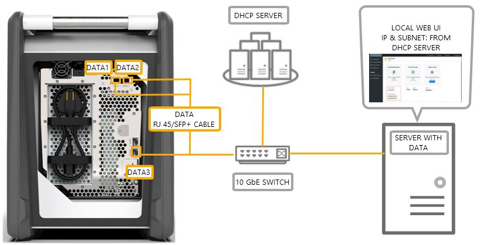

# Cabling options for your Azure Data Box

This article describes the various ways to cable your Azure Data Box for data transfer. For a full list of supported cables, see the [list of supported cables and switches from Mellanox](https://network.nvidia.com/pdf/firmware/ConnectX3-FW-2_42_5000-release_notes.pdf).

## Transfer via MGMT port

This option is the absolute minimum configuration for your Data Box. You can configure only the MGMT port for both management and data.

Before you begin, make sure you have:

- An RJ45 Ethernet cable for the MGMT.
- A data source running a [Supported OS](data-box-system-requirements.md#supported-operating-systems-for-clients).

Do the following steps to cable your device.

1. Use an RJ45 cable to connect the MGMT port to the server that has the data.

    

2. On the server, set:

    - **IP address** to 192.168.100.5
    - **Subnet** to 255.255.255.0

3. Access the local web UI of the device at: 192.168.100.10. Sign in and unlock the Data Box using the unlock password from the Azure portal.

## Transfer via DATA port with static IPs

You can configure two ports for your Data Box, the MGMT port for management traffic and one of the data ports for data. The data ports could be DATA 1, DATA 2, or DATA 3.

We strongly recommend that if you configure only one data port, it should be a 10-GbE port such as DATA 1 or DATA 2. A 1-GbE port would dramatically increase the time it takes for the data transfer.

Before you begin, make sure you have:

- An RJ45 Ethernet cable for the MGMT.
- A 10-GbE SFP+ Twinax copper cable for each 10-GbE data port that you want to connect.
- One or more data sources running a [Supported OS](data-box-system-requirements.md#supported-operating-systems-for-clients).

### Option 1 - Initial setup via server

Do the following steps to cable your device.

1. Use an RJ45 Ethernet cable from the server directly to the MGMT port for configuration.
2. Use an RJ45 for DATA 3 or SFP+ cables to connect DATA 1 or DATA 2 to the server acting  as data source. We recommend that you use 10-GbE DATA 1 or DATA 2 ports for good performance.
3. On the server, set:

   - **IP address** to 192.168.100.5
   - **Subnet** to 255.255.255.0

     

3. Access the local web UI of the device at: 192.168.100.10. Sign in and unlock the Data Box using the unlock password from the Azure portal.
4. Assign static IPs to the data ports that you've configured.

### Option 2 - Initial setup via separate computer

Do the following steps to cable your device.

1. Use an RJ45 Ethernet cable from the separate computer directly to the MGMT port for configuration.
2. Use an RJ45 for DATA 3 or SFP+ cables to connect DATA 1 or DATA 2 to the server. We recommend that you use 10-GbE DATA 1 or DATA 2 ports for good performance. The data ports are connected via a 10-GbE switch to the server with data.
3. Configure the Ethernet adapter of the laptop you're using to connect to the device with:

   - **IP address** of 192.168.100.5
   - **Subnet** of 255.255.255.0.
  
   

3. Access the local web UI of the device at: 192.168.100.10. Sign in and unlock the Data Box using the unlock password from the Azure portal.
4. Identify the IP addresses assigned by the DHCP server.

## Transfer via DATA port with static IPs using a switch 

Use this configuration for multiple data sources across 1 GbE and 10 gbE networks.

Before you begin, make sure you have:

- An RJ45 Ethernet cable for the MGMT.
- A 10-GbE SFP+ Twinax copper cable for each 10-GbE data port that you want to connect.
- One or more data sources running a [Supported OS](data-box-system-requirements.md#supported-operating-systems-for-clients). These data sources could be in different networks such as 1 GbE or 10-GbE networks.

Do the following steps to cable your device.

1. Use an RJ45 Ethernet cable from the server directly to the MGMT port for configuration.
2. Use an RJ45 for DATA 3 or SFP+ cables to connect DATA 1 or DATA 2 to the server. We recommend that you use 10-GbE DATA 1 or DATA 2 ports for good performance.
3. Configure the Ethernet adapter of the laptop you're using to connect to the device with:

   - **IP address** of 192.168.100.5
   - **Subnet** of 255.255.255.0.

     

3. Access the local web UI of the device at: 192.168.100.10. Sign in and unlock the Data Box using the unlock password from the Azure portal.
4. Assign static IPs to the data ports that you've configured.

## Transfer via DATA port in a DHCP environment

Use this configuration if your device will be in a DHCP environment.

Before you begin, make sure you have:

- An RJ45 cable if you wish to connect DATA 3.
- A 10-GbE SFP+ Twinax copper cable for each 10-GbE data port that you want to connect.
- One or more data sources running a [Supported OS](data-box-system-requirements.md#supported-operating-systems-for-clients). These data sources could be in different networks such as 1 GbE or 10-GbE networks.

Do the following steps to cable your device.

1. Use an RJ45 or SFP+ cable via a switch (where DHCP server is accessible) to the server.

    

2. Use DHCP server or DNS server to identify the IP address.
3. From a server on the same network, access the local web UI of the device using the IP address assigned by the DHCP server. Sign in and unlock the Data Box using the unlock password from the Azure portal.

## Next steps

- After you've cabled the device, go to [Copy data to your Azure Data Box](data-box-deploy-copy-data.md).
