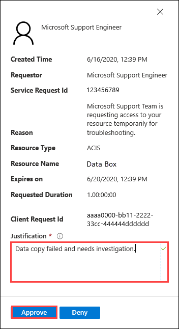
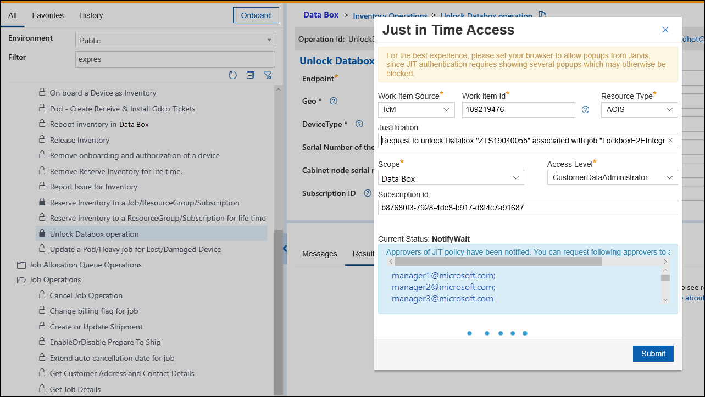
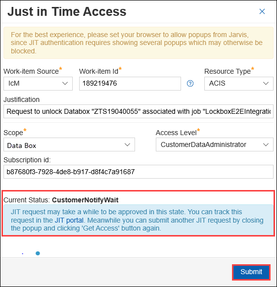

# Use Customer Lockbox for Azure Data Box (Preview)

Azure Data Box is used to transfer customer data to and from Azure. There are instances where Microsoft Support may need to access customer data during a Support request. You can use Customer Lockbox as an interface to review and approve or reject these data access requests. 

This article covers how Customer Lockbox requests are initiated and tracked for Data Box import as well as export orders. The article applies to both Azure Data Box devices and Azure Data Box Heavy devices. 

## Prerequisites

Before you begin, make sure:

1. You have created an Azure Data Box order as per the instructions in:
    1. [Tutorial: Order Azure Data Box](data-box-deploy-ordered.md) for import orders.
    1. [Tutorial: Order Azure Data Box](data-box-deploy-export-ordered.md) for export orders.

2. You have configured Customer Lockbox for Data Box. This is an opt-in service. 

    1. Customer Lockbox is currently in preview for Data Box service. To enable Customer Lockbox for Data Box for your organization, sign up for [Customer Lockbox for Azure Public Preview](https://forms.office.com/Pages/ResponsePage.aspx?id=v4j5cvGGr0GRqy180BHbR_Kwz02N6XVCoKNpxIpqE_hUNzlTUUNYVkozOVlFNVRSWDVHRkkwTFQyViQlQCN0PWcu).
    2. Customer Lockbox is automatically available for all customers who have an Azure support plan with a minimal level of Developer. <!--How do you enable Lockbox? change this for Azure Data Box, perhaps you need a different support plan When you have an eligible support plan, no action is required by you to enable Customer Lockbox. Customer Lockbox requests are initiated by a Microsoft engineer if this action is needed to progress a support ticket that is filed from somebody in your organization.-->

3. A service request or a  Support ticket is already opened for this issue. For information on support ticket, see [File a service request for Data Box](data-box-disk-contact-microsoft-support.md).

## Access customer data

Microsoft typically does not  access customer data. The only scenarios where there is a need to access customer data is when there is an issue with the data that needs to be fixed. For example, if the data is copied to a wrong folder or is an incorrect format and is likely to result in an upload or download failure, then Microsoft will try to access your data in the Azure datacenter. 

If you have enabled Lockbox, Microsoft will require your explicit consent to access the data. The access is requested and tracked via the Customer Lockbox service in the portal. 

If you have not enabled Lockbox, then your consent is not needed to access the data.

## Track, approve request via Lockbox

To track and approve a request to access customer data, follow these steps:

1. Microsoft detects that there is an issue during the upload or download of the data at Azure datacenter. For example, the Data Box order is halted during the **Data Copy** stage. 

    The support engineer first tries to troubleshoot the issue by using standard tools and telemetry. If the support engineer accessed the Data Box through support session and the disks are locked and shares are not accessible, then the Support engineer creates a Lockbox request. 
 
2. When the request is created, usually the notification goes to the admin of the subscription but you can also configure a group for notifications. 

3. The lockbox request shows up in the Azure portal for customer approval. 

    

    To approve the lockbox request from portal, you can select **Approve**.

    

4. Once the request is approved, the support engineer can access the device. The support engineer then validates that the device disks are unlocked and shares can be accessed in the support session.

5. The support engineer resolves the upload issue and then disables the support session.

After the issue is resolved, the data copy job will progress to completion.

## Next steps

- [Customer Lockbox for Microsoft Azure](https://docs.microsoft.com/azure/security/fundamentals/customer-lockbox-overview)

<!--- [Approve, audit support access requests to VMs using Customer Lockbox for Azure](https://azure.microsoft.com/blog/approve-audit-support-access-requests-to-vms-using-customer-lockbox-for-azure/)-->

<!--This request is for **Unlock Data Box operation** and the resource type is **ACIS**.-->

<!--

The request takes time to approve. Select **Submit**.

-->