# Use customer-managed keys in Azure Key Vault for Azure Data Box

Azure Data Box protects the device unlock key (also known as device password) that is used to lock the device via an encryption key. By default, device unlock key for a Data Box order is encrypted with a Microsoft managed key. For additional control over device unlock key, you can also provide a customer-managed key. 

Customer-managed keys must be created and stored in an Azure Key Vault. For more information about Azure Key Vault, see [What is Azure Key Vault?](../key-vault/general/overview.md).

This article shows how to use customer-managed keys with Azure Data Box in the [Azure portal](https://portal.azure.com/). This article applies to both Azure Data Box devices and Azure Data Box Heavy devices.

## Prerequisites

Before you begin, make sure:

1. You have created an Azure Data Box order as per the instructions in [Tutorial: Order Azure Data Box](data-box-deploy-ordered.md).

2. You have an existing Azure Key Vault with a key in it that you can use to protect your device unlock key. To learn how to create a key vault using the Azure portal, see [Quickstart: Set and retrieve a secret from Azure Key Vault using the Azure portal](../key-vault/secrets/quick-create-portal.md).

    - **Soft delete** and **Do not purge** are set on your existing key vault. These properties are not enabled by default. To enable these properties, see the sections titled **Enabling soft-delete** and **Enabling Purge Protection** in one of the following articles:

        - [How to use soft-delete with PowerShell](../key-vault/general/soft-delete-powershell.md).
        - [How to use soft-delete with CLI](../key-vault/general/soft-delete-cli.md).
    - The existing key vault should have an RSA key of 2048 size or more. For more information about keys, see [About Azure Key Vault keys](../key-vault/keys/about-keys.md).
    - Key vault must be in the same region as the storage accounts used for your data. Multiple storage accounts can be linked with your Azure Data Box resource.
    - If you don't have an existing key vault, you can also create it inline as described in the following section.

## Enable keys

Configuring customer-managed key for your Azure Data Box is optional. By default, Data Box uses a Microsoft managed key to protect your BitLocker key. To enable a customer-managed key in the Azure portal, follow these steps:

1. Go to the **Overview** blade for your Data Box order.

    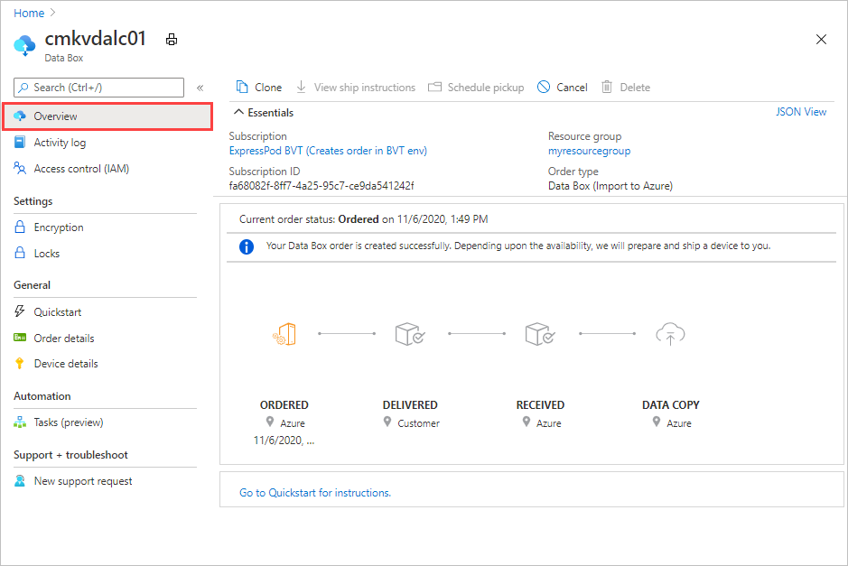

2. Go to **Settings > Encryption**. Under **Encryption type**, you can choose how you want to protect your device unlock key. By default, a Microsoft managed key is used to protect your device unlock password. 

    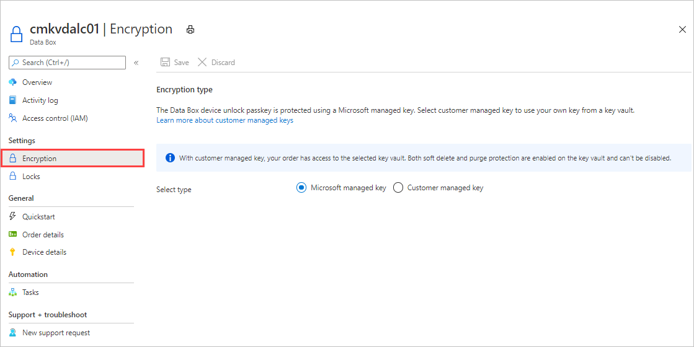

3. Select encryption type as **Customer managed key**. After you have selected the customer-managed key, **Select a key vault and key**.

    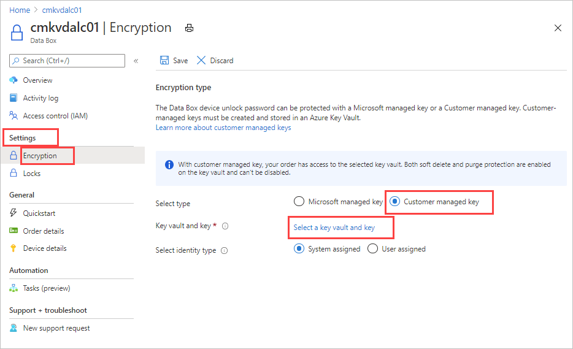

5. In the **Select key from Azure Key Vault** blade, the subscription is automatically populated. For **Key vault**, you can select an existing key vault from the dropdown list.

    

    You can also select **Create new** to create a new key vault. In the **Create key vault blade**, enter the resource group and the key vault name. Ensure that the **Soft delete** and **Purge protection** are enabled. Accept all other defaults. Select **Review + Create**.

    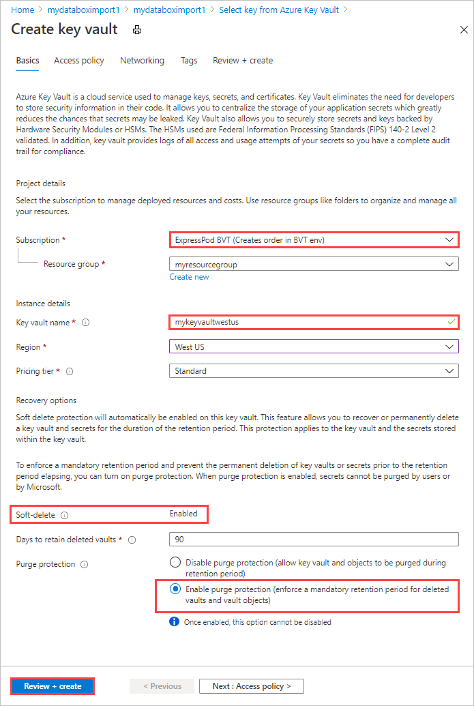

7. Review the information associated with your key vault and select **Create**. Wait for a couple minutes for the key vault creation to complete.

    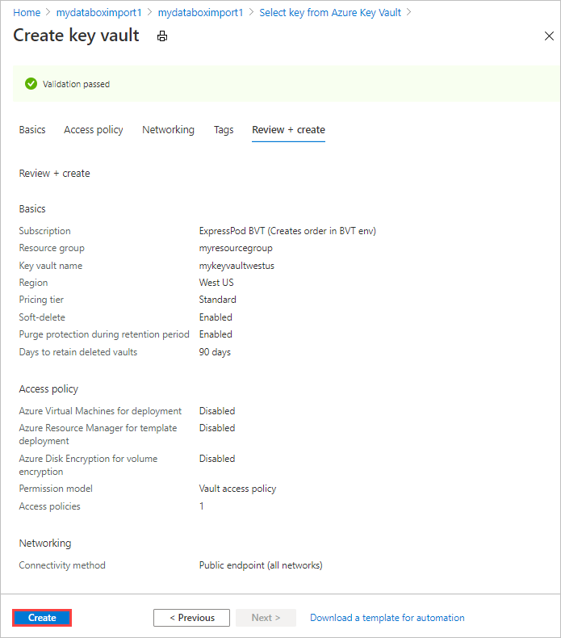

8. In the **Select key from Azure Key Vault**, you can select a key in the existing key vault.

    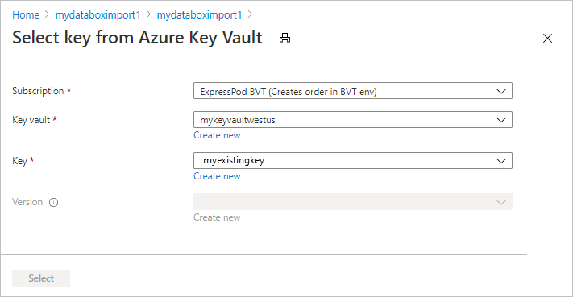

9. If you want to create a new key, select **Create new** to create a key. RSA key size can be 2048 or greater.

    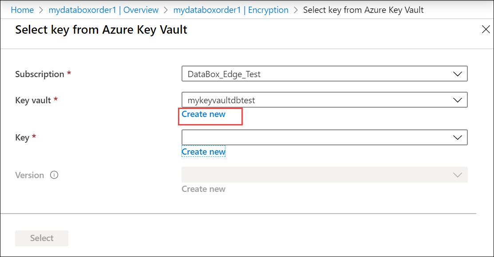

10. Provide the name for your key, accept the other defaults, and select **Create**. 

    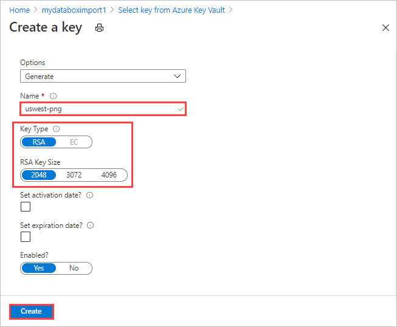

11. You are notified that a key is created in your key vault. Select the **Version** and then choose **Select**.

    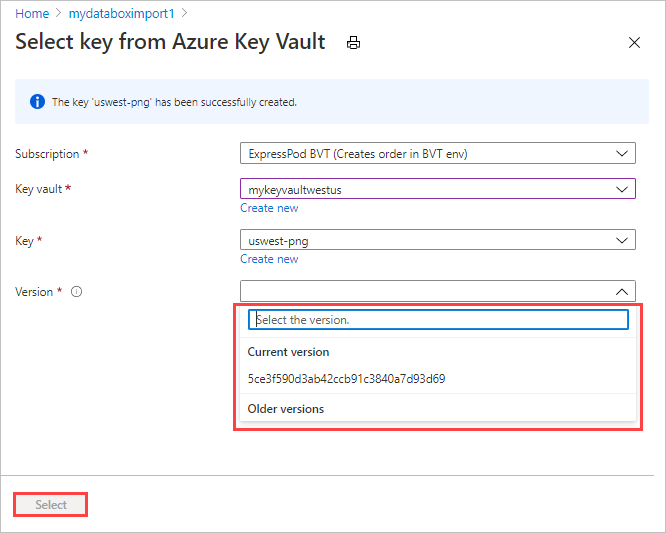

12. In the **Encryption type** pane, you can see the key vault and the key selected for your customer-managed key.

    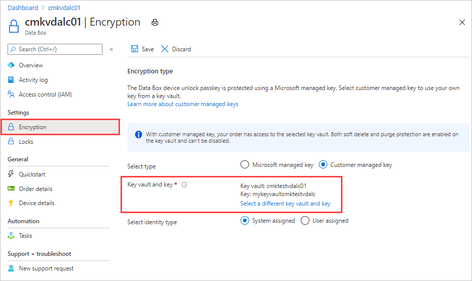

13. Save the key. 

    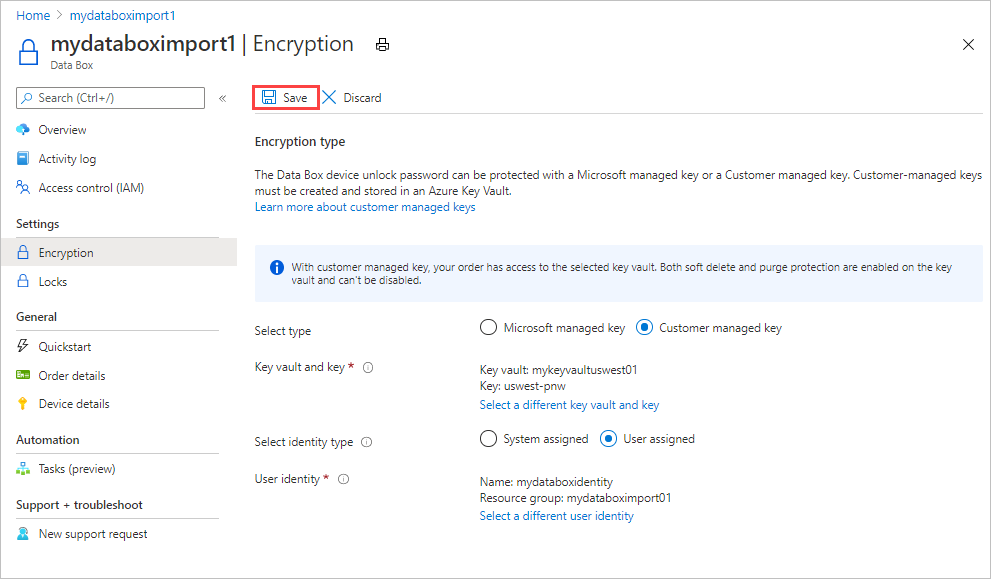

    The key URL is displayed under **Encryption type**.

    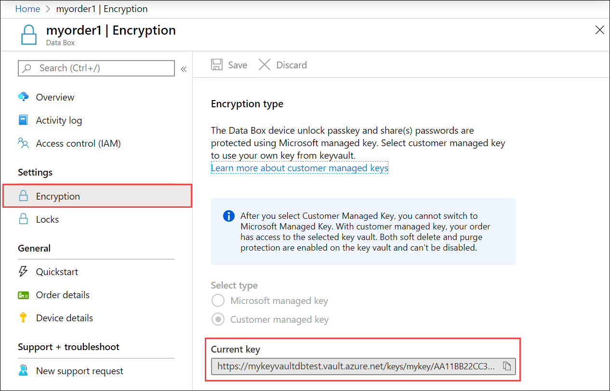

> [!IMPORTANT]
> You can disable Microsoft managed key and move to customer-managed key at any stage of the Data Box order. However, once you have created the customer-managed key, you cannot switch back to the Microsoft-managed key.

## Troubleshoot errors

If you receive any errors related to your customer-managed key, use the following table to troubleshoot.

| Error   code| Error details| Recoverable?|
|-------------|--------------|---------|
| SsemUserErrorEncryptionKeyDisabled| Could not fetch the passkey as the customer managed key is disabled.| Yes, by enabling the key version.|
| SsemUserErrorEncryptionKeyExpired| Could not fetch the passkey as the customer managed key has expired.| Yes, by enabling the key version.|
| SsemUserErrorKeyDetailsNotFound| Could not fetch the passkey as the customer managed key could not be found.| If you deleted the key vault, you can't recover the customer-managed key.  If you migrated the key vault to a different tenant, see [Change a key vault tenant ID after a subscription move](https://docs.microsoft.com/azure/key-vault/key-vault-subscription-move-fix). If you deleted the key vault:<ol><li>Yes, if it is in the purge-protection duration, using the steps at [Recover a key vault](https://docs.microsoft.com/azure/key-vault/general/soft-delete-powershell#recovering-a-key-vault).</li><li>No, if it is beyond the purge-protection duration.</li></ol> Else if the key vault underwent a tenant migration, yes, it can be recovered using one of the below steps: <ol><li>Revert the key vault back to the old tenant.</li><li>Set `Identity = None` and then set the value back to `Identity = SystemAssigned`. This deletes and recreates the identity once the new identity has been created. Enable `Get`, `Wrap`, and `Unwrap` permissions to the new identity in the key vault's Access policy.</li></ol> |
| SsemUserErrorKeyVaultBadRequestException| Could not fetch the passkey as the customer managed key access is revoked.| Yes, check if: <ol><li>Key vault still has the MSI in the access policy.</li><li>Access policy provides permissions to Get, Wrap, Unwrap.</li><li>If key vault is in a vNet behind the firewall, check if **Allow Microsoft Trusted Services** is enabled.</li></ol>|
| SsemUserErrorKeyVaultDetailsNotFound| Could not fetch the passkey as the associated key vault for the customer managed key could not be found. | If you deleted the key vault, you can't recover the customer-managed key.  If you migrated the key vault to a different tenant, see [Change a key vault tenant ID after a subscription move](https://docs.microsoft.com/azure/key-vault/key-vault-subscription-move-fix). If you deleted the key vault:<ol><li>Yes, if it is in the purge-protection duration, using the steps at [Recover a key vault](https://docs.microsoft.com/azure/key-vault/general/soft-delete-powershell#recovering-a-key-vault).</li><li>No, if it is beyond the purge-protection duration.</li></ol> Else if the key vault underwent a tenant migration, yes, it can be recovered using one of the below steps: <ol><li>Revert the key vault back to the old tenant.</li><li>Set `Identity = None` and then set the value back to `Identity = SystemAssigned`. This deletes and recreates the identity once the new identity has been created. Enable `Get`, `Wrap`, and `Unwrap` permissions to the new identity in the key vault's Access policy.</li></ol> |
| SsemUserErrorSystemAssignedIdentityAbsent  | Could not fetch the passkey as the customer managed key could not be found.| Yes, check if: <ol><li>Key vault still has the MSI in the access policy.</li><li>Identity is of type System assigned.</li><li>Enable Get, Wrap and Unwrap permissions to the identity in the key vault’s Access policy.</li></ol>|
| Generic error  | Could not fetch the passkey.| This is a generic error. Contact Microsoft Support to troubleshoot the error and determine the next steps.|

## Next steps

- [What is Azure Key Vault](https://docs.microsoft.com/azure/key-vault/key-vault-overview)?