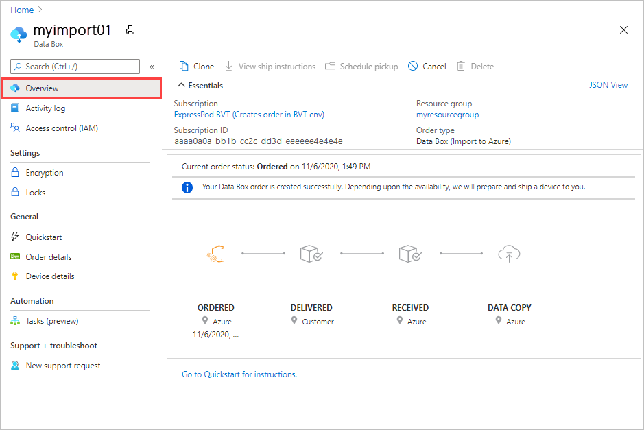
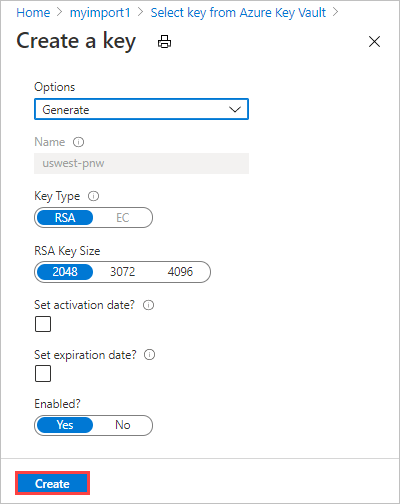
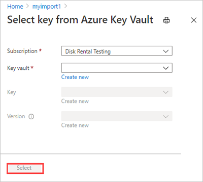
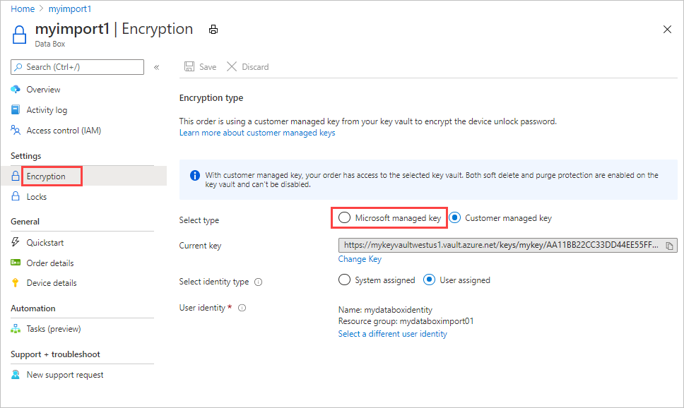

# Use customer-managed keys in Azure Key Vault for Azure Data Box

Azure Data Box protects the device unlock key (also known as the device password), which is used to lock a device, via an encryption key. By default, this encryption key is a Microsoft managed key. For more control, you can use a customer-managed key. 

Using a customer-managed key doesn't affect how data on the device is encrypted. It only affects how the device unlock key is encrypted.

To keep this level of control throughout the order process, use a customer-managed key when you create your order. For more information, see [Tutorial: Order Azure Data Box](data-box-deploy-ordered.md).

This article shows how to enable a customer-managed key for your existing Data Box order in the [Azure portal](https://portal.azure.com/). You'll find out how to change the key vault, key, version, or identity for your current customer-managed key, or switch back to using a Microsoft managed key.

This article applies to Azure Data Box and Azure Data Box Heavy devices.

## Requirements

The customer-managed key for a Data Box order must meet the following requirements:

- The key must be created and stored in an Azure Key Vault that has **Soft delete** and **Do not purge** enabled. For more information, see [What is Azure Key Vault?](../key-vault/general/overview.md). You can create a key vault and key while creating or updating your order.
- The key must be an RSA key of 2048 size or larger.
- You must enable the `Get`, `UnwrapKey`, and `WrapKey` permissions for the key in Azure Key Vault. The permissions must remain in place for the lifetime of the order. Otherwise, the customer-managed key can't be accessed at the start of the Data Copy phase.

## Enable key

To enable a customer-managed key for your existing Data Box order in the Azure portal, follow these steps:

1. Go to the **Overview** screen for your Data Box order.

    

2. Go to **Settings > Encryption**, and select **Customer managed key**. Then select **Select a key and key vault**.

    

   On the **Select key from Azure Key Vault** screen, your subscription is automatically populated.

 3. For **Key vault**, you can select an existing key vault from the dropdown list or select **Create new** and create a new key vault.

     

     To create a new key vault, enter the subscription, resource group, key vault name, and other info on the **Create new key vault** screen. In **Recovery options**, ensure that **Soft delete** and **Purge protection** are enabled. Then select **Review + Create**.

      

      Review the information for your key vault, and select **Create**. Wait for a couple minutes for key vault creation to complete.

       

4. On the **Select key from Azure Key Vault** screen, you can select an existing key from the key vault or create a new one.

    

   If you want to create a new key, select **Create new**. You must use an RSA key. The size can be 2048 or greater.

    

    Enter a name for your new key, accept the other defaults, and select **Create**. You'll be notified that a key has been created in your key vault.

    

5. For **Version**, you can select an existing key version from the drop-down list.

    

    If you want to generate a new key version, select **Create new**.

    

    Choose settings for the new key version, and select **Create**.

    

6. When you've selected a key vault, key, and key version, choose **Select**.

    

    The **Encryption type** settings show the key vault and key that you chose.

    

7. Select the type of identity to use to manage the customer-managed key for this resource. You can use the **system assigned** identity that was generated during order creation or choose a user-assigned identity.

    A user-assigned identity is an independent resource that you can use to manage access to resources. For more information, see [Managed identity types](../active-directory/managed-identities-azure-resources/overview.md).

    

    To assign a user identity, select **User assigned**. Then select **Select a user identity**, and select the managed identity that you want to use.

    

    You can't create a new user identity here. To find out how to create one, see [Create, list, delete, or assign a role to a user-assigned managed identity using the Azure portal](../active-directory/managed-identities-azure-resources/how-to-manage-ua-identity-portal.md).

    The selected user identity is shown in the **Encryption type** settings.

    

 8. Select **Save** to save the updated **Encryption type** settings.

     

    The key URL is displayed under **Encryption type**.

    

> [!IMPORTANT]
> You must enable the `Get`, `UnwrapKey`, and `WrapKey` permissions on the key. To set the permissions in Azure CLI, see [az keyvault set-policy](/cli/azure/keyvault#az-keyvault-set-policy).

## Change key

To change the key vault, key, and/or key version for the customer-managed key you're currently using, follow these steps:

1. On the **Overview** screen for your Data Box order, go to **Settings** > **Encryption**, and click **Change key**.

    

2. Choose **Select a different key vault and key**.

    

3. The **Select key from key vault** screen shows the subscription but no key vault, key, or key version. You can make any of the following changes:

   - Select a different key from the same key vault. You'll need to select the key vault before selecting the key and version.

   - Select a different key vault and assign a new key.

   - Change the version for the current key.
   
    When you finish your changes, choose **Select**.

    

4. Select **Save**.

    

> [!IMPORTANT]
> You must enable the `Get`, `UnwrapKey`, and `WrapKey` permissions on the key. To set the permissions in Azure CLI, see [az keyvault set-policy](/cli/azure/keyvault#az-keyvault-set-policy).

## Change identity

To change the identity that's used to manage access to the customer-managed key for this order, follow these steps:

1. On the **Overview** screen for your completed Data Box order, go to **Settings** > **Encryption**.

2. Make either of the following changes:

     - To change to a different user identity, click **Select a different user identity**. Then select a different identity in the panel on the right side of the screen, and choose **Select**.

       

   - To switch to the system-assigned identity generated during order creation, select **System assigned** by **Select identity type**.

     

3. Select **Save**.

    

## Use Microsoft managed key

To change from using a customer-managed key to the Microsoft managed key for your order, follow these steps:

1. On the **Overview** screen for your completed Data Box order, go to **Settings** > **Encryption**.

2. By **Select type**, select **Microsoft managed key**.

    

3. Select **Save**.

    

## Troubleshoot errors

If you receive any errors related to your customer-managed key, use the following table to troubleshoot.

| Error   code| Error details| Recoverable?|
|-------------|--------------|---------|
| SsemUserErrorEncryptionKeyDisabled| Could not fetch the passkey as the customer-managed key is disabled.| Yes, by enabling the key version.|
| SsemUserErrorEncryptionKeyExpired| Could not fetch the passkey as the customer-managed key has expired.| Yes, by enabling the key version.|
| SsemUserErrorKeyDetailsNotFound| Could not fetch the passkey as the customer-managed key could not be found.| If you deleted the key vault, you can't recover the customer-managed key.  If you migrated the key vault to a different tenant, see [Change a key vault tenant ID after a subscription move](../key-vault/general/move-subscription.md). If you deleted the key vault:<ol><li>Yes, if it is in the purge-protection duration, using the steps at [Recover a key vault](../key-vault/general/key-vault-recovery.md?tabs=azure-powershell#key-vault-powershell).</li><li>No, if it is beyond the purge-protection duration.</li></ol> Else if the key vault underwent a tenant migration, yes, it can be recovered using one of the below steps: <ol><li>Revert the key vault back to the old tenant.</li><li>Set `Identity = None` and then set the value back to `Identity = SystemAssigned`. This deletes and recreates the identity once the new identity has been created. Enable `Get`, `WrapKey`, and `UnwrapKey` permissions to the new identity in the key vault's Access policy.</li></ol> |
| SsemUserErrorKeyVaultBadRequestException | Applied a customer-managed key but the key access has not been granted or has been revoked, or unable to access key vault due to firewall being enabled. | Add the identity selected to your key vault to enable access to the customer-managed key. If key vault has firewall enabled, switch to a system assigned identity and then add a customer-managed key. For more information, see how to [Enable the key](#enable-key). |
| SsemUserErrorKeyVaultDetailsNotFound| Could not fetch the passkey as the associated key vault for the customer-managed key could not be found. | If you deleted the key vault, you can't recover the customer-managed key.  If you migrated the key vault to a different tenant, see [Change a key vault tenant ID after a subscription move](../key-vault/general/move-subscription.md). If you deleted the key vault:<ol><li>Yes, if it is in the purge-protection duration, using the steps at [Recover a key vault](../key-vault/general/key-vault-recovery.md?tabs=azure-powershell#key-vault-powershell).</li><li>No, if it is beyond the purge-protection duration.</li></ol> Else if the key vault underwent a tenant migration, yes, it can be recovered using one of the below steps: <ol><li>Revert the key vault back to the old tenant.</li><li>Set `Identity = None` and then set the value back to `Identity = SystemAssigned`. This deletes and recreates the identity once the new identity has been created. Enable `Get`, `WrapKey`, and `UnwrapKey` permissions to the new identity in the key vault's Access policy.</li></ol> |
| SsemUserErrorSystemAssignedIdentityAbsent  | Could not fetch the passkey as the customer-managed key could not be found.| Yes, check if: <ol><li>Key vault still has the MSI in the access policy.</li><li>Identity is of type System assigned.</li><li>Enable `Get`, `WrapKey`, and `UnwrapKey` permissions to the identity in the key vault’s access policy. These permissions must remain for the lifetime of the order. They're used during order creation and at the beginning of the Data Copy phase.</li></ol>|
| SsemUserErrorUserAssignedLimitReached | Adding new User Assigned Identity failed as you have reached the limit on the total number of user assigned identities that can be added. | Retry the operation with fewer user identities, or remove some user-assigned identities from the resource before retrying. |
| SsemUserErrorCrossTenantIdentityAccessForbidden | Managed identity access operation failed.   Note: This error can occur when a subscription is moved to different tenant. The customer has to manually move the identity to the new tenant. | Try adding a different user-assigned identity to your key vault to enable access to the customer-managed key. Or move the identity to the new tenant under which the subscription is present. For more information, see how to [Enable the key](#enable-key). |
| SsemUserErrorKekUserIdentityNotFound | Applied a customer-managed key but the user assigned identity that has access to the key was not found in the active directory.   Note: This error can occur when a user identity is deleted from Azure.| Try adding a different user-assigned identity to your key vault to enable access to the customer-managed key. For more information, see how to [Enable the key](#enable-key). |
| SsemUserErrorUserAssignedIdentityAbsent | Could not fetch the passkey as the customer-managed key could not be found. | Could not access the customer-managed key. Either the User Assigned Identity (UAI) associated with the key is deleted or the UAI type has changed. |
| SsemUserErrorKeyVaultBadRequestException | Applied a customer-managed key, but key access has not been granted or has been revoked, or the key vault couldn't be accessed because a firewall is enabled. | Add the identity selected to your key vault to enable access to the customer-managed key. If the key vault has a firewall enabled, switch to a system-assigned identity and then add a customer-managed key. For more information, see how to [Enable the key](#enable-key). |
| SsemUserErrorEncryptionKeyTypeNotSupported | The encryption key type isn't supported for the operation. | Enable a supported encryption type on the key - for example, RSA or RSA-HSM. For more information, see [Key types, algorithms, and operations](../key-vault/keys/about-keys-details.md). |
| SsemUserErrorSoftDeleteAndPurgeProtectionNotEnabled | Key vault does not have soft delete or purge protection enabled. | Ensure that both soft delete and purge protection are enabled on the key vault. |
| SsemUserErrorInvalidKeyVaultUrl (Command-line only) | An invalid key vault URI was used. | Get the correct key vault URI. To get the key vault URI, use [Get-AzKeyVault](/powershell/module/az.keyvault/get-azkeyvault) in PowerShell.  |
| SsemUserErrorKeyVaultUrlWithInvalidScheme | Only HTTPS is supported for passing the key vault URI. | Pass the key vault URI over HTTPS. |
| SsemUserErrorKeyVaultUrlInvalidHost | The key vault URI host is not an allowed host in the geographical region. | In the public cloud, the key vault URI should end with `vault.azure.net`. In the Azure Government cloud, the key vault URI should end with `vault.usgovcloudapi.net`. |  
| Generic error  | Could not fetch the passkey. | This error is a generic error. Contact Microsoft Support to troubleshoot the error and determine the next steps.|

## Next steps

- [What is Azure Key Vault?](../key-vault/general/overview.md)
- [Quickstart: Set and retrieve a secret from Azure Key Vault using the Azure portal](../key-vault/secrets/quick-create-portal.md)