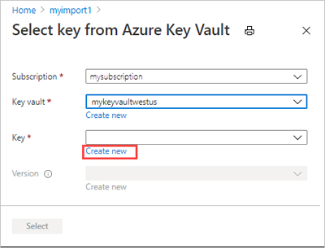
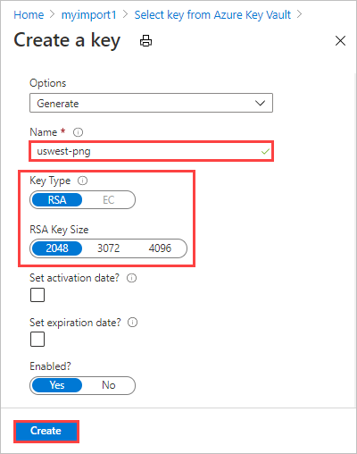
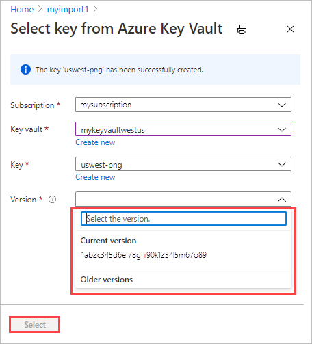

# Use customer-managed keys in Azure Key Vault for Azure Data Box

Azure Data Box protects the device unlock key (also known as the device password), which is used to lock a device, via an encryption key. By default, this encryption key is a Microsoft managed key. For additional control, you can use a customer-managed key.

Using a customer-managed key doesn't affect how data on the device is encrypted. It only affects how the device unlock key is encrypted.

To keep this level of control throughout the order process, use a customer-managed key when you create your order. For more information, see [Tutorial: Order Azure Data Box](data-box-deploy-ordered.md).

This article shows how to change the type of encryption key for an existing Data Box order, or to change the key vault, key, identity type, or user identity that you're using for a customer-managed key, via the [Azure portal](https://portal.azure.com/). This article applies to Azure Data Box and Azure Data Box Heavy devices.

## Requirements

The customer-managed key for a Data Box order must meet the following requirements:

- The key must be created and stored in an Azure Key Vault that has **Soft delete** and **Do not purge** enabled. For more information, see [What is Azure Key Vault?](../key-vault/general/overview.md). You can create a key vault and key while creating or updating your order.

- The key must be an RSA key of 2048 size or larger.

## Change encryption key

To change the encryption key used for a Data Box order in the Azure portal, follow these steps:

1. Go to the **Overview** screen for your completed Data Box order.

    

2. Go to **Settings > Encryption**. Under **Encryption type**, you can choose how you want to protect your device unlock key, by using either a Microsoft managed key or a customer-managed key. You can select either key type when you place your Data Box order and change it later.

    

    If you want to switch from a customer-managed key to a Microsoft managed key, simply select **Microsoft managed key**. No other steps are needed.

    If you want to switch to a customer-managed key or change the key vault, key, identity type, or identity for your existing customer-managed key, complete the following steps.

3. If you're changing to a customer-managed key, select **Customer managed key** as the encryption type. Then select **Select a key vault and key**. If you're changing an existing key, you'll select **Change the key vault and key**.

    

4. On the **Select key from Azure Key Vault** screen, you can select or change the key vault and key. The subscription is automatically populated.

   - For **Key vault**, you can select an existing key vault from the dropdown list.

     

    - Or select **Create new** to create a new key vault. On the **Create key vault** screen, enter the resource group and a key vault name. Ensure that **Soft delete** and **Purge protection** are enabled. Accept all other defaults. Select **Review + Create**.

      

      Review the information for your key vault, and select **Create**. Wait for a couple minutes for key vault creation to complete.

       

5. On the **Select key from Azure Key Vault** screen, you can select an existing key from the key vault.

    

   If you want to create a new key, select **Create new**. You must use an RSA key. The size can be 2048 or greater.

    

   Enter a name for your new key, accept the other defaults, and select **Create**. You'll be notified that a key has been created in your key vault.

    

6. For **Version**, select the version of the key to use - the current version or an earlier one from the drop-down list.

    

    If you want to generate a new key version, select **Create new**.

    

    Choose settings for the new key version, and select **Create**.

    

7. When you've selected a key vault, key, and key version, click **Select**.

    

    The **Encryption type** settings show the key vault and key that you chose.

    

7. Select the type of identity to use to manage the customer-managed key for this resource. You can use the **system assigned** identity that was generated during order creation or select **user assigned** and choose an identity of your own.

    A user-assigned identity is an independent resource that you can use to manage access to resources. For more information, see [Managed identity types](/azure/active-directory/managed-identities-azure-resources/overview).

    

    If you want to assign a user identity, select **Select a user identity** and then select your managed identity that you want to use.

    

    You can't create a new user identity here. To find out how to create one, see [Create, list, delete or assign a role to a user-assigned managed identity using the Azure portal](/azure-docs/blob/master/articles/active-directory/managed-identities-azure-resources/how-to-manage-ua-identity-portal).

    The selected user identity is shown in the **Encryption type** settings.

    

 8. Select **Save** to save the updated **Encryption type** settings.

     

The key URL is displayed under **Encryption type**.

<!--Probably need new screen from recent order. Can't successfully save encryption settings with my subscription.-->

## Troubleshoot errors

If you receive any errors related to your customer-managed key, use the following table to troubleshoot.

| Error   code| Error details| Recoverable?|
|-------------|--------------|---------|
| SsemUserErrorEncryptionKeyDisabled| Could not fetch the passkey as the customer managed key is disabled.| Yes, by enabling the key version.|
| SsemUserErrorEncryptionKeyExpired| Could not fetch the passkey as the customer managed key has expired.| Yes, by enabling the key version.|
| SsemUserErrorKeyDetailsNotFound| Could not fetch the passkey as the customer managed key could not be found.| If you deleted the key vault, you can't recover the customer-managed key.  If you migrated the key vault to a different tenant, see [Change a key vault tenant ID after a subscription move](../key-vault/general/move-subscription.md). If you deleted the key vault:<ol><li>Yes, if it is in the purge-protection duration, using the steps at [Recover a key vault](../key-vault/general/soft-delete-powershell.md#recovering-a-key-vault).</li><li>No, if it is beyond the purge-protection duration.</li></ol> Else if the key vault underwent a tenant migration, yes, it can be recovered using one of the below steps: <ol><li>Revert the key vault back to the old tenant.</li><li>Set `Identity = None` and then set the value back to `Identity = SystemAssigned`. This deletes and recreates the identity once the new identity has been created. Enable `Get`, `Wrap`, and `Unwrap` permissions to the new identity in the key vault's Access policy.</li></ol> |
| SsemUserErrorKeyVaultBadRequestException| Could not fetch the passkey as the customer managed key access is revoked.| Yes, check if: <ol><li>Key vault still has the MSI in the access policy.</li><li>Access policy provides permissions to Get, Wrap, Unwrap.</li><li>If key vault is in a vNet behind the firewall, check if **Allow Microsoft Trusted Services** is enabled.</li></ol>|
| SsemUserErrorKeyVaultDetailsNotFound| Could not fetch the passkey as the associated key vault for the customer managed key could not be found. | If you deleted the key vault, you can't recover the customer-managed key.  If you migrated the key vault to a different tenant, see [Change a key vault tenant ID after a subscription move](../key-vault/general/move-subscription.md). If you deleted the key vault:<ol><li>Yes, if it is in the purge-protection duration, using the steps at [Recover a key vault](../key-vault/general/soft-delete-powershell.md#recovering-a-key-vault).</li><li>No, if it is beyond the purge-protection duration.</li></ol> Else if the key vault underwent a tenant migration, yes, it can be recovered using one of the below steps: <ol><li>Revert the key vault back to the old tenant.</li><li>Set `Identity = None` and then set the value back to `Identity = SystemAssigned`. This deletes and recreates the identity once the new identity has been created. Enable `Get`, `Wrap`, and `Unwrap` permissions to the new identity in the key vault's Access policy.</li></ol> |
| SsemUserErrorSystemAssignedIdentityAbsent  | Could not fetch the passkey as the customer managed key could not be found.| Yes, check if: <ol><li>Key vault still has the MSI in the access policy.</li><li>Identity is of type System assigned.</li><li>Enable Get, Wrap and Unwrap permissions to the identity in the key vault’s Access policy.</li></ol>|
| SsemUserErrorUserAssignedLimitReached | Adding new User Assigned Identity failed as you have reached the limit on the total number of user assigned identities that can be added. | Please retry the operation with fewer user identities or remove some user assigned identities from the resource before retrying. |
| semUserErrorKekUserIdentityNotFound | Applied a customer managed key but the user assigned identity that has access to the key was not found in the active directory.   Note: This is for the case when user identity is deleted from Azure.| Please try adding a different user assigned identity selected to your key vault to enable access to the customer managed key. For more information, see how to [Change encryption key](#change-encryption-key). |
| SsemUserErrorUserAssignedIdentityAbsent | Could not fetch the passkey as the customer managed key could not be found. | Could not access the customer managed key. Either the User Assigned Identity (UAI) associated with the key is deleted or the UAI type has changed. |
| SsemUserErrorCrossTenantIdentityAccessForbidden | Managed identity access operation failed.   Note: This is for the scenario when subscription is moved to different tenant. Customer has to manually move the identity to new tenant. PFA mail for more details. | Please try adding a different user assigned identity selected to your key vault to enable access to the customer managed key. For more information, see how to [Change encryption key](#change-encryption-key). |
| SsemUserErrorKeyVaultBadRequestException | Applied a customer managed key but the key access has not been granted or has been revoked, or unable to access key vault due to firewall being enabled. | Add the identity selected to your key vault to enable access to the customer managed key. If key vault has firewall enabled, switch to a system assigned identity and then add a customer managed key. For more information, see how to [Change encryption key](#change-encryption-key). |
| Generic error  | Could not fetch the passkey.| This is a generic error. Contact Microsoft Support to troubleshoot the error and determine the next steps.|

## Next steps

- [What is Azure Key Vault?](../key-vault/general/overview.md)
- [Quickstart: Set and retrieve a secret from Azure Key Vault using the Azure portal](../key-vault/secrets/quick-create-portal.md)
