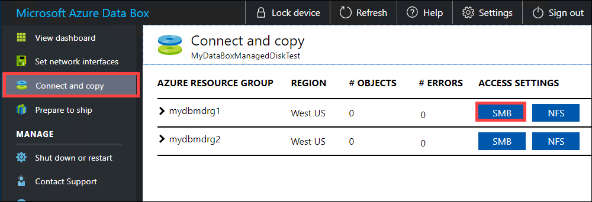
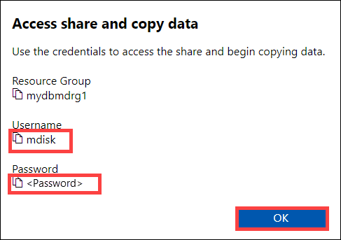
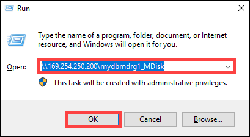
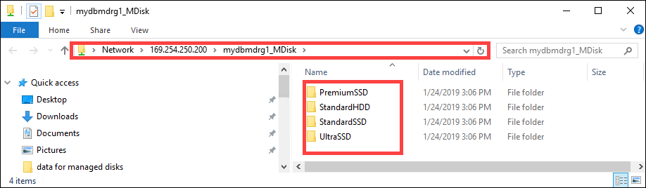
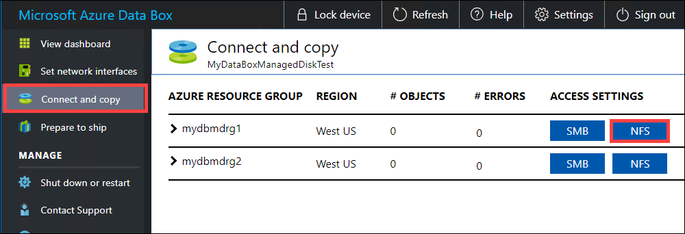
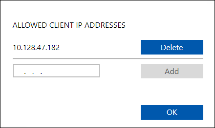
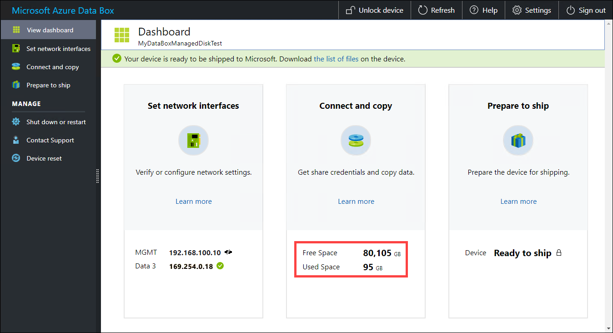

# Tutorial: Use Data Box to migrate on-premises VM workloads to Azure

This tutorial describes how to use the Azure Data Box to migrate you on-premises VM workloads to Azure. The VHDs from VM workloads are copied to Data Box as page blobs and are uploaded into Azure as managed disks. These managed disks can then be attached to Azure VMs.

In this tutorial, you learn how to:

> [!div class="checklist"]
> * Review prerequisites
> * Connect to Data Box
> * Copy data to Data Box


## Prerequisites

Before you begin, make sure that:

1. You've completed the [Tutorial: Set up Azure Data Box](data-box-deploy-set-up.md).
2. You've received your Data Box and the order status in the portal is **Delivered**.
3. You're connected to a high-speed network. We strongly recommend that you have at least one 10-GbE connection. If a 10-GbE connection isn't available, use a 1-GbE data link but the copy speeds will be impacted.

## Connect to Data Box

Based on the resource groups specified, Data Box creates one share for each associated resource group. For example, if `mydbmdrg1` and `mydbmdrg2` were created when placing the order, the following shares are created:

- `mydbmdrg1_MDisk`
- `mydbmdrg2_MDisk`

Within each share, the following four folders are created which correspond to containers in your storage account.

- Premium SSD
- Standard HDD
- Standard SSD
- Ultra SSD

The following table shows the UNC paths to the shares on your Data Box.
 
|        Connection protocol           |             UNC path to the share                                               |
|-------------------|--------------------------------------------------------------------------------|
| SMB |`\\<DeviceIPAddress>\<ResourceGroupName_MDisk>\<Premium SSD>\file.vhd`<br> `\\<DeviceIPAddress>\<ResourceGroupName_MDisk>\<Standard HDD>\file.vhd`<br> `\\<DeviceIPAddress>\<ResourceGroupName_MDisk>\<Standard SSD>\file.vhd`<br>`\\<DeviceIPAddress>\<ResourceGroupName_MDisk>\<Ultra SSD>\file.vhd` |  
| NFS |`//<DeviceIPAddress>/<ResourceGroup1_MDisk>/<Premium SSD>/file.vhd`<br> `//<DeviceIPAddress>/<ResourceGroupName_MDisk>/<Standard HDD>/file.vhd`<br> `//<DeviceIPAddress>/<ResourceGroupName_MDisk>/<Standard SSD>/file.vhd`<br>`//<DeviceIPAddress>/<ResourceGroupName_MDisk>/<Ultra SSD>/file.vhd` |

Depending on whether you are using SMB or NFS to connect to Data Box shares, the steps to connect are different. 

> [!NOTE]
> Connecting via REST is not supported for this feature.

### Connect to Data Box via SMB

If using a Windows Server host computer, follow these steps to connect to the Data Box.

1. The first step is to authenticate and start a session. Go to **Connect and copy**. Click **Get credentials** to get the access credentials for the shares associated with your resource group.

    > [!NOTE] 
    > The credentials for all the shares for managed disks are identical.

    

2. From the Access share and copy data dialog box, copy the **Username** and the **Password** for the share. Click **OK**.
    
    

3. To access the shares associated with your resource (*mydbmdrg1* in the following example) from your host computer, open a command window. At the command prompt, type:

    `net use \\<IP address of the device>\<share name>  /u:<user name for the share>`

    Your UNC share path in this example are as follows:

    - `\\169.254.250.200\mydbmdrg1_MDisk`
    - `\\169.254.250.200\mydbmdrg2_MDisk`
    
4. Enter the password for the share when prompted. The following sample shows connecting to a share via the preceding command.

    ```
    C:\>net use \\169.254.250.200\mydbmdrgl_MDisk /u:mdisk
    Enter the password for ‘mdisk’ to connect to '169.254.250.200':
    The command completed successfully.
    C: \>
    ```

4. Press  Windows + R. In the **Run** window, specify the `\\<device IP address>\<ShareName>`. Click **OK** to open File Explorer.
    
    

    You should now see the following 4 precreated folders within each share.
    
    


### Connect to Data Box via NFS

If you are using a Linux host computer, perform the following steps to configure Data Box to allow access to NFS clients.

1. Supply the IP addresses of the allowed clients that can access the share. In the local web UI, go to **Connect and copy** page. Under **NFS settings**, click **NFS client access**.

    

2. Supply the IP address of the NFS client and click **Add**. You can configure access for multiple NFS clients by repeating this step. Click **OK**.

    

2. Ensure that the Linux host computer has a [supported version](data-box-system-requirements.md) of NFS client installed. Use the specific version for your Linux distribution. 

3. Once the NFS client is installed, use the following command to mount the NFS share on your Data Box device:

    `sudo mount <Data Box device IP>:/<NFS share on Data Box device> <Path to the folder on local Linux computer>`

    The following example shows how to connect via NFS to a Data Box share. The Data Box device IP is `169.254.250.200`, the share `mydbmdrg1_MDisk` is mounted on the ubuntuVM, mount point being `/home/databoxubuntuhost/databox`.

    `sudo mount -t nfs 169.254.250.200:/mydbmdrg1_MDisk /home/databoxubuntuhost/databox`


## Copy data to Data Box

Once you're connected to the data server, the next step is to copy data. Depending on whether you are connecting via SMB or NFS, you can use:

- [Copy data via SMB](data-box-deploy-copy-data.md#copy-data-to-data-box)
- [Copy data via NFS](data-box-deploy-copy-data-via-nfs.md#copy-data-to-data-box)


> [!IMPORTANT]
> - Always copy the VHDs to one of the precreated folders. If you copy the VHDs outside of these folders or in a folder that you created, the VHDs will be uploaded to Azure Storage account as page blobs and not managed disks.
> - Only the fixed VHDs can be uploaded to create managed disks. VHDX files or dynamic and differencing VHDs are not supported.
> -  Ensure that you copy data only to those precreated folders that correspond to the managed disk types supported by your subscription. For example, if Ultra SSDs are not supported by your subscription, and if you copy data to the Ultra SSD folder, then the upload to Azure will fail with an error.
> -  You can only have one managed disk with a given name in a resource group across all the precreated folders. This implies that the VHDs uploaded to the precreated folders should have unique names.

Wait for the copy jobs to finish. As some errors are only logged in the **Connect and copy** page, make sure that the copy jobs have finished with no errors before you go to the next step.


To ensure data integrity, checksum is computed inline as the data is copied. Once the copy is complete, verify the used space and the free space on your device.
    


Once the copy job is finished, you can go to **Prepare to ship**.

>[!NOTE]
> Prepare to ship can't run while copy jobs are in progress.

## Next steps

In this tutorial, you learned about Azure Data Box topics such as:

> [!div class="checklist"]
> * Review prerequisites
> * Connect to Data Box
> * Copy data to Data Box


Advance to the next tutorial to learn how to ship your Data Box back to Microsoft.

> [!div class="nextstepaction"]
> [Ship your Azure Data Box to Microsoft](./data-box-deploy-picked-up.md)

