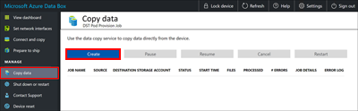
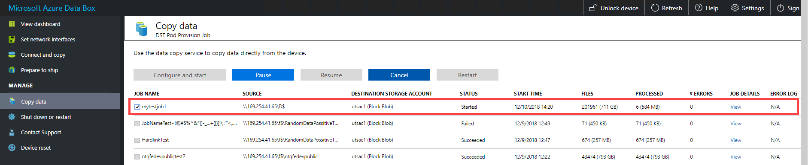
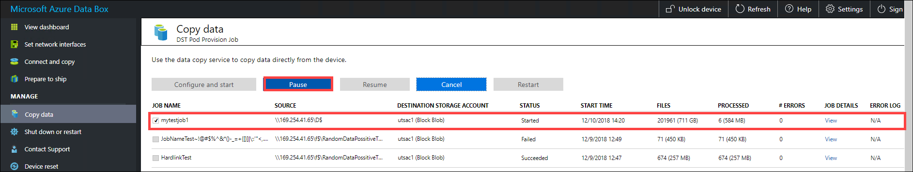
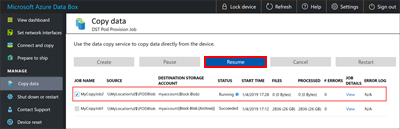
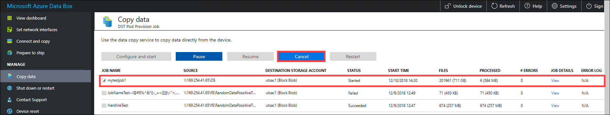
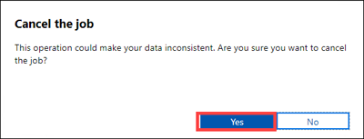
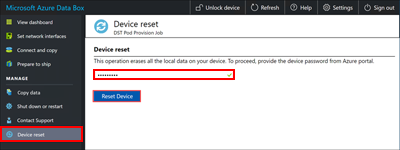
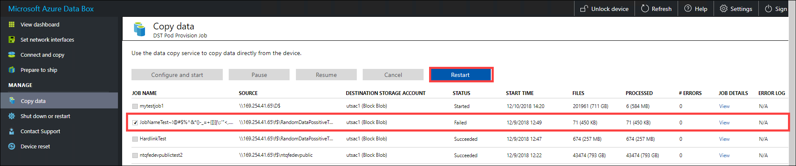
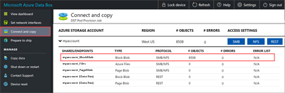
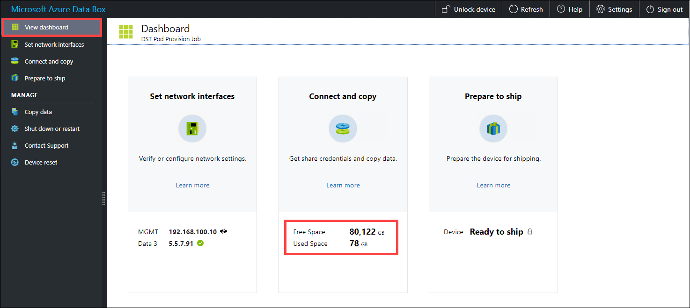

# Tutorial: Use the data copy service to copy data into Azure Data Box (preview)

This tutorial describes how to ingest data by using the data copy service without an intermediate host. The data copy service runs locally on Microsoft Azure Data Box, connects to your network-attached storage (NAS) device via SMB, and copies data to Data Box. 

Use the data copy service:

- In NAS environments where intermediate hosts might not be available.
- With small files that take weeks for ingestion and upload of data. The data copy service significantly improves the ingestion and upload time for small files.

In this tutorial, you learn how to:

> [!div class="checklist"]
>
> * Copy data to Data Box

## Prerequisites

Before you begin, make sure that:

1. You've completed this tutorial: [Set up Azure Data Box](data-box-deploy-set-up.md).
2. You've received your Data Box device and the order status in the portal is **Delivered**.
3. You have the credentials of the source NAS device that you'll connect to for data copy.
4. You're connected to a high-speed network. We strongly recommend that you have at least one 10-Gigabit Ethernet (GbE) connection. If a 10-GbE connection isn't available, you can use a 1-GbE data link, but the copy speeds will be affected.

## Copy data to Data Box

After you're connected to the NAS device, the next step is to copy your data. Before you begin the data copy, review the following considerations:

* While copying data, make sure that the data size conforms to the size limits described in the article [Azure storage and Data Box limits](data-box-limits.md).

* If data uploaded by Data Box is concurrently uploaded by other applications outside Data Box, upload-job failures and data corruption might result.

* If the data is being modified as the data copy service is reading it, you might see failures or corruption of data.

> [!IMPORTANT]
> Make sure that you maintain a copy of the source data until you can confirm that the Data Box has transferred your data into Azure Storage.

To copy data by using the data copy service, you need to create a job:

1. In the local web UI of your Data Box device, go to **Manage** > **Copy data**.
2. On the **Copy data** page, select **Create**.

    

3. In the **Configure job and start** dialog box, fill out the following fields:
    
    |Field                          |Value    |
    |-------------------------------|---------|
    |**Job name**                       |A unique name fewer than 230 characters for the job. These characters aren't allowed in the job name: \<, \>, \|, \?, \*, \\, \:, \/, and \\\.         |
    |**Source location**                |Provide the SMB path to the data source in the format: `\\<ServerIPAddress>\<ShareName>` or `\\<ServerName>\<ShareName>`.        |
    |**Username**                       |Username in `\\<DomainName><UserName>` format to access the data source. If a local administrator is connecting, they will need explicit security permissions. Right-click the folder, select **Properties** and then select **Security**. This should add the local administrator in the **Security** tab.       |
    |**Password**                       |Password to access the data source.           |
    |**Destination storage account**    |Select the target storage account to upload data to from the list.         |
    |**Destination type**       |Select the target storage type from the list: **Block Blob**, **Page Blob**, **Azure Files**, or **Block Blob (Archive)**.        |
    |**Destination container/share**    |Enter the name of the container or share that you want to upload data to in your destination storage account. The name can be a share name or a container name. For example, use `myshare` or `mycontainer`. You can also enter the name in the format `sharename\directory_name` or `containername\virtual_directory_name`.        |
    |**Copy files matching pattern**    | You can enter the file-name matching pattern in the following two ways:<ul><li>**Use wildcard expressions:** Only `*` and `?` are supported in wildcard expressions. For example, the expression `*.vhd` matches all the files that have the `.vhd` extension. Similarly, `*.dl?` matches all the files with either the extension `.dl` or that start with `.dl`, such as `.dll`. Likewise, `*foo` matches all the files whose names end with `foo`. You can directly enter the wildcard expression in the field. By default, the value you enter in the field is treated as a wildcard expression.</li><li>**Use regular expressions:** POSIX-based regular expressions are supported. For example, the regular expression `.*\.vhd` will match all the files that have the `.vhd` extension. For regular expressions, provide the `<pattern>` directly as `regex(<pattern>)`. For more information about regular expressions, go to [Regular expression language - a quick reference](/dotnet/standard/base-types/regular-expression-language-quick-reference).</li><ul>|
    |**File optimization**              |When this feature is enabled, files smaller than 1 MB are packed during ingestion. This packing speeds up the data copy for small files. It also saves a significant amount of time when the number of files far exceeds the number of directories. If you use file optimization:<ul><li>After you run prepare to ship, you can [download a BOM file](data-box-logs.md#inspect-bom-during-prepare-to-ship), which lists the original file names, to help you ensure that all the right files are copied.</li><li>Don't delete the packed files, whose file names begin with "ADB_PACK_". If you delete a packed file, the original file isn't uploaded during future data copies.</li><li>Don't copy the same files that you copy with the Copy Service via other protocols such as SMB, NFS, or REST API. Using different protocols can result in conflicts and failure during data uploads. </li><li>File optimization is not supported for Azure Files. To see what timestamps, file attributes, and ACLs are copied for a non-optimized data copy job, view the [transferred metadata](data-box-file-acls-preservation.md). </li></ul>    |
 
4. Select **Start**. The inputs are validated, and if the validation succeeds, then the job starts. It might take a few minutes for the job to start.

    

5. A job with the specified settings is created. You can pause, resume, cancel, or restart a job. Select the check box next to the job name, and then select the appropriate button.

    
    
    - You can pause a job if it's affecting the NAS device's resources during peak hours:

        

        You can resume the job later during off-peak hours:

        

    - You can cancel a job at any time:

        
        
        When you cancel a job, a confirmation is required:

        

        If you decide to cancel a job, the data that is already copied isn't deleted. To delete any data that you've copied to your Data Box device, reset the device.

        

        >[!NOTE]
        > If you cancel or pause a job, large files might be only partially copied. These partially copied files are uploaded in the same state to Azure. When you cancel or pause a job, make sure that your files have been properly copied. To validate the files, look at the SMB shares or download the BOM file.

    - You can restart a job if it has failed because of a transient error, such as a network glitch. But you can't restart a job if it has reached a terminal status, such as **Succeeded** or **Completed with errors**. Job failures might be caused by file-naming or file-size issues. These errors are logged, but the job can't be restarted after it's completed.

        

        If you experience a failure and you can't restart the job, download the error logs and look up the failure in the log files. After you've corrected the issue, create a new job to copy the files. You can also [copy the files over SMB](data-box-deploy-copy-data.md).
    
    - In this release, you can't delete a job.
    
    - You can create unlimited jobs, but you can run only a maximum of 10 jobs in parallel at any one time.
    - If **File optimization** is on, small files are packed at ingest to improve copy performance. In these cases, you'll see a packed file (it will have a GUID as its file name). Don't delete this file. It will be unpacked during upload.

6. While the job is in progress, on the **Copy data** page:

    - In the **Status** column, you can view the status of the copy job. The status can be:
        - **Running**
        - **Failed**
        - **Succeeded**
        - **Pausing**
        - **Paused**
        - **Canceling**
        - **Canceled**
        - **Completed with errors**
    - In the **Files** column, you can see the number and the total size of the files being copied.
    - In the **Processed** column, you can see the number and the total size of the files that are processed.
    - In the **Job details** column, select **View** to see the job details.
    - If any errors occur during the copy process, as shown in the **# Errors** column, go to the **Error log** column and download the error logs for troubleshooting.

Wait for the copy job to finish. Because some errors are logged only on the **Connect and copy** page, make sure that the copy job has finished with no errors before you go to the next step.

To ensure data integrity, a checksum is computed inline as the data is copied. After the copy is complete, select **View dashboard** to verify the used space and free space on your device.
    

After the copy job is finished, you can select **Prepare to ship**.

>[!NOTE]
> **Prepare to ship** can't run while copy jobs are in progress.

## Next steps

Advance to the next tutorial to learn how to ship your Data Box device back to Microsoft.

> [!div class="nextstepaction"]
> [Ship your Azure Data Box device to Microsoft](./data-box-deploy-picked-up.md)