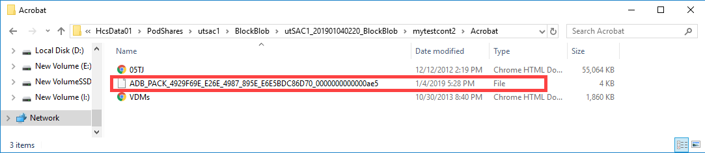

# Tutorial: Use data copy service to directly ingest data into Azure Data Box (preview)

This tutorial describes how to ingest data using the data copy service without the need of an intermediate host. The data copy service runs locally on the Data Box, connects to your NAS device via SMB, and copies data to Data Box.

Use data copy service:

- In the network-attached storage (NAS) environments where the intermediate hosts may not be available.
- With small files that take weeks for ingestion and upload of data. This service significantly improves the ingestion and upload time.

In this tutorial, you learn how to:

> [!div class="checklist"]
> * Copy data to Data Box
> * Prepare to ship Data Box.

## Prerequisites

Before you begin, make sure that:

1. You've completed the [Tutorial: Set up Azure Data Box](data-box-deploy-set-up.md).
2. You've received your Data Box and the order status in the portal is **Delivered**.
3. You have the credentials of the source NAS device that you connect to for data copy.
4. You're connected to a high-speed network. We strongly recommend that you have at least one 10-GbE connection. If a 10-GbE connection isn't available, use a 1-GbE data link but the copy speeds will be impacted.

## Copy data to Data Box

Once you're connected to the NAS, the next step is to copy data. Before you begin the data copy, review the following considerations:

- While copying data, make sure that the data size conforms to the size limits described in the [Azure storage and Data Box limits](data-box-limits.md).
- If data uploaded by Data Box, is concurrently uploaded by other applications outside of Data Box, then this could result in upload job failures and data corruption.
- If the data is being churned as the data copy service is reading it, you could see failures or corruption of data.

To copy data using data copy service, you need to create a job. Follow these steps to create a job to copy data.

1. In the local web UI of your Data Box, go to **Manage > Copy data**.
2. In the **Copy data** page, click **Create**.

    

3. In the **Configure and start** dialog box, provide the following inputs.
    
    |Field                          |Value    |
    |-------------------------------|---------|
    |Job name                       |A unique name fewer than 230 characters for the job. These characters aren't allowed in the job name - \<, \>, \|, \?, \*, \\, \:, \/, and \\\.         |
    |Source location                |Provide the SMB path to the data source in the format: `\\<ServerIPAddress>\<ShareName>` or `\\<ServerName>\<ShareName>`.        |
    |Username                       |Username to access the data source.        |
    |Password                       |Password to access the data source.           |
    |Destination storage account    |Select the target storage account to upload data to from the dropdown list.         |
    |Destination storage type       |Select the target storage type from block blob, page blob, or Azure Files.        |
    |Destination container/share    |Enter the name of the container or share to upload data in your destination storage account. The name can be a share name or a container name. For example, `myshare` or `mycontainer`. You can also enter in the format `sharename\directory_name` or `containername\virtual_directory_name` in cloud.        |
    |Copy files matching pattern    | Enter file name matching pattern in the following two ways.<ul><li>**Use wildcard expressions** Only `*` and `?` are supported in wildcard expressions. For example, this expression `*.vhd` matches all the files that have .vhd extension. Similarly, `*.dl?` matches all the files whose extension is either `.dl` or `.dll`. Also, `*foo` will match all the files whose names end with `foo`. You can directly enter wildcard expression in the field. By default, value entered in the field is treated as wildcard expression.</li><li>**Use regular expressions** - POSIX-based regular expressions are supported. For example, a regular expression `.*\.vhd` will match all the files that have `.vhd` extension. For regular expression, provide the `<pattern>` directly as `regex(<pattern>)`. <li>For more information on regular expressions, go to [Regular expression language - a quick reference](https://docs.microsoft.com/dotnet/standard/base-types/regular-expression-language-quick-reference).</li><ul>|
    |File optimization              |When enabled, the files are packed at the ingest. This speeds up the data copy for small files.        |
 
4. Click **Start**. The inputs are validated and if the validation succeeds, then a job starts. It may take a few minutes for the job to start.

    

5. A job with the specified settings is created. Select the checkbox and then you can pause and resume, cancel, or restart a job.

    
    
    - You can pause this job if it is impacting the NAS resources during the peak hours.

        

        You can resume the job later during the off peak hours.

        

    - You can cancel a job at any time.

        
        A confirmation is required when you cancel a job.

        

        If you decide to cancel a job, the data that is already copied is not deleted. To delete any data that you have copied on your Data Box, reset the device.

        

        >[!NOTE]
        > If you cancel or pause a job, large files that are being copied may be left half-copied. These files are uploaded in the same state to Azure. When trying to cancel or pause, validate your files are properly copied. To validate the files, look at the SMB shares or download the BOM file.

    - You can restart a job if it has failed abruptly due to a transient error such as a network glitch. You can't restart a job if it has reached a terminal state such as completed successfully or completed with errors. The failures could be due to file naming or file size issues. These errors are logged but the job can't be restarted once it has completed.

        

        If you experience a failure and the job can't be restarted, download the error logs and look at the failure in the log files. After you have corrected the issue, you can create a new job to copy the files. You can also [copy the files over SMB](data-box-deploy-copy-data.md).
    
    - In this release, you can't delete a job.
    
    - You can create unlimited jobs but run a maximum of 10 jobs in parallel at any given time.
    - If the file optimization is on, the small files are packed at ingest to improve the copy performance. In these instances, you will see a packed file (GUID as name) as shown in the following screenshot.

        

6. While the job is in progress, on the **Copy data** page:

    - In the **Status** column, you can view the status of the copy job. The status can be:
        - **Running**
        - **Failed**
        - **Succeeded**
        - **Pausing**
        - **Paused**
        - **Canceling**
        - **Canceled**
        - **Completed with errors**
    - In the **Files** column, you can see the number and the size of total files being copied.
    - In the **Processed** column, you can see the number and the size of files that are processed.
    - In the **Details** column, click **View** to see the job details.
    - If you have any errors during the copy process as shown in the **# Errors** column, go to **Error log** column and download the error logs for troubleshooting.

Wait for the copy jobs to finish. As some errors are only logged in the **Connect and copy** page, make sure that the copy jobs have finished with no errors before you go to the next step.

To ensure data integrity, checksum is computed inline as the data is copied. Once the copy is complete, verify the used space and the free space on your device.
    

Once the copy job is finished, you can go to **Prepare to ship**.

>[!NOTE]
> Prepare to ship can't run while copy jobs are in progress.

## Prepare to ship

[!INCLUDE [data-box-prepare-to-ship](../../includes/data-box-prepare-to-ship.md)]

## Next steps

In this tutorial, you learned about Azure Data Box topics such as:

> [!div class="checklist"]
> * Copy data to Data Box
> * Prepare to ship Data Box

Advance to the next tutorial to learn how to ship your Data Box back to Microsoft.

> [!div class="nextstepaction"]
> [Ship your Azure Data Box to Microsoft](./data-box-deploy-picked-up.md)

