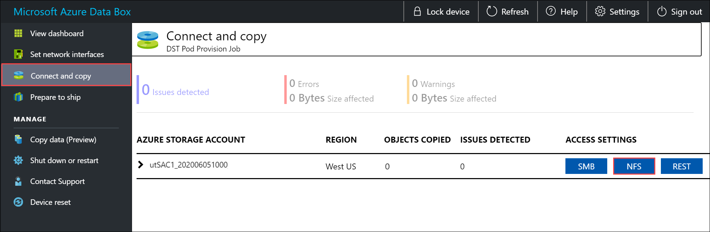
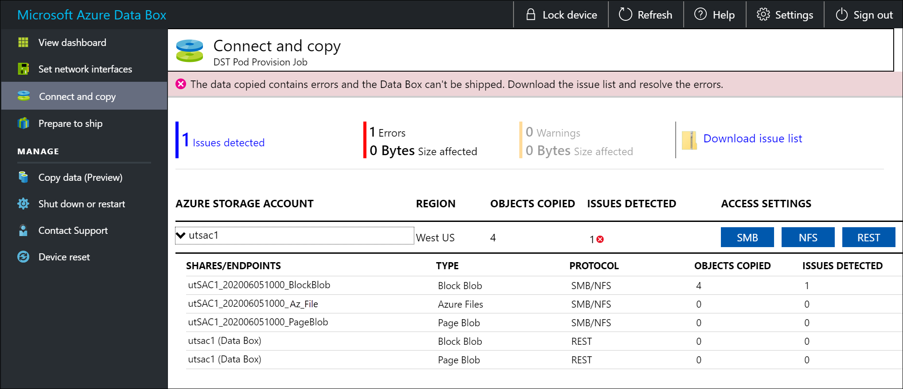
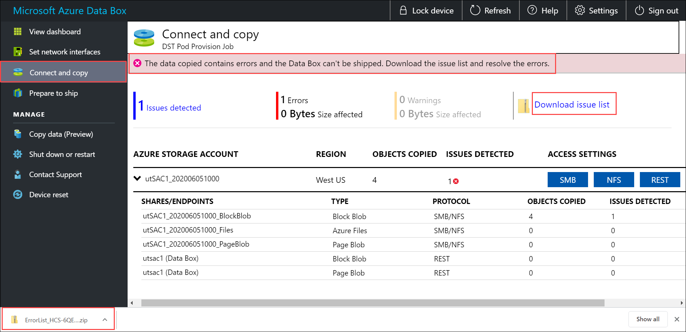
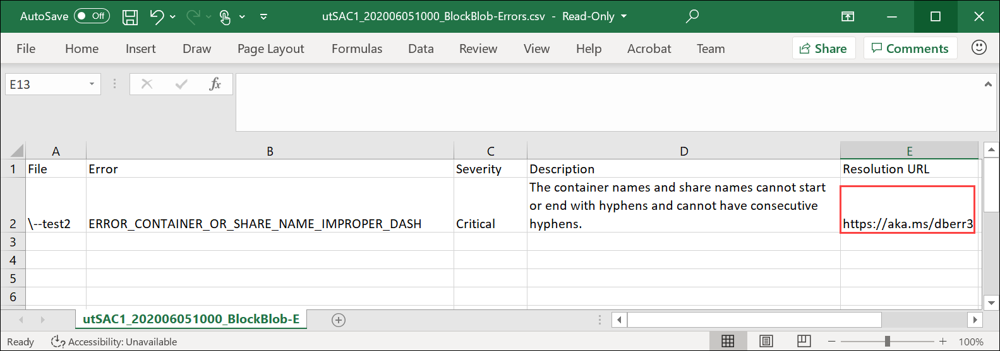

# Tutorial: Copy data to Azure Data Box via NFS

This tutorial describes how to connect to and copy data from your host computer using the local web UI.

In this tutorial, you learn how to:

> [!div class="checklist"]
>
> * Prerequisites
> * Connect to Data Box
> * Copy data to Data Box

## Prerequisites

Before you begin, make sure that:

1. You have completed the [Tutorial: Set up Azure Data Box](data-box-deploy-set-up.md).
2. You have received your Data Box and the order status in the portal is **Delivered**.
3. You have a host computer that has the data that you want to copy over to Data Box. Your host computer must
    - Run a [Supported operating system](data-box-system-requirements.md).
    - Be connected to a high-speed network. We strongly recommend that you have at least one 10-GbE connection. If a 10-GbE connection isn't available, a 1-GbE data link can be used but the copy speeds will be impacted. 

## Connect to Data Box

Based on the storage account selected, Data Box creates up to:
- Three shares for each associated storage account for GPv1 and GPv2.
- One share for premium storage. 
- One share for blob storage account. 

Under block blob and page blob shares, first-level entities are containers, and second-level entities are blobs. Under shares for Azure Files, first-level entities are shares, second-level entities are files.

The following table shows the UNC path to the shares on your Data Box and Azure Storage path URL where the data is uploaded. The final Azure Storage path URL can be derived from the UNC share path.
 
| Azure Storage type| Data Box shares                                       |
|-------------------|--------------------------------------------------------------------------------|
| Azure Block blobs | <li>UNC path to shares: `//<DeviceIPAddress>/<storageaccountname_BlockBlob>/<ContainerName>/files/a.txt`</li><li>Azure Storage URL: `https://<storageaccountname>.blob.core.windows.net/<ContainerName>/files/a.txt`</li> |  
| Azure Page blobs  | <li>UNC path to shares: `//<DeviceIPAddress>/<storageaccountname_PageBlob>/<ContainerName>/files/a.txt`</li><li>Azure Storage URL: `https://<storageaccountname>.blob.core.windows.net/<ContainerName>/files/a.txt`</li>   |  
| Azure Files       |<li>UNC path to shares: `//<DeviceIPAddress>/<storageaccountname_AzFile>/<ShareName>/files/a.txt`</li><li>Azure Storage URL: `https://<storageaccountname>.file.core.windows.net/<ShareName>/files/a.txt`</li>        |
| Azure Block blobs (Archive)       |  <li>UNC path to shares: `//<DeviceIPAddress>/<storageaccountname_BlockBlobArchive>/<ContainerName>/files/a.txt`</li><li>Azure Storage URL: `https://<storageaccountname>.blob.core.windows.net/<ContainerName>/files/a.txt`</li>      |

If you are using a Linux host computer, perform the following steps to configure Data Box to allow access to NFS clients.

1. Supply the IP addresses of the allowed clients that can access the share. In the local web UI, go to **Connect and copy** page. Under **NFS settings**, click **NFS client access**. 

    

2. Supply the IP address of the NFS client and click **Add**. You can configure access for multiple NFS clients by repeating this step. Click **OK**.

    

2. Ensure that the Linux host computer has a [supported version](data-box-system-requirements.md) of NFS client installed. Use the specific version for your Linux distribution. 

3. Once the NFS client is installed, use the following command to mount the NFS share on your Data Box device:

    `sudo mount <Data Box device IP>:/<NFS share on Data Box device> <Path to the folder on local Linux computer>`

    The following example shows how to connect via NFS to a Data Box share. The Data Box device IP is `10.161.23.130`, the share `Mystoracct_Blob` is mounted on the ubuntuVM, mount point being `/home/databoxubuntuhost/databox`.

    `sudo mount -t nfs 10.161.23.130:/Mystoracct_Blob /home/databoxubuntuhost/databox`
    
    For Mac clients, you will need to add an additional option as follows: 
    
    `sudo mount -t nfs -o sec=sys,resvport 10.161.23.130:/Mystoracct_Blob /home/databoxubuntuhost/databox`

    **Always create a folder for the files that you intend to copy under the share and then copy the files to that folder**. The folder created under block blob and page blob shares represents a container to which data is uploaded as blobs. You cannot copy files directly to *root* folder in the storage account.

## Copy data to Data Box

Once you are connected to the Data Box shares, the next step is to copy data. Before you begin the data copy, review the following considerations:

* Ensure that you copy the data to shares that correspond to the appropriate data format. For instance, copy the block blob data to the share for block blobs. Copy VHDs to page blobs. If the data format does not match the appropriate share type, then at a later step, the data upload to Azure will fail.
*  While copying data, ensure that the data size conforms to the size limits described in the [Azure storage account size limits](data-box-limits.md#azure-storage-account-size-limits).
* If data, which is being uploaded by Data Box, is concurrently uploaded by other applications outside of Data Box, then this could result in upload job failures and data corruption.
* If you use both the SMB and NFS protocols for data copies, we recommend that you:
  * Use different storage accounts for SMB and NFS.
  * Don't copy the same data to the same end destination in Azure using both SMB and NFS. In these cases, the final outcome can't be determined.
  * Although copying via both SMB and NFS in parallel can work, we don't recommend doing that as it's prone to human error. Wait until your SMB data copy is complete before you start an NFS data copy.
* **Always create a folder for the files that you intend to copy under the share and then copy the files to that folder**. The folder created under block blob and page blob shares represents a container to which data is uploaded as blobs. You cannot copy files directly to *root* folder in the storage account.
* If ingesting case-sensitive directory and file names from an NFS share to NFS on Data Box:
  * The case is preserved in the name.
  * The files are case-insensitive.

    For example, if copying `SampleFile.txt` and `Samplefile.Txt`, the case will be preserved in the name when copied to Data Box but the second file will overwrite the first one, as these are considered the same file.

> [!IMPORTANT]
> Make sure that you maintain a copy of the source data until you can confirm that the Data Box has transferred your data into Azure Storage.

If you're using a Linux host computer, use a copy utility similar to Robocopy. Some of the alternatives available in Linux are [`rsync`](https://rsync.samba.org/), [FreeFileSync](https://www.freefilesync.org/), [Unison](https://www.cis.upenn.edu/~bcpierce/unison/), or [Ultracopier](https://ultracopier.first-world.info/).  

The `cp` command is one of best options to copy a directory. For more information on the usage, go to [cp man pages](http://man7.org/linux/man-pages/man1/cp.1.html).

If using `rsync` option for a multi-threaded copy, follow these guidelines:

* Install the **CIFS Utils** or **NFS Utils** package depending on the filesystem your Linux client is using.

    `sudo apt-get install cifs-utils`

    `sudo apt-get install nfs-utils`

* Install `rsync` and **Parallel** (varies depending on the Linux distributed version).

    `sudo apt-get install rsync`
   
    `sudo apt-get install parallel` 

* Create a mount point.

    `sudo mkdir /mnt/databox`

* Mount the volume.

    `sudo mount -t NFS4  //Databox IP Address/share_name /mnt/databox` 

* Mirror folder directory structure.  

    `rsync -za --include='*/' --exclude='*' /local_path/ /mnt/databox`

* Copy files.

    `cd /local_path/; find -L . -type f | parallel -j X rsync -za {} /mnt/databox/{}`

     where j specifies the number of parallelization,  X = number of parallel copies

     We recommend that you start with 16 parallel copies and increase the number of threads depending on the resources available.

> [!IMPORTANT]
> The following Linux file types are not supported: symbolic links, character files, block files, sockets, and pipes. These file types will result in failures during the **Prepare to ship** step.

During the copy process, if there are any errors, you will see a notification.

Select **Download issue list**.

Open the list to view the details of the error and select the resolution URL to view the recommended resolution.

For more information, see [View error logs during data copy to Data Box](data-box-logs.md#view-error-log-during-data-copy). For a detailed list of errors during data copy, see [Troubleshoot Data Box issues](data-box-troubleshoot.md).

To ensure data integrity, checksum is computed inline as the data is copied. Once the copy is complete, verify the used space and the free space on your device.

   

## Next steps

In this tutorial, you learned about Azure Data Box topics such as:

> [!div class="checklist"]
>
> * Prerequisites
> * Connect to Data Box
> * Copy data to Data Box

Advance to the next tutorial to learn how to ship your Data Box back to Microsoft.

> [!div class="nextstepaction"]
> [Ship your Azure Data Box to Microsoft](./data-box-deploy-picked-up.md)
