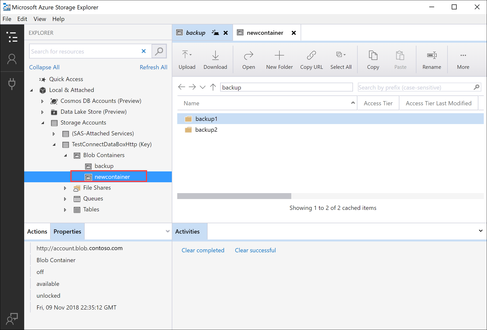

# Tutorial: Use REST APIs to Copy data to Azure Data Box Blob storage

> [!IMPORTANT]
> Azure Data Box now supports access tier assignment at the blob level. The steps contained within this tutorial reflect the updated data copy process and are specific to block blobs. 
>
>For help with determining the appropriate access tier for your block blob data, refer to the [Determine appropriate access tiers for block blobs](#determine-appropriate-access-tiers-for-block-blobs) section. Follow the steps containined within the [Copy data to Data Box](#copy-data-to-data-box) section to copy your data to the appropriate access tier.
>
> The information contained within this section applies to orders placed after April 1, 2024.

> [!CAUTION]
> This article references CentOS, a Linux distribution that is nearing End Of Life (EOL) status. Please consider your use and planning accordingly. For more information, see the [CentOS End Of Life guidance](~/articles/virtual-machines/workloads/centos/centos-end-of-life.md).

This tutorial describes procedures to connect to Azure Data Box Blob storage via REST APIs over *http* or *https*. Once connected, the steps required to copy the data to Data Box Blob storage and prepare the Data Box to ship, are also described.

In this tutorial, you learn how to:

> [!div class="checklist"]
>
> * Prerequisites
> * Connect to Data Box Blob storage via *http* or *https*
> * Copy data to Data Box

## Prerequisites

Before you begin, make sure that:

1. You complete the [Tutorial: Set up Azure Data Box](data-box-deploy-set-up.md).
2. You receive your Data Box and the order status in the portal is **Delivered**.
3. You review the [system requirements for Data Box Blob storage](data-box-system-requirements-rest.md) and are familiar with supported versions of APIs, SDKs, and tools.
4. You have access to a host computer that has the data that you want to copy over to Data Box. Your host computer must:
    * Run a [Supported operating system](data-box-system-requirements.md).
    * Be connected to a high-speed network. We strongly recommend that you have at least one 10-GbE connection. If a 10-GbE connection isn't available, a 1-GbE data link can be used but the copy speeds are impacted.
5. [Download AzCopy V10](../storage/common/storage-use-azcopy-v10.md) on your host computer. AzCopy is used to copy data to Azure Data Box Blob storage from your host computer.

## Connect via http or https

You can connect to Data Box Blob storage over *http* or *https*.

* *Https* is the secure and recommended way to connect to Data Box Blob storage.
* *Http* is used  when connecting over trusted networks.

The steps to connect are different when you connect to Data Box Blob storage over *http* or *https*.

## Connect via http

Connection to Data Box Blob storage REST APIs over *http* requires the following steps:

* Add the device IP and blob service endpoint to the remote host
* Configure partner software and verify the connection

Each of these steps is described in the following sections.

### Add device IP address and blob service endpoint

[!INCLUDE [data-box-add-device-ip](../../includes/data-box-add-device-ip.md)]

### Verify connection and configure partner software

[!INCLUDE [data-box-configure-partner-software](../../includes/data-box-configure-partner-software.md)]

[!INCLUDE [data-box-verify-connection](../../includes/data-box-verify-connection.md)]

## Connect via https

Connection to Azure Blob storage REST APIs over https requires the following steps:

* Download the certificate from Azure portal. This certificate is used for connecting to the web UI and Azure Blob storage REST APIs.
* Import the certificate on the client or remote host.
* Add the device IP and blob service endpoint to the client or remote host.
* Configure partner software and verify the connection.

Each of these steps is described in the following sections.

### Download certificate

Use the Azure portal to download certificate.

1. Sign into the Azure portal.
2. Go to your Data Box order and navigate to **General > Device details**.
3. Under **Device credentials**, go to **API access** to device. Select **Download**. This action downloads a **\<your order name>.cer** certificate file. **Save** this file and install it on the client or host computer you use to connect to the device.

    

### Import certificate

Accessing Data Box Blob storage over HTTPS requires a TLS/SSL certificate for the device. The way in which this certificate is made available to the client application varies from application to application and across operating systems and distributions. Some applications can access the certificate after it's imported into the system's certificate store, while other applications don't make use of that mechanism.

Specific information for some applications is mentioned in this section. For more information on other applications, see the documentation for the application and the operating system used.

Follow these steps to import the `.cer` file into the root store of a Windows or Linux client. On a Windows system, you can use Windows PowerShell or the Windows Server UI to import and install the certificate on your system.

#### Use Windows PowerShell

1. Start a Windows PowerShell session as an administrator.
2. At the command prompt, type:

    ```
    Import-Certificate -FilePath C:\temp\localuihttps.cer -CertStoreLocation Cert:\LocalMachine\Root
    ```

#### Use Windows Server UI

1. Right-click the `.cer` file and select **Install certificate**. This action starts the Certificate Import Wizard.
2. For **Store location**, select **Local Machine**, and then select **Next**.

    

3. Select **Place all certificates in the following store**, and then select **Browse**. Navigate to the root store of your remote host, and then select **Next**.

    

4. Select **Finish**. A message that tells you that the import was successful appears.

    

#### Use a Linux system

The method to import a certificate varies by distribution.

Several, such as Ubuntu and Debian, use the `update-ca-certificates` command.

* Rename the Base64-encoded certificate file to have a `.crt` extension and copy it into the `/usr/local/share/ca-certificates directory`.
* Run the command `update-ca-certificates`.

Recent versions of RHEL, Fedora, and CentOS use the `update-ca-trust` command.

* Copy the certificate file into the `/etc/pki/ca-trust/source/anchors` directory.
* Run `update-ca-trust`.

Consult the documentation specific to your distribution for details.

### Add device IP address and blob service endpoint

Follow the same steps to [add device IP address and blob service endpoint when connecting over *http*](#add-device-ip-address-and-blob-service-endpoint).

### Configure partner software and verify connection

Follow the steps to [Configure partner software that you used while connecting over *http*](#verify-connection-and-configure-partner-software). The only difference is that you should leave the *Use http option* unchecked.

## Determine appropriate access tiers for block blobs

> [!IMPORTANT]
> The information contained within this section applies to orders placed after April 1<sup>st</sup>, 2024.

Azure Storage allows you to store block blob data in multiple access tiers within the same storage account. This ability allows data to be organized and stored more efficiently based on how often it's accessed. The following table contains information and recommendations about Azure Storage access tiers.

| Tier    | Recommendation | Best practice |
|---------|----------------|---------------|
| Hot     | Useful for online data accessed or modified frequently. This tier has the highest storage costs, but the lowest access costs. | Data in this tier should be in regular and active use. |
| Cool    | Useful for online data accessed or modified infrequently. This tier has lower storage costs and higher access costs than the hot tier. | Data in this tier should be stored for at least 30 days. |
| Cold    | Useful for online data accessed or modified rarely but still requiring fast retrieval. This tier has lower storage costs and higher access costs than the cool tier.| Data in this tier should be stored for a minimum of 90 days. |
| Archive | Useful for offline data rarely accessed and having lower latency requirements. | Data in this tier should be stored for a minimum of 180 days. Data removed from the archive tier within 180 days is subject to an early deletion charge. |

For more information about blob access tiers, see [Access tiers for blob data](../storage/blobs/access-tiers-overview.md). For more detailed best practices, see [Best practices for using blob access tiers](../storage/blobs/access-tiers-best-practices.md).

You can transfer your block blob data to the appropriate access tier by copying it to the corresponding folder within Data Box. This process is discussed in greater detail within the [Copy data to Azure Data Box](#copy-data-to-data-box) section.

## Copy data to Data Box

After connecting to one or more Data Box shares, the next step is to copy data. Before you begin the data copy, consider the following limitations:

* While copying data, ensure that the data size conforms to the size limits described in the [Azure storage and Data Box limits](data-box-limits.md).
* Simultaneous uploads by Data Box and another non-Data Box application could potentially result in upload job failures and data corruption.

> [!IMPORTANT]
> Make sure that you maintain a copy of the source data until you can confirm that your data has been copied into Azure Storage.

In this tutorial, AzCopy is used to copy data to Data Box Blob storage. If you prefer a GUI-based tool, you can also use Azure Storage Explorer or other partner software to copy the data.

The copy procedure has the following steps:

* Create a container
* Upload contents of a folder to Data Box Blob storage
* Upload modified files to Data Box Blob storage

Each of these steps is described in detail in the following sections.

### Create a container

The first step is to create a container, because blobs are always uploaded into a container. Containers organize groups of blobs like you organize files in folders on your computer. Follow these steps to create a blob container.

1. Open Storage Explorer.
2. In the left pane, expand the storage account within which you wish to create the blob container.
3. Right-click **Blob Containers**, and from the context menu, select **Create Blob Container**.

   

4. A text box appears below the **Blob Containers** folder. Enter the name for your blob container. See the [Create the container and set permissions](../storage/blobs/storage-quickstart-blobs-dotnet.md) for information on rules and restrictions on naming blob containers.
5. Press **Enter** when done to create the blob container, or **Esc** to cancel. After the blob container is successfully created, it's displayed under the **Blob Containers** folder for the selected storage account.

   

### Upload the contents of a folder to Data Box Blob storage

Use AzCopy to upload all files within a folder to Blob storage on Windows or Linux. To upload all blobs in a folder, enter the following AzCopy command:

#### Linux

```azcopy
azcopy \
    --source /mnt/myfolder \
    --destination https://data-box-storage-account-name.blob.device-serial-no.microsoftdatabox.com/container-name/ \
    --dest-key <key> \
    --recursive
```

#### Windows

```azcopy
AzCopy /Source:C:\myfolder /Dest:https://data-box-storage-account-name.blob.device-serial-no.microsoftdatabox.com/container-name/ /DestKey:<key> /S
```

Replace `<key>` with your account key. You can retrieve your account key within the Azure portal by navigating to your storage account. Select **Settings > Access keys**, choose a key, then copy and paste the value into the AzCopy command.

If the specified destination container doesn't exist, AzCopy creates it and uploads the file into it. Update the source path to your data directory, and replace `data-box-storage-account-name` in the destination URL with the name of the storage account associated with your Data Box.

To upload the contents of the specified directory to Blob storage recursively, specify the `--recursive` option for Linux or the `/S` option for Windows. When you run AzCopy with one of these options, all subfolders and their files are uploaded as well.

### Upload modified files to Data Box Blob storage

You can also use AzCopy to upload files based on their last-modified time. To upload only updated or new files, add the `--exclude-older` parameter for Linux or the `/XO` parameter for Windows parameter to the AzCopy command.

If you only want to copy the resources within your local source that don't exist within the destination, specify both the `--exclude-older` and `--exclude-newer` parameters for Linux, or the `/XO` and `/XN` parameters for Windows in the AzCopy command. AzCopy uploads updated data only, as determined by its time stamp.

#### Linux

```azcopy
azcopy \
--source /mnt/myfolder \
--destination https://data-box-storage-account-name.blob.device-serial-no.microsoftdatabox.com/container-name/ \
--dest-key <key> \
--recursive \
--exclude-older
```

#### Windows

```azcopy
AzCopy /Source:C:\myfolder /Dest:https://data-box-storage-account-name.blob.device-serial-no.microsoftdatabox.com/container-name/ /DestKey:<key> /S /XO
```

If there are any errors during the connect or copy operation, see [Troubleshoot issues with Data Box Blob storage](data-box-troubleshoot-rest.md).

The next step is to prepare your device to ship.

## Next steps

In this tutorial, you learned about Azure Data Box topics such as:

> [!div class="checklist"]
>
> * Prerequisites for copy data to Azure Data Box Blob storage using REST APIs
> * Connecting to Data Box Blob storage via *http* or *https*
> * Determining appropriate access tiers for block blobs
> * Copy data to Data Box

Advance to the next tutorial to learn how to ship your Data Box back to Microsoft.

> [!div class="nextstepaction"]
> [Ship your Azure Data Box to Microsoft](./data-box-deploy-picked-up.md)
