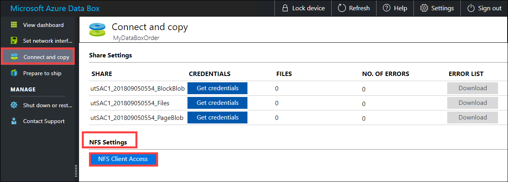
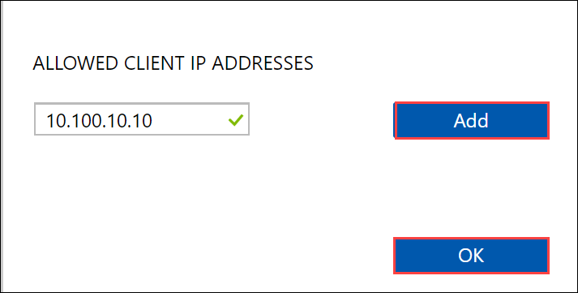
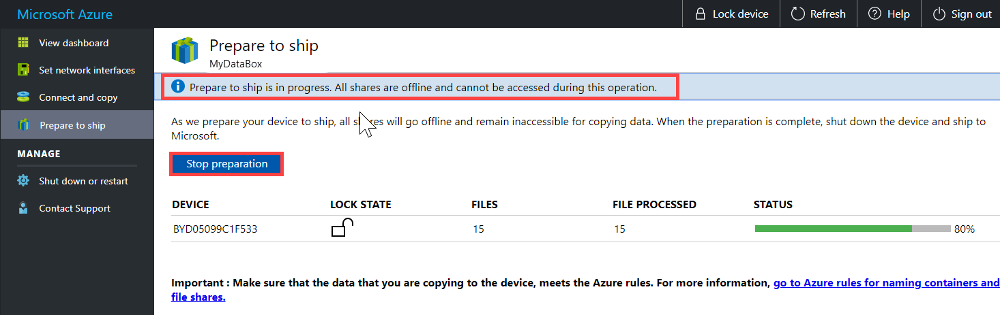

# Tutorial: Copy data to Azure Data Box 

This tutorial describes how to connect to and copy data from your host computer using the local web UI, and then prepare to ship Data Box.

In this tutorial, you learn how to:

> [!div class="checklist"]
> * Connect to Data Box
> * Copy data to Data Box
> * Prepare to ship Data Box.

## Prerequisites

Before you begin, make sure that:

1. You have completed the [Tutorial: Set up Azure Data Box](data-box-deploy-set-up.md).
2. You have received your Data Box and the order status in the portal is **Delivered**.
3. You have a host computer that has the data that you want to copy over to Data Box. Your host computer must
    - Run a [Supported operating system](data-box-system-requirements.md).
    - Be connected to a high-speed network. We strongly recommend that you have at least one 10 GbE connection. If a 10 GbE connection isn't available, a 1 GbE data link can be used but the copy speeds will be impacted. 

## Connect to Data Box

Based on the storage account selected, Data Box creates upto:
- Three shares for each associated storage account for GPv1 and GPv2.
- One share for premium or blob storage account. 

Under block blob and page blob shares, first-level entities are containers, and second-level entities are blobs. Under shares for Azure Files, first-level entities are shares, second-level entities are files.

Consider the following example. 

- Storage account: *Mystoracct*
- Share for block blob: *Mystoracct_BlockBlob/my-container/blob*
- Share for page blob: *Mystoracct_PageBlob/my-container/blob*
- Share for file: *Mystoracct_AzFile/my-share*

Depending on whether your Data Box is connected to a Windows Server host computer or to a Linux host, the steps to connect and copy can be different.

### Connect via SMB 

If you are using a Windows Server host computer, perform the following steps to connect to the Data Box.

1. The first step is to authenticate and start a session. Go to **Connect and copy**. Click **Get credentials** to get the access credentials for the shares associated with your storage account. 

    

2. In the Access share and copy data dialog box, copy the **Username** and the **Password** corresponding to the share. Click **OK**.
    
    

3. Access the shares associated with your storage account (Mystoracct in the following example). Use the `\\<IP of the device>\ShareName` path to access the shares. Depending upon your data format, connect to the shares (use the share name) at the following address: 
    - *\\<IP address of the device>\Mystoracct_Blob*
    - *\\<IP address of the device>\Mystoracct_Page*
    - *\\<IP address of the device>\Mystoracct_AzFile*
    
    To connect to the shares from your host computer, open a command window. At the command prompt, type:

    `net use \\<IP address of the device>\<share name>  /u:<user name for the share>`

    Enter the password for the share when prompted. The following sample shows connecting to a share via the preceding command.

    ```
    C:\Users\Databoxuser>net use \\10.126.76.172\devicemanagertest1_BlockBlob /u:devicemanagertest1
    Enter the password for 'devicemanagertest1' to connect to '10.126.76.172':
    The command completed successfully.
    ```

4. Press  Windows + R. In the **Run** window, specify the `\\<device IP address>`. Click **OK**. This opens File Explorer. You should now be able to see the shares as folders.
    
    

5.  **Always create a folder for the files that you intend to copy under the share and then copy the files to that folder**. Occassionally, the folders may show a gray cross. The cross does not denote an error condition. The folders are flagged by the application to track the status.
    
      

### Connect via NFS 

If you are using a Linux host computer, perform the following steps to configure Data Box to allow access to NFS clients.

1. Supply the IP addresses of the allowed clients that can access the share. In the local web UI, go to **Connect and copy** page. Under **NFS settings**, click **NFS client access**. 

    

2. Supply the IP address of the NFS client and click **Add**. You can configure access for multiple NFS clients by repeating this step. Click **OK**.

    

2. Ensure that the Linux host computer has a [supported version](data-box-system-requirements.md) of NFS client installed. Use the specific version for your Linux distribution. 

3. Once the NFS client is installed, use the following command to mount the NFS share on your Data Box device:

    `sudo mount <Data Box device IP>:/<NFS share on Data Box device> <Path to the folder on local Linux computer>`

    The following example shows how to connect via NFS to a Data Box share. The Data Box device IP is `10.161.23.130`, the share `Mystoracct_Blob` is mounted on the ubuntuVM, mount point being `/home/databoxubuntuhost/databox`.

    `sudo mount -t nfs 10.161.23.130:/Mystoracct_Blob /home/databoxubuntuhost/databox`


## Copy data to Data Box

Once you are connected to the Data Box shares, the next step is to copy data. Prior to data copy, ensure that you review the following considerations:

- Ensure that you copy the data to shares that correspond to the appropriate data format. For instance, copy the block blob data to the share for block blobs. If the data format does not match the appropriate share type, then at a later step, the data upload to Azure will fail.
-  While copying data, ensure that the data size conforms to the size limits described in the [Azure storage and Data Box limits](data-box-limits.md). 
- If data, which is being uploaded by Data Box, is concurrently uploaded by other applications outside of Data Box, then this could result in upload job failures and data corruption.
- We recommend that you do not use both SMB and NFS concurrently or copy same data to same end destination on Azure. In such cases, the final outcome cannot be determined.

### Copy data via SMB

After you have connected to the SMB share, initiate a data copy. 

You can use any SMB compatible file copy tool such as Robocopy to copy your data. Multiple copy jobs can be initiated using Robocopy. Use the following command:
    
    robocopy <Source> <Target> * /e /r:3 /w:60 /is /nfl /ndl /np /MT:32 or 64 /fft /Log+:<LogFile> 
  
 The attributes are described in the following table.
    
|Attribute  |Description  |
|---------|---------|
|/e     |Copies subdirectories including empty directories.         |
|/r:     |Specifies the number of retries on failed copies.         |
|/w:     |Specifies the wait time between retries, in seconds.         |
|/is     |Includes the same files.         |
|/nfl     |Specifies that file names are not to be logged.         |
|/ndl    |Specifies that directory names are not to be logged.        |
|/np     |Specifies that the progress of the copying operation (the number of files or directories copied so far) will not be displayed. Displaying the progress significantly lowers the performance.         |
|/MT     | Use multithreading, recommended 32 or 64 threads. This option not used with encrypted files. You may need to separate encrypted and unencrypted files. However, single threaded copy significantly lowers the performance.           |
|/fft     | Use to reduce the time stamp granularity for any file system.        |
|/b     | Copies files in Backup mode.        |
|/z    | Copies files in Restart mode, use this if the environment is unstable. This option reduces throughput due to additional logging.      |
| /zb     | Uses Restart mode. If access is denied, this option uses Backup mode. This option reduces throughput due to checkpointing.         |
|/efsraw     | Copies all encrypted files in EFS raw mode. Use only with encrypted files.         |
|log+:<LogFile>| Appends the output to the existing log file.|    
 
The following sample shows the output of the robocopy command to copy files to the Data Box.
    
    C:\Users>robocopy
        -------------------------------------------------------------------------------
        ROBOCOPY     ::     Robust File Copy for Windows
    -------------------------------------------------------------------------------
    
        Started : Thursday, March 8, 2018 2:34:53 PM
            Simple Usage :: ROBOCOPY source destination /MIR
    
                    source :: Source Directory (drive:\path or \\server\share\path).
            destination :: Destination Dir  (drive:\path or \\server\share\path).
                    /MIR :: Mirror a complete directory tree.
    
        For more usage information run ROBOCOPY /?    
    
    ****  /MIR can DELETE files as well as copy them !
    
    C:\Users>Robocopy C:\Git\azure-docs-pr\contributor-guide \\10.126.76.172\devicemanagertest1_AzFile\templates /MT:32
    -------------------------------------------------------------------------------
        ROBOCOPY     ::     Robust File Copy for Windows
    -------------------------------------------------------------------------------
    
        Started : Thursday, March 8, 2018 2:34:58 PM
        Source : C:\Git\azure-docs-pr\contributor-guide\
            Dest : \\10.126.76.172\devicemanagertest1_AzFile\templates\
    
        Files : *.*
    
        Options : *.* /DCOPY:DA /COPY:DAT /MT:32 /R:5 /W:60
    
    ------------------------------------------------------------------------------
    
    100%        New File                 206        C:\Git\azure-docs-pr\contributor-guide\article-metadata.md
    100%        New File                 209        C:\Git\azure-docs-pr\contributor-guide\content-channel-guidance.md
    100%        New File                 732        C:\Git\azure-docs-pr\contributor-guide\contributor-guide-index.md
    100%        New File                 199        C:\Git\azure-docs-pr\contributor-guide\contributor-guide-pr-criteria.md
                New File                 178        C:\Git\azure-docs-pr\contributor-guide\contributor-guide-pull-request-co100%  .md
                New File                 250        C:\Git\azure-docs-pr\contributor-guide\contributor-guide-pull-request-et100%  e.md
    100%        New File                 174        C:\Git\azure-docs-pr\contributor-guide\create-images-markdown.md
    100%        New File                 197        C:\Git\azure-docs-pr\contributor-guide\create-links-markdown.md
    100%        New File                 184        C:\Git\azure-docs-pr\contributor-guide\create-tables-markdown.md
    100%        New File                 208        C:\Git\azure-docs-pr\contributor-guide\custom-markdown-extensions.md
    100%        New File                 210        C:\Git\azure-docs-pr\contributor-guide\file-names-and-locations.md
    100%        New File                 234        C:\Git\azure-docs-pr\contributor-guide\git-commands-for-master.md
    100%        New File                 186        C:\Git\azure-docs-pr\contributor-guide\release-branches.md
    100%        New File                 240        C:\Git\azure-docs-pr\contributor-guide\retire-or-rename-an-article.md
    100%        New File                 215        C:\Git\azure-docs-pr\contributor-guide\style-and-voice.md
    100%        New File                 212        C:\Git\azure-docs-pr\contributor-guide\syntax-highlighting-markdown.md
    100%        New File                 207        C:\Git\azure-docs-pr\contributor-guide\tools-and-setup.md
    ------------------------------------------------------------------------------
    
                    Total    Copied   Skipped  Mismatch    FAILED    Extras
        Dirs :         1         1         1         0         0         0
        Files :        17        17         0         0         0         0
        Bytes :     3.9 k     3.9 k         0         0         0         0          
    C:\Users>
       

To optimize the performance, use the following robocopy parameters when copying the data.

|    Platform    |    Mostly small files < 512 KB                           |    Mostly medium  files 512 KB-1 MB                      |    Mostly large files > 1 MB                             |   
|----------------|--------------------------------------------------------|--------------------------------------------------------|--------------------------------------------------------|---|
|    Data Box         |    2 Robocopy sessions <br> 16 threads per sessions    |    3 Robocopy sessions <br> 16 threads per sessions    |    2 Robocopy sessions <br> 24 threads per sessions    |  |


For more information on Robocopy command, go to [Robocopy and a few examples](https://social.technet.microsoft.com/wiki/contents/articles/1073.robocopy-and-a-few-examples.aspx).

Open the target folder to view and verify the copied files. If you have any errors during the copy process, download the error files for troubleshooting.

To ensure data integrity, checksum is computed inline as the data is copied. Once the copy is complete, verify the used space and the free space on your device.
    
   

### Copy data via NFS

If you're using a Linux host computer, use a copy utility similar to Robocopy. Some of the alternatives available in Linux are [rsync](https://rsync.samba.org/), [FreeFileSync](https://www.freefilesync.org/), [Unison](https://www.cis.upenn.edu/~bcpierce/unison/), or [Ultracopier](https://ultracopier.first-world.info/).  

The `cp` command is one of best options to copy a directory. For more information on the usage, go to [cp man pages](http://man7.org/linux/man-pages/man1/cp.1.html).

If using rsync option for a multi-threaded copy, follow these guidelines:

 - Install the **CIFS Utils** or **NFS Utils** package depending on the filesystem your Linux client is using.

    `sudo apt-get install cifs-utils`

    `sudo apt-get install nfs-utils`

 -  Install **Rsync**, and **Parallel** (varies depending on the Linux distributed version).

    `sudo apt-get install rsync`
   
    `sudo apt-get install parallel` 

 - Create a mount point.

    `sudo mkdir /mnt/databox`

 - Mount the volume.

    `sudo mount -t NFS4  //Databox IP Address/share_name /mnt/databox` 

 - Mirror folder directory structure.  

    `rsync -za --include='*/' --exclude='*' /local_path/ /mnt/databox`

 - Copy files. 

    `cd /local_path/; find -L . -type f | parallel -j X rsync -za {} /mnt/databox/{}`

     where j specifies the number of parallelization,  X = number of parallel copies

     We recommend that you start with 16 parallel copies and increase the number of threads depending on the resources available.

## Prepare to ship

Final step is to prepare the device to ship. In this step, all the device shares are taken offline. The shares cannot be accessed once you start preparing the device to ship.
1. Go to **Prepare to ship** and click **Start preparation**. 
   
    

2. By default, checksums are computed inline during the prepare to ship. The checksum computation may take some time depending upon the size of your data. Click **Start preparation**.
    1. The device shares go offline and the device is locked when we prepare to ship.
        
         
   
    2. The device status updates to *Ready to ship* once the device preparation is complete. 
        
        

    3. Download the list of files (manifest) that were copied in this process. You can later use this list to verify the files uploaded to Azure.
        
        

3. Shut down the device. Go to **Shut down or restart** page and click **Shut down**. When prompted for confirmation, click **OK** to continue.
4. Remove the cables. The next step is to ship the device to Microsoft.

 
<!--## Appendix - robocopy parameters

This section describes the robocopy parameters used when copying the data to optimize the performance.

|    Platform    |    Mostly small files < 512 KB                           |    Mostly medium  files 512 KB-1 MB                      |    Mostly large files > 1 MB                             |   
|----------------|--------------------------------------------------------|--------------------------------------------------------|--------------------------------------------------------|---|
|    Data Box         |    2 Robocopy sessions <br> 16 threads per sessions    |    3 Robocopy sessions <br> 16 threads per sessions    |    2 Robocopy sessions <br> 24 threads per sessions    |  |
|    Data Box Heavy     |    6 Robocopy sessions <br> 24 threads per sessions    |    6 Robocopy sessions <br> 16 threads per sessions    |    6 Robocopy sessions <br> 16 threads per sessions    |   
|    Data Box Disk         |    4 Robocopy sessions <br> 16 threads per sessions             |    2 Robocopy sessions <br> 16 threads per sessions    |    2 Robocopy sessions <br> 16 threads per sessions    |   
-->

## Next steps

In this tutorial, you learned about Azure Data Box topics such as:

> [!div class="checklist"]
> * Connect to Data Box
> * Copy data to Data Box
> * Prepare to ship Data Box

Advance to the next tutorial to learn how to set up and copy data on your Data Box.

> [!div class="nextstepaction"]
> [Ship your Azure Data Box to Microsoft](./data-box-deploy-picked-up.md)

