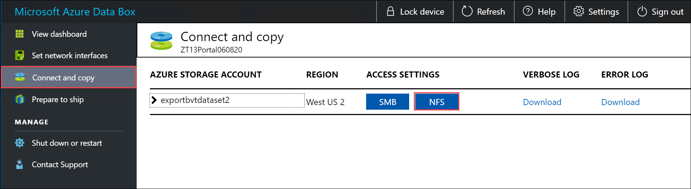
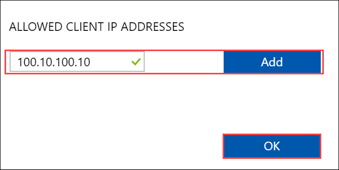

# Tutorial: Copy data from Azure Data Box via NFS

This tutorial describes how to connect to and copy data from the local web UI of your Data Box to an on-premises data server via NFS. The data on your Data Box is exported from your Azure Storage account.

In this tutorial, you learn how to:

> [!div class="checklist"]
>
> * Prerequisites
> * Connect to Data Box
> * Copy data from Data Box

## Prerequisites

Before you begin, make sure that:

1. You have placed the order for Azure Data Box.
    - For an import order, see [Tutorial: Order Azure Data Box](data-box-deploy-ordered.md).
    - For an export order, see [Tutorial: Order Azure Data Box](data-box-deploy-export-ordered.md).
2. You've received your Data Box and the order status in the portal is **Delivered**.
3. You have a host computer to which you want to copy the data from your Data Box. Your host computer must
   * Run a [Supported operating system](data-box-system-requirements.md).
   * Be connected to a high-speed network. We strongly recommend that you have at least one 10-GbE connection. If a 10-GbE connection isn't available, use a 1-GbE data link but the copy speeds will be impacted.

## Connect to Data Box

[!INCLUDE [data-box-shares](../../includes/data-box-shares.md)]

If you are using a Linux host computer, perform the following steps to configure Data Box to allow access to NFS clients. Data Box can connect as many as five NFS clients at a time.

1. Supply the IP addresses of the allowed clients that can access the share:

    1.  In the local web UI, go to the **Connect and copy** page. Under **NFS settings**, click **NFS client access**. 

        

    1. To add an NFS client, supply the client's IP address and click **Add**. Data Box can connect as many as five NFS clients at a time. When you finish, click **OK**.

         

2. Ensure that the Linux host computer has a [supported version](data-box-system-requirements.md) of NFS client installed. Use the specific version for your Linux distribution. 

3. Once the NFS client is installed, use the following command to mount the NFS share on your Data Box device:

    `sudo mount <Data Box device IP>:/<NFS share on Data Box device> <Path to the folder on local Linux computer>`

    The following example shows how to connect via NFS to a Data Box share. The Data Box device IP is `10.161.23.130`, the share `Mystoracct_Blob` is mounted on the ubuntuVM, mount point being `/home/databoxubuntuhost/databox`.

    `sudo mount -t nfs 10.161.23.130:/Mystoracct_Blob /home/databoxubuntuhost/databox`
    
    For Mac clients, you will need to add an additional option as follows: 
    
    `sudo mount -t nfs -o sec=sys,resvport 10.161.23.130:/Mystoracct_Blob /home/databoxubuntuhost/databox`

    **Always create a folder for the files that you intend to copy under the share and then copy the files to that folder**. The folder created under block blob and page blob shares represents a container to which data is uploaded as blobs. You cannot copy files directly to *root* folder in the storage account.

## Copy data from Data Box

Once you're connected to the Data Box shares, the next step is to copy data.

[!INCLUDE [data-box-export-review-logs](../../includes/data-box-export-review-logs.md)]

 You can now begin data copy. If you're using a Linux host computer, use a copy utility similar to Robocopy. Some of the alternatives available in Linux are [`rsync`](https://rsync.samba.org/), [FreeFileSync](https://www.freefilesync.org/), [Unison](https://www.cis.upenn.edu/~bcpierce/unison/), or [Ultracopier](https://ultracopier.first-world.info/).  

The `cp` command is one of best options to copy a directory. For more information on the usage, go to [cp man pages](http://man7.org/linux/man-pages/man1/cp.1.html).

If using the `rsync` option for a multi-threaded copy, follow these guidelines:

* Install the **CIFS Utils** or **NFS Utils** package depending on the filesystem your Linux client is using.

    `sudo apt-get install cifs-utils`

    `sudo apt-get install nfs-utils`

* Install `rsync` and **Parallel** (varies depending on the Linux distributed version).

    `sudo apt-get install rsync`
   
    `sudo apt-get install parallel` 

* Create a mount point.

    `sudo mkdir /mnt/databox`

* Mount the volume.

    `sudo mount -t NFS4  //Databox IP Address/share_name /mnt/databox` 

* Mirror folder directory structure.  

    `rsync -za --include='*/' --exclude='*' /local_path/ /mnt/databox`

* Copy files.

    `cd /local_path/; find -L . -type f | parallel -j X rsync -za {} /mnt/databox/{}`

     where j specifies the number of parallelization,  X = number of parallel copies

     We recommend that you start with 16 parallel copies and increase the number of threads depending on the resources available.

> [!IMPORTANT]
> The following Linux file types are not supported: symbolic links, character files, block files, sockets, and pipes. These file types will result in failures during the **Prepare to ship** step.

Once the copy is complete, go to the **Dashboard** and verify the used space and the free space on your device.

You can now proceed to ship your Data Box to Microsoft.

## Next steps

In this tutorial, you learned about Azure Data Box topics such as:

> [!div class="checklist"]
>
> * Prerequisites
> * Connect to Data Box
> * Copy data from Data Box

Advance to the next tutorial to learn how to ship your Data Box back to Microsoft.

> [!div class="nextstepaction"]
> [Ship your Azure Data Box to Microsoft](./data-box-deploy-export-picked-up.md)
