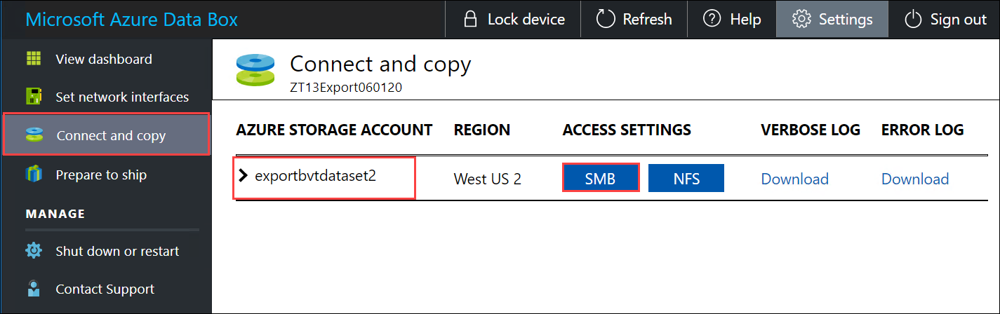

# Tutorial: Copy data from Azure Data Box via SMB

This tutorial describes how to connect to and copy data from your Data Box to an on-premises server using the local web UI. The Data Box device contains the data exported from your Azure Storage account.

In this tutorial, you learn how to:

> [!div class="checklist"]
>
> * Prerequisites
> * Connect to Data Box
> * Copy data from Data Box

## Prerequisites

Before you begin, make sure that:

1. You have placed the order for Azure Data Box.
    - For an import order, see [Tutorial: Order Azure Data Box](data-box-deploy-ordered.md).
    - For an export order, see [Tutorial: Order Azure Data Box](data-box-deploy-export-ordered.md).
2. You've received your Data Box and the order status in the portal is **Delivered**.
3. You have a host computer to which you want to copy the data from your Data Box. Your host computer must
   * Run a [Supported operating system](data-box-system-requirements.md).
   * Be connected to a high-speed network. We strongly recommend that you have at least one 10-GbE connection. If a 10-GbE connection isn't available, use a 1-GbE data link but the copy speeds will be impacted.

## Connect to Data Box

[!INCLUDE [data-box-shares](../../includes/data-box-shares.md)]

If using a Windows Server host computer, follow these steps to connect to the Data Box.

1. The first step is to authenticate and start a session. Go to **Connect and copy**. Select **Get credentials** to get the access credentials for the shares associated with your storage account. 

    

2. In the Access share and copy data dialog box, copy the **Username** and the **Password** corresponding to the share. Select **OK**.
    
    

3. To access the shares associated with your storage account (*exportbvtdataset2* in the following example) from your host computer, open a command window. At the command prompt, type:

    `net use \\<IP address of the device>\<share name>  /u:<IP address of the device>\<user name for the share>`

    Depending upon your data format, the share paths are as follows:
    - Azure Block blob - `\\169.254.143.85\exportbvtdataset2_BlockBlob`
    - Azure Page blob - `\\169.254.143.85\exportbvtdataset2_PageBlob`
    - Azure Files - `\\169.254.143.85\exportbvtdataset2_AzFile`

4. Enter the password for the share when prompted. The following sample shows connecting to a share via the preceding command.

    ```
    C:\Users\Databoxuser>net use \\169.254.143.85\exportbvtdataset2_BlockBlob /u:169.254.143.85\exportbvtdataset2
    Enter the password for 'exportbvtdataset2' to connect to '169.254.143.85':
    The command completed successfully.
    ```

5. Press  Windows + R. In the **Run** window, specify the `\\<device IP address>`. Select **OK** to open File Explorer.
    
    

    You should now see the shares as folders.
    
    

    
If using a Linux client, use the following command to mount the SMB share. The "vers" parameter below is the version of SMB that your Linux host supports. Plug in the appropriate version in the command below. For versions of SMB that the Data Box supports see [Supported file systems for Linux clients](./data-box-system-requirements.md#supported-file-transfer-protocols-for-clients) 

```console
sudo mount -t nfs -o vers=2.1 169.254.143.85:/exportbvtdataset2_BlockBlob /home/databoxubuntuhost/databox
```

## Copy data from Data Box

Once you're connected to the Data Box shares, the next step is to copy data.

[!INCLUDE [data-box-export-review-logs](../../includes/data-box-export-review-logs.md)]


 After you connected to the SMB share, begin data copy. You can use any SMB compatible file copy tool such as Robocopy to copy your data. Multiple copy jobs can be initiated using Robocopy. 


For more information on Robocopy command, go to [Robocopy and a few examples](https://social.technet.microsoft.com/wiki/contents/articles/1073.robocopy-and-a-few-examples.aspx).

Once the copy is complete, go to the **Dashboard** and verify the used space and the free space on your device.

You can now proceed to ship your Data Box to Microsoft.


## Next steps

In this tutorial, you learned about Azure Data Box topics such as:

> [!div class="checklist"]
>
> * Prerequisites
> * Connect to Data Box
> * Copy data from Data Box

Advance to the next tutorial to learn how to ship your Data Box back to Microsoft.

> [!div class="nextstepaction"]
> [Ship your Azure Data Box to Microsoft](./data-box-deploy-export-picked-up.md)
