# Tutorial: Create export order for Azure Data Box

:::zone pivot="dbx"
[!INCLUDE [data-box-retirement](includes/data-box-retirement.md)]
:::zone-end

Azure Data Box is a hybrid solution that allows you to move data out of Azure into your location. This tutorial describes how to create an export order for Azure Data Box. The main reason to create an export order is for disaster recovery, in case on-premises storage gets compromised and a back-up needs to be restored.

In this tutorial, you learn about:

> [!div class="checklist"]
>
> * Prerequisites for export
> * Order a Data Box for export
> * Track the export order
> * Cancel the export order

## Prerequisites

Complete the following configuration prerequisites for Data Box service and device before you order the device.

### For service

[!INCLUDE [Data Box service prerequisites](../../includes/data-box-supported-subscriptions.md)]

* Make sure that you have an existing resource group that you can use with your Azure Data Box.

* Make sure that your Azure Storage account that you want to export data from is one of the supported Storage account types as described [Supported storage accounts for Data Box](data-box-system-requirements.md#supported-storage-accounts).
  
> [!NOTE] 
> The Export functionality will not include Access Control List (ACL) or metadata regarding the files and folders. If you are exporting Azure Files data, you may consider using a tool such as Robocopy to apply ACLs to the target folders prior to import. 

### For device

Before you begin, make sure that:

* You should have a host computer connected to the datacenter network. You will copy the data from Azure Data Box to this computer. Your host computer must run a supported operating system as described in [Azure Data Box system requirements](data-box-system-requirements.md).

:::zone pivot="dbx"
* Your datacenter needs to have high-speed network. We strongly recommend that you have at least one 10-GbE connection. If a 10-GbE connection is not available, a 1-GbE data link can be used but the copy speeds are impacted.
:::zone-end

:::zone pivot="dbx-ng"
* Your datacenter needs to have high-speed network. We strongly recommend that you have at least one 100-GbE connection. If a 100-GbE connection is not available, a 10-GbE or 1-GbE data link can be used but the copy speeds are impacted.
:::zone-end

## Order Data Box for export

Perform the following steps in the Azure portal to order a device.

:::zone pivot="dbx-ng"
1. Use your Microsoft Azure credentials to sign in at this URL: [https://portal.azure.com](https://portal.azure.com).

2. Select **+ Create a resource** and search for *Azure Data Box*. Select **Azure Data Box**.

   

3. Select **Create**.

   

4. Check if Azure Data Box service is available in your region. Enter or select the following information and select **Apply**.

    |Setting  |Value     |
    |---------|----------|
    |Transfer type       | Select **Export from Azure**. |
    |Subscription        | Select an EA, CSP, or Azure sponsorship subscription for Data Box service. <br> The subscription is linked to your billing account. |
    |Resource group      |    Select an existing resource group. <br> A resource group is a logical container for the resources that can be managed or deployed together.            |
    |Source Azure region |    Select the Azure region where your data currently is. |
    |Destination country |     Select the country/region where you want to ship the device. |

    :::image type="content" source="media/data-box-deploy-export-ordered/databox-export-source-destination-blade.png" alt-text="Screen capture showing the settings fields and associated values for an export order.":::

5. Select **Data Box**. The maximum usable capacity for a single order is 120 TB/525 TB or 80 TB depending on the SKU. You can create multiple orders for larger data sizes.

    :::image type="content" source="media/data-box-deploy-export-ordered/databox-export-sku-selection-sml.png" alt-text="Screen capture showing the available Data Box SKUs for an export order." lightbox="media/data-box-deploy-export-ordered/databox-export-sku-selection.png":::

6. In **Order**, specify the **Basic** order details. Enter or select the following information.

    |Setting  |Value  |
    |---------|---------|
    |Subscription     | The subscription is automatically populated based on your earlier selection.|
    |Resource group | The resource group you selected previously. |
    |Export order name     |  Provide a friendly name to track the order. <br> The name can have between 3 and 24 characters that can be letters, numbers, and hyphens. <br> The name must start and end with a letter or a number.      |

    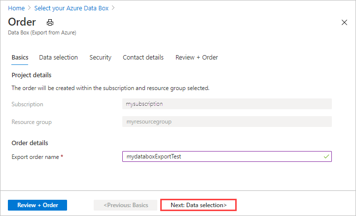

    Select **Next: Data Selection** to proceed.

7. In **Data Selection**, select **Add storage account and export type**.

    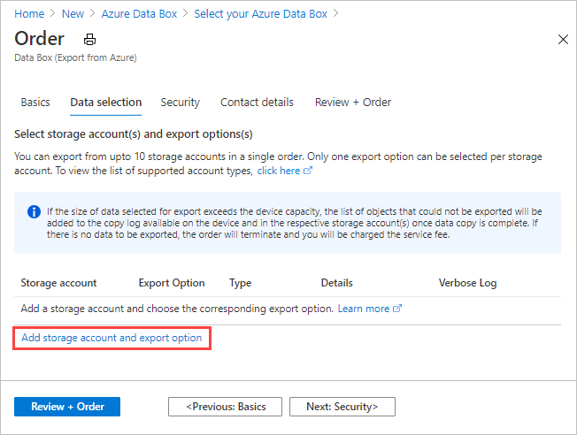

8. In **Select Export option**, specify the export option details. Enter or select the following information and select **Add**.

    |Setting  |Value  |
    |---------|---------|
    |Storage account     | The Azure Storage account from where you want to export data. |
    |Export type     | Specifies the type of data to export from **All objects** and **Use XML file**.<ul><li> **All objects** - Specifies that the job exports all data depending on your selection for **Transfer options**.</li><li> **Use XML file** – Specifies an XML file that contains a set of paths and prefixes for blobs and/or files to be exported from the storage account. The XML file needs to be in the selected storage account's container, and selecting from file shares is currently not supported. The file needs to be a non-empty .xml file.</li></ul>        |
    |Transfer options     |  Specifies the data transfer options from **Select all**, **All blobs**, and **All files**. <ul><li> **Select All** - Specifies that all blobs and Azure Files are exported. If you are using a storage account that supports only blobs (Blob Storage Account), the **All Files** option will not be selectable.</li><li> **All Blobs** - Specifies that only block and page blobs are exported.</li><li> **All Files** - Specifies that all files are exported excluding blobs. The type of storage account you have (GPv1 and GPv2, premium storage, or blob storage) determines the types of data you can export. For more information, see [Supported storage accounts for export](../import-export/storage-import-export-requirements.md#supported-storage-types).</li></ul>         |
    |Include verbose log     | Indicates whether you want a verbose log file that contains a list of all files that were exported successfully. For more information about the copy logs and verbose logs for an export order, see [View logs](data-box-export-logs.md#view-logs-during-data-copy). |

    > [!NOTE]
    > If you select **Use XML file** for the **Export type** setting, you need to make sure that the XML file contains valid paths and/or prefixes. You must construct and supply the XML file. If the file is invalid or no data matches the paths specified, the order terminates with partial data or no data exported. For guidance, see [Create XML file](#create-xml-file).

    To see how to add an XML file to a container, see [Export order using XML file](data-box-deploy-export-ordered.md#export-order-using-xml-file).

   

   To see an example of the XML input, see [Create XML file](#create-xml-file)

9. In **Data selection**, review your settings and select **Next: Security>** to continue.

   

    The **Security** screen lets you use your own encryption key and choose to use double encryption.

    All settings on the **Security** screen are optional. If you don't change any settings, the default settings will apply.

    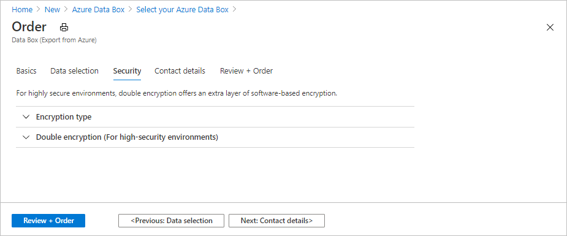

10. If you want to use your own customer-managed key to protect the unlock passkey for your new resource, expand **Encryption type**.

    Configuring a customer-managed key for your Azure Data Box is optional. By default, Data Box uses a Microsoft managed key to protect the unlock passkey.

    A customer-managed key doesn't affect how data on the device is encrypted. The key is only used to encrypt the device unlock passkey.

    If you don't want to use a customer-managed key, skip to Step 16.

    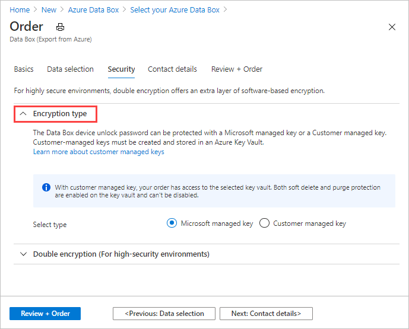

11. Select **Customer managed key** as the key type. Then select **Select a key vault and key**.

    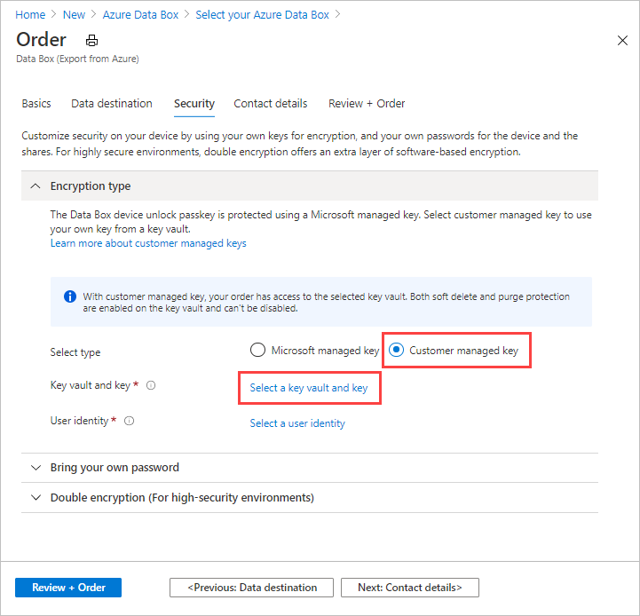

12. On the **Select key from Azure Key Vault** screen, the subscription is automatically populated.

    - For **Key vault**, you can select an existing key vault from the dropdown list.

      

    - You can also select **Create new** to create a new key vault. On the **Create key vault** screen, enter the resource group and a key vault name. Ensure that **Soft delete** and **Purge protection** are enabled. Accept all other defaults, and select **Review + Create**.

      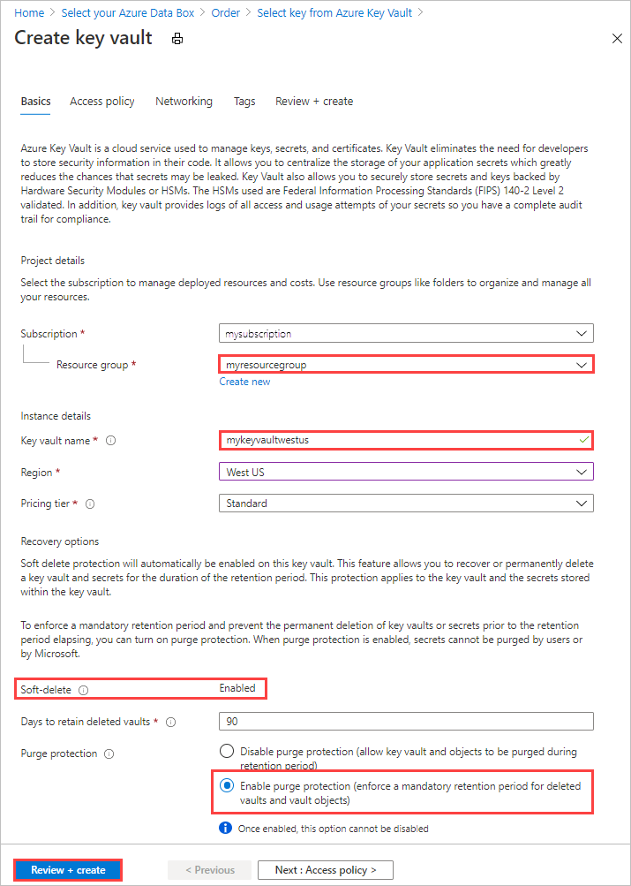

      Review the information for your key vault, and select **Create**. Wait for a couple minutes for key vault creation to complete.

      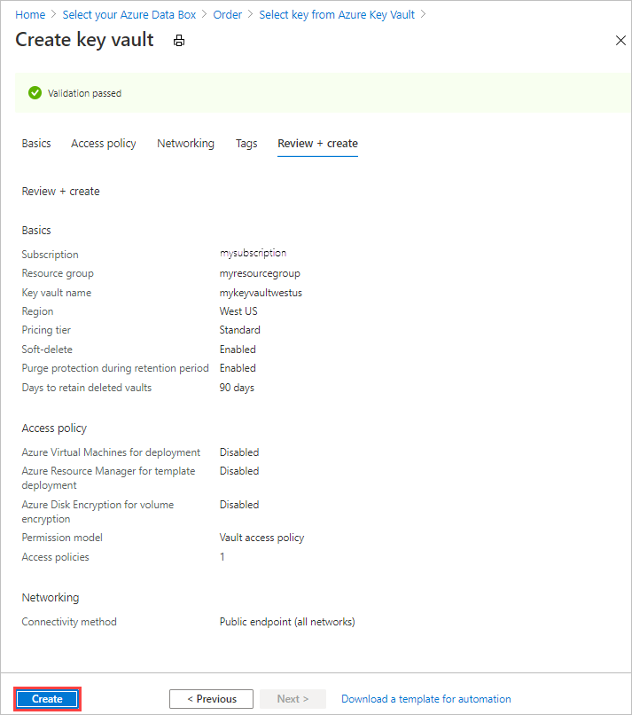

13. On the **Select key from Azure Key Vault** screen, you can select an existing key in the key vault.

    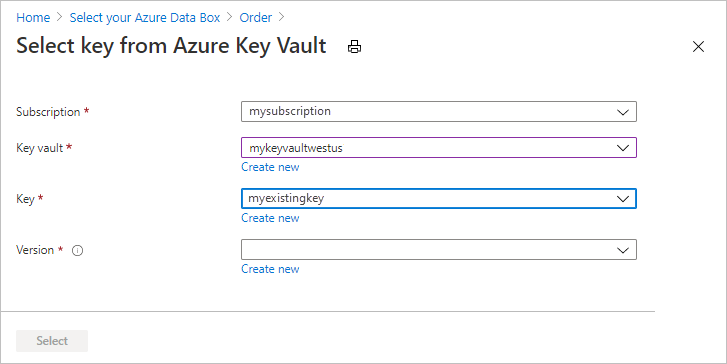

    If you want to create a new key, select **Create new**. You must use an RSA key. The size can be 2048 or greater. Enter a name for your new key, accept the other defaults, and select **Create**.

      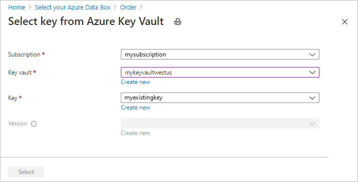

      You'll be notified when the key has been created in your key vault.

14. Select the **Version** of the key to use, and then choose **Select**.

      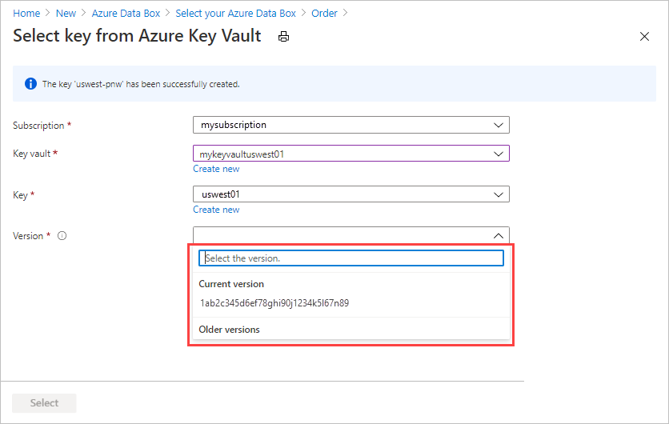

    If you want to create a new key version, select **Create new**.

    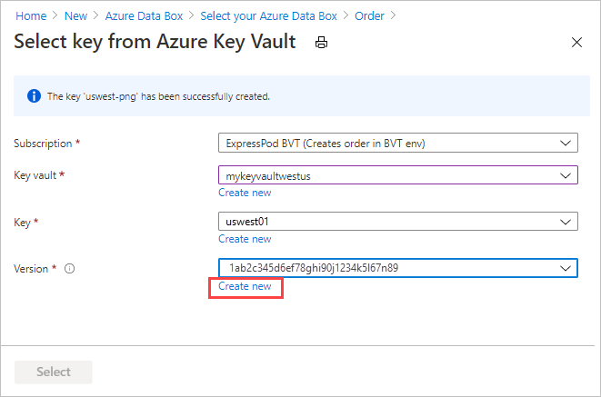

    On the **Create new key** screen, choose settings for the new key version, and select **Create**.

    

    The **Encryption type** settings on the **Security** screen show your key vault and key.

    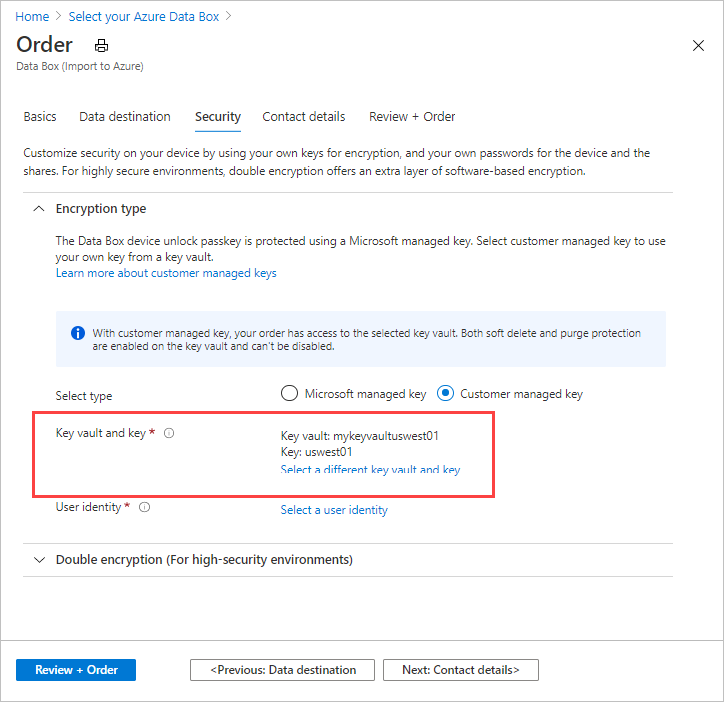

15. Select a user identity that you'll use to manage access to this resource. Choose **Select a user identity**. In the panel on the right, select the subscription and the managed identity to use. Then choose **Select**.

    A user-assigned managed identity is a stand-alone Azure resource that can be used to manage multiple resources. For more information, see [Managed identity types](../active-directory/managed-identities-azure-resources/overview.md).

    If you need to create a new managed identity, follow the guidance in [Create, list, delete, or assign a role to a user-assigned managed identity using the Azure portal](../../articles/active-directory/managed-identities-azure-resources/how-to-manage-ua-identity-portal.md).

    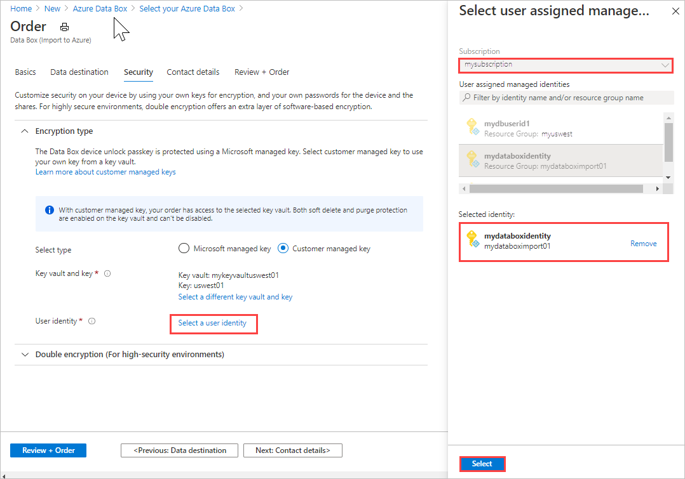

    The user identity is shown in **Encryption type** settings.

    You can collapse the **Encryption type** settings now.

    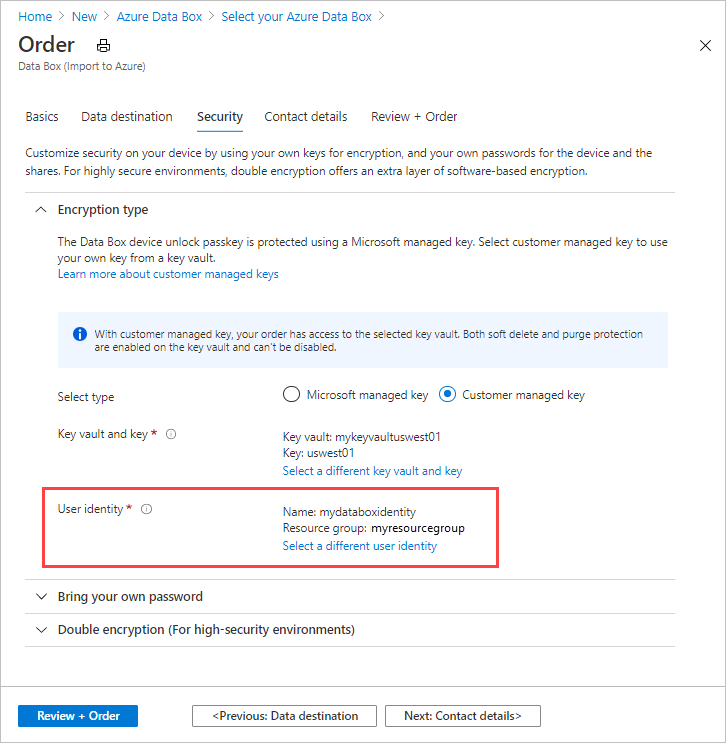

16. If you want to enable software-based double encryption, expand **Double encryption (for high-security environments)**, and select **Enable double encryption for the order**.

    The software-based encryption is performed in addition to the AES-256 bit encryption of the data on the Data Box.

    > [!NOTE]
    > Enabling this option could make order processing and data copy take longer. You can't change this option after you create your order.

    

    Select **Next: Contact details** to continue.

11. In the **Contact details**, select **+ Add Shipping Address** to enter your shipping information.

    

12. In **Add Shipping address**, provide your first and last name, name and postal address of the company, and a valid phone number. Select **Validate**. The service validates the shipping address for service availability. If the service is available for the specified shipping address, you receive a notification to that effect.

    

    If you are ordering in a region where self-managed shipping is available, you can select this option. For more information about self-managed shipping, see [Use self-managed shipping](data-box-portal-customer-managed-shipping.md).

13. Select **Add shipping address** once the shipping details have been validated successfully.

14. In **Contact details**, review your shipping address and email address. The service sends email notifications regarding any updates to the order status to the specified email addresses.

    We recommend that you use a group email so that you continue to receive notifications if an admin in the group leaves.

    

15. Select **Next: Review + Order>**. You must accept the terms and conditions to proceed with order creation.

16. Select **Order**. The order takes a few minutes to be created.

    :::image type="content" source="media/data-box-deploy-export-ordered/databox-export-review-order-sml.png" alt-text="Screen capture of the Order Review pane." lightbox="media/data-box-deploy-export-ordered/databox-export-review-order.png":::
:::zone-end

:::zone pivot="dbx"
1. Use your Microsoft Azure credentials to sign in at this URL: [https://portal.azure.com](https://portal.azure.com).

2. Select **+ Create a resource** and search for *Azure Data Box*. Select **Azure Data Box**.

   

3. Select **Create**.

   

4. Check if Azure Data Box service is available in your region. Enter or select the following information and select **Apply**.

    |Setting  |Value     |
    |---------|----------|
    |Transfer type       | Select **Export from Azure**. |
    |Subscription        | Select an EA, CSP, or Azure sponsorship subscription for Data Box service. <br> The subscription is linked to your billing account. |
    |Resource group      |    Select an existing resource group. <br> A resource group is a logical container for the resources that can be managed or deployed together.            |
    |Source Azure region |    Select the Azure region where your data currently is. |
    |Destination country |     Select the country/region where you want to ship the device. |

    :::image type="content" source="media/data-box-deploy-export-ordered/databox-export-source-destination-blade.png" alt-text="Screen capture showing the settings fields and associated values for an export order.":::
   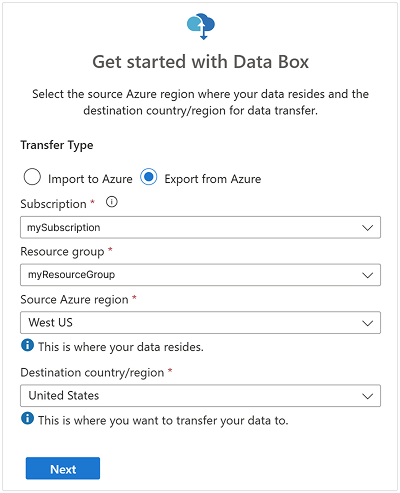

5. Select **Data Box**. The maximum usable capacity for a single order is 120 TB/525 TB or 80 TB depending on the SKU. You can create multiple orders for larger data sizes.

   

6. In **Order**, specify the **Basic** order details. Enter or select the following information.

    |Setting  |Value  |
    |---------|---------|
    |Subscription     | The subscription is automatically populated based on your earlier selection.|
    |Resource group | The resource group you selected previously. |
    |Export order name     |  Provide a friendly name to track the order. <br> The name can have between 3 and 24 characters that can be letters, numbers, and hyphens. <br> The name must start and end with a letter or a number.      |

    

    Select **Next: Data Selection** to proceed.

7. In **Data Selection**, select **Add storage account and export type**.

    

8. In **Select Export option**, specify the export option details. Enter or select the following information and select **Add**.

    |Setting  |Value  |
    |---------|---------|
    |Storage account     | The Azure Storage account from where you want to export data. |
    |Export type     | Specifies the type of data to export from **All objects** and **Use XML file**.<ul><li> **All objects** - Specifies that the job exports all data depending on your selection for **Transfer options**.</li><li> **Use XML file** – Specifies an XML file that contains a set of paths and prefixes for blobs and/or files to be exported from the storage account. The XML file needs to be in the selected storage account's container, and selecting from file shares is currently not supported. The file needs to be a non-empty .xml file.</li></ul>        |
    |Transfer options     |  Specifies the data transfer options from **Select all**, **All blobs**, and **All files**. <ul><li> **Select All** - Specifies that all blobs and Azure Files are exported. If you are using a storage account that supports only blobs (Blob Storage Account), the **All Files** option will not be selectable.</li><li> **All Blobs** - Specifies that only block and page blobs are exported.</li><li> **All Files** - Specifies that all files are exported excluding blobs. The type of storage account you have (GPv1 and GPv2, premium storage, or blob storage) determines the types of data you can export. For more information, see [Supported storage accounts for export](../import-export/storage-import-export-requirements.md#supported-storage-types).</li></ul>         |
    |Include verbose log     | Indicates whether you want a verbose log file that contains a list of all files that were exported successfully. For more information about the copy logs and verbose logs for an export order, see [View logs](data-box-export-logs.md#view-logs-during-data-copy). |

    > [!NOTE]
    > If you select **Use XML file** for the **Export type** setting, you need to make sure that the XML file contains valid paths and/or prefixes. You must construct and supply the XML file. If the file is invalid or no data matches the paths specified, the order terminates with partial data or no data exported. For guidance, see [Create XML file](#create-xml-file).

    To see how to add an XML file to a container, see [Export order using XML file](data-box-deploy-export-ordered.md#export-order-using-xml-file).

   

   To see an example of the XML input, see [Create XML file](#create-xml-file)

9. In **Data selection**, review your settings and select **Next: Security>** to continue.

   

    The **Security** screen lets you use your own encryption key and choose to use double encryption.

    All settings on the **Security** screen are optional. If you don't change any settings, the default settings will apply.

    

10. If you want to use your own customer-managed key to protect the unlock passkey for your new resource, expand **Encryption type**.

    Configuring a customer-managed key for your Azure Data Box is optional. By default, Data Box uses a Microsoft managed key to protect the unlock passkey.

    A customer-managed key doesn't affect how data on the device is encrypted. The key is only used to encrypt the device unlock passkey.

    If you don't want to use a customer-managed key, skip to Step 16.

    

11. Select **Customer managed key** as the key type. Then select **Select a key vault and key**.

    

12. On the **Select key from Azure Key Vault** screen, the subscription is automatically populated.

    - For **Key vault**, you can select an existing key vault from the dropdown list.

      

    - You can also select **Create new** to create a new key vault. On the **Create key vault** screen, enter the resource group and a key vault name. Ensure that **Soft delete** and **Purge protection** are enabled. Accept all other defaults, and select **Review + Create**.

      

      Review the information for your key vault, and select **Create**. Wait for a couple minutes for key vault creation to complete.

      

13. On the **Select key from Azure Key Vault** screen, you can select an existing key in the key vault.

    

    If you want to create a new key, select **Create new**. You must use an RSA key. The size can be 2048 or greater. Enter a name for your new key, accept the other defaults, and select **Create**.

      

      You'll be notified when the key has been created in your key vault.

14. Select the **Version** of the key to use, and then choose **Select**.

      

    If you want to create a new key version, select **Create new**.

    

    On the **Create new key** screen, choose settings for the new key version, and select **Create**.

    

    The **Encryption type** settings on the **Security** screen show your key vault and key.

    

15. Select a user identity that you'll use to manage access to this resource. Choose **Select a user identity**. In the panel on the right, select the subscription and the managed identity to use. Then choose **Select**.

    A user-assigned managed identity is a stand-alone Azure resource that can be used to manage multiple resources. For more information, see [Managed identity types](../active-directory/managed-identities-azure-resources/overview.md).

    If you need to create a new managed identity, follow the guidance in [Create, list, delete, or assign a role to a user-assigned managed identity using the Azure portal](../../articles/active-directory/managed-identities-azure-resources/how-to-manage-ua-identity-portal.md).

    

    The user identity is shown in **Encryption type** settings.

    You can collapse the **Encryption type** settings now.

    

16. If you want to enable software-based double encryption, expand **Double encryption (for high-security environments)**, and select **Enable double encryption for the order**.

    The software-based encryption is performed in addition to the AES-256 bit encryption of the data on the Data Box.

    > [!NOTE]
    > Enabling this option could make order processing and data copy take longer. You can't change this option after you create your order.

    

    Select **Next: Contact details** to continue.

11. In the **Contact details**, select **+ Add Shipping Address** to enter your shipping information.

    

12. In **Add Shipping address**, provide your first and last name, name and postal address of the company, and a valid phone number. Select **Validate**. The service validates the shipping address for service availability. If the service is available for the specified shipping address, you receive a notification to that effect.

    

    If you are ordering in a region where self-managed shipping is available, you can select this option. For more information about self-managed shipping, see [Use self-managed shipping](data-box-portal-customer-managed-shipping.md).

13. Select **Add shipping address** once the shipping details have been validated successfully.

14. In **Contact details**, review your shipping address and email address. The service sends email notifications regarding any updates to the order status to the specified email addresses.

    We recommend that you use a group email so that you continue to receive notifications if an admin in the group leaves.

    

15. Select **Next: Review + Order>**. You must accept the terms and conditions to proceed with order creation.

16. Select **Order**. The order takes a few minutes to be created.

    
:::zone-end


## Export order using XML file

If you select **Use XML file**, you can specify specific containers and blobs (page and block) you want to export. The steps below show you how to use the XML file for exporting your data. To construct the XML file, follow the guidance in [Create XML file](#create-xml-file).

To use an XML file to export your data:

1. For **Export type**, select **Use XML file**. This is your XML file that specifies specific blobs and Azure files you want to export. To add the XML file, select **Click here to select an XML file**.

     

2. Select **+ Container** to create a container.

    

3. In **New Container** tab that pops out from the right side of the Azure portal, add a name for the container. The name must be lower-case and you may include numbers and dashes '-'. Then select the **Public access level** from the drop-down list box. We recommend that you choose **Private (non anonymous access)** to prevent others from accessing your data. For more information regarding container access levels, see [Container access permissions](../storage/blobs/anonymous-read-access-configure.md#set-the-anonymous-access-level-for-a-container).

   

4. Select **Create**.

   

   If your container is created successfully, you will receive the following message:

   

5. Select the container you created and double-click on it.

   

6. Double-clicking on the container will bring up the container properties view. You now want to attach (or browse to) your XML file that contains your list of blobs and/or Azure Files you want to export. Select **Upload**.

   

7. You have successfully added the XML file to the container. Only blobs and Azure Files you specified in this XML will be exported.

   

## Create XML file

Follow these guidelines to create your XML file if you choose to select blobs and files for export using an XML file:
- **Sample XML file tab:** Copy a sample XML file with examples of each tag.
- **XML file overview tab:** Review tag requirements for the XML file.
- **Prefix examples tab:** See examples of valid prefixes that select multiple blobs and files for export.

> [!NOTE]
> You can use the `generateXMLFilesForExport.ps1` script to generate XML files for large blob exports. The script creates XML files for exporting from Azure Blob storage containers to multiple Azure Data Box or Azure Data Box Heavy devices. You can download the script from [Azure Samples](https://github.com/Azure-Samples/data-box-samples). See the [README](https://github.com/Azure-Samples/data-box-samples/blob/main/multipleDataBoxExportScript/README.md) for more information.

### [Sample XML file](#tab/sample-xml-file)

This sample XML file includes examples of each XML tag that is used to select blobs and files for export in a Data Box export order.

- For XML file requirements, go to the **XML file overview** tab.
- For more examples of valid blob and file prefixes, go to the **Prefix examples** tab.

```xml
<?xml version="1.0" encoding="utf-8"?>
   <!--BlobList selects individual blobs (BlobPath) and multiple blobs (BlobPathPrefix) in Blob storage for export.-->
   <BlobList>
      <BlobPath>/container1/blob.txt</BlobPath> <!-- Exports /container1/blob.txt -->
      <BlobPathPrefix>/container2/</BlobPathPrefix> <!--Exports all blobs in container2 -->
      <BlobPathPrefix>/container</BlobPathPrefix>  <!-- Exports all containers beginning with prefix: "container" -->
	  <BlobPathPrefix>/container1/2021Q2</BlobPathPrefix> <!-- Exports all blobs in container1 with prefix: "2021Q2" -->
   </BlobList>

   <!--AzureFileList selects individual files (FilePath) and multiple files (FilePathPrefix) in Azure File storage for export.-->
   <AzureFileList>
	  <FilePath>/fileshare1/file.txt</FilePath> <!-- Exports /fileshare1/file.txt -->
      <FilePathPrefix>/fileshare1/</FilePathPrefix> <!-- Exports all directories and files in fileshare1 -->
	  <FilePathPrefix>/fileshare</FilePathPrefix> <!-- Exports all directories and files in any fileshare with prefix: "fileshare" -->
      <FilePathPrefix>/fileshare2/contosowest</FilePathPrefix> <!-- Exports all directories and files in fileshare2 with prefix: "contosowest" -->
   </AzureFileList>
```

### [XML file overview](#tab/xml-file-overview)

Follow these guidelines when you construct the XML file for your export order. Incorrect tag formats can lead to export failures.

For steps to upload the XML file when you place an export order, see [Export order using XML file](#export-order-using-xml-file).

#### Path vs. prefix

To form the XML tags in your XML file correctly, you need to understand the difference between a path and a prefix:

* A *path* selects and filters to a single blob or file.
* A *prefix* selects and filters to multiple blobs or multiple files.

For examples of correctly formed prefixes, go to the **Prefix examples** tab.

#### Tag usage

The following XML tags are used in the XML file for a Data Box export order:

| xml tag           |Description |
|-------------------|------------|
|`<BlobList>`       |Parent tag for &lt;BlobPath&gt; and &lt;BlobPathPrefix&gt; tags.|
|`<BlobPath>`       |Selects a single blob. |
|`<BlobPathPrefix>` |Selects blobs with a common prefix. For examples, go to the **Prefix examples** tab.|
|`<AzureFileList>`  |Parent tag for &lt;FilePath&gt; and &lt;FilePathPrefix&gt; tags.|
|`<FilePath>`       |Selects a single file. |
|`<FilePathPrefix>` |Selects files with a common prefix. For examples, go to the **Prefix examples** tab.|

To see the tags in context, go to the **Sample XML file** tab.

#### XML tag requirements

* All XML tags are case sensitive and need to match the tags in the above table exactly.
* Opening and closing tags must match.
* Incorrect XML tags or formatting may lead to data export failure.
* No data will be exported if the blob prefix or file prefix is invalid. For examples of valid prefixes, go to the **Prefix examples** tab.

### [Prefix examples](#tab/prefix-examples)

These sample paths show various ways to construct a prefix to select multiple blobs or files for export.

#### Valid blob path prefixes

The sample paths below are used with the &lt;BlobPathPrefix&gt; tag to select multiple blobs in Azure Blob storage for export.

|Blob path prefix        |Description                                                                     |Tag example                         |
|------------------------|--------------------------------------------------------------------------------|------------------------------------|
|/	                     |Exports all blobs in the storage account.                                       |`<BlobPathPrefix>/</BlobPathPrefix>`|
|/$root/	             |Exports all blobs in the root container.                                        |`<BlobPathPrefix>/$root/</BlobPathPrefix>`|
|/container2/            |Exports all blobs in the container **container2**.                              |`<BlobPathPrefix>/container2/</BlobPathPrefix>`|
|/container	         |Exports all blobs in any container that begins with prefix **container**.      |`<BlobPathPrefix>/container</BlobPathPrefix>`|
|/container1/2021Q2      |Exports all blobs in container **container1** that begin with prefix **2021Q2**.|`<BlobPathPrefix>/container1/2021Q2</BlobPathPrefix>`|

To select a *single* blob for export, use the &lt;BlobPath&gt; tag with a container path and blob name. For example, to select **blob.txt** in the **container1** container, you would use this tag: `<BlobPath>/container1/blob.txt</BlobPath>`.

#### Valid file path prefixes

The sample paths below are used with the &lt;FilePathPrefix&gt; tag to select multiple Azure Files for export.

|File path prefix        |Description                                                                                          |Tag example|
|------------------------|-----------------------------------------------------------------------------------------------------|-----------|
|/                       |Exports all files and directories in the storage account. |`<FilePathPrefix>/</FilePath>Prefix>`|
|/fileshare1/            |Exports all files and directories in the share named **fileshare1**.                                                 |`<FilePathPrefix>/fileshare1/</FilePath>Prefix>`|
|/fileshare              |Exports all files and directories in any file share that begins with prefix **fileshare**. |`<FilePathPrefix>/fileshare</FilePath>Prefix>`|
|/fileshare2/contosowest |Exports all files and directories in fileshare **fileshare2** that begin with prefix **contosowest**.|`<FilePathPrefix>/fileshare2/contosowest</FilePath>Prefix>`|

To select a *single* file for export, use the &lt;FilePath&gt; tag with a share path and file name. For example, to select **file.txt** in **fileshare1**, you would use this tag: `<FilePath>/fileshare1/file.txt</FilePath>`

---

## Track the order

After you have placed the order, you can track the status of the order from Azure portal. Go to your Data Box order and then go to **Overview** to view the status. The portal shows the order in **Ordered** state.

When the device preparation is complete, data copy will begin from the selected storage accounts. The portal shows the order in **Data copy in progress** state.


Data Box copies data from the source storage account(s). Once the data copy is complete, Data Box is locked and the portal will show the order in **Copy Completed** state.


The data export from Azure Storage to your Data Box can sometimes fail. Make sure that the blobs aren't archive blobs as export of these blobs is not supported.

> [!NOTE]
> For archive blobs, you need rehydrate those blobs before they can be exported from Azure Storage account to your Data Box. For more information, see [Rehydrate an archive blob]( ../storage/blobs/storage-blob-rehydration.md).

If the device is not available, you will receive a notification. If the device is available, Microsoft identifies the device for shipment and prepares the shipment. During device preparation, the following actions occur:

* SMB shares are created for each storage account associated with the device.
* For each share, access credentials such as username and password are generated.
* The device is locked and can be accessed only using the device unlock password. To retrieve the password, you need to log in to your Azure portal account and select **Device details**.

Microsoft then prepares and dispatches your device through a regional carrier. You receive a tracking number once the device is shipped. The portal shows the order in **Dispatched** state.


If self-managed shipping was selected, you will receive an email notification with next steps when the device is ready to be picked up from the datacenter. For more information relating to self-managed shipping, see [Self-managed shipping](data-box-portal-customer-managed-shipping.md).


## Cancel the order

To cancel this order, in the Azure portal, go to **Overview** and select **Cancel** from the command bar.

After placing an order, you can cancel it at any point before the order starts processing.

To delete a canceled order, go to **Overview** and select **Delete** from the command bar.

## Next steps

In this tutorial, you learned about Azure Data Box topics such as:

> [!div class="checklist"]
>
> * Prerequisites for export
> * Order a Data Box for export
> * Track the export order
> * Cancel the export order

Advance to the next tutorial to learn how to set up your Data Box.

> [!div class="nextstepaction"]
> [Set up your Azure Data Box](./data-box-deploy-set-up.md)

:::zone pivot="dbx-ng"

:::zone-end
