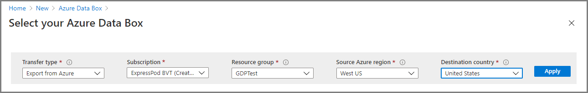
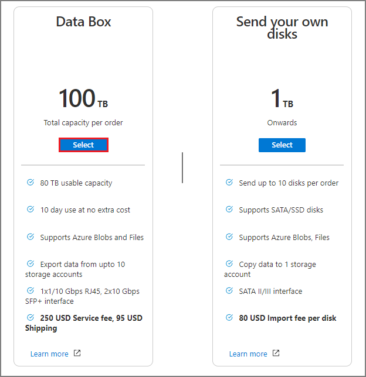
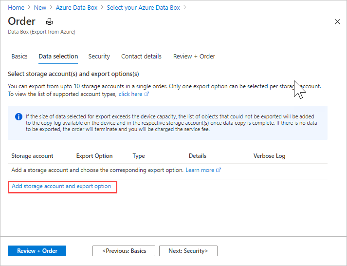
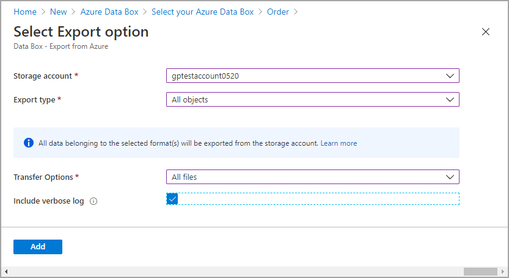
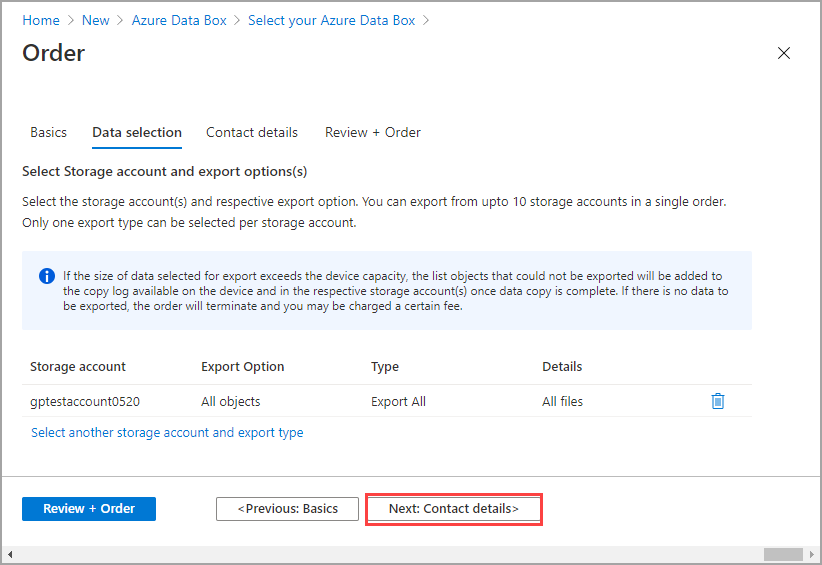
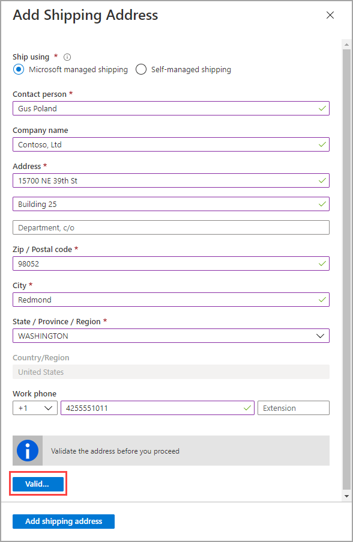
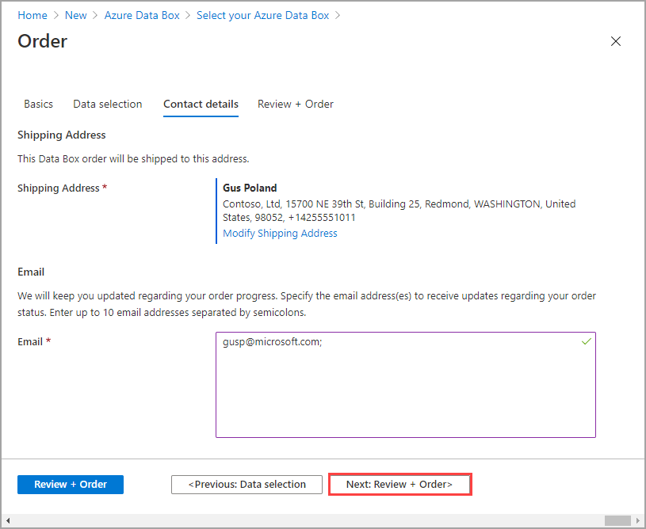
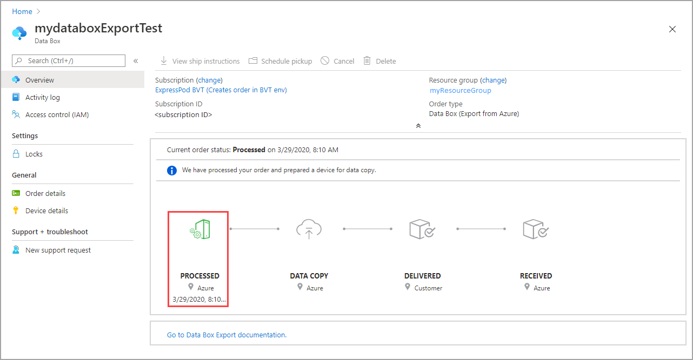
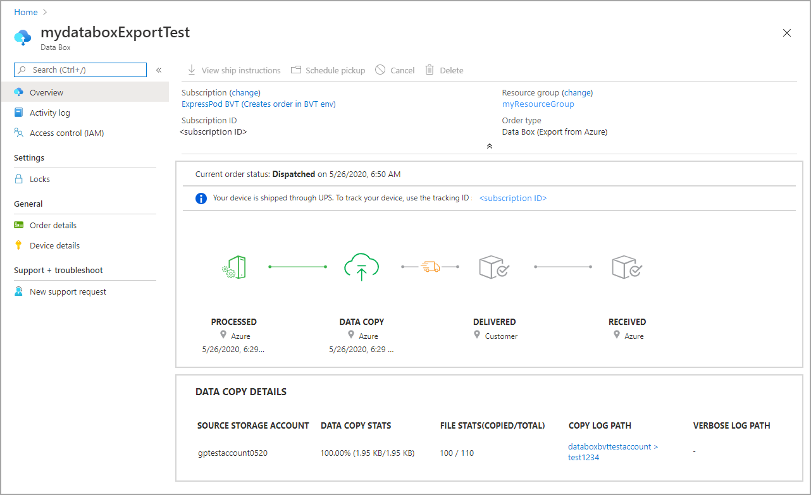

# Tutorial: Create export order for Azure Data Box (Preview)

Azure Data Box is a hybrid solution that allows you to move data out of Azure into your location. This tutorial describes how to create an export order for Azure Data Box.

You may need to export data for:

* disaster recovery
* government and security
* content distribution
* data backup or replication

In this tutorial, you learn about:

> [!div class="checklist"]
>
> * Prerequisites for export
> * Order a Data Box for export
> * Track the export order
> * Cancel the export order

[!INCLUDE [Data Box feature is in preview](../../includes/data-box-feature-is-preview-info.md)]

## Prerequisites

Complete the following configuration prerequisites for Data Box service and device before you deploy the device.

### For service

[!INCLUDE [Data Box service prerequisites](../../includes/data-box-supported-subscriptions.md)]

* Make sure that you have an existing resource group that you can use with your Azure Data Box. You can also create a new resource group inline when creating the order.

### For device

Before you begin, make sure that:

* You should have a host computer connected to the datacenter network. Data Box will copy the data to this computer. Your host computer must run a supported operating system as described in [Azure Data Box system requirements](data-box-system-requirements.md).
* Your datacenter needs to have high-speed network. We strongly recommend that you have at least one 10 GbE connection. If a 10 GbE connection is not available, a 1 GbE data link can be used but the copy speeds are impacted.

### Supported storage accounts

[!INCLUDE [data-box-supported-storage-accounts](../../includes/data-box-supported-storage-accounts.md)]

> [!NOTE]
>
> * Azure Data Lake Storage (ADLS) Gen2 storage accounts are not supported for Export.
> * Append blob storage is also not supported for export.
> * A maximum of 80 TBs can be exported.
> * File history is not exported.

## Order Data Box

Perform the following steps in the Azure portal to order a device.

1. Use your Microsoft Azure credentials to sign in at this URL: [https://portal.azure.com](https://portal.azure.com).

2. Select **+ Create a resource** and search for *Azure Data Box*. Select **Azure Data Box**.

   

3. Select **Create**.

    

4. Check if Azure Data Box service is available in your region. In this preview release, export feature is available in US and EU. Enter or select the following information and select **Apply**.

    |Setting  |Value  |
    |---------|---------|
    |Transfer type     | Select **Export to Azure**.        |
    |Subscription     | Select an EA, CSP, or Azure sponsorship subscription for Data Box service. <br> The subscription is linked to your billing account.       |
    |Resource group     |    Use an existing or create a new one. <br> A resource group is a logical container for the resources that can be managed or deployed together.         |
    |Source Azure region    |    Select the Azure region where your data currently. resides.         |
    |Destination country     |     Select the country where you want to ship the device.        |

   

5. Select **Data Box**. The maximum usable capacity for a single order is 80 TB. You can create multiple orders for larger data sizes.

   

6. In **Order**, specify the **Basic** order details. Enter or select the following information and select **Next**.

    |Setting  |Value  |
    |---------|---------|
    |Subscription     | The subscription is automatically populated based on your earlier selection.|
    |Resource group | The resource group you selected previously. |
    |Export order name     |  Provide a friendly name to track the order. <br> The name can have between 3 and 24 characters that can be letters, numbers, and hyphens. <br> The name must start and end with a letter or a number.      |

    

    Select **Next: Data Selection** to proceed.

7. In **Data Selection**, select **Add storage account and export type**.

    

8. In **Select Export option**, specify the export option details. Enter or select the following information and select **Add**.

    |Setting  |Value  |
    |---------|---------|
    |Storage account     | The Azure Storage account from where you want to export data. |
    |Export type     | Specifies the type of data to export from **All objects** and **Use XML file**.<ul><li> **All objects** - Specifies that the job exports all data depending on your selection for **Transfer options**.</li><li> **Use XML file** – Specifies an XML file that contains a set of paths and prefixes for blobs and/or files to be exported from the storage account. The XML file needs to be in the selected storage account's container, and selecting from file shares is not supported for the preview release. The file needs to be a non-empty .xml file.</li></ul>        |
    |Transfer options     |  Specifies the data transfer options from **Select all**, **All blobs**, and **All files**. <ul><li> **Select All** - Specifies that all blobs and Azure files are exported. If you are using a storage account that supports only blobs (Blob Storage Account), the **All Files** option will not be selectable.</li><li> **All Blobs** - Specifies that only block and page blobs are exported.</li><li> **All Files** - Specifies that all files are exported excluding blobs. The type of storage account you have (GPv1 and GPv2, premium storage, or blob storage) determines the types of data you can export. For more information, see [Supported storage accounts for export](../storage/common/storage-import-export-requirements#supported-storage-types).</li></ul>         |
    |Include verbose log     | Indicates whether you want a verbose log file that contains all operations and files that were transferred.        |

    > [!NOTE]
    >
    > If you select **Use XML file** for the **Export type** setting, you need to make sure that the xml contains valid paths and/or prefixes. You must construct and supply the XML file.  If the file is invalid or no data matches the paths specified, the order will terminate with no data exported.

   

   The following xml shows an example of the xml format that the export order use when you use the **use XML file** option:

   ```xml
   <?xml version="1.0" encoding="utf-8"?>
   <BlobList>
      <BlobPathPrefix>/export-container</BlobPathPrefix>
      <BlobPath>/export-container-blobsonly/TELL.C</BlobPath>
   </BlobList>
   <AzureFileList>
      <FilePathPrefix>/export-fileshare-prefix</FilePathPrefix>
      <FilePath>/export-filelist1/windows/NgcPopKeySrv.log</FilePath>
   </AzureFileList>
   ```
   <!-- 21:00 of video, caveats of the xml file -->
   <!-- CUSTOMER NEEDS TO SPECIFY THE FILE. If <blobPathPrefix> has a '/' at the end, it exports all containers. if it doesn't only the specific container is exported. LINK OUT TO AZURE PREFIX DOCUMENTATION. Also a transport file doc file? Whitespace is allowed in blobs, so if there is an extra space or misspelled blob, the blob will not be found and not exported. Azure containers are all case sensitive. Azure containers we handle internally. Page Blob part is case sensitive, so if the customer messes up the casing, his/her blob will not be found. Names must match containers in terms of case -->

9. In **Data selection**, review your settings and select **Next: Contact details>**.

   

10. In the **Contact details**, select **+ Add Shipping Address** to enter your shipping information.
   

11. In **Add Shipping address**, provide your first and last name, name and postal address of the company, and a valid phone number. Select **Validate**. The service validates the shipping address for service availability. If the service is available for the specified shipping address, you receive a notification to that effect.

    

    After the order is placed successfully, if self-managed shipping was selected, you will receive an email notification. For more information about self-managed shipping, see [Use self-managed shipping](data-box-portal-customer-managed-shipping.md).

12. Select **Add shipping address** once the shipping details have been validated successfully.

13. In **Contact details**, review your shipping address and email address. The service sends email notifications regarding any updates to the order status to the specified email addresses.

    We recommend that you use a group email so that you continue to receive notifications if an admin in the group leaves.

    

14. Select **Next: Review + Order>**.

15. Select **Order**. The order takes a few minutes to be created.

    

## Track the order

After you have placed the order, you can track the status of the order from Azure portal. Go to your Data Box order and then go to **Overview** to view the status. The portal shows the order in **Ordered** state.

If the device is not available, you will receive a notification. If the device is available, Microsoft identifies the device for shipment and prepares the shipment. During device preparation, the following actions occur:

* SMB shares are created for each storage account associated with the device.
* For each share, access credentials such as username and password are generated.
* The device is locked and can be accessed only using the device unlock password. To retrieve the password, you need to log in to your Azure portal account and select **Device details**.

When the device preparation is complete, the portal shows the order in **Processed** state.



Data Box copies data from the source storage account. Once the data copy is complete, Data Box is locked.

Microsoft then prepares and dispatches your device through a regional carrier. You receive a tracking number once the device is shipped. The portal shows the order in **Dispatched** state.



## Cancel the order

To cancel this order, in the Azure portal, go to **Overview** and select **Cancel** from the command bar.

After placing an order, you can cancel it at any point before the order status is marked processed.

To delete a canceled order, go to **Overview** and select **Delete** from the command bar.

## Sample XML file

The export blob list file may contain blob names and blob prefixes, as shown here:  

```xml
<?xml version="1.0" encoding="utf-8"?>  
<BlobList>  
   <BlobPath>pictures/animals/koala.jpg</BlobPath>  
   <BlobPathPrefix>/vhds/</BlobPathPrefix>  
   <BlobPathPrefix>/movies/</BlobPathPrefix>  
</BlobList>
<AzureFileList>
   <FilePathPrefix>/export-fileshare-prefix</FilePathPrefix>
   <FilePath>/export-filelist1/windows/NgcPopKeySrv.log</FilePath>
</AzureFileList>  
```

### Examples of valid blob paths

The following table shows examples of valid blob paths:

   | Selector | Blob Path | Description |
   | --- | --- | --- |
   | Starts with |/ |Exports all blobs in the storage account |
   | Starts with |/$root/ |Exports all blobs in the root container |
   | Starts with |/book |Exports all blobs in any container that begins with prefix **book** |
   | Starts with |/music/ |Exports all blobs in container **music** |
   | Starts with |/music/love |Exports all blobs in container **music** that begin with prefix **love** |
   | Equal to |$root/logo.bmp |Exports blob **logo.bmp** in the root container |
   | Equal to |videos/story.mp4 |Exports blob **story.mp4** in container **videos** |

## Next steps

In this tutorial, you learned about Azure Data Box topics such as:

> [!div class="checklist"]
>
> * Prerequisites for export
> * Order a Data Box for export
> * Track the export order
> * Cancel the export order

Advance to the next tutorial to learn how to set up your Data Box.

> [!div class="nextstepaction"]
> [Set up your Azure Data Box](./data-box-deploy-set-up.md)
