# Tutorial: Order Azure Data Box

Azure Data Box is a hybrid solution that allows you to import your on-premises data into Azure in a quick, easy, and reliable way. You transfer your data to a Microsoft-supplied 80-TB (usable capacity) storage device, and then ship the device back. This data is then uploaded to Azure.

This tutorial describes how you can order an Azure Data Box. In this tutorial, you learn about:  

> [!div class="checklist"]
>
> * Prerequisites to deploy Data Box
> * Order a Data Box
> * Track the order
> * Cancel the order

## Prerequisites

# [Portal](#tab/portal)

Complete the following configuration prerequisites for Data Box service and device before you deploy the device:

[!INCLUDE [Prerequisites](../../includes/data-box-deploy-ordered-prerequisites.md)]

# [Azure CLI](#tab/azure-cli)

[!INCLUDE [Prerequisites](../../includes/data-box-deploy-ordered-prerequisites.md)]

If you don't have an Azure subscription, [create a free account](https://azure.microsoft.com/free/) before you begin.

You can sign in to Azure and run Azure CLI commands in one of two ways:

* You can install the CLI and run CLI commands locally.
* You can run CLI commands from within the Azure portal, in Azure Cloud Shell.

We use Azure CLI through Windows PowerShell for the tutorial, but you are free to choose either option.

### For Azure CLI

Before you begin, make sure that:

#### Install the CLI locally

* Install [Azure CLI](/cli/azure/install-azure-cli) version 2.0.67 or later. Alternatively, you may [install using MSI](https://aka.ms/installazurecliwindows).

**Sign in to Azure**

Open up a Windows PowerShell command window and sign in to Azure with the [az login](/cli/azure/reference-index#az_login) command:

```azurecli
PS C:\Windows> az login
```

Here is the output from a successful sign-in:

```output
You have logged in. Now let us find all the subscriptions to which you have access.
[
   {
      "cloudName": "AzureCloud",
      "homeTenantId": "aaaaaaaa-aaaa-aaaa-aaaa-aaaaaaaaaaaa",
      "id": "xxxxxxxx-xxxx-xxxx-xxxx-xxxxxxxxxxxx",
      "isDefault": true,
      "managedByTenants": [],
      "name": "My Subscription",
      "state": "Enabled",
      "tenantId": "aaaaaaaa-aaaa-aaaa-aaaa-aaaaaaaaaaaa",
      "user": {
          "name": "gusp@contoso.com",
          "type": "user"
      }
   }
]
```

**Install the Azure Data Box CLI extension**

Before you can use the Azure Data Box CLI commands, you need to install the extension. Azure CLI extensions give you access to experimental and pre-release commands that have not yet shipped as part of the core CLI. For more information about extensions, see [Use extensions with Azure CLI](/cli/azure/azure-cli-extensions-overview).

To install the extension for Azure Data Box, run the following command: `az extension add --name databox`:

```azurecli

    PS C:\Windows> az extension add --name databox
```

If the extension is installed successfully, you'll see the following output:

```output
    The installed extension 'databox' is experimental and not covered by customer support. Please use with discretion.
    PS C:\Windows>

    # az databox help

    PS C:\Windows> az databox -h

    Group
        az databox

    Subgroups:
        job [Experimental] : Commands to manage databox job.

    For more specific examples, use: az find "az databox"

        Please let us know how we are doing: https://aka.ms/clihats
```

#### Use Azure Cloud Shell

You can use [Azure Cloud Shell](https://shell.azure.com/), an Azure hosted interactive shell environment, through your browser to run CLI commands. Azure Cloud Shell supports Bash or Windows PowerShell with Azure services. The Azure CLI is pre-installed and configured to use with your account. Select the Cloud Shell button on the menu in the upper-right section of the Azure portal:


The button launches an interactive shell that you can use to run the steps outlined in this how-to article.

# [PowerShell](#tab/azure-ps)

[!INCLUDE [Prerequisites](../../includes/data-box-deploy-ordered-prerequisites.md)]

### For Azure PowerShell

Before you begin, make sure that you:

* Install Windows PowerShell 6.2.4 or higher.
* Install Azure PowerShell (AZ) module.
* Install Azure Data Box (Az.DataBox) module.
* Sign in to Azure.

#### Install Azure PowerShell and modules locally

**Install or upgrade Windows PowerShell**

You will need to have Windows PowerShell version 6.2.4 or higher installed. To find out what version of PowerShell you have installed, run: `$PSVersionTable`.

You will see the following output:

```azurepowershell
    PS C:\users\gusp> $PSVersionTable
    
    Name                           Value
    ----                           -----
    PSVersion                      6.2.3
    PSEdition                      Core
    GitCommitId                    6.2.3
    OS                             Microsoft Windows 10.0.18363
    Platform                       Win32NT
    PSCompatibleVersions           {1.0, 2.0, 3.0, 4.0…}
    PSRemotingProtocolVersion      2.3
    SerializationVersion           1.1.0.1
    WSManStackVersion              3.0
```

If your version is lower than 6.2.4, you need to upgrade your version of Windows PowerShell. To install the latest version of Windows PowerShell, see [Install Azure PowerShell](/powershell/scripting/install/installing-powershell).

**Install Azure PowerShell and Data Box modules**

You will need to install the Azure PowerShell modules to use Azure PowerShell to order an Azure Data Box. To install the Azure PowerShell modules:

1. Install the [Azure PowerShell Az module](/powershell/azure/new-azureps-module-az).
2. Then install Az.DataBox using the command `Install-Module -Name Az.DataBox`.

```azurepowershell
PS C:\PowerShell\Modules> Install-Module -Name Az.DataBox
PS C:\PowerShell\Modules> Get-InstalledModule -Name "Az.DataBox"

Version              Name                                Repository           Description
-------              ----                                ----------           -----------
0.1.1                Az.DataBox                          PSGallery            Microsoft Azure PowerShell - DataBox ser…
```

#### Sign in to Azure

Open up a Windows PowerShell command window and sign in to Azure with the [Connect-AzAccount](/powershell/module/az.accounts/Connect-AzAccount) command:

```azurepowershell
PS C:\Windows> Connect-AzAccount
```

Here is the output from a successful sign-in:

```output
WARNING: To sign in, use a web browser to open the page https://microsoft.com/devicelogin and enter the code FSBFZMBKC to authenticate.

Account              SubscriptionName                          TenantId                             Environment
-------              ----------------                          --------                             -----------
gusp@contoso.com     MySubscription                            aaaaaaaa-aaaa-aaaa-aaaa-aaaaaaaaaaaa AzureCloud

PS C:\Windows\System32>
```

For detailed information on how to sign in to Azure using Windows PowerShell, see [Sign in with Azure PowerShell](/powershell/azure/authenticate-azureps).

---

## Order Data Box

# [Portal](#tab/portal)

Do the following steps in the Azure portal to order a device.

1. Use your Microsoft Azure credentials to sign in at this URL: [https://portal.azure.com](https://portal.azure.com).
2. Select **+ Create a resource** and search for *Azure Data Box*. Select **Azure Data Box**.

   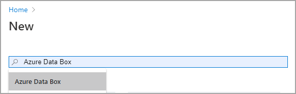

3. Select **Create**.

   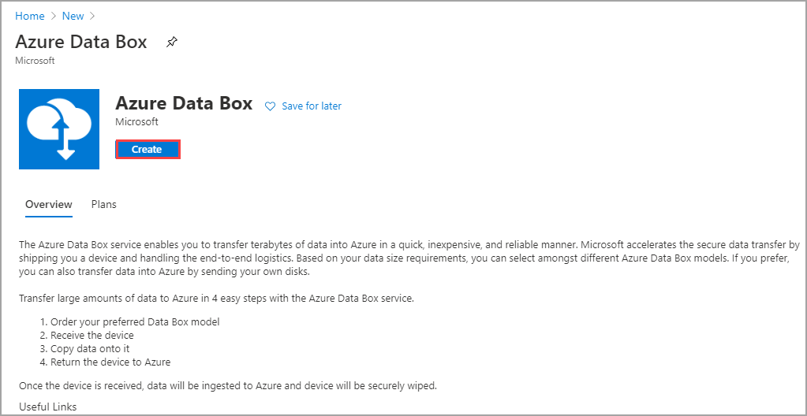

4. Check if Data Box service is available in your region. Enter or select the following information and select **Apply**.

    |Setting  |Value  |
    |---------|---------|
    |Transfer type     | Select **Import to Azure**.        |
    |Subscription     | Select an EA, CSP, or Azure sponsorship subscription for Data Box service. <br> The subscription is linked to your billing account.       |
    |Resource Group | Select an existing resource group. A resource group is a logical container for the resources that can be managed or deployed together. |
    |Source country/region    |    Select the country/region where your data currently resides.         |
    |Destination Azure region     |     Select the Azure region where you want to transfer data. <br> For more information, go to [region availability](data-box-overview.md#region-availability).            |

    [ 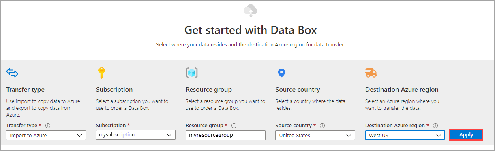 ](media/data-box-deploy-ordered/select-data-box-import-04-b.png#lightbox)

5. Select **Data Box**. The maximum usable capacity for a single order is 80 TB. You can create multiple orders for larger data sizes.

    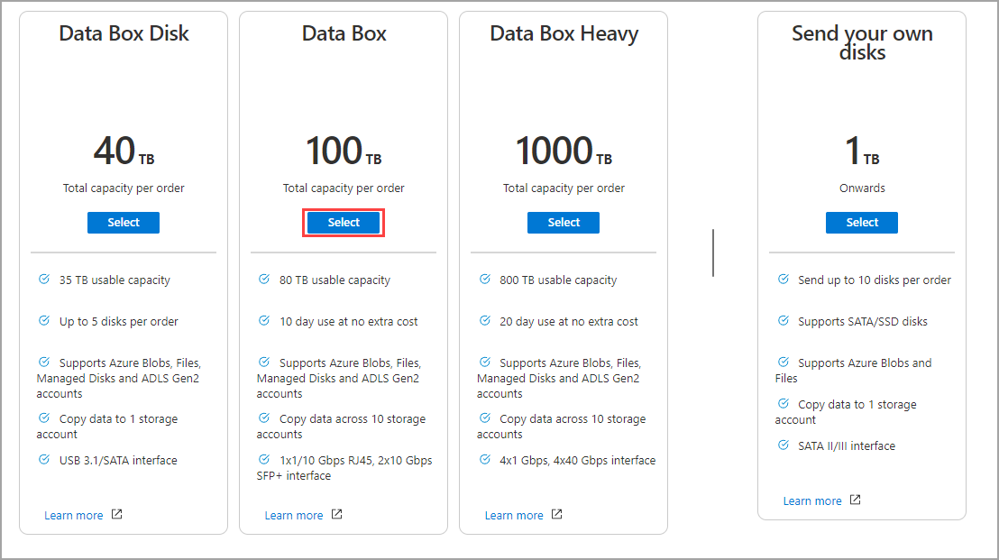

6. In **Order**, go to the **Basics** tab. Enter or select the following information and select **Next: Data destination>**.

    |Setting  |Value  |
    |---------|---------|
    |Subscription      | The subscription is automatically populated based on your earlier selection.|
    |Resource group    | The resource group you selected previously. |
    |Import order name | Provide a friendly name to track the order. <br> The name can have between 3 and 24 characters that can be letters, numbers, and hyphens. <br> The name must start and end with a letter or a number.    |

    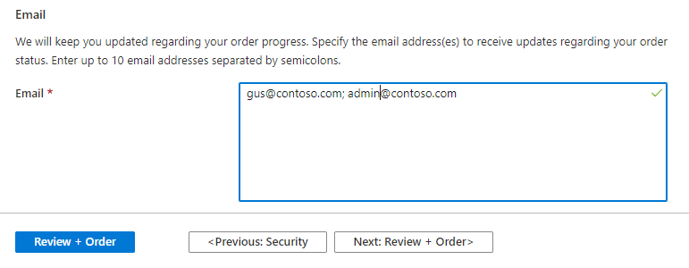

7. On the **Data destination** screen, select the **Data destination** - either storage accounts or managed disks.

    If using **storage account(s)** as the storage destination, you see the following screen:

    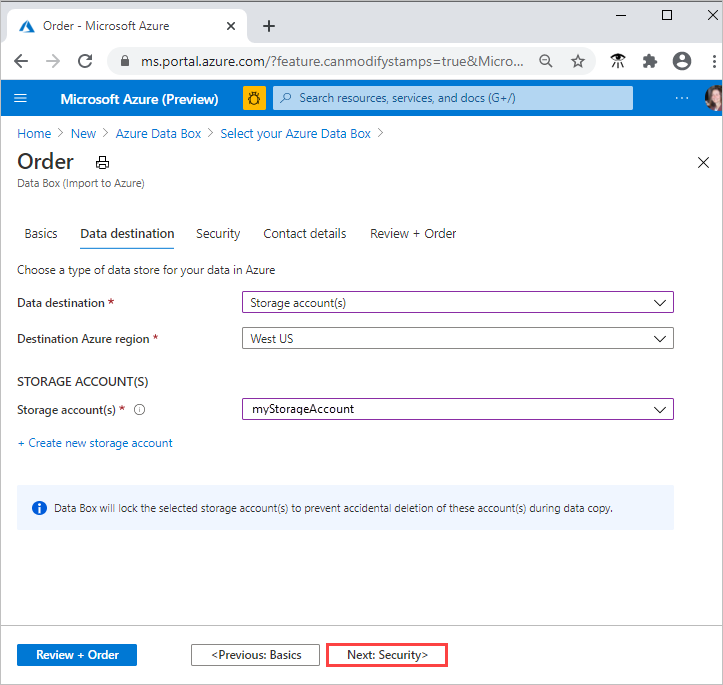

    Based on the specified Azure region, select one or more storage accounts from the filtered list of existing storage accounts. Data Box can be linked with up to 10 storage accounts. You can also create a new **General-purpose v1**, **General-purpose v2**, or **Blob storage account**.

   > [!NOTE]
   > - If you select Azure Premium FileStorage accounts, the provisioned quota on the storage account share will increase to the size of data being copied to the file shares. After the quota is increased, it isn't adjusted again, for example, if for some reason the Data Box can't copy your data.
   > - This quota is used for billing. After your data is uploaded to the datacenter, you should adjust the quota to meet your needs. For more information, see [Understanding billing](../../articles/storage/files/understanding-billing.md).

    Storage accounts with virtual networks are supported. To allow Data Box service to work with secured storage accounts, enable the trusted services within the storage account network firewall settings. For more information, see how to [Add Azure Data Box as a trusted service](../storage/common/storage-network-security.md#exceptions).

    If using Data Box to create **Managed disk(s)** from the on-premises virtual hard disks (VHDs), you will also need to provide the following information:

    |Setting  |Value  |
    |---------|---------|
    |Resource groups     | Create new resource groups if you intend to create managed disks from on-premises VHDs. You can use an existing resource group only if the resource group was created previously when creating a Data Box order for managed disks by the Data Box service. <br> Specify multiple resource groups separated by semi-colons. A maximum of 10 resource groups are supported.|

    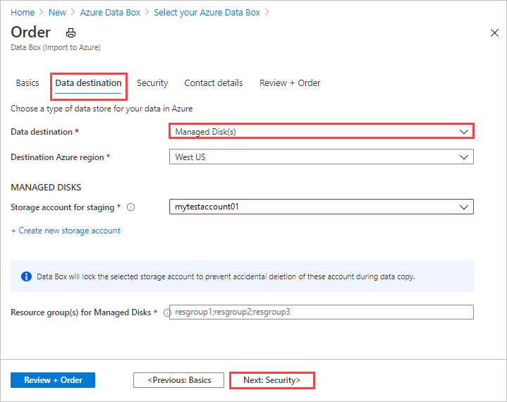

    The storage account specified for managed disks is used as a staging storage account. The Data Box service uploads the VHDs as page blobs to the staging storage account before converting it into managed disks and moving it to the resource groups. For more information, see [Verify data upload to Azure](data-box-deploy-picked-up.md#verify-data-upload-to-azure).

   > [!NOTE]
   > If a page blob isn't successfully converted to a managed disk, it stays in the storage account and you're charged for storage.

8. Select **Next: Security** to continue.

    The **Security** screen lets you use your own encryption key and your own device and share passwords, and choose to use double encryption.

    All settings on the **Security** screen are optional. If you don't change any settings, the default settings will apply.

    

9. If you want to use your own customer-managed key to protect the unlock passkey for your new resource, expand **Encryption type**.

    Configuring a customer-managed key for your Azure Data Box is optional. By default, Data Box uses a Microsoft managed key to protect the unlock passkey.

    A customer-managed key doesn't affect how data on the device is encrypted. The key is only used to encrypt the device unlock passkey.

    If you don't want to use a customer-managed key, skip to Step 15.

   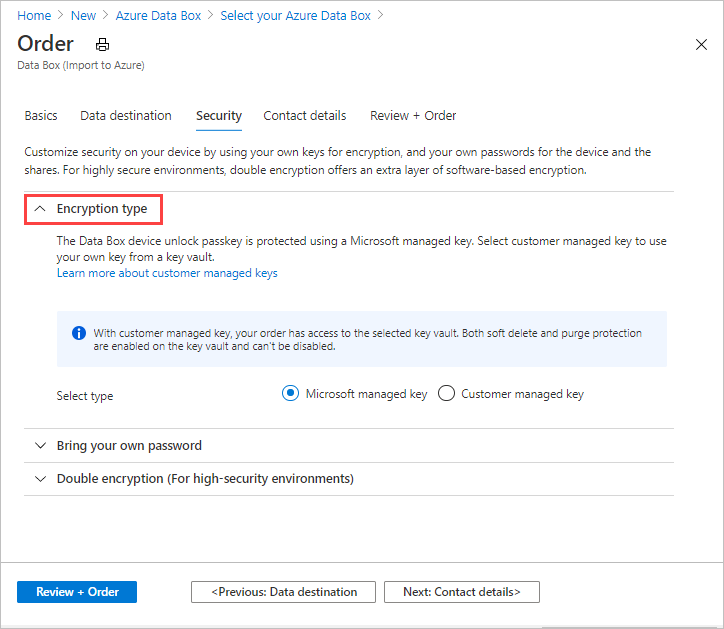

10. Select **Customer managed key** as the key type. Then select **Select a key vault and key**.
   
    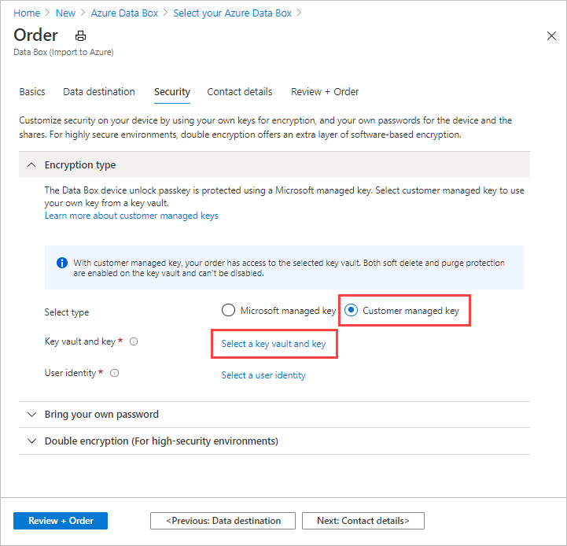

11. In the **Select key from Azure Key Vault** blade, the subscription is automatically populated.

    - For **Key vault**, you can select an existing key vault from the dropdown list.

      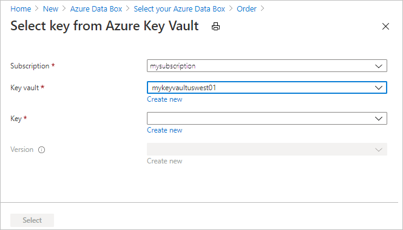

    - You can also select **Create new** to create a new key vault. On the **Create key vault** screen, enter the resource group and a key vault name. Ensure that **Soft delete** and **Purge protection** are enabled. Accept all other defaults, and select **Review + Create**.

      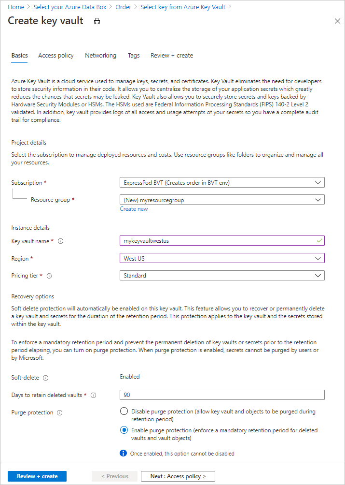

      Review the information for your key vault, and select **Create**. Wait for a couple minutes for key vault creation to complete.

      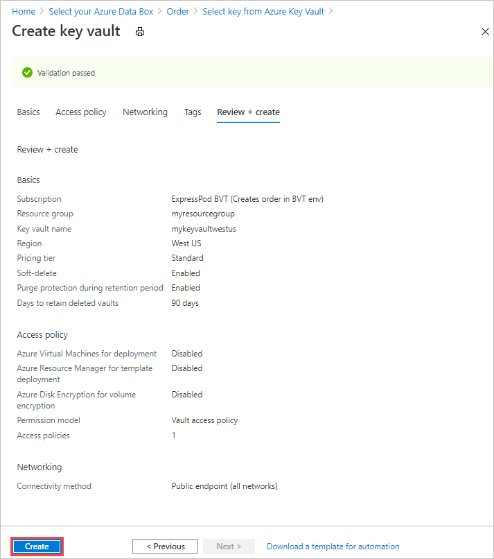

12. In **Select key from Azure Key Vault**, you can select an existing key in the key vault.

    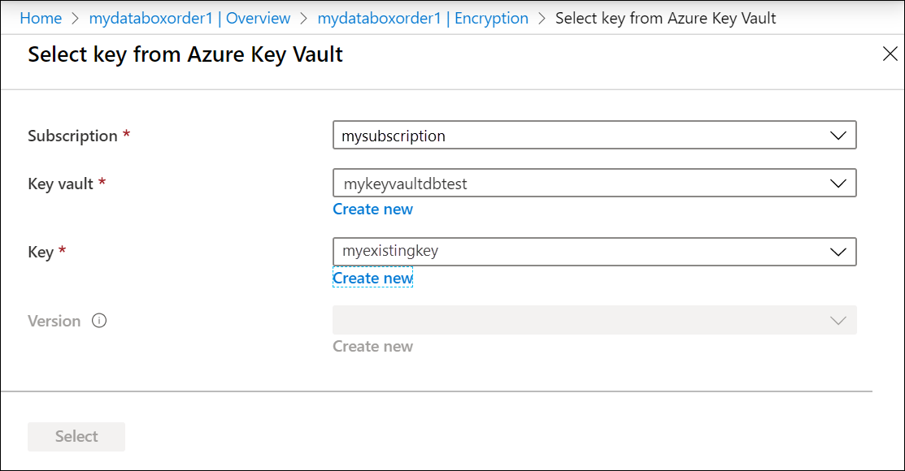

    If you want to create a new key, select **Create new**. You must use an RSA key. The size can be 2048 or greater. Enter a name for your new key, accept the other defaults, and select **Create**.

      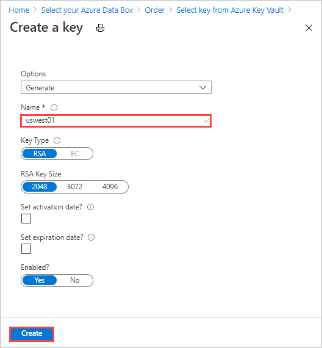

      You'll be notified when the key has been created in your key vault.

13. Select the **Version** of the key to use, and then choose **Select**.

      

    If you want to create a new key version, select **Create new**.

    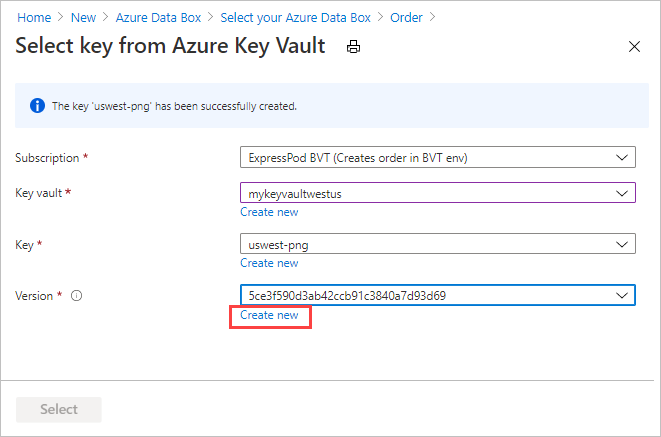

    Choose settings for the new key version, and select **Create**.

    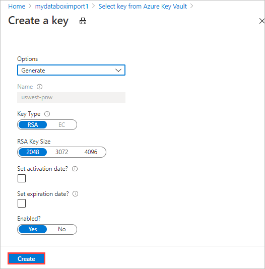

    The **Encryption type** settings on the **Security** screen show your key vault and key.

    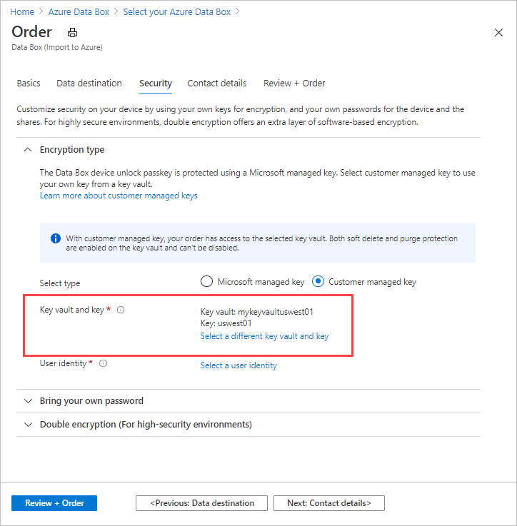

14. Select a user identity that you'll use to manage access to this resource. Choose **Select a user identity**. In the panel on the right, select the subscription and the managed identity to use. Then choose **Select**.

    A user-assigned managed identity is a stand-alone Azure resource that can be used to manage multiple resources. For more information, see [Managed identity types](../active-directory/managed-identities-azure-resources/overview.md).  

    If you need to create a new managed identity, follow the guidance in [Create, list, delete, or assign a role to a user-assigned managed identity using the Azure portal](../active-directory/managed-identities-azure-resources/how-to-manage-ua-identity-portal.md).
    
    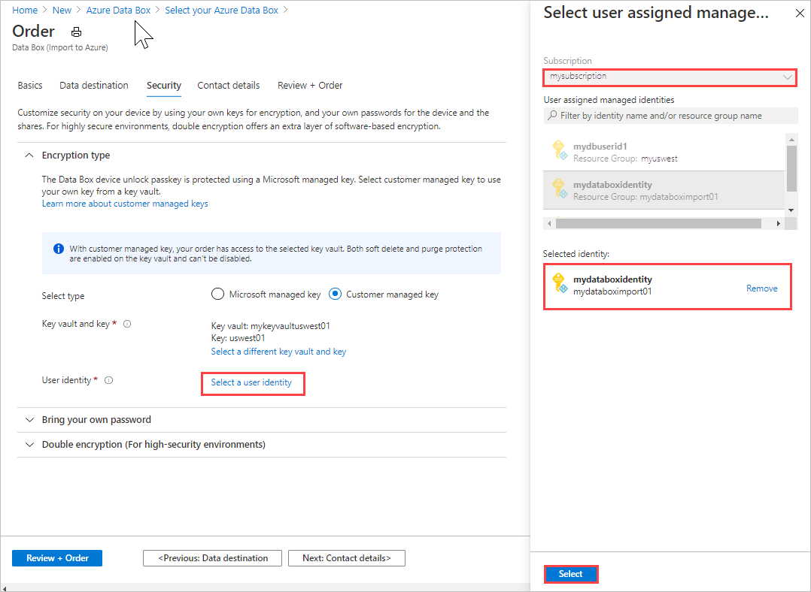

    The user identity is shown in **Encryption type** settings.

    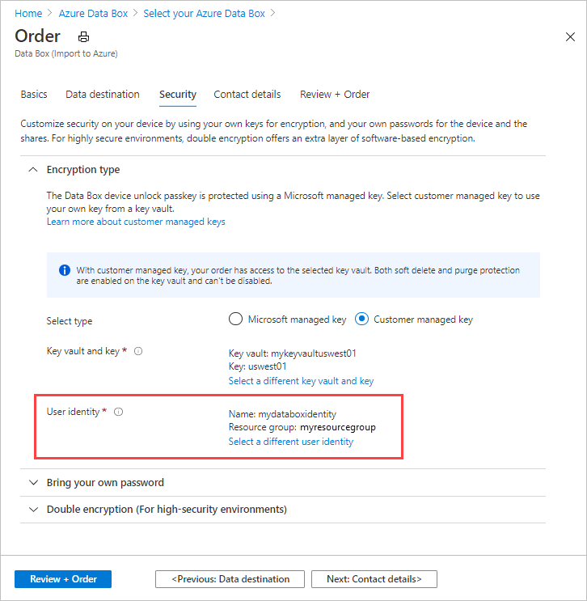

15. If you don't want to use the system-generated passwords that Azure Data Box uses by default, expand **Bring your own password** on the **Security** screen.

    The system-generated passwords are secure, and are recommended unless your organization requires otherwise.

    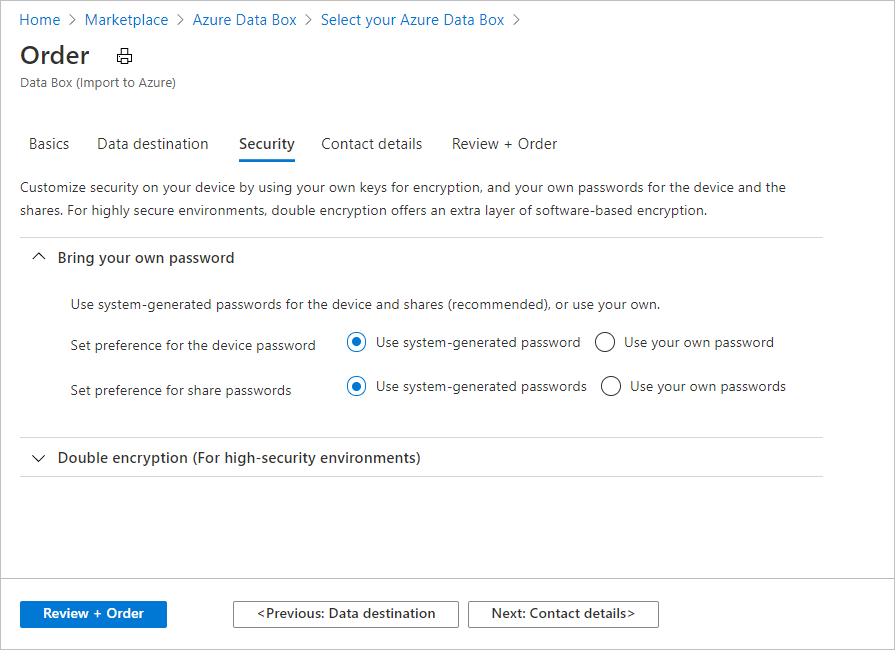 

   - To use your own password for your new device, by **Set preference for the device password**, select **Use your own password**, and type a password that meets the security requirements.
     
     The password must be alphanumeric and contain from 12 to 15 characters, with at least one uppercase letter, one lowercase letter, one special character, and one number. 

     - Allowed special characters: @ # - $ % ^ ! + = ; : _ ( )
     - Characters not allowed: I i L o O 0
   
     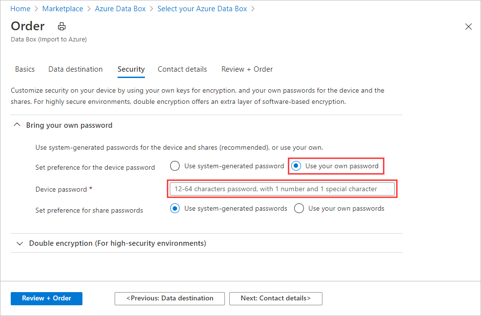

 - To use your own passwords for shares:

   1. By **Set preference for share passwords**, select **Use your own passwords** and then **Select passwords for the shares**.
     
       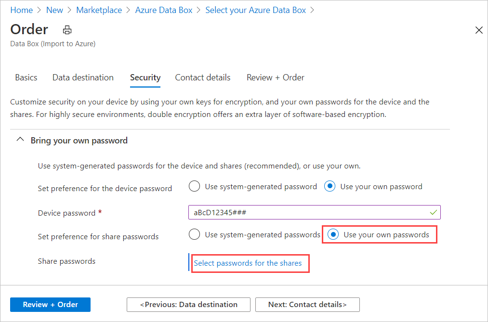

    1. Type a password for each storage account in the order. The password will be used on all shares for the storage account.
    
       The password must be alphanumeric and contain from 12 to 64 characters, with at least one uppercase letter, one lowercase letter, one special character, and one number.

       - Allowed special characters: @ # - $ % ^ ! + = ; : _ ( )
       - Characters not allowed: I i L o O 0
     
    1. To use the same password for all of the storage accounts, select **Copy to all**. 

    1. When you finish, select **Save**.
     
       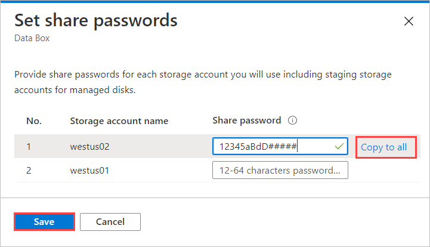

    On the **Security** screen, you can use **View or change passwords** to change the passwords.

16. In **Security**, if you want to enable software-based double encryption, expand **Double-encryption (for highly secure environments)**, and select **Enable double encryption for the order**.

    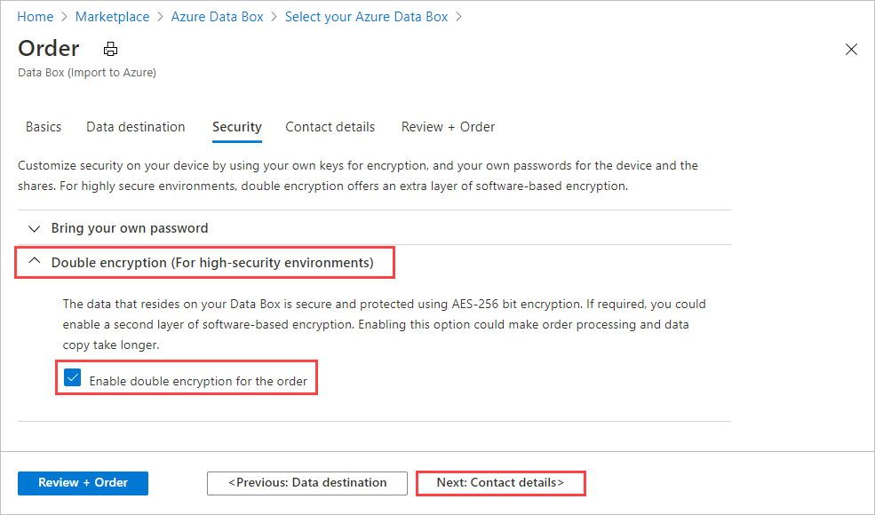

    The software-based encryption is performed in addition to the  AES-256 bit encryption of the data on the Data Box.

    > [!NOTE]
    > Enabling this option could make order processing and data copy take longer. You can't change this option after you create your order.

    Select **Next: Contact details** to continue.

17. In **Contact details**, select **+ Add Shipping Address**.

    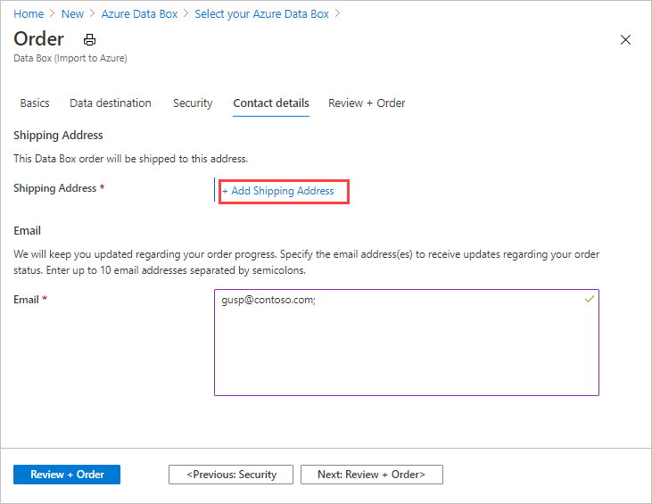

18. In the **Shipping address**, provide your first and last name, name and postal address of the company, and a valid phone number. Select **Validate address**. The service validates the shipping address for service availability. If the service is available for the specified shipping address, you receive a notification to that effect.

    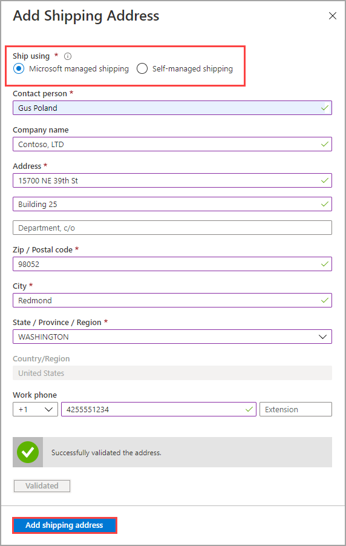

    If you selected self-managed shipping, you will receive an email notification after the order is placed successfully. For more information about self-managed shipping, see [Use self-managed shipping](data-box-portal-customer-managed-shipping.md).

19. Select **Add Shipping Address** once the shipping details have been validated successfully. You will return to the **Contact details** tab.

20. After you return to **Contact details**, add one or more email addresses. The service sends email notifications regarding any updates to the order status to the specified email addresses.

    We recommend that you use a group email so that you continue to receive notifications if an admin in the group leaves.

    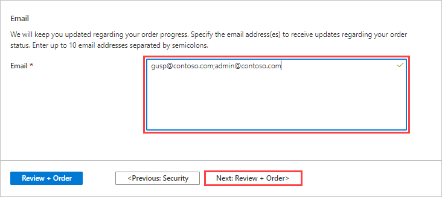

21. Review the information in **Review + Order** related to the order, contact, notification, and privacy terms. Check the box corresponding to the agreement to privacy terms.

22. Select **Order**. The order takes a few minutes to be created.

    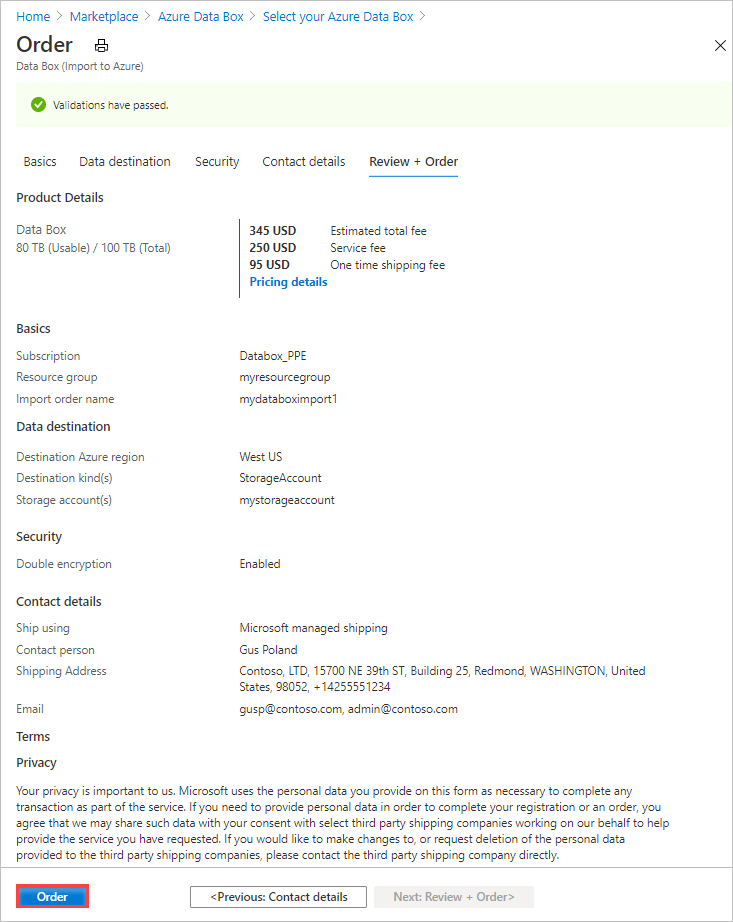

# [Azure CLI](#tab/azure-cli)

Do the following steps using Azure CLI to order a device:

1. Write down your settings for your Data Box order. These settings include your personal/business information, subscription name, device information, and shipping information. You will need to use these settings as parameters when running the CLI command to create the Data Box order. The following table shows the parameter settings used for `az databox job create`:

   | Setting (parameter) | Description |  Sample value |
   |---|---|---|
   |resource-group| Use an existing or create a new one. A resource group is a logical container for the resources that can be managed or deployed together. | "myresourcegroup"|
   |name| The name of the order you are creating. | "mydataboxorder"|
   |contact-name| The name associated with the shipping address. | "Gus Poland"|
   |phone| The phone number of the person or business that will receive the order.| "14255551234"
   |location| The nearest Azure region to you that will be shipping your device.| "US West"|
   |sku| The specific Data Box device you are ordering. Valid values are: "DataBox", "DataBoxDisk", and "DataBoxHeavy"| "DataBox" |
   |email-list| The email addresses associated with the order.| "gusp@contoso.com" |
   |street-address1| The street address to where the order will be shipped. | "15700 NE 39th St" |
   |street-address2| The secondary address information, such as apartment number or building number. | "Building 123" |
   |city| The city that the device will be shipped to. | "Redmond" |
   |state-or-province| The state where the device will be shipped.| "WA" |
   |country| The country that the device will be shipped. | "United States" |
   |postal-code| The zip code or postal code associated with the shipping address.| "98052"|
   |company-name| The name of your company you work for.| "Contoso, LTD" |
   |storage account| The Azure Storage account from where you want to import data.| "mystorageaccount"|
   |debug| Include debugging information to verbose logging  | --debug |
   |help| Display help information for this command. | --help -h |
   |only-show-errors| Only show errors, suppressing warnings. | --only-show-errors |
   |output -o| Sets the output format.  Allowed values: json, jsonc, none, table, tsv, yaml, yamlc. The default value is json. | --output "json" |
   |query| The JMESPath query string. For more information, see [JMESPath](http://jmespath.org/). | --query <string>|
   |verbose| Include verbose logging. | --verbose |

2. In your command-prompt of choice or terminal, run [az data box job create](/cli/azure/databox/job#az_databox_job_create) to create your Azure Data Box order.

   ```azurecli
   az databox job create --resource-group <resource-group> --name <order-name> --location <azure-location> --sku <databox-device-type> --contact-name <contact-name> --phone <phone-number> --email-list <email-list> --street-address1 <street-address-1> --street-address2 <street-address-2> --city "contact-city" --state-or-province <state-province> --country <country> --postal-code <postal-code> --company-name <company-name> --storage-account "storage-account"
   ```

   Here is an example of command usage:

   ```azurecli
   az databox job create --resource-group "myresourcegroup" \
                         --name "mydataboxtest3" \
                         --location "westus" \
                         --sku "DataBox" \
                         --contact-name "Gus Poland" \
                         --phone "14255551234" \
                         --email-list "gusp@contoso.com" \
                         --street-address1 "15700 NE 39th St" \
                         --street-address2 "Bld 25" \
                         --city "Redmond" \
                         --state-or-province "WA" \
                         --country "US" \
                         --postal-code "98052" \
                         --company-name "Contoso" \
                         --storage-account mystorageaccount
   ```

   Here is the output from running the command:

   ```output
   Command group 'databox job' is experimental and not covered by customer support. Please use with discretion.
   {
     "cancellationReason": null,
     "deliveryInfo": {
        "scheduledDateTime": "0001-01-01T00:00:00+00:00"
   },
   "deliveryType": "NonScheduled",
   "details": null,
   "error": null,
   "id": "/subscriptions/xxxxxxxx-xxxx-xxxx-xxxx-xxxxxxxxxxxx/resourceGroups/myresourcegroup/providers/Microsoft.DataBox/jobs/mydataboxtest3",
   "identity": {
     "type": "None"
   },
   "isCancellable": true,
   "isCancellableWithoutFee": true,
   "isDeletable": false,
   "isShippingAddressEditable": true,
   "location": "westus",
   "name": "mydataboxtest3",
   "resourceGroup": "myresourcegroup",
   "sku": {
     "displayName": null,
     "family": null,
     "name": "DataBox"
   },
   "startTime": "2020-06-10T23:28:27.354241+00:00",
   "status": "DeviceOrdered",
   "tags": {},
   "type": "Microsoft.DataBox/jobs"

   }
   PS C:\Windows>

   ```

3. All Azure CLI commands will use json as the output format by default unless you change it. You can change the output format by using the global parameter `--output <output-format>`. Changing the format to "table" will improve output readability.

   Here is the same command we just ran with a small tweak to change the formatting:

    ```azurecli
    az databox job create --resource-group "myresourcegroup" --name "mydataboxtest4" --location "westus" --sku "DataBox" --contact-name "Gus Poland" --phone "14255551234" --email-list "gusp@contoso.com" --street-address1 "15700 NE 39th St" --street-address2 "Bld 25" --city "Redmond" --state-or-province "WA" --country "US" --postal-code "98052" --company-name "Contoso" --storage-account mystorageaccount --output "table"
   ```

   Here is the output from running the command:

   ```output

    Command group 'databox job' is experimental and not covered by customer support. Please use with discretion.
    DeliveryType    IsCancellable    IsCancellableWithoutFee    IsDeletable    IsShippingAddressEditable    Location    Name            ResourceGroup    StartTime                         Status
    --------------  ---------------  -------------------------  -------------  ---------------------------  ----------  --------------  ---------------  --------------------------------  -------------
    NonScheduled    True             True                       False          True                         westus      mydataboxtest4  myresourcegroup  2020-06-18T03:48:00.905893+00:00  DeviceOrdered

    ```

# [PowerShell](#tab/azure-ps)

Do the following steps using Azure PowerShell to order a device:

1. Before you create the import order, you need to get your storage account and save the storage account object in a variable.

   ```azurepowershell
    $storAcct = Get-AzStorageAccount -Name "mystorageaccount" -ResourceGroup "myresourcegroup"
   ```

2. Write down your settings for your Data Box order. These settings include your personal/business information, subscription name, device information, and shipping information. You will need to use these settings as parameters when running the PowerShell command to create the Data Box order. The following table shows the parameter settings used for [New-AzDataBoxJob](/powershell/module/az.databox/New-AzDataBoxJob).

    | Setting (parameter) | Description |  Sample value |
    |---|---|---|
    |ResourceGroupName [Required]| Use an existing resource group. A resource group is a logical container for the resources that can be managed or deployed together. | "myresourcegroup"|
    |Name [Required]| The name of the order you are creating. | "mydataboxorder"|
    |ContactName [Required]| The name associated with the shipping address. | "Gus Poland"|
    |PhoneNumber [Required]| The phone number of the person or business that will receive the order.| "14255551234"
    |Location [Required]| The nearest Azure region to you that will be shipping your device.| "WestUS"|
    |DataBoxType [Required]| The specific Data Box device you are ordering. Valid values are: "DataBox", "DataBoxDisk", and "DataBoxHeavy"| "DataBox" |
    |EmailId [Required]| The email addresses associated with the order.| "gusp@contoso.com" |
    |StreetAddress1 [Required]| The street address to where the order will be shipped. | "15700 NE 39th St" |
    |StreetAddress2| The secondary address information, such as apartment number or building number. | "Building 123" |
    |StreetAddress3| The tertiary address information. | |
    |City [Required]| The city that the device will be shipped to. | "Redmond" |
    |StateOrProvinceCode [Required]| The state where the device will be shipped.| "WA" |
    |CountryCode [Required]| The country that the device will be shipped. | "United States" |
    |PostalCode [Required]| The zip code or postal code associated with the shipping address.| "98052"|
    |CompanyName| The name of your company you work for.| "Contoso, LTD" |
    |StorageAccountResourceId [Required]| The Azure Storage account ID from where you want to import data.| <AzStorageAccount>.id |

3. In your command-prompt of choice or terminal, use the [New-AzDataBoxJob](/powershell/module/az.databox/New-AzDataBoxJob) to create your Azure Data Box order.

   ```azurepowershell
    PS> $storAcct = Get-AzureStorageAccount -StorageAccountName "mystorageaccount"
    PS> New-AzDataBoxJob -Location "WestUS" \
                         -StreetAddress1 "15700 NE 39th St" \
                         -PostalCode "98052" \
                         -City "Redmond" \
                         -StateOrProvinceCode "WA" \
                         -CountryCode "US" \
                         -EmailId "gusp@contoso.com" \
                         -PhoneNumber 4255551234 \
                         -ContactName "Gus Poland" \
                         -StorageAccount $storAcct.id \
                         -DataBoxType DataBox \
                         -ResourceGroupName "myresourcegroup" \
                         -Name "myDataBoxOrderPSTest"
   ```

   Here is the output from running the command:

   ```output
    jobResource.Name     jobResource.Sku.Name jobResource.Status jobResource.StartTime jobResource.Location ResourceGroup
    ----------------     -------------------- ------------------ --------------------- -------------------- -------------
    myDataBoxOrderPSTest DataBox              DeviceOrdered      07-06-2020 05:25:30   westus               myresourcegroup
   ```

---

## Track the order

# [Portal](#tab/portal)

After you have placed the order, you can track the status of the order from Azure portal. Go to your Data Box order and then go to **Overview** to view the status. The portal shows the order in **Ordered** state.

If the device is not available, you receive a notification. If the device is available, Microsoft identifies the device for shipment and prepares the shipment. During device preparation, following actions occur:

* SMB shares are created for each storage account associated with the device.
* For each share, access credentials such as username and password are generated.
* Device password that helps unlock the device is also generated.
* The Data Box is locked to prevent unauthorized access to the device at any point.

When the device preparation is complete, the portal shows the order in **Processed** state.

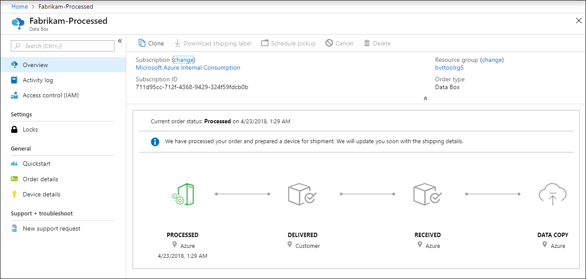

Microsoft then prepares and dispatches your device via a regional carrier. You receive a tracking number once the device is shipped. The portal shows the order in **Dispatched** state.

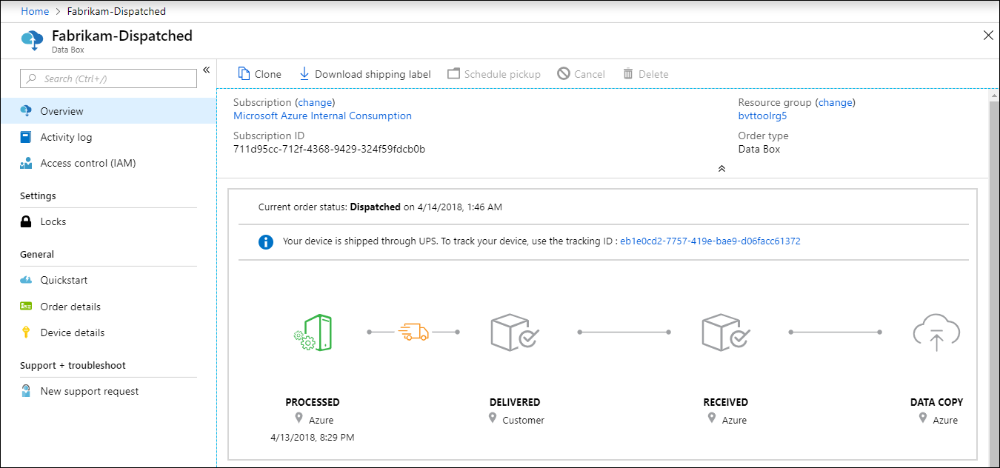

# [Azure CLI](#tab/azure-cli)

### Track a single order

To get tracking information about a single, existing Azure Data Box order, run [`az databox job show`](/cli/azure/databox/job#az_databox_job_show). The command displays information about the order such as, but not limited to: name, resource group, tracking information, subscription ID, contact information, shipment type, and device sku.

   ```azurecli
   az databox job show --resource-group <resource-group> --name <order-name>
   ```

   The following table shows the parameter information for `az databox job show`:

   | Parameter | Description |  Sample value |
   |---|---|---|
   |resource-group [Required]| The name of the resource group associated with the order. A resource group is a logical container for the resources that can be managed or deployed together. | "myresourcegroup"|
   |name [Required]| The name of the order to be displayed. | "mydataboxorder"|
   |debug| Include debugging information to verbose logging | --debug |
   |help| Display help information for this command. | --help -h |
   |only-show-errors| Only show errors, suppressing warnings. | --only-show-errors |
   |output -o| Sets the output format.  Allowed values: json, jsonc, none, table, tsv, yaml, yamlc. The default value is json. | --output "json" |
   |query| The JMESPath query string. For more information, see [JMESPath](http://jmespath.org/). | --query <string>|
   |verbose| Include verbose logging. | --verbose |

   Here is an example of the command with output format set to "table":

   ```azurecli
    PS C:\WINDOWS\system32> az databox job show --resource-group "myresourcegroup" \
                                                --name "mydataboxtest4" \
                                                --output "table"
   ```

   Here is the output from running the command:

   ```output
    Command group 'databox job' is experimental and not covered by customer support. Please use with discretion.
    DeliveryType    IsCancellable    IsCancellableWithoutFee    IsDeletable    IsShippingAddressEditable    Location    Name            ResourceGroup    StartTime                         Status
    --------------  ---------------  -------------------------  -------------  ---------------------------  ----------  --------------  ---------------  --------------------------------  -------------
    NonScheduled    True             True                       False          True                         westus      mydataboxtest4  myresourcegroup  2020-06-18T03:48:00.905893+00:00  DeviceOrdered
   ```

> [!NOTE]
> List order can be supported at subscription level and that makes resource group an optional parameter (rather than a required parameter).

### List all orders

If you have ordered multiple devices, you can run [`az databox job list`](/cli/azure/databox/job#az_databox_job_list) to view all your Azure Data Box orders. The command lists all orders that belong to a specific resource group. Also displayed in the output: order name, shipping status, Azure region, delivery type, order status. Canceled orders are also included in the list.
The command also displays time stamps of each order.

```azurecli
az databox job list --resource-group <resource-group>
```

The following table shows the parameter information for `az databox job list`:

   | Parameter | Description |  Sample value |
   |---|---|---|
   |resource-group [Required]| The name of the resource group that contains the orders. A resource group is a logical container for the resources that can be managed or deployed together. | "myresourcegroup"|
   |debug| Include debugging information to verbose logging | --debug |
   |help| Display help information for this command. | --help -h |
   |only-show-errors| Only show errors, suppressing warnings. | --only-show-errors |
   |output -o| Sets the output format.  Allowed values: json, jsonc, none, table, tsv, yaml, yamlc. The default value is json. | --output "json" |
   |query| The JMESPath query string. For more information, see [JMESPath](http://jmespath.org/). | --query <string>|
   |verbose| Include verbose logging. | --verbose |

   Here is an example of the command with output format set to "table":

   ```azurecli
    PS C:\WINDOWS\system32> az databox job list --resource-group "GDPTest" --output "table"
   ```

   Here is the output from running the command:

   ```output
   Command group 'databox job' is experimental and not covered by customer support. Please use with discretion.
   CancellationReason                                               DeliveryType    IsCancellable    IsCancellableWithoutFee    IsDeletable    IsShippingAddressEditable    Location    Name                 ResourceGroup    StartTime                         Status
   ---------------------- ----------------------------------------  --------------  ---------------  -------------------------  -------------  ---------------------------  ----------  -------------------  ---------------  --------------------------------  -------------
   OtherReason This was a test order for documentation purposes.    NonScheduled    False            False                      True           False                        westus      gdpImportTest        MyResGrp         2020-05-26T23:20:57.464075+00:00  Cancelled
   NoLongerNeeded This order was created for documentation purposes.NonScheduled    False            False                      True           False                        westus      mydataboxExportTest  MyResGrp         2020-05-27T00:04:16.640397+00:00  Cancelled
   IncorrectOrder                                                   NonScheduled    False            False                      True           False                        westus      mydataboxtest2       MyResGrp         2020-06-10T16:54:23.509181+00:00  Cancelled
                                                                    NonScheduled    True             True                       False          True                         westus      mydataboxtest3       MyResGrp         2020-06-11T22:05:49.436622+00:00  DeviceOrdered
                                                                    NonScheduled    True             True                       False          True                         westus      mydataboxtest4       MyResGrp         2020-06-18T03:48:00.905893+00:00  DeviceOrdered
   PS C:\WINDOWS\system32>
   ```

# [PowerShell](#tab/azure-ps)

### Track a single order

To get tracking information about a single, existing Azure Data Box order, run [Get-AzDataBoxJob](/powershell/module/az.databox/Get-AzDataBoxJob). The command displays information about the order such as, but not limited to: name, resource group, tracking information, subscription ID, contact information, shipment type, and device sku.

> [!NOTE]
> `Get-AzDataBoxJob` is used for displaying both single and multiple orders. The difference is that you specify the order name for single orders.

   ```azurepowershell
    Get-AzDataBoxJob -ResourceGroupName <String> -Name <String>
   ```

   The following table shows the parameter information for `Get-AzDataBoxJob`:

   | Parameter | Description |  Sample value |
   |---|---|---|
   |ResourceGroup [Required]| The name of the resource group associated with the order. A resource group is a logical container for the resources that can be managed or deployed together. | "myresourcegroup"|
   |Name [Required]| The name of the order to get information for. | "mydataboxorder"|
   |ResourceId| The ID of the resource associated with the order. |  |

   Here is an example of the command with output:

   ```azurepowershell
    PS C:\WINDOWS\system32> Get-AzDataBoxJob -ResourceGroupName "myResourceGroup" -Name "myDataBoxOrderPSTest"
   ```

   Here is the output from running the command:

   ```output
   jobResource.Name     jobResource.Sku.Name jobResource.Status jobResource.StartTime jobResource.Location ResourceGroup
   ----------------     -------------------- ------------------ --------------------- -------------------- -------------
   myDataBoxOrderPSTest DataBox              DeviceOrdered      7/7/2020 12:37:16 AM  WestUS               myResourceGroup
   ```

### List all orders

If you have ordered multiple devices, you can run [`Get-AzDataBoxJob`](/powershell/module/az.databox/Get-AzDataBoxJob) to view all your Azure Data Box orders. The command lists all orders that belong to a specific resource group. Also displayed in the output: order name, shipping status, Azure region, delivery type, order status. Canceled orders are also included in the list.
The command also displays time stamps of each order.

```azurepowershell
Get-AzDataBoxJob -ResourceGroupName <String>
```

Here is an example of the command:

```azurepowershell
PS C:\WINDOWS\system32> Get-AzDataBoxJob -ResourceGroupName "myResourceGroup"
```

Here is the output from running the command:

```output
jobResource.Name     jobResource.Sku.Name jobResource.Status jobResource.StartTime jobResource.Location ResourceGroup
----------------     -------------------- ------------------ --------------------- -------------------- -------------
guspImportTest       DataBox              Cancelled          5/26/2020 11:20:57 PM WestUS               myResourceGroup
mydataboxExportTest  DataBox              Cancelled          5/27/2020 12:04:16 AM WestUS               myResourceGroup
mydataboximport1     DataBox              Cancelled          6/26/2020 11:00:34 PM WestUS               myResourceGroup
myDataBoxOrderPSTest DataBox              Cancelled          7/07/2020 12:37:16 AM WestUS               myResourceGroup
mydataboxtest2       DataBox              Cancelled          6/10/2020 4:54:23  PM WestUS               myResourceGroup
mydataboxtest4       DataBox              DeviceOrdered      6/18/2020 3:48:00  AM WestUS               myResourceGroup
PS C:\WINDOWS\system32>
```

---

## Cancel the order

# [Portal](#tab/portal)

To cancel this order, in the Azure portal, go to **Overview** and select **Cancel** from the command bar.

After placing an order, you can cancel it at any point before the order status is marked processed.

To delete a canceled order, go to **Overview** and select **Delete** from the command bar.

# [Azure CLI](#tab/azure-cli)

### Cancel an order

To cancel an Azure Data Box order, run [`az databox job cancel`](/cli/azure/databox/job#az_databox_job_cancel). You are required to specify your reason for canceling the order.

   ```azurecli
   az databox job cancel --resource-group <resource-group> --name <order-name> --reason <cancel-description>
   ```

   The following table shows the parameter information for `az databox job cancel`:

   | Parameter | Description |  Sample value |
   |---|---|---|
   |resource-group [Required]| The name of the resource group associated with the order to be deleted. A resource group is a logical container for the resources that can be managed or deployed together. | "myresourcegroup"|
   |name [Required]| The name of the order to be deleted. | "mydataboxorder"|
   |reason [Required]| The reason for canceling the order. | "I entered erroneous information and needed to cancel the order." |
   |yes| Do not prompt for confirmation. | --yes (-y)| 
   |debug| Include debugging information to verbose logging | --debug |
   |help| Display help information for this command. | --help -h |
   |only-show-errors| Only show errors, suppressing warnings. | --only-show-errors |
   |output -o| Sets the output format.  Allowed values: json, jsonc, none, table, tsv, yaml, yamlc. The default value is json. | --output "json" |
   |query| The JMESPath query string. For more information, see [JMESPath](http://jmespath.org/). | --query <string>|
   |verbose| Include verbose logging. | --verbose |

   Here is an example of the command with output:

   ```azurecli
   PS C:\Windows> az databox job cancel --resource-group "myresourcegroup" --name "mydataboxtest3" --reason "Our budget was slashed due to **redacted** and we can no longer afford this device."
   ```

   Here is the output from running the command:

   ```output
   Command group 'databox job' is experimental and not covered by customer support. Please use with discretion.
   Are you sure you want to perform this operation? (y/n): y
   PS C:\Windows>
   ```

### Delete an order

If you have canceled an Azure Data Box order, you can run [`az databox job delete`](/cli/azure/databox/job#az_databox_job_delete) to delete the order.

   ```azurecli
   az databox job delete --name [-n] <order-name> --resource-group <resource-group> [--yes] [--verbose]
   ```

   The following table shows the parameter information for `az databox job delete`:

   | Parameter | Description |  Sample value |
   |---|---|---|
   |resource-group [Required]| The name of the resource group associated with the order to be deleted. A resource group is a logical container for the resources that can be managed or deployed together. | "myresourcegroup"|
   |name [Required]| The name of the order to be deleted. | "mydataboxorder"|
   |subscription| The name or ID (GUID) of your Azure subscription. | "xxxxxxxx-xxxx-xxxx-xxxx-xxxxxxxxxxxx" |
   |yes| Do not prompt for confirmation. | --yes (-y)|
   |debug| Include debugging information to verbose logging | --debug |
   |help| Display help information for this command. | --help -h |
   |only-show-errors| Only show errors, suppressing warnings. | --only-show-errors |
   |output -o| Sets the output format.  Allowed values: json, jsonc, none, table, tsv, yaml, yamlc. The default value is json. | --output "json" |
   |query| The JMESPath query string. For more information, see [JMESPath](http://jmespath.org/). | --query <string>|
   |verbose| Include verbose logging. | --verbose |

Here is an example of the command with output:

   ```azurecli
   PS C:\Windows> az databox job delete --resource-group "myresourcegroup" --name "mydataboxtest3" --yes --verbose
   ```

   Here is the output from running the command:

   ```output
   Command group 'databox job' is experimental and not covered by customer support. Please use with discretion.
   command ran in 1.142 seconds.
   PS C:\Windows>
   ```

# [PowerShell](#tab/azure-ps)

### Cancel an order

To cancel an Azure Data Box order, run [Stop-AzDataBoxJob](/powershell/module/az.databox/stop-azdataboxjob). You are required to specify your reason for canceling the order.

```azurepowershell
Stop-AzDataBoxJob -ResourceGroup <String> -Name <String> -Reason <String>
```

The following table shows the parameter information for `Stop-AzDataBoxJob`:

| Parameter | Description |  Sample value |
|---|---|---|
|ResourceGroup [Required]| The name of the resource group associated with the order to be canceled. A resource group is a logical container for the resources that can be managed or deployed together. | "myresourcegroup"|
|Name [Required]| The name of the order to be deleted. | "mydataboxorder"|
|Reason [Required]| The reason for canceling the order. | "I entered erroneous information and needed to cancel the order." |
|Force | Forces the cmdlet to run without user confirmation. | -Force |

Here is an example of the command with output:

```azurepowershell
PS C:\PowerShell\Modules> Stop-AzDataBoxJob -ResourceGroupName myResourceGroup \
                                            -Name "myDataBoxOrderPSTest" \
                                            -Reason "I entered erroneous information and had to cancel."
```

Here is the output from running the command:

```output
Confirm
"Cancelling Databox Job "myDataBoxOrderPSTest
[Y] Yes  [N] No  [S] Suspend  [?] Help (default is "Y"): y
PS C:\WINDOWS\system32>
```

### Delete an order

If you have canceled an Azure Data Box order, you can run [`Remove-AzDataBoxJob`](/powershell/module/az.databox/remove-azdataboxjob) to delete the order.

```azurepowershell
Remove-AzDataBoxJob -Name <String> -ResourceGroup <String>
```

The following table shows the parameter information for `Remove-AzDataBoxJob`:

| Parameter | Description |  Sample value |
|---|---|---|
|ResourceGroup [Required]| The name of the resource group associated with the order to be deleted. A resource group is a logical container for the resources that can be managed or deployed together. | "myresourcegroup"|
|Name [Required]| The name of the order to be deleted. | "mydataboxorder"|
|Force | Forces the cmdlet to run without user confirmation. | -Force |

Here is an example of the command with output:

```azurepowershell
PS C:\Windows> Remove-AzDataBoxJob -ResourceGroup "myresourcegroup" \
                                   -Name "mydataboxtest3"
```

Here is the output from running the command:

```output
Confirm
"Removing Databox Job "mydataboxtest3
[Y] Yes  [N] No  [S] Suspend  [?] Help (default is "Y"): y
PS C:\Windows>
```

---

## Next steps

In this tutorial, you learned about Azure Data Box articles such as:

> [!div class="checklist"]
>
> * Prerequisites to deploy Data Box
> * Order Data Box
> * Track the order
> * Cancel the order

Advance to the next tutorial to learn how to set up your Data Box.

> [!div class="nextstepaction"]
> [Set up your Azure Data Box](./data-box-deploy-set-up.md)
