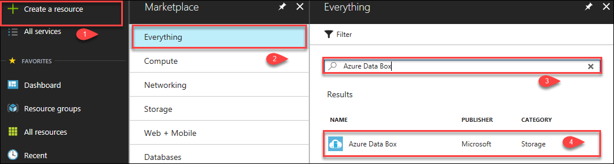
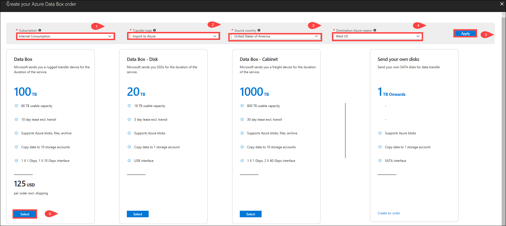
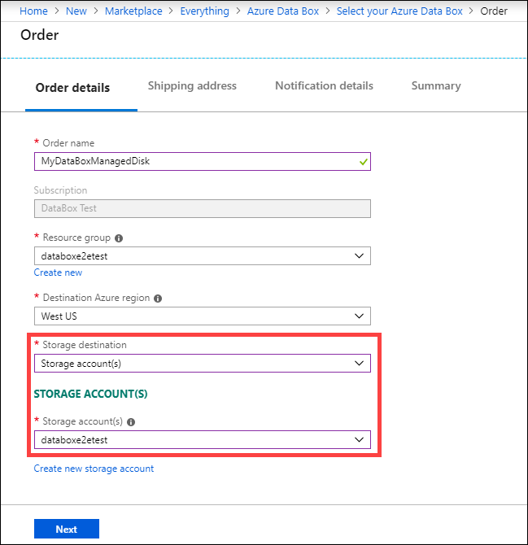
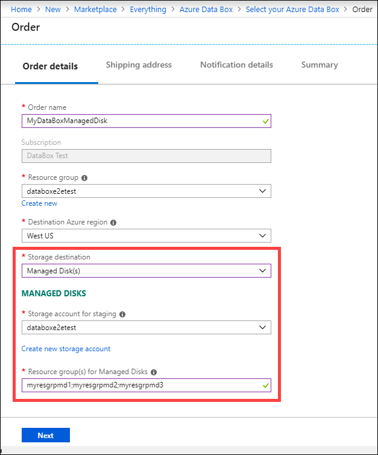

# Tutorial: Order Azure Data Box

Azure Data Box is a hybrid solution that allows you to import your on-premises data into Azure in a quick, easy, and reliable way. You transfer your data to a Microsoft-supplied 80 TB (usable capacity) storage device and then ship the device back. This data is then uploaded to Azure.

This tutorial describes how you can order an Azure Data Box. In this tutorial, you learn about:

> [!div class="checklist"]
> * Prerequisites to deploy Data Box
> * Order a Data Box
> * Track the order
> * Cancel the order

## Prerequisites

Complete the following configuration prerequisites for Data Box service and device before you deploy the device.

### For service

Before you begin, make sure that:
- You have your Microsoft Azure storage account with access credentials.
- Make sure that the subscription you use for Data Box service is one of the following types:
    - Microsoft Enterprise Agreement (EA). Read more about [EA subscriptions](https://azure.microsoft.com/pricing/enterprise-agreement/).
    - Cloud Solution Provider (CSP). Learn more about [Azure CSP program](https://docs.microsoft.com/azure/cloud-solution-provider/overview/azure-csp-overview).
    - Microsoft Azure Sponsorship. Learn more about [Azure sponsorship program](https://azure.microsoft.com/offers/ms-azr-0036p/).

- Ensure that you have owner or contributor access to the subscription to create a Data Box order.

### For device

Before you begin, make sure that:
- You should have a host computer connected to the datacenter network. Data Box will copy the data from this computer. Your host computer must run a supported operating system as described in [Azure Data Box system requirements](data-box-system-requirements.md).
- Your datacenter needs to have high-speed network. We strongly recommend that you have at least one 10 GbE connection. If a 10 GbE connection is not available, a 1 GbE data link can be used but the copy speeds are impacted.

## Order Data Box

Perform the following steps in the Azure portal to order a device.

1. Use your Microsoft Azure credentials to sign in at this URL: [https://portal.azure.com](https://portal.azure.com).
2. Click **+ Create a resource** and search for *Azure Data Box*. Click **Azure Data Box**.
    
   

3. Click **Create**.

4. Check if Data Box service is available in your region. Enter or select the following information and click **Apply**. 

    |Setting  |Value  |
    |---------|---------|
    |Subscription     | Select an EA, CSP, or Azure sponsorship subscription for Data Box service.   The subscription is linked to your billing account.       |
    |Transfer type     | Select **Import to Azure**.        |
    |Source country     |	Select the country/region where your data currently resides.         |
    |Destination Azure region     | 	Select the Azure region where you want to transfer data.        |

5. Select Data **Box**. The maximum usable capacity for a single order is 80 TB. You can create multiple orders for larger data sizes.

      

6. In **Order**, specify the **Order details**. Enter or select the following information and click **Next**.
    
    |Setting  |Value  |
    |---------|---------|
    |Name     |  Provide a friendly name to track the order.   The name can have between 3 and 24 characters that can be letters, numbers, and hyphens.   The name must start and end with a letter or a number.      |
    |Resource group     |	Use an existing or create a new one.   A resource group is a logical container for the resources that can be managed or deployed together.         |
    |Destination Azure region     | Select a region for your storage account.   For more information, go to [region availability](data-box-overview.md#region-availability).        |
    |Storage destination     | Choose from storage account or managed disks or both.   Based on the specified Azure region, select one or more storage accounts from the filtered list of an existing storage account. Data Box can be linked with up to 10 storage accounts.   You can also create a new **General-purpose v1**, **General-purpose v2**, or **Blob storage account**.  Storage accounts with virtual networks are supported. To allow Data Box service to work with secured storage accounts, enable the trusted services within the storage account network firewall settings. For more information, see how to [Add Azure Data Box as a trusted service](../storage/common/storage-network-security.md#exceptions).|

    If using storage account as the storage destination, you see the following screenshot:

    

    If using Data Box to create managed disks from the on-premises VHDs, you will also need to provide the following information:

    |Setting  |Value  |
    |---------|---------|
    |Resource groups     | Create new resource groups if you intend to create managed disks from on-premises VHDs. You can use an existing resource group only if the resource group was created previously when creating a Data Box order for managed disk by Data Box service.   Specify multiple resource groups separated by semi-colons. A maximum of 10 resource groups are supported.|

    

    The storage account specified for managed disks is used as a staging storage account. The Data Box service uploads the VHDs as page blobs to the staging storage account before converting it into managed disks and moving it to the resource groups. For more information, see [Verify data upload to Azure](data-box-deploy-picked-up.md#verify-data-upload-to-azure).

7. In the **Shipping address**, provide your first and last name, name and postal address of the company, and a valid phone number. Click **Validate address**. The service validates the shipping address for service availability. If the service is available for the specified shipping address, you receive a notification to that effect. Click **Next**.

8. In the **Notification details**, specify email addresses. The service sends email notifications regarding any updates to the order status to the specified email addresses.

    We recommend that you use a group email so that you continue to receive notifications if an admin in the group leaves.

9. Review the information **Summary** related to the order, contact, notification, and privacy terms. Check the box corresponding to the agreement to privacy terms.

10. Click **Order**. The order takes a few minutes to be created.

## Track the order

After you have placed the order, you can track the status of the order from Azure portal. Go to your Data Box order and then go to **Overview** to view the status. The portal shows the order in **Ordered** state.

If the device is not available, you receive a notification. If the device is available, Microsoft identifies the device for shipment and prepares the shipment. During device preparation, following actions occur:

- SMB shares are created for each storage account associated with the device.
- For each share, access credentials such as username and password are generated.
- Device password that helps unlock the device is also generated.
- The Data Box is locked to prevent unauthorized access to the device at any point.

When the device preparation is complete, the portal shows the order in **Processed** state.

Microsoft then prepares and dispatches your device via a regional carrier. You receive a tracking number once the device is shipped. The portal shows the order in **Dispatched** state.

## Cancel the order

To cancel this order, in the Azure portal, go to **Overview** and click **Cancel** from the command bar.

After placing an order, you can cancel it at any point before the order status is marked processed.
 
To delete a canceled order, go to **Overview** and click **Delete** from the command bar.

## Next steps

In this tutorial, you learned about Azure Data Box topics such as:

> [!div class="checklist"]
> * Prerequisites to deploy Data Box
> * Order Data Box
> * Track the order
> * Cancel the order

Advance to the next tutorial to learn how to set up your Data Box.

> [!div class="nextstepaction"]
> [Set up your Azure Data Box](./data-box-deploy-set-up.md)

