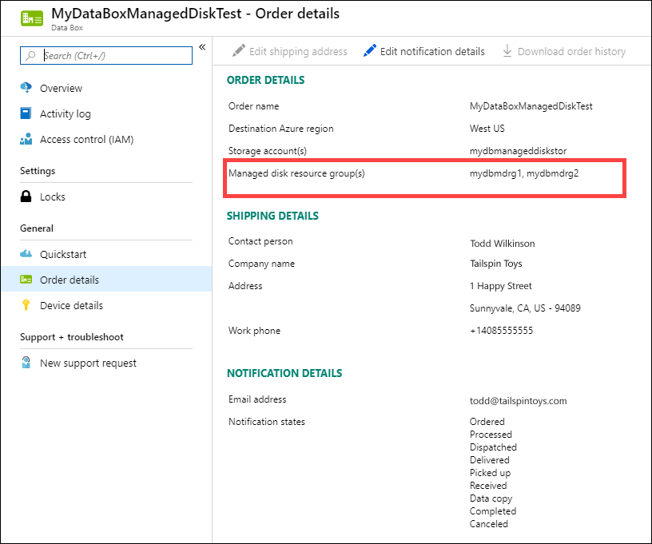

# Tutorial: Return Azure Data Box and verify data upload to Azure

This tutorial describes how to return Azure Data Box and verify the data uploaded to Azure.

In this tutorial, you will learn about topics such as:

> [!div class="checklist"]
> * Prerequisites
> * Prepare to ship
> * Ship Data Box to Microsoft
> * Verify data upload to Azure
> * Erasure of data from Data Box

## Prerequisites

Before you begin, make sure:

- You've have completed the [Tutorial: Copy data to Azure Data Box and verify](data-box-deploy-copy-data.md). 
- Copy jobs are complete. Prepare to ship can't run if copy jobs are in progress.

## Prepare to ship

[!INCLUDE [data-box-prepare-to-ship](../../includes/data-box-prepare-to-ship.md)]

## Ship Data Box back

1. Ensure that the device is powered off and cables are removed. Spool and securely place the power cord that was provided with device in the back of the device.
2. Ensure that the shipping label is displayed on the E-ink display and schedule a pickup with your carrier. If the label is damaged or lost or not displayed on the E-ink display, contact Microsoft Support. If the Support suggests, then you can go to **Overview > Download shipping label** in the Azure portal. Download the shipping label and affix on the device. 
3. Schedule a pickup with UPS if returning the device. To schedule a pickup:

    - Call the local UPS (country-specific toll free number).
    - In your call, quote the reverse shipment tracking number as shown in the E-ink display or your printed label.
    - If the tracking number is not quoted, UPS will require you to pay an additional charge during pickup.

    Instead of scheduling the pickup, you can also drop off the Data Box at the nearest drop-off location.
4. Once the Data Box is picked up and scanned by your carrier, the order status in the portal updates to **Picked up**. A tracking ID is also displayed.

## Verify data upload to Azure

When Microsoft receives and scans the device, order status is updated to **Received**. The device then undergoes physical verification for damage or signs of tampering.

After the verification is complete, the Data Box is connected to the network in the Azure datacenter. The data copy starts automatically. Depending upon the data size, the copy operation may take a few hours to days to complete. You can monitor the copy job progress in the portal.

Once the copy is complete, order status updates to **Completed**.

Verify that your data is uploaded to Azure before you delete it from the source. Your data can be in:

- Your Azure Storage account(s). When you copy the data to Data Box, depending on the type, the data is uploaded to one of the following paths in your Azure Storage account.

  - For block blobs and page blobs: `https://<storage_account_name>.blob.core.windows.net/<containername>/files/a.txt`
  - For Azure Files: `https://<storage_account_name>.file.core.windows.net/<sharename>/files/a.txt`

    Alternatively, you could go to your Azure storage account in Azure portal and navigate from there.

- Your managed disk resource group(s). When creating managed disks, the VHDs are uploaded as page blobs and then converted to managed disks. The managed disks are attached to the resource groups specified at the time of order creation. 

    - If your copy to managed disks in Azure was successful, you can go to the **Order details** in the Azure portal and make a note of the resource groups specified for managed disks.

        

        Go to the noted resource group and locate your managed disks.

        

    - If you copied a VHDX, or a dynamic/differencing VHD, then the VHDX/VHD is uploaded to the staging storage account as a page blob but the conversion of VHD to managed disk fails. Go to your staging **Storage account > Blobs** and then select the appropriate container - Standard SSD, Standard HDD, or Premium SSD. The VHDs are uploaded as page blobs in your staging storage account.

## Erasure of data from Data Box
 
Once the upload to Azure is complete, the Data Box erases the data on its disks as per the [NIST SP 800-88 Revision 1 guidelines](https://csrc.nist.gov/News/2014/Released-SP-800-88-Revision-1,-Guidelines-for-Medi).

## Next steps

In this tutorial, you learned about Azure Data Box topics such as:

> [!div class="checklist"]
> * Prerequisites
> * Prepare to ship
> * Ship Data Box to Microsoft
> * Verify data upload to Azure
> * Erasure of data from Data Box

Advance to the following article to learn how to manage Data Box via the local web UI.

> [!div class="nextstepaction"]
> [Use local web UI to administer Azure Data Box](./data-box-local-web-ui-admin.md)

