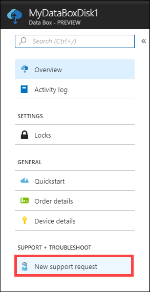
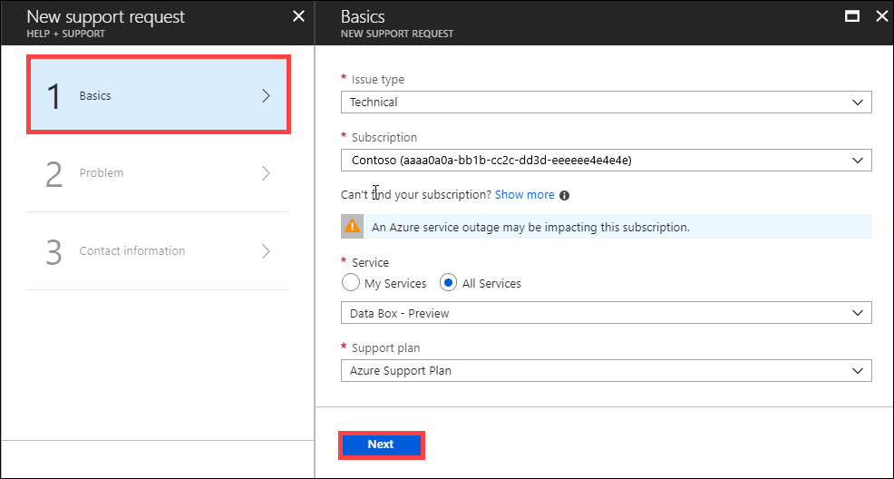
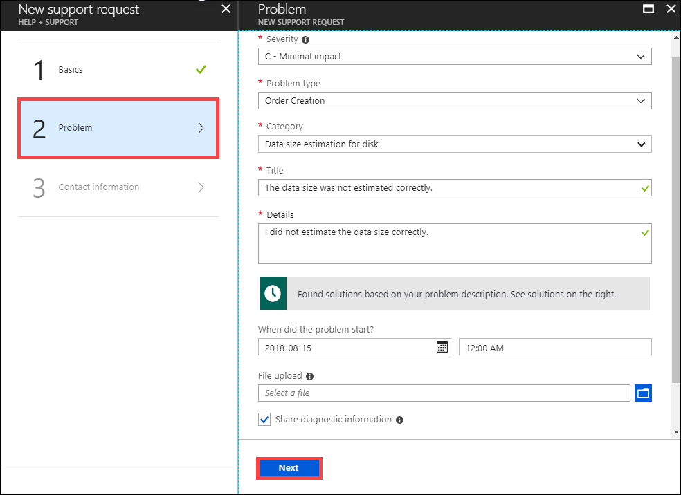
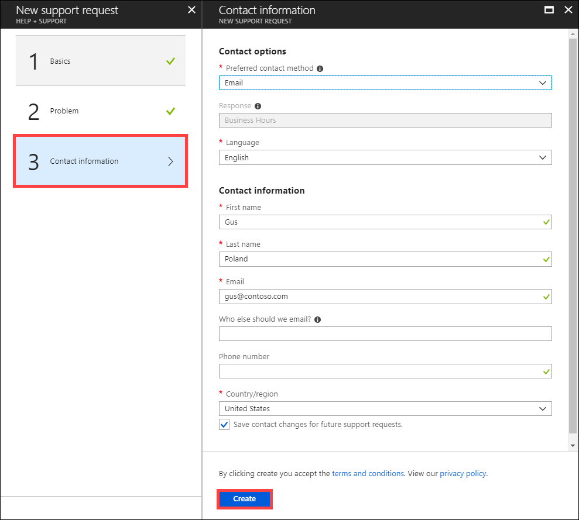
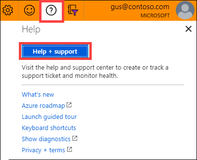
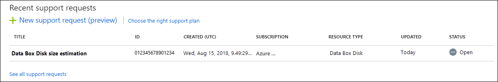

# Open a support ticket for Azure Data Box

This article applies to Azure Data Box, Azure Data Box Heavy, and Azure Data Box Disk, all of which are managed by the Azure Data Box service. If you encounter any issues with your Azure Data Box service, you can create a service request for technical support. This article walks you through:

* How to create a support request.
* How to manage a support request lifecycle from within the portal.

## Create a support request

Perform the following steps to create a support request:

1. Go to your Data Box or Data Box Disk order. Navigate to **SUPPORT + TROUBLESHOOTING** section and then click **New support request**.

    

2. In **New support request**, select **Basics**. In **Basics**, do the following steps:

    1. From the **Issue type** dropdown list, select **Technical**.
    2. Choose your **Subscription**.
    3. Under **Service**, check **All Services**. From the dropdown list, select **Data Box**. 
    4. Specify your **Support plan**.
    5. Click **Next**.

        

3. In **New support request**, select **Step 2 Problem**. In **Problem**, do the following steps:

    1. Choose the **Severity** as **C - Minimal impact**. Support will update it if needed.
    2. Select the **Problem type** from the dropdown list.
    3. Based on the problem type you selected, choose a corresponding **Category**.
    4. Provide a **Title** for the issue and more **Details**.
    5. Provide the start date and time for the problem.
    6. In the **File upload**, click the folder icon to browse any other files you want to upload.
    7. Check **Share diagnostic information**.
    8. Click **Next**.

       

4. In **New support request**, click **Step 3 Contact information**. In **Contact information**, do the following steps:

   1. In the **Contact options**, provide your preferred contact method (phone or email) and the language. The response time is automatically selected based on your subscription plan.
   2. In the **Contact information**, provide your name, email, optional contact, country/region. Select **Save contact changes for future support requests**.
   3. Click **Create**.

          

      Microsoft Support uses this information to reach out to you for further information, diagnosis, and resolution.
      After you have submitted your request, a Support engineer will contact you as soon as possible to proceed with your request.

## Manage a support request

After creating a support ticket, you can manage the lifecycle of the ticket from within the portal.

#### To manage your support requests

1. To get to the help and support page, navigate to **Browse > Help + support**.

    

2. A tabular listing of **Recent support requests** is displayed in **Help + support**.

    

3. Select and click a support request. You can view the status and the details for this request. Click **+ New message** if you want to follow up on this request.

## Next steps

Learn how to [Troubleshoot issues related to Data Box Disk](data-box-disk-troubleshoot.md).

Learn how to [Troubleshoot issues related to a Data Box](data-box-troubleshoot.md).

Learn how to [Review copy errors in an upload from a Data Box or Data Box Disk device](data-box-troubleshoot-data-upload.md).

Learn how to [Troubleshoot issues related to Data Box Blob storage](data-box-troubleshoot-rest.md).
