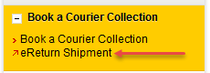
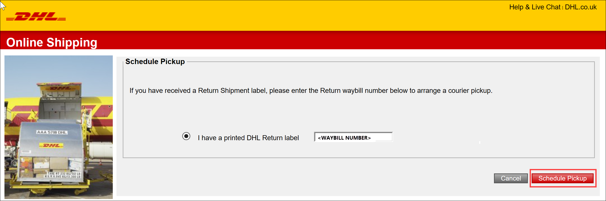
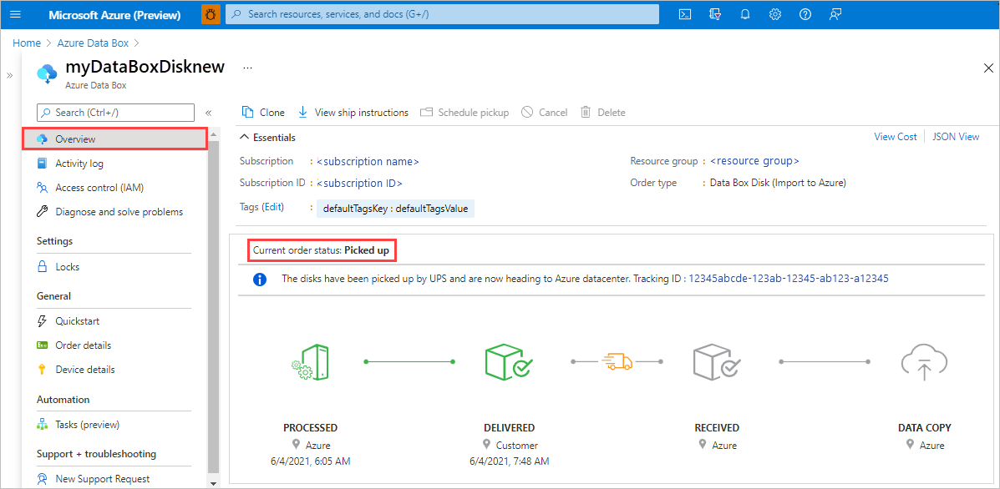
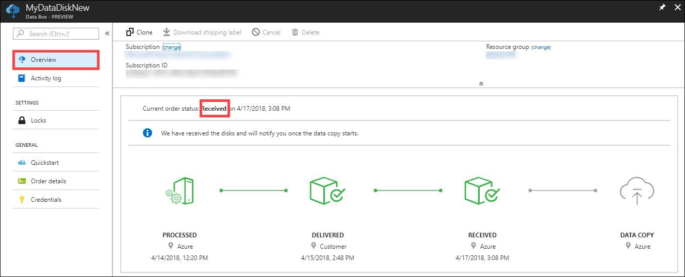
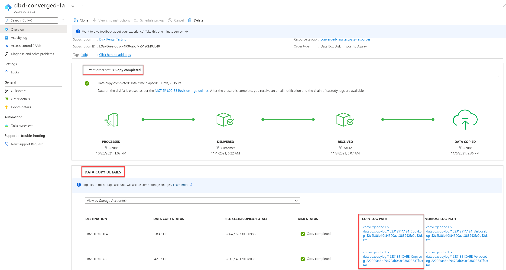
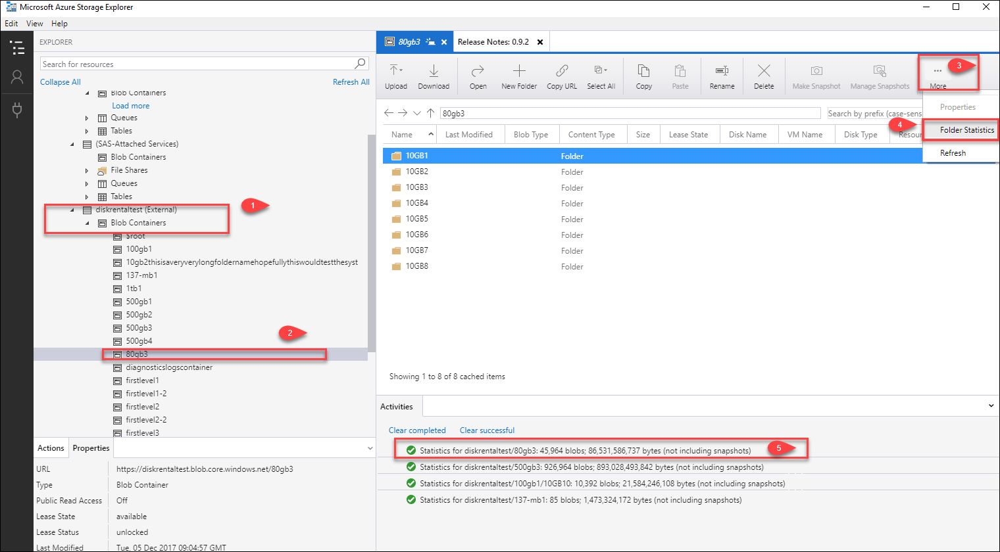

# Tutorial: Return Azure Data Box Disk and verify data upload to Azure

This is the last tutorial of the series: Deploy Azure Data Box Disk. In this tutorial, you will learn how to:

> [!div class="checklist"]
> * Ship Data Box Disk to Microsoft
> * Verify data upload to Azure
> * Erasure of data from Data Box Disk

## Prerequisites

Before you begin, make sure that you have completed the [Tutorial: Copy data to Azure Data Box Disk and verify](data-box-disk-deploy-copy-data.md).

## Ship Data Box Disk back

1. Once the data validation is complete, unplug the disks. Remove the connecting cables.
2. Wrap all the disks and the connecting cables with a bubble wrap and place those into the shipping box.
3. Use the return shipping label in the clear plastic sleeve affixed to the box. If the label is damaged or lost, download a new shipping label from the Azure portal and affix on the device. Go to **Overview > Download shipping label**. 

    

    This action downloads a return shipping label as shown below.

    

4. Seal the shipping box and ensure that the return shipping label is visible.
5. Schedule a pickup with UPS if returning the device in US. If you are returning the device in Europe with DHL, request for pickup from DHL by visiting their website and specifying the airway bill number. Go to the country DHL Express website and choose **Book a Courier Collection > eReturn Shipment**.

    
    
    Specify the waybill number and click **Schedule Pickup** to arrange for pickup.

      

7. Once the disks are picked up by your carrier, the order status in the portal updates to **Picked up**. A tracking ID is also displayed.

    

## Verify data upload to Azure

When Microsoft receives and scans the disk, job status is updated to **Received**. 

The data automatically gets copied once the disks are connected to a server in the Azure datacenter. Depending upon the data size, the copy operation may take a few hours to days to complete. You can monitor the copy job progress in the portal.

Once the copy is complete, order status updates to **Completed**.

Verify that your data is in the storage account(s) before you delete it from the source. To verify that the data has uploaded into Azure, perform the following steps:

1. Go to the storage account associated with your disk order.
2. Go to **Blob service > Browse blobs**. The list of containers is presented. Corresponding to the subfolder that you created under *BlockBlob* and *PageBlob* folders, containers with the same name are created in your storage account.
    If the folder names do not conform to Azure naming conventions, then the data upload to Azure will fail.

4. To verify that the entire dataset has loaded, use Microsoft Azure Storage Explorer. Attach the storage account corresponding to the disk rental order and then look at the list of blob containers. Select a container, click **…More** and then click **Folder statistics**. In the **Activities** pane, the statistics for that folder including the number of blobs and the total blob size is displayed. The total blob size in bytes should match the size of the dataset.

    

## Erasure of data from Data Box Disk

Once the copy is complete and you have verified that data is in the Azure storage account, disks are securely erased as per the NIST standard. 

## Next steps

In this tutorial, you learned about Azure Data Box Disk topics such as:

> [!div class="checklist"]
> * Ship Data Box Disk to Microsoft
> * Verify data upload to Azure
> * Erasure of data from Data Box Disk

Advance to the next how-to to learn how to manage Data Box Disk via the Azure portal.

> [!div class="nextstepaction"]
> [Use Azure portal to administer Azure Data Box Disk](./data-box-portal-ui-admin.md)

