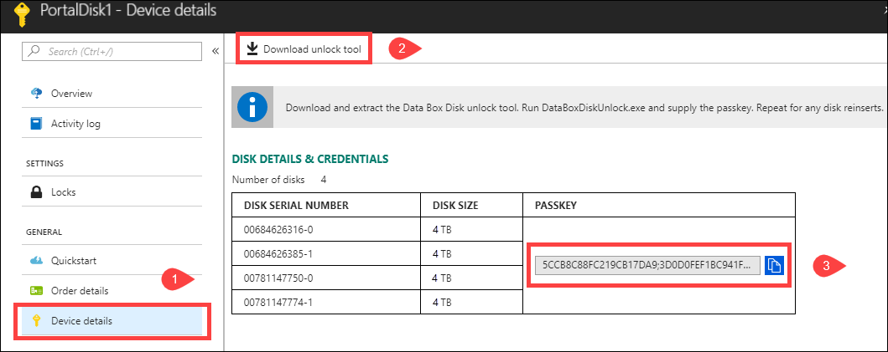

# Tutorial: Unpack, connect, and unlock Azure Data Box Disk

This tutorial describes how to unpack, connect, and unlock your Azure Data Box Disk.

In this tutorial, you learn how to:

> [!div class="checklist"]
> * Unpack your Data Box Disk
> * Connect and unlock Data Box Disk.

## Prerequisites

Before you begin, make sure that:

1. You have completed the [Tutorial: Order Azure Data Box Disk](data-box-disk-deploy-ordered.md).
2. You have received your disks and the job status in the portal is updated to **Delivered**.
3. You have a host computer on which you can install the Data Box Disk unlock tool. Your host computer must
    - Run a [Supported operating system](data-box-disk-system-requirements.md).
    - Have [Windows PowerShell 4 installed](https://www.microsoft.com/download/details.aspx?id=40855).
    - Have [.NET Framework 4.5.1 installed](https://www.microsoft.com/download/details.aspx?id=30653).
    - Have [BitLocker enabled](https://docs.microsoft.com/windows/security/information-protection/bitlocker/bitlocker-how-to-deploy-on-windows-server).
    - Have [Windows Management Framework 4 installed](https://www.microsoft.com/en-us/download/details.aspx?id=40855). 

## Unpack your disks

 Perform the following steps to unpack your disks.

1. The Data Box Disks are mailed in a small shipping Box. Open the box and remove its contents. Check that the box has 1 to 5 solid-state disks (SSDs) and a USB connecting cable per disk. Inspect the box for any evidence of tampering, or any other obvious damage. 

    

2. If the shipping box is tampered or severely damaged, do not open the box. Contact Microsoft Support to help you assess whether the disks are in good working order and if they need to ship you a replacement.
3. Verify that the box has a clear sleeve containing a shipping label (under the current label) for return shipment. If this label is lost or damaged, you can always download and print a new one from the Azure portal. 

    

4. Save the box and packaging foam for return shipment of the disks.

## Connect and unlock your disks

Perform the following steps to connect and unlock your disks.

1. Use the included cable to connect the disk to a Windows computer running a supported OS as stated in the prerequisites. 

        
    
2. In the Azure portal, go to **General > Device details**. 
3. Click **Download Data Box Disk unlock tool**. 

         

4. Extract the tool on the same computer that you will use to copy the data.
5. Open a Command Prompt window or run Windows PowerShell as administrator on the same computer.
6. (Optional) To verify the computer that you are using to unlock the disk meets the operating system requirements, run the system check command. A sample output is shown below. 

    ```powershell
    Windows PowerShell
    Copyright (C) Microsoft Corporation. All rights reserved.
    
    PS C:\DataBoxDiskUnlockTool\DiskUnlock> .\DataBoxDiskUnlock.exe /SystemCheck
    Successfully verified that the system can run the tool.
    PS C:\DataBoxDiskUnlockTool\DiskUnlock>
    ``` 

7. In the Azure portal, go to **General > Device details**. Use the copy icon to copy the passkey.
8. Run `DataBoxDiskUnlock.exe` and supply the passkey. The drive letter assigned to the disk is displayed. A sample output is shown below.

    ```powershell
    PS C:\WINDOWS\system32> cd C:\DataBoxDiskUnlockTool\DiskUnlock
    PS C:\DataBoxDiskUnlockTool\DiskUnlock> .\DataBoxDiskUnlock.exe
    Enter the passkeys (format: passkey1;passkey2;passkey3):
    testpasskey1
    
    Following volumes are unlocked and verified.
    Volume drive letters: D:
    
    PS C:\DataBoxDiskUnlockTool\DiskUnlock>
    ```

9. Repeat steps 6-8 for any future disk reinserts. Use the help command if you need help with the Data Box Disk unlock tool.   

    ```powershell
    PS C:\DataBoxDiskUnlockTool\DiskUnlock> .\DataBoxDiskUnlock.exe /help
    USAGE:
    DataBoxUnlock /PassKeys:<passkey_list_separated_by_semicolon>
    
    Example: DataBoxUnlock /PassKeys:<your passkey>
    Example: DataBoxUnlock /SystemCheck
    Example: DataBoxUnlock /Help
    
    /PassKeys:       Get this passkey from Azure DataBox Disk order. The passkey unlocks your disks.
    /SystemCheck:    This option checks if your system meets the requirements to run the tool.
    /Help:           This option provides help on cmdlet usage and examples.
    
    PS C:\DataBoxDiskUnlockTool\DiskUnlock>
    ```  
10. Once the disk is unlocked, you can view the contents of the disk.    

     

## Next steps

In this tutorial, you learned about Azure Data Box Disk topics such as:

> [!div class="checklist"]
> * Unpack your Data Box Disk
> * Connect and unlock Data Box Disks


Advance to the next tutorial to learn how to copy data on your Data Box Disk.

> [!div class="nextstepaction"]
> [Copy data on your Data Box Disk](./data-box-disk-deploy-copy-data.md)

