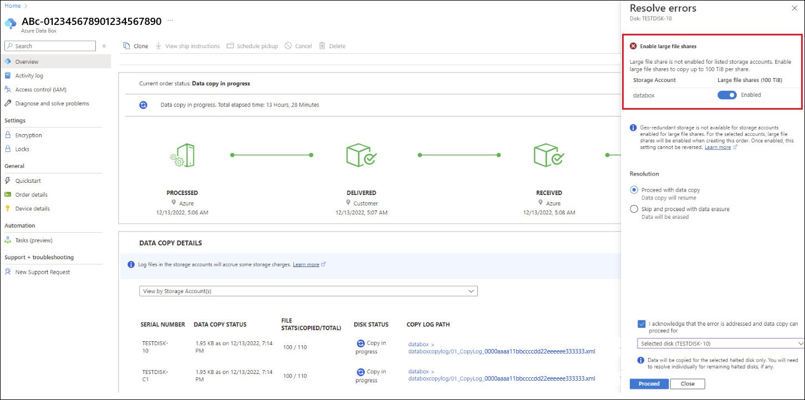

# Review copy errors in uploads from Azure Data Box Disk

This article describes review and follow-up for errors that occasionally prevent files from uploading to the Azure cloud from an Azure Data Box Disk device.

The error notification and options vary depending on whether you can fix the error in the current upload:

- **Retryable errors** - You can fix many types of copy error and resume the upload. The data is then successfully uploaded in your current order. 
    
    
    An example of a retryable error is when Large File Shares are not enabled for a storage account that requires shares with data more than 5 TiB. To resolve this, you will need to enable this setting and then confirm to resume data copy. This type of error is referred to as a *retryable error* in the discussion that follows.

- **Non-retryable errors** - These are errors that can't be fixed. For those errors, the upload pauses to give you a chance to review the errors. But the order completes without the data that failed to upload, and the data is secure erased from the device. You'll need to create a new order after you resolve the issues in your data. 

    An example of a non-retryable error is if a blob storage container is configured as Write Once, Read Many (WORM). Upload of any blobs that are already stored in the container will fail. This type of error is referred to as a *non-retryable error* in the discussion that follows.

## Upload errors notification

When a file upload fails because of an error, you'll receive a notification in the Azure portal. You can tell whether the error can be fixed by the status and options in the order overview.

**Retryable errors**: If you can fix the error in the current order, the notification looks similar to the following one. The current order status is **Data copy halted**. You can either choose to resolve the error or proceed with data erasure without making any change. If you select **Resolve error**, a **Resolve error** screen will tell you how to resolve each error. For step-by-step instructions, see [Review errors and proceed](#review-errors-and-proceed).

 
**Non-retryable errors:** If the error can't be fixed in the current order, the notification looks similar to the following one. The current order status is **Data copy halted for disks in this order. Provide your input by selecting Resolve in Data copy details**. The errors are listed in the data copy log, which you can open using the **Copy Log Path**. For guidance on resolving the errors, see [Summary of upload errors](#summary-of-upload-errors).

You can't fix these errors. The upload has completed with errors. The notification lets you know about any configuration issues you need to fix before you try another upload via network transfer or a new import order.

After you review the errors and confirm you're ready to proceed, the data is secure erased from the device. If you don't respond to the notification, the order is completed automatically after 14 days.

## Review errors and proceed

How you proceed with an upload depends on whether the errors can be fixed and the current upload resumed (see **Retryable errors** tab), or the errors can't be fixed in the current order (see the **Non-retryable errors** tab). 

# [Retryable errors](#tab/retryable-errors)

When a retryable error occurs during an upload, you receive a notification with instructions for fixing the error. If you can't fix the error, or prefer not to, you can proceed with the order without fixing the errors.

To resolve retryable copy errors during an upload, do these steps:

1. Open your order in the Azure portal.

   If any retryable copy errors prevented files from uploading, you'll see the following notification. The current order status will be **Data copy halted for disks in this order**.

   

1. Select **Resolve** to view help for the errors.

   

   Your screen will look similar to the one below. In the example, the **Enable large file share** error can be resolved by toggling **Not enabled** for each storage account.

   

   You can then select **Proceed with data copy** or **Skip and proceed with data erasure**. If you opt for **Proceed with data copy**, you can select if you want to address the error for **Selected disk** or **All disks**.
 
   

1. After you resolve the errors, select the check box by **I confirm that the errors have been resolved**. Then select **Proceed**.

   The order status changes to **Data copy error resolved**. The data copy will proceed within 24 hours.

   > [!NOTE]
   > If you don't resolve all of the retryable errors, this process will repeat after the data copy proceeds. To proceed without resolving any of the retryable errors, select **Skip and proceed with data erasure** on the **Overview** screen.

# [Non-retryable errors](#tab/non-retryable-errors)

The following errors can't be resolved in the current order. The order will be completed automatically after 14 days. By acting on the notification, you can move things along more quickly.

If the error can't be fixed in the current order, the notification looks similar to the following one. The current order status is **Data copy halted for disks in this order. Provide your input by selecting Resolve in Data copy details**. The errors are listed in the data copy log, which you can open using the **Copy Log Path**. For guidance on resolving the errors, see [Summary of upload errors](#summary-of-upload-errors).

---

## Summary of upload errors

Review the summary tables on the **Retryable errors** tab or the **Non-retryable errors** tab to find out how to resolve or follow up on data copy errors that occurred during your upload.

# [Retryable errors](#tab/retryable-errors)

When the following errors occur, you can resolve the errors and include the files in the current data upload.

|Error message  |Error description |Error resolution |
|---------------|------------------|-----------------|
|Large file share not enabled on account |Large file shares aren’t enabled on one or more storage accounts. Resolve the error and resume data copy, or skip to data erasure and complete the order. | Large file shares are not enabled on the indicated storage accounts. Select the option highlighted to enable quota up to 100 TiB per share.|
|Unknown user error |An error has halted the data copy. Contact Support for details on how to resolve the error. Alternatively, you may skip to data erasure and review copy and error logs for the order for the list of files that weren’t copied. |**Error during data copy** Data copy is halted due to an error. [Contact Support](data-box-disk-contact-microsoft-support.md) for details on how to resolve the error. After the error is resolved, confirm to resume data copy. |

For more information about the data copy log's contents, see [Use logs to troubleshoot upload issues in Azure Data Box Disk](data-box-disk-troubleshoot-upload.md).

Other REST API errors might occur during data uploads. For more information, see [Common REST API error codes](/rest/api/storageservices/common-rest-api-error-codes). 

# [Non-retryable errors](#tab/non-retryable-errors)

The following non-retryable errors result in a notification:

|Error category                    |Error code |Error message                                                                             |
|----------------------------------|-----------|------------------------------------------------------------------------------------------|
|UploadErrorCloudHttp              |400        |Bad Request (file name not valid) [Learn more](#bad-request-file-name-not-valid).|
|UploadErrorCloudHttp              |400        |The value for one of the HTTP headers is not in the correct format. [Learn more](#the-value-for-one-of-the-http-headers-is-not-in-the-correct-format).|
|UploadErrorCloudHttp              |409        |This operation is not permitted as the blob is immutable due to a policy. [Learn more](#this-operation-is-not-permitted-as-the-blob-is-immutable-due-to-policy).|
|UploadErrorCloudHttp              |409        |The total provisioned capacity of the shares cannot exceed the account maximum size limit. [Learn more](#the-total-provisioned-capacity-of-the-shares-cannot-exceed-the-account-maximum-size-limit).|
|UploadErrorCloudHttp              |409        |The blob type is invalid for this operation. [Learn more](#the-blob-type-is-invalid-for-this-operation).|
|UploadErrorCloudHttp              |409        |There is currently a lease on the blob and no lease ID was specified in the request. [Learn more](#there-is-currently-a-lease-on-the-blob-and-no-lease-id-was-specified-in-the-request).|
|UploadErrorManagedConversionError |409        |The size of the blob being imported is invalid. The blob size is `<blob-size>` bytes. Supported sizes are between 20,971,520 Bytes and 8,192 GiB. [Learn more](#the-size-of-the-blob-being-imported-is-invalid-the-blob-size-is-blob-size-bytes-supported-sizes-are-between-20971520-bytes-and-8192-gib)|

For more information about the data copy log's contents, see [Use logs to troubleshoot upload issues in Azure Data Box Disk](data-box-disk-troubleshoot-upload.md).

Other REST API errors might occur during data uploads. For more information, see [Common REST API error codes](/rest/api/storageservices/common-rest-api-error-codes).

> [!NOTE]
> The **Follow-up** sections in the error descriptions describe how to update your data configuration before you place a new import order or perform a network transfer. You can't fix these errors in the current upload.

### Bad Request (file name not valid)

**Error category:** UploadErrorCloudHttp 

**Error code:** 400

**Error description:** Most file naming issues are caught during the **Prepare to ship** phase or fixed automatically during the upload (resulting in a **Copy with warnings** status). When an invalid file name is not caught, the file fails to upload to Azure.

**Follow-up:** You can't fix this error in the current upload. The upload has completed with errors. Before you do a network transfer or start a new order, rename the listed files to meet naming requirements for Azure Files. For naming requirements, see [Directory and File Names](/rest/api/storageservices/naming-and-referencing-shares--directories--files--and-metadata#directory-and-file-names).

### The value for one of the HTTP headers is not in the correct format

**Error category:** UploadErrorCloudHttp 

**Error code:** 400

**Error description:** The listed blobs couldn't be uploaded because they don't meet format or size requirements for blobs in Azure storage.

**Follow-up:** You can't fix this error in the current upload. The upload has completed with errors. Before you do a network transfer or start a new import order, ensure that:

- The listed page blobs align to the 512-byte page boundaries.

- The listed block blobs do not exceed the 4.75-TiB maximum size.

### This operation is not permitted as the blob is immutable due to policy

**Error category:** UploadErrorCloudHttp 

**Error code:** 409

**Error description:** If a blob storage container is configured as Write Once, Read Many (WORM), upload of any blobs that are already stored in the container will fail.

**Follow-up:** You can't fix this error in the current upload. The upload has completed with errors. Before you do a network transfer or start a new import order, make sure the listed blobs are not part of an immutable storage container. For more information, see [Store business-critical blob data with immutable storage](../storage/blobs/immutable-storage-overview.md).

### The total provisioned capacity of the shares cannot exceed the account maximum size limit

**Error category:** UploadErrorCloudHttp 

**Error code:** 409

**Error description:** The upload failed because the total size of the data exceeds the storage account size limit. For example, the maximum capacity of a FileStorage account is 100 TiB. If total data size exceeds 100 TiB, the upload will fail.  

**Follow-up:** You can't fix this error in the current upload. The upload has completed with errors. Before you do a network transfer or start a new import order, make sure the total capacity of all shares in the storage account will not exceed the size limit of the storage account. For more information, see [Azure storage account size limits](data-box-limits.md#azure-storage-account-size-limits).

### The blob type is invalid for this operation

**Error category:** UploadErrorCloudHttp 

**Error code:** 409

**Error description:** Data import to a blob in the cloud will fail if the destination blob's data or properties are being modified.

**Follow-up:** You can't fix this error in the current upload. The upload has completed with errors. Before you do a network transfer or start a new import order, make sure there is no concurrent modification of the listed blobs or their properties during the upload.

### There is currently a lease on the blob and no lease ID was specified in the request

**Error category:** UploadErrorCloudHttp 

**Error code:** 409

**Error description:** Data import to a blob in the cloud will fail if the destination blob has an active lease.

**Follow-up:** You can't fix this error in the current upload. The upload has completed with errors. Before you do a network transfer or start a new import order, ensure that the listed blobs do not have an active lease. For more information, see [Pessimistic concurrency for blobs](../storage/blobs/concurrency-manage.md?tabs=dotnet#pessimistic-concurrency-for-blobs).

### The size of the blob being imported is invalid. The blob size is `<blob-size>` Bytes. Supported sizes are between 20,971,520 Bytes and 8,192 GiB.

**Error category:** UploadErrorManagedConversionError

**Error code:** 409

**Error description:** The listed page blobs failed to upload because they are not a size that can be converted to a Managed Disk. To be converted to a Managed Disk, a page blob must be from 20 MB (20,971,520 Bytes) to 8192 GiB in size.

**Follow-up:** You can't fix this error in the current upload. The upload has completed with errors. Before you do a network transfer or start a new import order, make sure each listed blob is from 20 MB to 8192 GiB in size.

---

## Next steps

- [Verify data upload to Azure](data-box-disk-deploy-upload-verify.md)