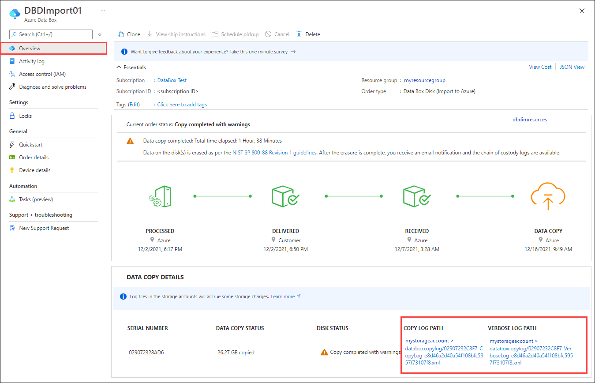
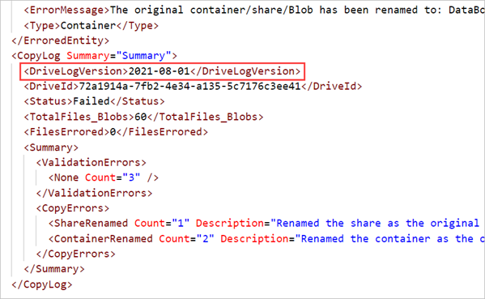

# Use logs to troubleshoot upload issues in Azure Data Box Disk

This article describes the issues you see when you upload data in the Azure datacenter using Azure Data Box Disk.

## About upload logs

When the data from a Data Box Disk is uploaded in the Azure datacenter, a copy/error log and a verbose log are generated for each storage account. These logs are uploaded to the same storage account that was used to upload data. 

[!INCLUDE [storage-import-export-verbose-log-copy-log-descriptions.md](../../includes/storage-import-export-verbose-log-copy-log-descriptions.md)]

## Locate the logs

To find the logs from a data upload, do the following steps.

1. Open your order in the [Azure portal](https://portal.azure.com).

2. As the data upload completes for each disk, the **Overview** pane displays the disk status and the paths to diagnostics logs for the disk.

   * For new orders, the disk details look like those in the following screen. A copy log is saved automatically. If you chose to save verbose logs when you placed your order, you'll also see the path to the verbose log.

     

     The logs are uploaded to a container (for blob imports) or share (for imports to Azure Files) in the storage account. The container is named `databoxcopylog`. The URLs have these formats:

     |Log type   |URL format|
     |-----------|----------|
     |copy log   |<*storage-account-name*>/databoxcopylog/<*order-name*>_<*device-serial-number*>&#95;CopyLog&#95;<*job-ID*>.xml |
     |verbose log|<*storage-account-name*>/databoxcopylog/<*order-name*>_<*device-serial-number*>&#95;VerboseLog&#95;<*job-ID*>.xml|

   * For your earlier orders, the display might look like the following screen. 
   
      If there are any errors when uploading the data to Azure, **Copy logs** displays a path to the folder where the diagnostics logs are located. 

      
   
     The logs are uploaded to a `waies` container in the storage account. The URLs have these formats:

     |Log type   |URL format|
     |-----------|----------|
     |error log  |<*storage-account-name*>/databoxlogs-<*order-name*>/waies/ri-<*order-name*>-guid_<*drive-ID*>_<*timestamp*>_error.xml   |
     |verbose log|<*storage-account-name*>/databoxlogs-<*order-name*>/waies/ri-<*order-name*>-guid_<*drive-ID*>_<*timestamp*>_verbose.xml |

   > [!NOTE]
   > Logs in the **databoxcopylog** container have a different format than logs in the `waies` container. For help interpreting the logs, use the instructions for the associated drive log version. See [Identify log version](#identify-log-version) for more information.

3. To view the logs, open the container that stores the logs in your storage account. The following illustration shows the logs in a `waies` container.

    
   
4. Select each log and download a local copy.


## Identify log version

There are two versions of the copy/error log and verbose log, with different formats. The log versions are discussed separately in the sections that follow.

Along with the verbose log, you'll see either a copy log (`_copy.xml`) or an error log (`_error.xml`), depending on the drive release.

To find out the log release for both the copy/error log and the accompanying verbose log, check the drive log version in the copy/error log.

|Log file name   | Field            | Drive log version |
|----------------|------------------|-------------------|
|_copy.xml       | DriveLogVersion  | 2021-08-01        |
|_error.xml      | DriveLog Version | 2018-10-01        |

The following illustration shows the `DriveLogVersion` in the summary section of a copy log.




## Sample upload logs

The log formats of copy/error log and verbose log differ for the two log versions. If you aren't sure which version of the logs you have, see [Identify log version](#identify-log-version).

### [Log version: 2021-08-01](#tab/log-version-2021-08-01)

Each data transfer for a disk generates a copy log. If you chose to save a verbose log when you placed your order, there’s also a verbose log in the same folder.

### Verbose log

The verbose log is an optional file that you can enable during ordering. It's a simple listing of all files that were successfully imported from the drive, with the following information for each file. The verbose log doesn’t provide summary information.

| Field       | Description                                  |
|-------------|----------------------------------------------|
| CloudFormat | BlockBlob, PageBlob, or AzureFile.           |
| Path        | Path to the file within the storage account. |
| Size        | File or blob size.                           |
| crc64       | The cyclic redundancy check 64 (CRC64) checksum that was used to verify data integrity during data transfer. |

#### Sample verbose log

[!INCLUDE [data-box-disk-sample-verbose-log.md](../../includes/data-box-disk-sample-verbose-log.md)]

### Copy log

The copy log contains an error entry for each file that failed to import, with error detail. The copy log ends with a summary of validation and copy errors that occurred during the import.

Each error entry contains the following information.

| Field        | Description                                               |
|--------------|-----------------------------------------------------------|
| Path         | The destination share within the container or file share. |
| Category     | One of 15 error categories. For more information, see [Data upload errors](#data-upload-errors) for **Log version 2021-08-01.** |
| ErrorCode    | The numeric code for the error.                           |
| ErrorMessage | Describes the error.                                      |

The summary at the end of the log (look for `CopyLog Summary`) gives the following information:

*	Drive log version (in this case, 2021-08-01)
*	Drive ID
*	Data copy status
*	Summary of validation errors by error category
*	Summary of copy errors by error category

#### Sample copy log

[!INCLUDE [data-box-disk-sample-copy-log.md](../../includes/data-box-disk-sample-copy-log.md)]

### [Log version: 2018-10-01](#tab/log-version-2018-10-01)

In drive log version 2018-10-01, the data upload produces an error log and a verbose log. Both the logs are in the same format and contain XML descriptions of the events that occurred while copying the data from the disk to the Azure Storage account.

The verbose log contains complete about the status of the copy operation for every blob or file, whereas the error log contains only the information for blobs or files that encountered errors during the upload.

The error log has the same structure as the verbose log, but filters out successful operations.

### Sample verbose log

A sample of the `_verbose.xml` is shown below. In this case, the order has completed successfully with no errors.

```xml

<?xml version="1.0" encoding="utf-8"?>
<DriveLog Version="2018-10-01">
  <DriveId>184020D95632</DriveId>
  <Blob Status="Completed">
    <BlobPath>$root/botetapageblob.vhd</BlobPath>
    <FilePath>\PageBlob\botetapageblob.vhd</FilePath>
    <Length>1073742336</Length>
    <ImportDisposition Status="Created">rename</ImportDisposition>
    <PageRangeList>
      <PageRange Offset="0" Length="4194304" Status="Completed" />
      <PageRange Offset="4194304" Length="4194304" Status="Completed" />
      <PageRange Offset="8388608" Length="4194304" Status="Completed" />
      --------CUT-------------------------------------------------------
      <PageRange Offset="1061158912" Length="4194304" Status="Completed" />
      <PageRange Offset="1065353216" Length="4194304" Status="Completed" />
      <PageRange Offset="1069547520" Length="4194304" Status="Completed" />
      <PageRange Offset="1073741824" Length="512" Status="Completed" />
    </PageRangeList>
  </Blob>
  <Blob Status="Completed">
    <BlobPath>$root/botetablockblob.txt</BlobPath>
    <FilePath>\BlockBlob\botetablockblob.txt</FilePath>
    <Length>19</Length>
    <ImportDisposition Status="Created">rename</ImportDisposition>
    <BlockList>
      <Block Offset="0" Length="19" Status="Completed" />
    </BlockList>
  </Blob>
  <File Status="Completed">
    <FileStoragePath>botetaazurefilesfolder/botetaazurefiles.txt</FileStoragePath>
    <FilePath>\AzureFile\botetaazurefilesfolder\botetaazurefiles.txt</FilePath>
    <Length>20</Length>
    <ImportDisposition Status="Created">rename</ImportDisposition>
    <FileRangeList>
      <FileRange Offset="0" Length="20" Status="Completed" />
    </FileRangeList>
  </File>
  <Status>Completed</Status>
</DriveLog>
```

### Sample error logs

For the same order, a sample of the `_error.xml` is shown below.

```xml

<?xml version="1.0" encoding="utf-8"?>
<DriveLog Version="2018-10-01">
  <DriveId>184020D95632</DriveId>
  <Summary>
    <ValidationErrors>
      <None Count="3" />
    </ValidationErrors>
    <CopyErrors>
      <None Count="3" Description="No errors encountered" />
    </CopyErrors>
  </Summary>
  <Status>Completed</Status>
</DriveLog>
```

A sample of the `_error.xml` is shown below where the order completed with errors.

The error file in this case has a `Summary` section and another section that contains all the file level errors. 

The `Summary` contains the `ValidationErrors` and the `CopyErrors`. In this case, 8 files or folders were uploaded to Azure and there were no validation errors. When the data was copied to Azure Storage account, 5 files or folders uploaded successfully. The remaining 3 files or folders were renamed as per the Azure container naming conventions and then uploaded successfully to Azure.

The file level statuses are in `BlobStatus`, which describes any actions taken to upload the blobs. In this case, three containers are renamed because the folders to which the data was copied did not conform with the Azure naming conventions for containers. For the blobs uploaded in those containers, the new container name, path of the blob in Azure, original invalid file path, and the blob size are included.
  
```xml
 <?xml version="1.0" encoding="utf-8"?>
  <DriveLog Version="2018-10-01">
    <DriveId>18041C582D7E</DriveId>
    <Summary>
      <ValidationErrors>
        <None Count="8" />
      </ValidationErrors>
      <CopyErrors>
        <Completed Count="5" Description="No errors encountered" />
        <ContainerRenamed Count="3" Description="Renamed the container as the original container name does not follow Azure conventions." />
      </CopyErrors>
    </Summary>
    <Blob Status="ContainerRenamed">
      <BlobPath>databox-c2073fd1cc379d83e03d6b7acce23a6cf29d1eef/private.vhd</BlobPath>
      <OriginalFilePath>\PageBlob\pageblob test\private.vhd</OriginalFilePath>
      <SizeInBytes>10490880</SizeInBytes>
    </Blob>
    <Blob Status="ContainerRenamed">
      <BlobPath>databox-c2073fd1cc379d83e03d6b7acce23a6cf29d1eef/resource.vhd</BlobPath>
      <OriginalFilePath>\PageBlob\pageblob test\resource.vhd</OriginalFilePath>
      <SizeInBytes>71528448</SizeInBytes>
    </Blob>
    <Blob Status="ContainerRenamed">
      <BlobPath>databox-c2073fd1cc379d83e03d6b7acce23a6cf29d1eef/role.vhd</BlobPath>
      <OriginalFilePath>\PageBlob\pageblob test\role.vhd</OriginalFilePath>
      <SizeInBytes>10490880</SizeInBytes>
    </Blob>
    <Status>CompletedWithErrors</Status>
  </DriveLog>
```

---

## Data upload errors

The errors reported in the logs vary slightly in the two log versions. If you aren't sure which version of the logs you have, see [Identify log version](#identify-log-version).

### [Log version: 2021-08-01](#tab/log-version-2021-08-01)

The errors found in the 2018-10-01 copy log are described below.

| Error category                      | Description       |
|-------------------------------------|-------------------|
| `UploadErrorWin32`                  |File system error. |
| `UploadErrorCloudHttp`              |Unsupported blob type. For more information about errors in this category, see [Summary of upload errors](../databox/data-box-troubleshoot-data-upload.md#summary-of-upload-errors).|
| `UploadErrorDataValidationError`    |CRC computed during data ingestion doesn’t match the CRC computed during upload. |
| `UploadErrorManagedConversionError` |The size of the blob being imported is invalid. The blob size is <*blob-size*> bytes. Supported sizes are between 20971520 Bytes and 8192 GiB. For more information, see [Summary of upload errors](../databox/data-box-troubleshoot-data-upload.md#summary-of-upload-errors). |
| `UploadErrorUnknownType`            |Unknown error. |
| `ContainerRenamed`                  |Renamed the container because the original container name doesn't follow [Azure naming conventions](data-box-disk-limits.md#azure-block-blob-page-blob-and-file-naming-conventions). The original container has been renamed to DataBox-<*GUID*> from <*original container name*>. |
| `ShareRenamed`                      |Renamed the share because the original share name doesn't follow [Azure naming conventions](data-box-disk-limits.md#azure-block-blob-page-blob-and-file-naming-conventions). The original share has been renamed to DataBox-<*GUID*> from <*original folder name*>. |
| `BlobRenamed`                       |Renamed the blob because the original blob name doesn't follow [Azure naming conventions](data-box-disk-limits.md#azure-block-blob-page-blob-and-file-naming-conventions). The original blob has been renamed to BlockBlob/DataBox-<*GUID*> from <*original name*>.|
| `FileRenamed`                       |Renamed the file because the original file name doesn't follow [Azure naming conventions](data-box-disk-limits.md#azure-block-blob-page-blob-and-file-naming-conventions). The original blob has been renamed to AzureFile/DataBox-<*GUID*> from <*original name*>. |
| `DiskRenamed`                       |Renamed the managed disk file because the original file name doesn't follow [Azure naming conventions](data-box-disk-limits.md#managed-disk-naming-conventions). The original managed disk file was renamed to ManagedDisk/DataBox-<*GUID*> from <*original name*>. |
| `ExportCloudHttp`                   |Unsupported blob type. |


### [Log version: 2018-10-01](#tab/log-version-2018-10-01)

The errors generated when uploading the data to Azure are summarized in the following table. This error set is found in the 2018-10-01 error log.

| Error code | Description                   |
|-------------|------------------------------|
|`Renamed` | Successfully renamed the blob.  |
|`CompletedWithErrors` | Upload completed with errors. The details of the files in error are included in the log file.  |
|`Corrupted`|CRC computed during data ingestion doesn’t match the CRC computed during upload.  |  
|`StorageRequestFailed` | Azure storage request failed.   |
|`LeasePresent` | This item is leased and is being used by another user. |
|`StorageRequestForbidden` |Could not upload due to authentication issues. |
|`ManagedDiskCreationTerminalFailure` | Could not upload as managed disks. The files are available in the staging storage account as page blobs. You can manually convert page blobs to managed disks.  |
|`DiskConversionNotStartedTierInfoMissing` | Since the VHD file was copied outside of the precreated tier folders, a managed disk wasn't created. The file is uploaded as page blob to the staging storage account as specified during order creation. You can convert it manually to a managed disk.|
|`InvalidWorkitem` | Could not upload the data as it does not conform to Azure naming and limits conventions.|
|`InvalidPageBlobUploadAsBlockBlob` | Uploaded as block blobs in a container with prefix `databoxdisk-invalid-pb-`.|
|`InvalidAzureFileUploadAsBlockBlob` | Uploaded as block blobs in a container with prefix `databoxdisk-invalid-af`-.|
|`InvalidManagedDiskUploadAsBlockBlob` | Uploaded as block blobs in a container with prefix `databoxdisk-invalid-md`-.|
|`InvalidManagedDiskUploadAsPageBlob` |Uploaded as page blobs in a container with prefix `databoxdisk-invalid-md-`. |
|`MovedToOverflowShare` |Uploaded files to a new share as the original share size exceeded the maximum Azure size limit. The new file share name has the original name suffixed with `-2`.   |
|`MovedToDefaultAzureShare` |Uploaded files that weren’t a part of any folder to a default share. The share name starts with `databox-`. |
|`ContainerRenamed` |The container for these files didn’t conform to Azure naming conventions and is renamed. The new name starts with `databox-` and is suffixed with the SHA1 hash of the original name |
|`ShareRenamed` |The share for these files didn’t conform to Azure naming conventions and is renamed. The new name starts with `databox-` and is suffixed with the SHA1 hash of the original name. |
|`BlobRenamed` |These files didn’t conform to Azure naming conventions and were renamed. Check the `BlobPath` field for the new name. |
|`FileRenamed` |These files didn’t conform to Azure naming conventions and were renamed. Check the `FileStoragePath` field for the new name. |
|`DiskRenamed` |These files didn’t conform to Azure naming conventions and were renamed. Check the `BlobPath` field for the new name. |

---

## Next steps

[Contact Microsoft Support](data-box-disk-contact-microsoft-support.md).
