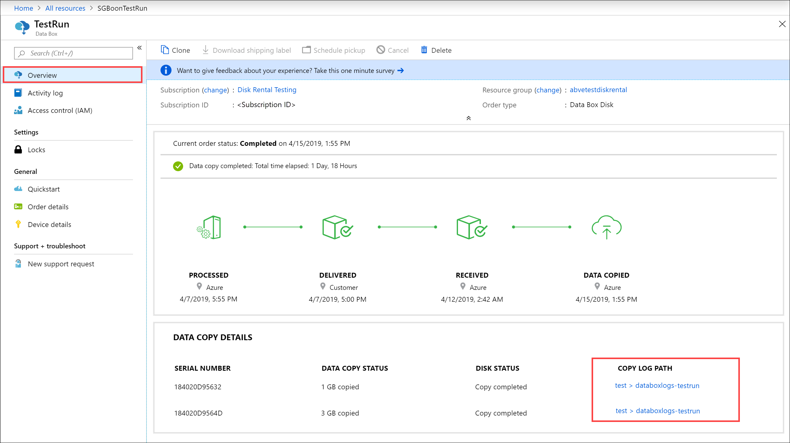
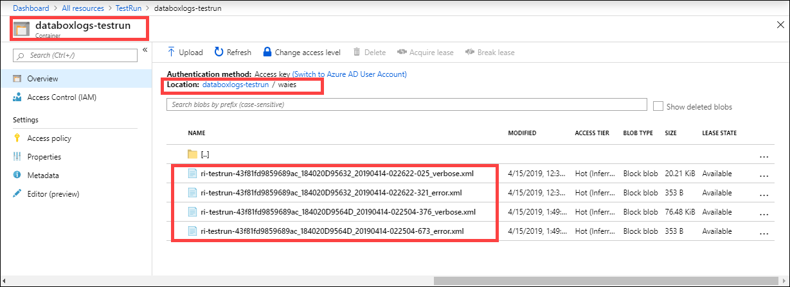

# Understand logs to troubleshoot data upload issues in Azure Data Box Disk

This article applies to Microsoft Azure Data Box Disk and describes the issues you see when you upload data to Azure.

## About upload logs

When the data is uploaded to Azure at the datacenter, `_error.xml` and `_verbose.xml` files are generated for each storage account. These logs are uploaded to the same storage account that was used to upload data. 

Both the logs are in the same format and contain XML descriptions of the events that occurred while copying the data from the disk to the Azure Storage account.

The verbose log contains complete information about the status of the copy operation for every blob or file, whereas the error log contains only the information for blobs or files that encountered errors during the upload.

The error log has the same structure as the verbose log, but filters out successful operations.

## Download logs

Take the following steps to locate the upload logs.

1. If there are any errors when uploading the data to Azure, the portal displays a path to the folder where the diagnostics logs are located.

    

2. Go to **waies**.

    

In each case, you see the error logs and the verbose logs. Select each log and download a local copy.

## Sample upload logs

A sample of the `_verbose.xml` is shown below. In this case, the order has completed successfully with no errors.

```xml

<?xml version="1.0" encoding="utf-8"?>
<DriveLog Version="2018-10-01">
  <DriveId>184020D95632</DriveId>
  <Blob Status="Completed">
    <BlobPath>$root/botetapageblob.vhd</BlobPath>
    <FilePath>\PageBlob\botetapageblob.vhd</FilePath>
    <Length>1073742336</Length>
    <ImportDisposition Status="Created">rename</ImportDisposition>
    <PageRangeList>
      <PageRange Offset="0" Length="4194304" Status="Completed" />
      <PageRange Offset="4194304" Length="4194304" Status="Completed" />
      <PageRange Offset="8388608" Length="4194304" Status="Completed" />
      --------CUT-------------------------------------------------------
      <PageRange Offset="1061158912" Length="4194304" Status="Completed" />
      <PageRange Offset="1065353216" Length="4194304" Status="Completed" />
      <PageRange Offset="1069547520" Length="4194304" Status="Completed" />
      <PageRange Offset="1073741824" Length="512" Status="Completed" />
    </PageRangeList>
  </Blob>
  <Blob Status="Completed">
    <BlobPath>$root/botetablockblob.txt</BlobPath>
    <FilePath>\BlockBlob\botetablockblob.txt</FilePath>
    <Length>19</Length>
    <ImportDisposition Status="Created">rename</ImportDisposition>
    <BlockList>
      <Block Offset="0" Length="19" Status="Completed" />
    </BlockList>
  </Blob>
  <File Status="Completed">
    <FileStoragePath>botetaazurefilesfolder/botetaazurefiles.txt</FileStoragePath>
    <FilePath>\AzureFile\botetaazurefilesfolder\botetaazurefiles.txt</FilePath>
    <Length>20</Length>
    <ImportDisposition Status="Created">rename</ImportDisposition>
    <FileRangeList>
      <FileRange Offset="0" Length="20" Status="Completed" />
    </FileRangeList>
  </File>
  <Status>Completed</Status>
</DriveLog>
```

For the same order, a sample of the `_error.xml` is shown below.

```xml

<?xml version="1.0" encoding="utf-8"?>
<DriveLog Version="2018-10-01">
  <DriveId>184020D95632</DriveId>
  <Summary>
    <ValidationErrors>
      <None Count="3" />
    </ValidationErrors>
    <CopyErrors>
      <None Count="3" Description="No errors encountered" />
    </CopyErrors>
  </Summary>
  <Status>Completed</Status>
</DriveLog>
```

A sample of the `_error.xml` is shown below where the order completed with errors. 

The error file in this case has a `Summary` section and another section that contains all the file level errors. 

The `Summary` contains the `ValidationErrors` and the `CopyErrors`. In this case, 8 files or folders were uploaded to Azure and there were no validation errors. When the data was copied to Azure Storage account, 5 files or folders uploaded successfully. The remaining 3 files or folders were renamed as per the Azure container naming conventions and then uploaded successfully to Azure.

The file level status are in `BlobStatus` that describes any actions taken to upload the blobs. In this case, three containers are renamed because the folders to which the data was copied did not conform with the Azure naming conventions for containers. For the blobs uploaded in those containers, the new container name, path of the blob in Azure, original invalid file path, and the blob size are included.
	
```xml
 <?xml version="1.0" encoding="utf-8"?>
	<DriveLog Version="2018-10-01">
	  <DriveId>18041C582D7E</DriveId>
	  <Summary>
     <!--Summary for validation and data copy to Azure -->
	    <ValidationErrors>
	      <None Count="8" />
	    </ValidationErrors>
	    <CopyErrors>
	      <Completed Count="5" Description="No errors encountered" />
	      <ContainerRenamed Count="3" Description="Renamed the container as the original container name does not follow Azure conventions." />
	    </CopyErrors>
	  </Summary>
    <!--List of renamed containers with the new names, new file path in Azure, original invalid file path, and size -->
	  <Blob Status="ContainerRenamed">
	    <BlobPath>databox-c2073fd1cc379d83e03d6b7acce23a6cf29d1eef/private.vhd</BlobPath>
	    <OriginalFilePath>\PageBlob\pageblob test\private.vhd</OriginalFilePath>
	    <SizeInBytes>10490880</SizeInBytes>
	  </Blob>
	  <Blob Status="ContainerRenamed">
	    <BlobPath>databox-c2073fd1cc379d83e03d6b7acce23a6cf29d1eef/resource.vhd</BlobPath>
	    <OriginalFilePath>\PageBlob\pageblob test\resource.vhd</OriginalFilePath>
	    <SizeInBytes>71528448</SizeInBytes>
	  </Blob>
	  <Blob Status="ContainerRenamed">
	    <BlobPath>databox-c2073fd1cc379d83e03d6b7acce23a6cf29d1eef/role.vhd</BlobPath>
	    <OriginalFilePath>\PageBlob\pageblob test\role.vhd</OriginalFilePath>
	    <SizeInBytes>10490880</SizeInBytes>
	  </Blob>
	  <Status>CompletedWithErrors</Status>
	</DriveLog>
```

## Data upload errors

The errors generated when uploading the data to Azure are summarized in the following table.

| Error code | Description                   |
|-------------|------------------------------|
|`None` |  Completed successfully.           |
|`Renamed` | Successfully renamed the blob.   |
|`CompletedWithErrors` | Upload completed with errors. The details of the files in error are included in the log file.  |
|`Corrupted`|CRC computed during data ingestion doesn’t match the CRC computed during upload.  |  
|`StorageRequestFailed` | Azure storage request failed.   |     
|`LeasePresent` | This item is leased and is being used by another user. |
|`StorageRequestForbidden` |Could not upload due to authentication issues. |
|`ManagedDiskCreationTerminalFailure` | Could not upload as managed disks. The files are available in the staging storage account as page blobs. You can manually convert page blobs to managed disks.  |
|`DiskConversionNotStartedTierInfoMissing` | Since the VHD file was copied outside of the precreated tier folders, a managed disk wasn't created. The file is uploaded as page blob to the staging storage account as specified during order creation. You can convert it manually to a managed disk.|
|`InvalidWorkitem` | Could not upload the data as it does not conform to Azure naming and limits conventions.|
|`InvalidPageBlobUploadAsBlockBlob` | Uploaded as block blobs in a container with prefix `databoxdisk-invalid-pb-`.|
|`InvalidAzureFileUploadAsBlockBlob` | Uploaded as block blobs in a container with prefix `databoxdisk-invalid-af`-.|
|`InvalidManagedDiskUploadAsBlockBlob` | Uploaded as block blobs in a container with prefix `databoxdisk-invalid-md`-.|
|`InvalidManagedDiskUploadAsPageBlob` |Uploaded as page blobs in a container with prefix `databoxdisk-invalid-md-`. |
|`MovedToOverflowShare` |Uploaded files to a new share as the original share size exceeded the maximum Azure size limit. The new file share name has the original name suffixed with `-2`.   |
|`MovedToDefaultAzureShare` |Uploaded files that weren’t a part of any folder to a default share. The share name starts with `databox-`. |
|`ContainerRenamed` |The container for these files didn’t conform to Azure naming conventions and is renamed. The new name starts with `databox-` and is suffixed with the SHA1 hash of the original name |
|`ShareRenamed` |The share for these files didn’t conform to Azure naming conventions and is renamed. The new name starts with `databox-` and is suffixed with the SHA1 hash of the original name. |
|`BlobRenamed` |These files didn’t conform to Azure naming conventions and were renamed. Check the `BlobPath` field for the new name. |
|`FileRenamed` |These files didn’t conform to Azure naming conventions and were renamed. Check the `FileStoragePath` field for the new name. |
|`DiskRenamed` |These files didn’t conform to Azure naming conventions and were renamed. Check the `BlobPath` field for the new name. |


## Next steps

- [Open a Support ticket for Data Box Disk issues](data-box-disk-contact-microsoft-support.md).
