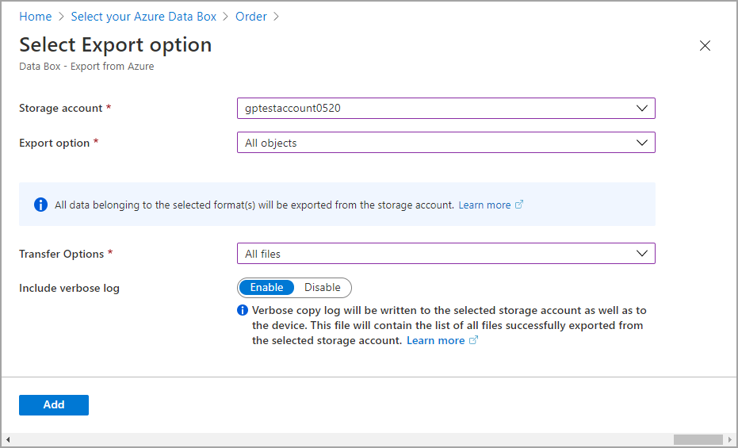
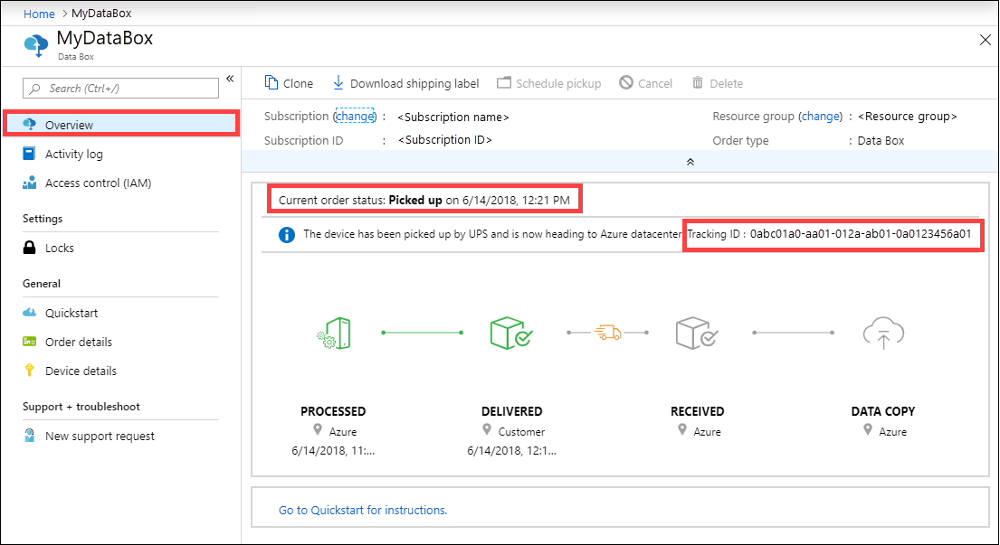
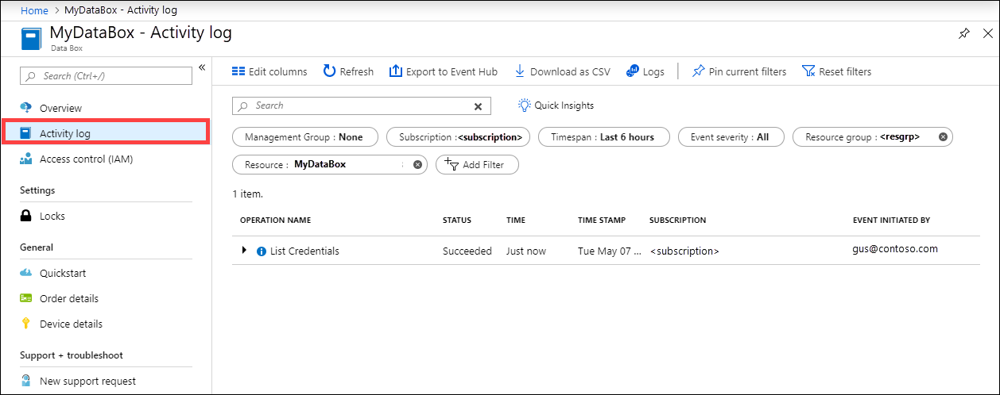

# Tracking and event logging for your Azure Data Box and Azure Data Box Heavy export orders

A Data Box or Data Box Heavy export order goes through the following steps: order, set up, data copy, return, and data erasure. Corresponding to each step in the order, you can take multiple actions to control the access to the order, audit the events, track the order, and interpret the various logs that are generated.

This article describes in detail the various mechanisms or tools available to track and audit export orders for Data Box or Data Box Heavy. The information in this article applies to both, Data Box and Data Box Heavy. In the subsequent sections, any references to Data Box also apply to Data Box Heavy.

The following table shows a summary of the Data Box export order steps and the tools available to track and audit the order during each step.

| Data Box export order stage       | Tool to track and audit                                                                        |
|----------------------------|------------------------------------------------------------------------------------------------|
| Create order               | [Set up access control on the order via Azure RBAC](#set-up-access-control-on-the-order) <br> [Enable verbose log in the order](#enable-verbose-log-in-the-order)                                                    |
| Order processed            | [Track the order](#track-the-order) through <ul><li> Azure portal </li><li> Shipping carrier website </li><li>Email notifications</ul> |
| Set up device              | Device credentials access logged in [Activity logs](#query-activity-logs-during-setup)              |
| Data copy from device        | [Review copy logs](#copy-log) <br> [Review verbose logs](#verbose-log) before you copy data            |
| Data erasure from device   | [View chain of custody logs](#get-chain-of-custody-logs-after-data-erasure) including audit logs and order history                |


## Set up access control on the order

You can control who can access your order when the order is first created. Set up Azure roles at various scopes to control the access to the Data Box order. An Azure role determines the type of access – read-write, read-only, read-write to a subset of operations.

The two roles that can be defined for the Azure Data Box service are:

- **Data Box Reader** - have read-only access to an order(s) as defined by the scope. They can only view details of an order. They can’t access any other details related to storage accounts or edit the order details such as address and so on.
- **Data Box Contributor** - can only create an order to transfer data to a given storage account *if they already have write access to a storage account*. If they do not have access to a storage account, they can't even create a Data Box order to copy data to the account. This role does not define any Storage account related permissions nor grants access to storage accounts.

To restrict access to an order, you can:

- Assign a role at an order level. The user only has those permissions as defined by the roles to interact with that specific Data Box order only and nothing else.
- Assign a role at the resource group level, the user has access to all the Data Box orders within a resource group.

For more information on suggested Azure RBAC use, see [Best practices for Azure RBAC](../role-based-access-control/best-practices.md).

## Enable verbose log in the order

When placing an export order for Data Box, you have the option to enable the collection of a verbose log. Here is the order screen where you can enable the verbose log:



When you select the **Include verbose log** option, a verbose log file is generated when copying the data from your Azure Storage account. This log contains a list of all files that were exported successfully.

For more information on export order, see [Create an export order for Data Box](data-box-deploy-export-ordered.md)

## Track the order

You can track your order through the Azure portal and through the shipping carrier website. The following mechanisms are in place to track the Data Box order at any time:

- To track the order when the device is in Azure datacenter or your premises, go to your **Data Box order > Overview** in Azure portal.

    

- To track the order while the device is in transit, go to the regional carrier website, for example, UPS  website in US. Provide the tracking number associated with your order.
- Data Box also sends email notifications anytime the order status changes based on the emails provided when the order was created. For a list of all the Data Box order statuses, see [View order status](data-box-portal-admin.md#view-order-status). To change the notification settings associated with the order, see [Edit notification details](data-box-portal-admin.md#edit-notification-details).

## Query activity logs during setup

- Your Data Box arrives on your premises in a locked state. You can use the device credentials available in the Azure portal for your order.

    When a Data Box is set up, you may need to know who all accessed the device credentials. To figure out who accessed the **Device credentials** blade, you can query the Activity logs.  Any action that involves accessing **Device details > Credentials** blade is logged into the activity logs as `ListCredentials` action.

    

- Each sign into the Data Box is logged real time. However, this information is only available in the [Chain of custody audit logs](#chain-of-custody-audit-logs) after the order is successfully completed.

## View logs during data copy

Before you copy data from your Data Box, you can download and review *copy log* and *verbose log* for the data that was copied to the Data Box. These logs are generated when the data is copied from your Storage account in Azure to your Data Box.

### Copy log

Before you copy the data from your Data Box, download the copy log from the **Connect and copy** page.

Here is a sample output of *copy log* when there were no errors and all the files were copied during the data copy from Azure to Data Box device.

```output
<CopyLog Summary="Summary">
  <Status>Succeeded</Status>
  <TotalFiles_Blobs>5521</TotalFiles_Blobs>
  <FilesErrored>0</FilesErrored>
</CopyLog>
```

Here is a sample output when the *copy log* has errors and some of the files failed to copy from Azure.

```output
<ErroredEntity CloudFormat="AppendBlob" Path="export-ut-appendblob/wastorage.v140.3.0.2.nupkg">
  <Category>UploadErrorCloudHttp</Category>
  <ErrorCode>400</ErrorCode>
  <ErrorMessage>UnsupportBlobType</ErrorMessage>
  <Type>File</Type>
</ErroredEntity><ErroredEntity CloudFormat="AppendBlob" Path="export-ut-appendblob/xunit.console.Primary_2020-05-07_03-54-42-PM_27444.hcsml">
  <Category>UploadErrorCloudHttp</Category>
  <ErrorCode>400</ErrorCode>
  <ErrorMessage>UnsupportBlobType</ErrorMessage>
  <Type>File</Type>
</ErroredEntity><ErroredEntity CloudFormat="AppendBlob" Path="export-ut-appendblob/xunit.console.Primary_2020-05-07_03-54-42-PM_27444 (1).hcsml">
  <Category>UploadErrorCloudHttp</Category>
  <ErrorCode>400</ErrorCode>
  <ErrorMessage>UnsupportBlobType</ErrorMessage>
  <Type>File</Type>
</ErroredEntity><CopyLog Summary="Summary">
  <Status>Failed</Status>
  <TotalFiles_Blobs>4</TotalFiles_Blobs>
  <FilesErrored>3</FilesErrored>
</CopyLog>
```

You have the following options to export those files:

- You can transfer the files that could not be copied over the network.
- If your data size was larger than the usable device capacity, then a partial copy occurs and all the files that were not copied are listed in this log. You can use this log as an input XML to create a new Data Box order and then copy over these files.

### Verbose log

The *verbose log* contains a list of all the files that were successfully exported from Azure Storage account. The log also contains file size and checksum computation.

The verbose log has the information in the following format:

`<file size = "file-size-in-bytes" crc64="cyclic-redundancy-check-string">\folder-path-on-data-box\name-of-file-copied.md</file>`

Here is a sample output of the verbose log.

```powershell
  <File CloudFormat="BlockBlob" Path="validblobdata/test1.2.3.4" Size="1024" crc64="7573843669953104266">
  </File><File CloudFormat="BlockBlob" Path="validblobdata/helloEndWithDot..txt" Size="11" crc64="7320094093915972193">
  </File><File CloudFormat="BlockBlob" Path="validblobdata/test..txt" Size="12" crc64="17906086011702236012">
  </File><File CloudFormat="BlockBlob" Path="validblobdata/test1" Size="1024" crc64="7573843669953104266">
  </File><File CloudFormat="BlockBlob" Path="validblobdata/test1.2.3" Size="1024" crc64="7573843669953104266">
  </File><File CloudFormat="BlockBlob" Path="validblobdata/.......txt" Size="11" crc64="7320094093915972193">
  </File><File CloudFormat="BlockBlob" Path="validblobdata/copylogb08fa3095564421bb550d775fff143ed====..txt" Size="53638" crc64="1147139997367113454">
  </File><File CloudFormat="BlockBlob" Path="validblobdata/testmaxChars-123456790-123456790-123456790-123456790-123456790-123456790-123456790-123456790-123456790-123456790-123456790-123456790-123456790-123456790-123456790-123456790-123456790-123456790-123456790-123456790-12345679" Size="1024" crc64="7573843669953104266">
  </File><File CloudFormat="BlockBlob" Path="export-ut-container/file0" Size="0" crc64="0">
  </File><File CloudFormat="BlockBlob" Path="export-ut-container/file1" Size="0" crc64="0">
  </File><File CloudFormat="BlockBlob" Path="export-ut-container/file4096_000001" Size="4096" crc64="16969371397892565512">
  </File><File CloudFormat="BlockBlob" Path="export-ut-container/file4096_000000" Size="4096" crc64="16969371397892565512">
  </File><File CloudFormat="BlockBlob" Path="export-ut-container/64KB-Seed10.dat" Size="65536" crc64="10746682179555216785">
  </File><File CloudFormat="BlockBlob" Path="export-ut-container/LiveSiteReport_Oct.xlsx" Size="7028" crc64="6103506546789189963">
  </File><File CloudFormat="BlockBlob" Path="export-ut-container/NE_Oct_GeoReport.xlsx" Size="103197" crc64="13305485882546035852">
  </File><File CloudFormat="BlockBlob" Path="export-ut-container/64KB-Seed1.dat" Size="65536" crc64="3140622834011462581">
  </File><File CloudFormat="BlockBlob" Path="export-ut-container/1mbfiles-0-0" Size="1048576" crc64="16086591317856295272">
  </File><File CloudFormat="BlockBlob" Path="export-ut-container/file524288_000001" Size="524288" crc64="8908547729214703832">
  </File><File CloudFormat="BlockBlob" Path="export-ut-container/4mbfiles-0-0" Size="4194304" crc64="1339017920798612765">
  </File><File CloudFormat="BlockBlob" Path="export-ut-container/file524288_000000" Size="524288" crc64="8908547729214703832">
  </File><File CloudFormat="BlockBlob" Path="export-ut-container/8mbfiles-0-1" Size="8388608" crc64="3963298606737216548">
  </File><File CloudFormat="BlockBlob" Path="export-ut-container/1mbfiles-0-1" Size="1048576" crc64="11061759121415905887">
  </File><File CloudFormat="BlockBlob" Path="export-ut-container/XLS-10MB.xls" Size="1199104" crc64="2218419493992437463">
  </File><File CloudFormat="BlockBlob" Path="export-ut-container/8mbfiles-0-0" Size="8388608" crc64="1072783424245035917">
  </File><File CloudFormat="BlockBlob" Path="export-ut-container/4mbfiles-0-1" Size="4194304" crc64="9991307204216370812">
  </File><File CloudFormat="BlockBlob" Path="export-ut-container/VL_Piracy_Negtive10_TPNameAndGCS.xlsx" Size="12398699" crc64="13526033021067702820">
  </File>
  ``````

The verbose logs are also copied to the Azure storage account. By default, logs are written to a container named `copylog`. The logs are stored with the following naming convention:

`storage-account-name/databoxcopylog/ordername_device-serial-number_CopyLog_guid.xml`.

The copy log path is also displayed on the **Overview** blade for the portal.

<!-- add a screenshot-->

You can use these logs to verify that files copied from Azure match the data that was copied to your on-premises server.

Use your verbose log file:

- To verify against the actual names and the number of files that were copied from the Data Box.
- To verify against the actual sizes of the files.
- To verify that the *crc64* corresponds to a non-zero string. A Cyclic Redundancy Check (CRC) computation is done during the export from Azure. The CRCs from the export and after the data is copied from Data Box to on-premises server can be compared. A CRC mismatch indicates that the corresponding files failed to copy properly.


## Get chain of custody logs after data erasure

After the data is erased from the Data Box disks as per the NIST SP 800-88 Revision 1 guidelines, the chain of custody logs are available. These logs include the chain of custody audit logs and the order history. The BOM or manifest files are also copied with the audit logs.

### Chain of custody audit logs

The chain of custody audit logs contain information about powering on and accessing shares on the Data Box or Data Box Heavy when it is outside of Azure datacenter. These logs are located at: `storage-account/azuredatabox-chainofcustodylogs`

Here is a sample of the audit log from a Data Box:

```output
9/10/2018 8:23:01 PM : The operating system started at system time ‎2018‎-‎09‎-‎10T20:23:01.497758400Z.
9/10/2018 8:23:42 PM : An account was successfully logged on.
Subject:
	Security ID:		S-1-5-18
	Account Name:		WIN-DATABOXADMIN
	Account Domain:	Workgroup
	Logon ID:		0x3E7
Logon Information:
	Logon Type:		3
	Restricted Admin Mode:	-
	Virtual Account:		No
	Elevated Token:		No
Impersonation Level:		Impersonation
New Logon:
	Security ID:		S-1-5-7
	Account Name:		ANONYMOUS LOGON
	Account Domain:	NT AUTHORITY
	Logon ID:		0x775D5
	Linked Logon ID:	0x0
	Network Account Name:	-
	Network Account Domain:	-
	Logon GUID:		{00000000-0000-0000-0000-000000000000}
Process Information:
	Process ID:		0x4
	Process Name:
Network Information:
	Workstation Name:	-
	Source Network Address:	-
	Source Port:		-
Detailed Authentication Information:
	Logon Process:		NfsSvr
	Authentication Package:MICROSOFT_AUTHENTICATION_PACKAGE_V1_0
	Transited Services:	-
	Package Name (NTLM only):	-
	Key Length:		0
This event is generated when a logon session is created. It is generated on the computer that was accessed.
The subject fields indicate the account on the local system which requested the logon. This is most commonly a service such as the Server service, or a local process such as Winlogon.exe or Services.exe.
The logon type field indicates the kind of logon that occurred. The most common types are 2 (interactive) and 3 (network).
The New Logon fields indicate the account for whom the new logon was created, i.e. the account that was logged on.
The network fields indicate where a remote logon request originated. Workstation name is not always available and may be left blank in some cases.
The impersonation level field indicates the extent to which a process in the logon session can impersonate.
The authentication information fields provide detailed information about this specific logon request.
	- Logon GUID is a unique identifier that can be used to correlate this event with a KDC event.
	- Transited services indicate which intermediate services have participated in this logon request.
	- Package name indicates which sub-protocol was used among the NTLM protocols.
	- Key length indicates the length of the generated session key. This will be 0 if no session key was requested.
9/10/2018 8:25:58 PM : An account was successfully logged on.
```

## Download order history

Order history is available in Azure portal. If the order is complete and the device cleanup (data erasure from the disks) is complete, then go to your device order and navigate to **Order details**. **Download order history** option is available. For more information, see [Download order history](data-box-portal-admin.md#download-order-history).

If you scroll through the order history, you see:

- Carrier tracking information for your device.
- Events with *SecureErase* activity. These events correspond to the erasure of the data on the disk.
- Data Box log links. The paths for the *audit logs*, *copy logs*, and *BOM* files are presented.

Here is a sample of the order history log from Azure portal:

```
-------------------------------
Microsoft Data Box Order Report
-------------------------------
Name                                               : gus-poland
StartTime(UTC)                              : 9/19/2018 8:49:23 AM +00:00
DeviceType                                     : DataBox
-------------------
Data Box Activities
-------------------
Time(UTC)                 | Activity                       | Status          | Description

9/19/2018 8:49:26 AM      | OrderCreated                   | Completed       |
10/2/2018 7:32:53 AM      | DevicePrepared                 | Completed       |
10/3/2018 1:36:43 PM      | ShippingToCustomer             | InProgress      | Shipment picked up. Local Time : 10/3/2018 1:36:43 PM at AMSTERDAM-NLD
10/4/2018 8:23:30 PM      | ShippingToCustomer             | InProgress      | Processed at AMSTERDAM-NLD. Local Time : 10/4/2018 8:23:30 PM at AMSTERDAM-NLD
10/4/2018 11:43:34 PM     | ShippingToCustomer             | InProgress      | Departed Facility in AMSTERDAM-NLD. Local Time : 10/4/2018 11:43:34 PM at AMSTERDAM-NLD
10/5/2018 8:13:49 AM      | ShippingToCustomer             | InProgress      | Arrived at Delivery Facility in BRIGHTON-GBR. Local Time : 10/5/2018 8:13:49 AM at LAMBETH-GBR
10/5/2018 9:13:24 AM      | ShippingToCustomer             | InProgress      | With delivery courier. Local Time : 10/5/2018 9:13:24 AM at BRIGHTON-GBR
10/5/2018 12:03:04 PM     | ShippingToCustomer             | Completed       | Delivered - Signed for by. Local Time : 10/5/2018 12:03:04 PM at BRIGHTON-GBR
1/25/2019 3:19:25 PM      | ShippingToDataCenter           | InProgress      | Shipment picked up. Local Time : 1/25/2019 3:19:25 PM at BRIGHTON-GBR
1/25/2019 8:03:55 PM      | ShippingToDataCenter           | InProgress      | Processed at BRIGHTON-GBR. Local Time : 1/25/2019 8:03:55 PM at LAMBETH-GBR
1/25/2019 8:04:58 PM      | ShippingToDataCenter           | InProgress      | Departed Facility in BRIGHTON-GBR. Local Time : 1/25/2019 8:04:58 PM at BRIGHTON-GBR
1/25/2019 9:06:09 PM      | ShippingToDataCenter           | InProgress      | Arrived at Sort Facility LONDON-HEATHROW-GBR. Local Time : 1/25/2019 9:06:09 PM at LONDON-HEATHROW-GBR
1/25/2019 9:48:54 PM      | ShippingToDataCenter           | InProgress      | Processed at LONDON-HEATHROW-GBR. Local Time : 1/25/2019 9:48:54 PM at LONDON-HEATHROW-GBR
1/25/2019 10:30:20 PM     | ShippingToDataCenter           | InProgress      | Departed Facility in LONDON-HEATHROW-GBR. Local Time : 1/25/2019 10:30:20 PM at LONDON-HEATHROW-GBR
1/28/2019 7:11:35 AM      | ShippingToDataCenter           | InProgress      | Arrived at Delivery Facility in AMSTERDAM-NLD. Local Time : 1/28/2019 7:11:35 AM at AMSTERDAM-NLD
1/28/2019 9:07:57 AM      | ShippingToDataCenter           | InProgress      | With delivery courier. Local Time : 1/28/2019 9:07:57 AM at AMSTERDAM-NLD
1/28/2019 1:35:56 PM      | ShippingToDataCenter           | InProgress      | Scheduled for delivery. Local Time : 1/28/2019 1:35:56 PM at AMSTERDAM-NLD
1/28/2019 2:57:48 PM      | ShippingToDataCenter           | Completed       | Delivered - Signed for by. Local Time : 1/28/2019 2:57:48 PM at AMSTERDAM-NLD
1/29/2019 2:18:43 PM      | PhysicalVerification           | Completed       |
1/29/2019 3:49:50 PM      | DeviceBoot                     | Completed       | Appliance booted up successfully.
1/29/2019 3:49:51 PM      | AnomalyDetection               | Completed       | No anomaly detected.
2/12/2019 10:37:03 PM     | DataCopy                       | Resumed         |
2/13/2019 12:05:15 AM     | DataCopy                       | Resumed         |
2/15/2019 7:07:34 PM      | DataCopy                       | Completed       | Copy Completed.
2/15/2019 7:47:32 PM      | SecureErase                    | Started         |
2/15/2019 8:01:10 PM      | SecureErase                    | Completed       | Azure Data Box:<Device-serial-no> has been sanitized according to NIST 800-88 Rev 1.
------------------
Data Box Log Links
------------------
Account Name         : gusacct
Copy Logs Path       : databoxcopylog/gus-poland_<Device-serial-no>_CopyLog_<GUID>.xml
Audit Logs Path      : azuredatabox-chainofcustodylogs\<GUID>\<Device-serial-no>
BOM Files Path       : azuredatabox-chainofcustodylogs\<GUID>\<Device-serial-no>
```

## Next steps

- Learn how to [Troubleshoot issues on your Data Box and Data Box Heavy](data-box-troubleshoot.md).
