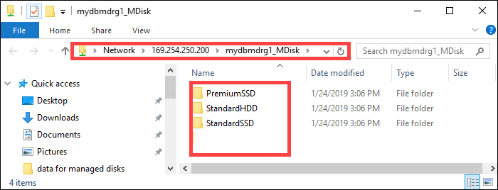
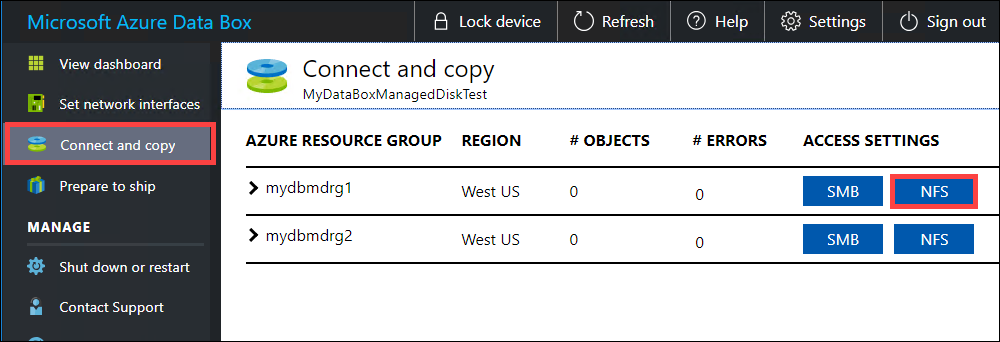
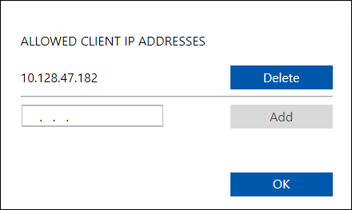
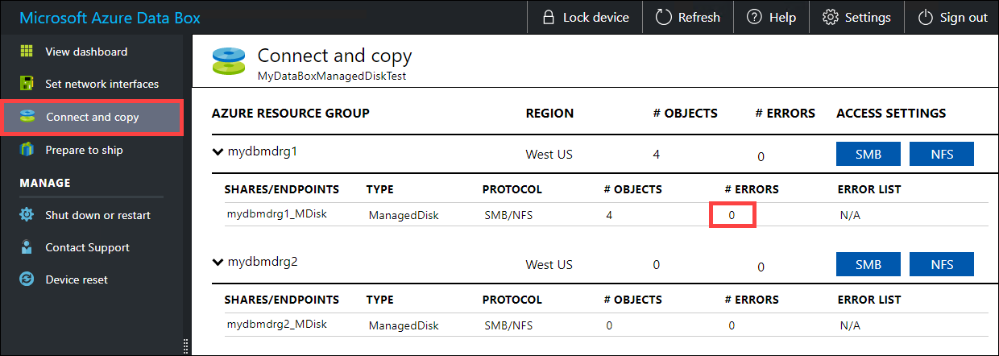
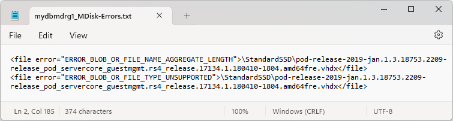
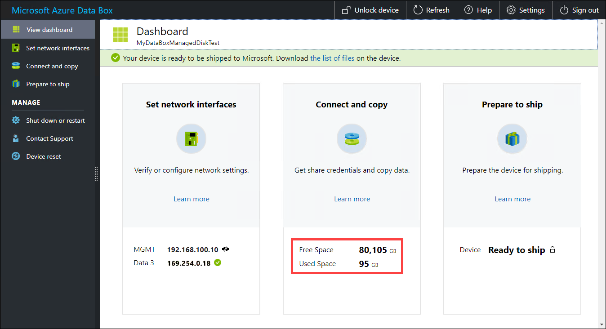

# Tutorial: Use Data Box Heavy to import data as managed disks in Azure

This tutorial describes how to use the Azure Data Box Heavy to migrate you on-premises VHDs to managed disks in Azure. The VHDs from on-premises VMs are copied to Data Box Heavy as page blobs and are uploaded into Azure as managed disks. These managed disks can then be attached to Azure VMs.

In this tutorial, you learn how to:

> [!div class="checklist"]
> * Review prerequisites
> * Connect to Data Box Heavy
> * Copy data to Data Box Heavy


## Prerequisites

Before you begin, make sure that:

1. You've completed the [Tutorial: Set up Azure Data Box Heavy](data-box-heavy-deploy-set-up.md).
2. You've received your Data Box Heavy and the order status in the portal is **Delivered**.
3. You're connected to a high-speed network. For fastest copy speeds, two 40-GbE connections (one per node) can be utilized in parallel. If you do not have 40-GbE connection available, we recommend that you have at least two 10-GbE connections (one per node). 
4. You've reviewed the:

    - Supported [managed disk sizes in Azure object size limits](data-box-heavy-limits.md#azure-object-size-limits).
    - [Introduction to Azure managed disks](/azure/virtual-machines/windows/managed-disks-overview). 

## Connect to Data Box Heavy

Based on the resource groups specified, Data Box Heavy creates one share for each associated resource group per node. For example, if `mydbmdrg1` and `mydbmdrg2` were created when placing the order, the following shares are created:

- `mydbmdrg1_MDisk`
- `mydbmdrg2_MDisk`

Within each share, the following three folders are created which correspond to containers in your storage account.

- Premium SSD
- Standard HDD
- Standard SSD

The following table shows the UNC paths to the shares on your Data Box Heavy.
 
|        Connection protocol           |             UNC path to the share                                               |
|-------------------|--------------------------------------------------------------------------------|
| SMB |`\\<DeviceIPAddress>\<ResourceGroupName_MDisk>\<Premium SSD>\file1.vhd`<br> `\\<DeviceIPAddress>\<ResourceGroupName_MDisk>\<Standard HDD>\file2.vhd`<br> `\\<DeviceIPAddress>\<ResourceGroupName_MDisk>\<Standard SSD>\file3.vhd` |  
| NFS |`//<DeviceIPAddress>/<ResourceGroup1_MDisk>/<Premium SSD>/file1.vhd`<br> `//<DeviceIPAddress>/<ResourceGroupName_MDisk>/<Standard HDD>/file2.vhd`<br> `//<DeviceIPAddress>/<ResourceGroupName_MDisk>/<Standard SSD>/file3.vhd` |

Based on whether you use SMB or NFS to connect to Data Box Heavy shares, the steps to connect are different.

> [!NOTE]
> - Connecting via REST is not supported for this feature.
> - Repeat the connect instructions to connect to the second node of Data Box Heavy.

### Connect to Data Box Heavy via SMB

If using a Windows Server host computer, follow these steps to connect to the Data Box Heavy.

1. The first step is to authenticate and start a session. Go to **Connect and copy**. Click **Get credentials** to get the access credentials for the shares associated with your resource group. You can also get the access credentials from the **Device details** in the Azure portal.

    > [!NOTE]
    > The credentials for all the shares for managed disks are identical.

    

2. From the Access share and copy data dialog box, copy the **Username** and the **Password** for the share. Click **OK**.
    
    

3. To access the shares associated with your resource (*mydbmdrg1* in the following example) from your host computer, open a command window. At the command prompt, type:

    `net use \\<IP address of the device>\<share name>  /u:<user name for the share>`

    Your UNC share paths in this example are as follows:

    - `\\169.254.250.200\mydbmdrg1_MDisk`
    - `\\169.254.250.200\mydbmdrg2_MDisk`
    
4. Enter the password for the share when prompted. The following sample shows connecting to a share via the preceding command.

    ```
    C:\>net use \\169.254.250.200\mydbmdrgl_MDisk /u:mdisk
    Enter the password for ‘mdisk’ to connect to '169.254.250.200':
    The command completed successfully.
    C: \>
    ```

4. Press  Windows + R. In the **Run** window, specify the `\\<device IP address>\<ShareName>`. Click **OK** to open File Explorer.
    
    

    You should now see the following precreated folders within each share.
    
    


### Connect to Data Box Heavy via NFS

If you are using a Linux host computer, perform the following steps to configure your device to allow access to NFS clients.

1. Supply the IP addresses of the allowed clients that can access the share. In the local web UI, go to **Connect and copy** page. Under **NFS settings**, click **NFS client access**.

    

2. Supply the IP address of the NFS client and click **Add**. You can configure access for multiple NFS clients by repeating this step. Click **OK**.

    

2. Ensure that the Linux host computer has a [supported version](data-box-system-requirements.md) of NFS client installed. Use the specific version for your Linux distribution.

3. Once the NFS client is installed, use the following command to mount the NFS share on your device:

    `sudo mount <Data Box or Data Box Heavy IP>:/<NFS share on Data Box or Data Box Heavy device> <Path to the folder on local Linux computer>`

    The following example shows how to connect via NFS to a Data Box or Data Box Heavy share. The Data Box or Data Box Heavy device IP is `169.254.250.200`, the share `mydbmdrg1_MDisk` is mounted on the ubuntuVM, mount point being `/home/databoxubuntuhost/databox`.

    `sudo mount -t nfs 169.254.250.200:/mydbmdrg1_MDisk /home/databoxubuntuhost/databox`


## Copy data to Data Box Heavy

After you're connected to the data server, the next step is to copy data. The VHD file is copied to the staging storage account as page blob. The page blob is then converted to a managed disk and moved to a resource group.

Review the following considerations before you begin data copy:

- Always copy the VHDs to one of the precreated folders. If you copy the VHDs outside of these folders or in a folder that you created, the VHDs will be uploaded to Azure Storage account as page blobs and not managed disks.
- Only the fixed VHDs can be uploaded to create managed disks. VHDX files or dynamic and differencing VHDs are not supported.
- You can only have one managed disk with a given name in a resource group across all the precreated folders. This implies that the VHDs uploaded to the precreated folders should have unique names. Make sure that the given name does not match an already existing managed disk in a resource group.
- Review managed disk limits in [Azure object size limits](data-box-heavy-limits.md#azure-object-size-limits).

Depending on whether you are connecting via SMB or NFS, you can use:

- [Copy data via SMB](data-box-heavy-deploy-copy-data.md#copy-data-to-data-box-heavy)
- [Copy data via NFS](data-box-heavy-deploy-copy-data-via-nfs.md#copy-data-to-data-box-heavy)

Wait for the copy jobs to finish. Make sure that the copy jobs have finished with no errors before you go to the next step.



If there are errors during the copy process, download the logs from the **Connect and copy** page.

- If you copied a file that is not 512 bytes aligned, the file isn't uploaded as page blob to your staging storage account. You will see an error in the logs. Remove the file and copy a file that is 512 bytes aligned.

- If you copied a VHDX (these files are not supported) with a long name, you will see an error in the logs.

    

    Resolve the errors before you proceed to the next step.

To ensure data integrity, checksum is computed inline as the data is copied. Once the copy is complete, verify the used space and the free space on your device.
    


Once the copy job is finished, you can go to **Prepare to ship**.


## Next steps

In this tutorial, you learned about Azure Data Box Heavy topics such as:

> [!div class="checklist"]
> * Review prerequisites
> * Connect to Data Box Heavy
> * Copy data to Data Box Heavy


Advance to the next tutorial to learn how to ship your Data Box Heavy back to Microsoft.

> [!div class="nextstepaction"]
> [Ship your Azure Data Box Heavy to Microsoft](./data-box-heavy-deploy-picked-up.md)

