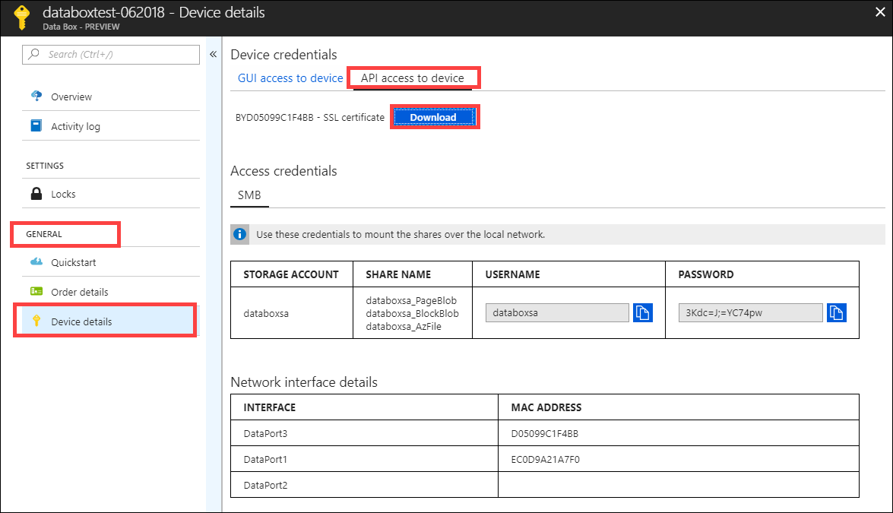
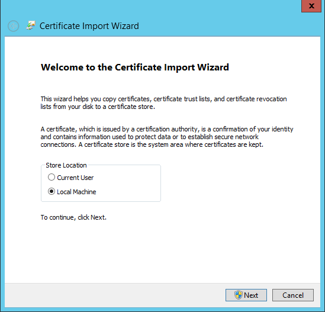
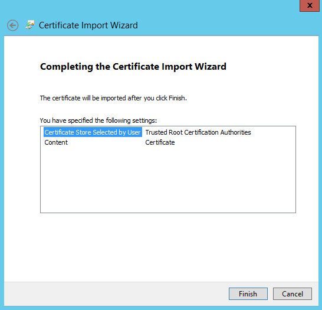
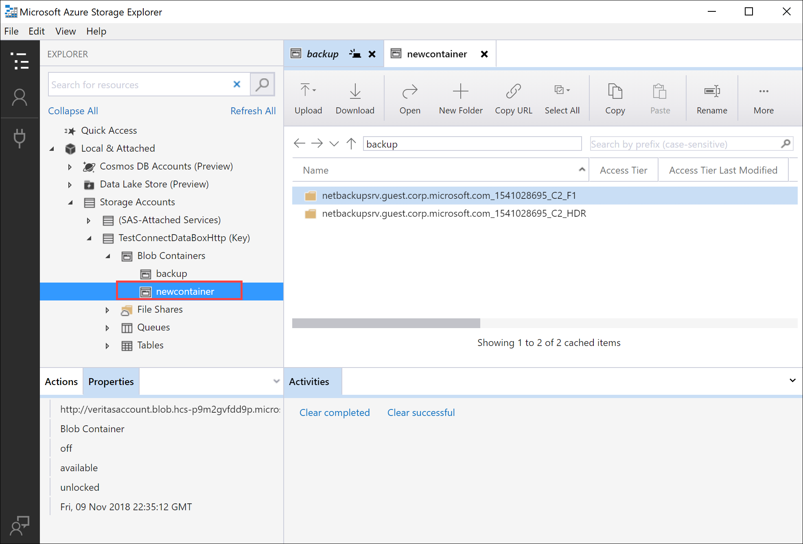

# Tutorial: Copy data to Azure Data Box Blob storage via REST APIs  

This tutorial describes procedures to connect to Azure Data Box Blob storage via REST APIs over *http* or *https*. Once connected, the steps required to copy the data to Data Box Blob storage are described.

In this tutorial, you learn how to:

> [!div class="checklist"]
> * Prerequisites
> * Connect to Data Box Blob storage via *http* or *https*
> * Copy data to Data Box Heavy

## Prerequisites

Before you begin, make sure that:

1. You've completed the [Tutorial: Set up Azure Data Box Heavy](data-box-heavy-deploy-set-up.md).
2. You've received your Data Box Heavy and the order status in the portal is **Delivered**.
3. You've reviewed the [system requirements for Data Box Blob storage](data-box-system-requirements-rest.md) and are familiar with supported versions of APIs, SDKs, and tools.
4. You've access to a host computer that has the data that you want to copy over to Data Box Heavy. Your host computer must
    - Run a [Supported operating system](data-box-system-requirements.md).
    - Be connected to a high-speed network. For fastest copy speeds, two 40-GbE connections (one per node) can be utilized in parallel. If you do not have 40-GbE connection available, we recommend that you have at least two 10-GbE connections (one per node). 
5. [Download AzCopy 7.1.0](https://aka.ms/azcopyforazurestack20170417) on your host computer. You'll use AzCopy to copy data to Azure Data Box Blob storage from your host computer.


## Connect via http or https

You can connect to Data Box Blob storage over *http* or *https*.

- *Https* is the secure and recommended way to connect to Data Box Blob storage.
- *Http* is used  when connecting over trusted networks.

The steps to connect are different when you connect to Data Box Blob storage over *http* or *https*.

## Connect via http

Connection to Data Box Blob storage REST APIs over *http* requires the following steps:

- Add the device IP and blob service endpoint to the remote host
- Configure third-party software and verify the connection

Each of these steps is described in the following sections.

> [!IMPORTANT]
> For Data Box Heavy, you'll need to repeat all the connection instructions to connect to the second node.

### Add device IP address and blob service endpoint

[!INCLUDE [data-box-add-device-ip](../../includes/data-box-add-device-ip.md)]


### Configure partner software and verify connection

[!INCLUDE [data-box-configure-partner-software](../../includes/data-box-configure-partner-software.md)]

[!INCLUDE [data-box-verify-connection](../../includes/data-box-verify-connection.md)]

## Connect via https

Connection to Azure Blob storage REST APIs over https requires the following steps:

- Download the certificate from Azure portal
- Import the certificate on the client or remote host
- Add the device IP and blob service endpoint to the client or remote host
- Configure third-party software and verify the connection

Each of these steps is described in the following sections.

> [!IMPORTANT]
> For Data Box Heavy, you'll need to repeat all the connection instructions to connect to the second node.

### Download certificate

Use the Azure portal to download certificate.

1. Sign into the Azure portal.
2. Go to your Data Box order and navigate to **General > Device details**.
3. Under **Device credentials**, go to **API access** to device. Click **Download**. This action downloads a **\<your order name>.cer** certificate file. **Save** this file. You will install this certificate on the client or host computer that you will use to connect to the device.

    
 
### Import certificate 

Accessing Data Box Blob storage over HTTPS requires an SSL certificate for the device. The way in which this certificate is made available to the client application varies from application to application and across operating systems and distributions. Some applications can access the certificate after it is imported into the system’s certificate store, while other applications do not make use of that mechanism.

Specific information for some applications is mentioned in this section. For more information on other applications, consult the documentation for the application and the operating system used.

Follow these steps to import the `.cer` file into the root store of a Windows or Linux client. On a Windows system, you can use Windows PowerShell or the Windows Server UI to import and install the certificate on your system.

#### Use Windows PowerShell

1. Start a Windows PowerShell session as an administrator.
2. At the command prompt, type:

    ```
    Import-Certificate -FilePath C:\temp\localuihttps.cer -CertStoreLocation Cert:\LocalMachine\Root
    ```

#### Use Windows Server UI

1.	Right-click the `.cer` file and select **Install certificate**. This action starts the Certificate Import Wizard.
2.	For **Store location**, select **Local Machine**, and then click **Next**.

    

3.	Select **Place all certificates in the following store**, and then click **Browse**. Navigate to the root store of your remote host, and then click **Next**.

    

4.	Click **Finish**. A message that tells you that the import was successful appears.

    

#### Use a Linux system

The method to import a certificate varies by distribution.

> [!IMPORTANT]
> For Data Box Heavy, you'll need to repeat all the connection instructions to connect to the second node.

Several, such as Ubuntu and Debian, use the `update-ca-certificates` command.  

- Rename the Base64-encoded certificate file to have a `.crt` extension and copy it into the `/usr/local/share/ca-certificates directory`.
- Run the command `update-ca-certificates`.

Recent versions of RHEL, Fedora, and CentOS use the `update-ca-trust` command.

- Copy the certificate file into the `/etc/pki/ca-trust/source/anchors` directory.
- Run `update-ca-trust`.

Consult the documentation specific to your distribution for details.

### Add device IP address and blob service endpoint 

Follow the same steps to [add device IP address and blob service endpoint when connecting over *http*](#add-device-ip-address-and-blob-service-endpoint).

### Configure partner software and verify connection

Follow the steps to [Configure partner software that you used while connecting over *http*](#configure-partner-software-and-verify-connection). The only difference is that you should leave the *Use http option* unchecked.

## Copy data to Data Box Heavy

Once you are connected to the Data Box Blob storage, the next step is to copy data. Prior to data copy, review the following considerations:

-  While copying data, ensure that the data size conforms to the size limits described in the [Azure storage and Data Box Heavy limits](data-box-limits.md).
- If data, which is being uploaded by Data Box Heavy, is concurrently uploaded by other applications outside of Data Box Heavy, this may result in upload job failures and data corruption.

In this tutorial, AzCopy is used to copy data to Data Box Blob storage. You can also use Azure Storage Explorer (if you prefer a GUI-based tool) or a partner software to copy the data.

The copy procedure has the following steps:

- Create a container
- Upload contents of a folder to Data Box Blob storage
- Upload modified files to Data Box Blob storage


Each of these steps is described in detail in the following sections.

> [!IMPORTANT]
> For Data Box Heavy, you'll need to repeat all the copy instructions to copy data to the second node.

### Create a container

The first step is to create a container, because blobs are always uploaded into a container. Containers organize groups of blobs like you organize files in folders on your computer. Follow these steps to create a blob container.

1. Open Storage Explorer.
2. In the left pane, expand the storage account within which you wish to create the blob container.
3. Right-click **Blob Containers**, and from the context menu, select **Create Blob Container**.

   

4. A text box appears below the **Blob Containers** folder. Enter the name for your blob container. See the [Create the container and set permissions](../storage/blobs/storage-quickstart-blobs-dotnet.md) for information on rules and restrictions on naming blob containers.
5. Press **Enter** when done to create the blob container, or **Esc** to cancel. Once the blob container is successfully created, it is displayed under the **Blob Containers** folder for the selected storage account.

   

### Upload contents of a folder to Data Box Blob storage

Use AzCopy to upload all files in a folder to Blob storage on Windows or Linux. To upload all blobs in a folder, enter the following AzCopy command:

#### Linux

    azcopy \
        --source /mnt/myfolder \
        --destination https://data-box-storage-account-name.blob.device-serial-no.microsoftdatabox.com/container-name/files/ \
        --dest-key <key> \
        --recursive

#### Windows

    AzCopy /Source:C:\myfolder /Dest:https://data-box-storage-account-name.blob.device-serial-no.microsoftdatabox.com/container-name/files/ /DestKey:<key> /S


Replace `<key>` with your account key. To get your account key, in the Azure portal, go to your storage account. Go to **Settings > Access keys**, select a key, and paste it into the AzCopy command.

If the specified destination container does not exist, AzCopy creates it and uploads the file into it. Update the source path to your data directory, and replace `data-box-storage-account-name` in the destination URL with the name of the storage account associated with your Data Box.

To upload the contents of the specified directory to Blob storage recursively, specify the `--recursive` (Linux) or `/S` (Windows) option. When you run AzCopy with one of these options, all subfolders and their files are uploaded as well.

### Upload modified files to Data Box Blob storage

Use AzCopy to upload files based on their last-modified time. To try this, modify or create new files in your source directory for test purposes. To upload only updated or new files, add the `--exclude-older` (Linux) or `/XO` (Windows) parameter to the AzCopy command.

If you only want to copy source resources that do not exist in the destination, specify both `--exclude-older` and `--exclude-newer` (Linux) or `/XO` and `/XN` (Windows) parameters in the AzCopy command. AzCopy uploads only the updated data, based on its time stamp.

#### Linux
    azcopy \
    --source /mnt/myfolder \
    --destination https://data-box-heavy-storage-account-name.blob.device-serial-no.microsoftdatabox.com/container-name/files/ \
    --dest-key <key> \
    --recursive \
    --exclude-older

#### Windows

    AzCopy /Source:C:\myfolder /Dest:https://data-box-heavy-storage-account-name.blob.device-serial-no.microsoftdatabox.com/container-name/files/ /DestKey:<key> /S /XO

If there are any errors during the connect or copy operation, see [Troubleshoot issues with Data Box Blob storage](data-box-troubleshoot-rest.md).

Next step is to prepare your device to ship.

## Next steps

In this tutorial, you learned about Azure Data Box topics such as:

> [!div class="checklist"]
> * Prerequisites
> * Connect to Data Box Blob storage via *http* or *https*
> * Copy data to Data Box Heavy


Advance to the next tutorial to learn how to ship your Data Box back to Microsoft.

> [!div class="nextstepaction"]
> [Ship your Azure Data Box Heavy to Microsoft](./data-box-heavy-deploy-picked-up.md)
