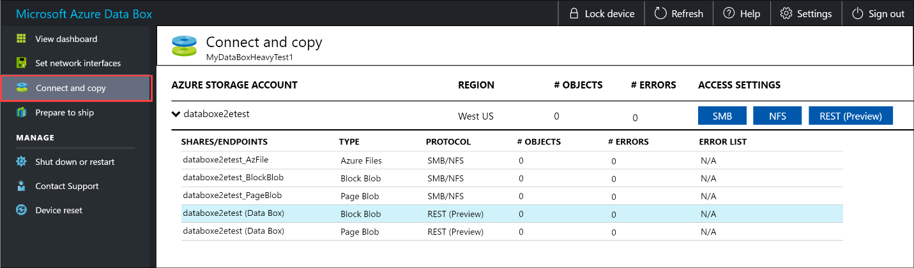
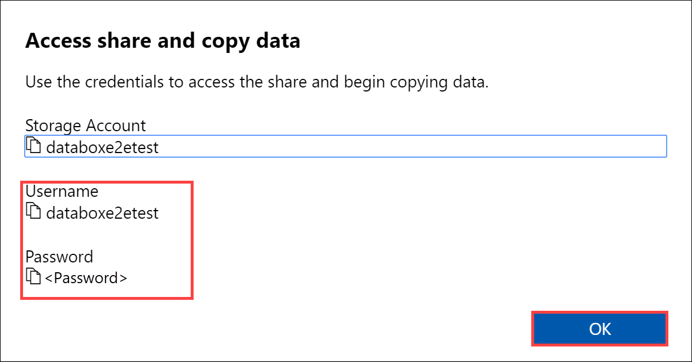
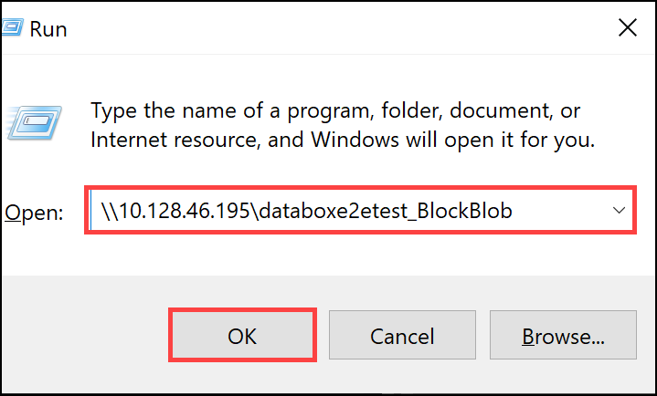
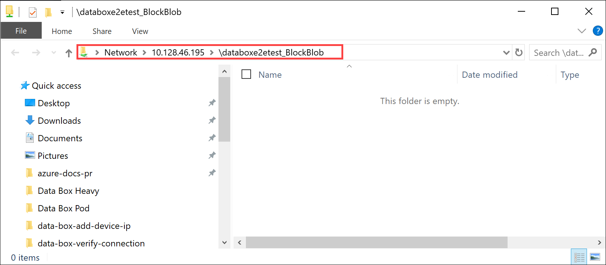
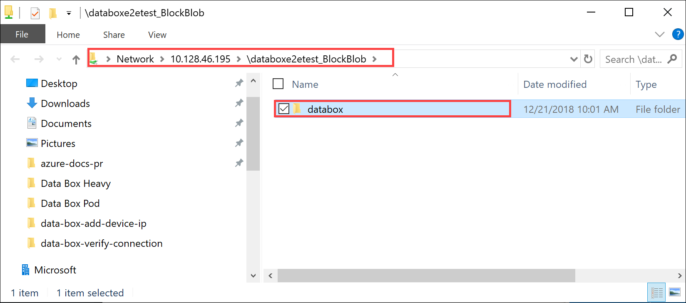
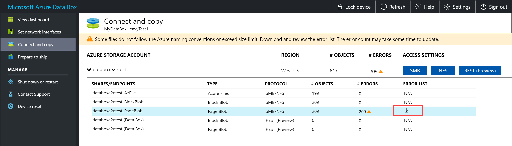
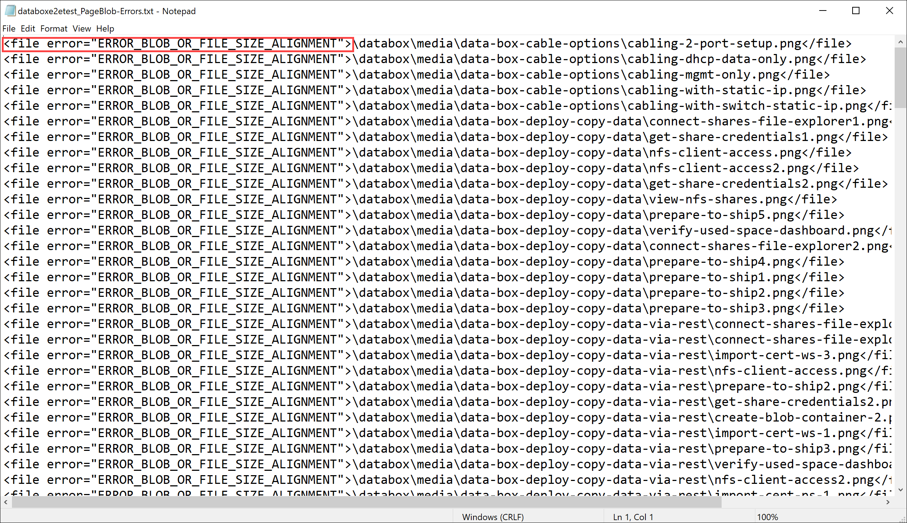
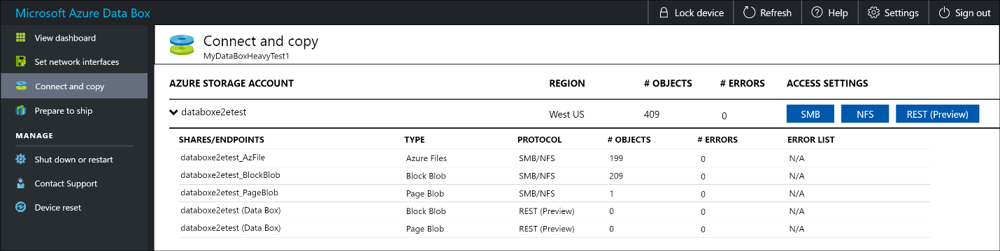
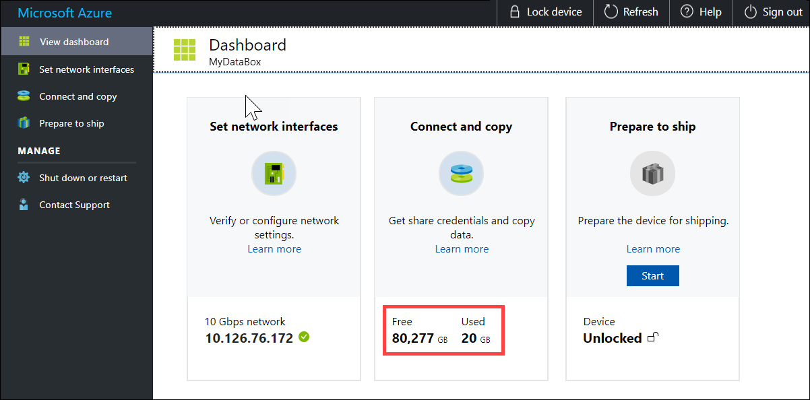

::: zone target = "docs"

# Tutorial: Copy data to Azure Data Box Heavy via SMB

::: zone-end

::: zone target = "chromeless"

## Copy data to Azure Data Box Heavy

::: zone-end

::: zone target = "docs"

This tutorial describes how to connect to and copy data from your host computer using the local web UI.

In this tutorial, you learn how to:

> [!div class="checklist"]
> * Connect to Data Box Heavy
> * Copy data to Data Box Heavy

::: zone-end

::: zone target = "chromeless"

You can copy data from your source server to your Data Box via SMB, NFS, REST, data copy service or to managed disks.

In each case, make sure that the share and folder names, and the data size follow guidelines described in the [Azure Storage and Data Box Heavy service limits](data-box-heavy-limits.md).

::: zone-end

::: zone target = "docs"

## Prerequisites

Before you begin, make sure that:

1. You've completed the [Tutorial: Set up Azure Data Box Heavy](data-box-deploy-set-up.md).
2. You've received your Data Box Heavy and the order status in the portal is **Delivered**.
3. You have a host computer that has the data that you want to copy over to Data Box Heavy. Your host computer must
    - Run a [Supported operating system](data-box-system-requirements.md).
    - Be connected to a high-speed network. For fastest copy speeds, two 40-GbE connections (one per node) can be utilized in parallel. If you do not have 40-GbE connection available, we recommend that you have at least two 10-GbE connections (one per node).
   

## Connect to Data Box Heavy shares

Based on the storage account selected, Data Box Heavy creates up to:
- Three shares for each associated storage account for GPv1 and GPv2.
- One share for premium storage.
- One share for blob storage account.

These shares are created on both the nodes of the device.

Under block blob and page blob shares:
- First-level entities are containers.
- Second-level entities are blobs.

Under shares for Azure Files:
- First-level entities are shares.
- Second-level entities are files.

The following table shows the UNC path to the shares on your Data Box Heavy and Azure Storage path URL where the data is uploaded. The final Azure Storage path URL can be derived from the UNC share path.
 
|                   |                                                            |
|-------------------|--------------------------------------------------------------------------------|
| Azure Block blobs | <li>UNC path to shares: `\\<DeviceIPAddress>\<StorageAccountName_BlockBlob>\<ContainerName>\files\a.txt`</li><li>Azure Storage URL: `https://<StorageAccountName>.blob.core.windows.net/<ContainerName>/files/a.txt`</li> |  
| Azure Page blobs  | <li>UNC path to shares: `\\<DeviceIPAddres>\<StorageAccountName_PageBlob>\<ContainerName>\files\a.txt`</li><li>Azure Storage URL: `https://<StorageAccountName>.blob.core.windows.net/<ContainerName>/files/a.txt`</li>   |  
| Azure Files       |<li>UNC path to shares: `\\<DeviceIPAddres>\<StorageAccountName_AzFile>\<ShareName>\files\a.txt`</li><li>Azure Storage URL: `https://<StorageAccountName>.file.core.windows.net/<ShareName>/files/a.txt`</li>        |      

The steps to connect using a Windows or a Linux client are different.

> [!NOTE]
> Follow the same steps to connect to both the nodes of the device in parallel.

### Connect on a Windows system

If using a Windows Server host computer, follow these steps to connect to the Data Box Heavy.

1. The first step is to authenticate and start a session. Go to **Connect and copy**. Click **Get credentials** to get the access credentials for the shares associated with your storage account.

    

2. In the Access share and copy data dialog box, copy the **Username** and the **Password** corresponding to the share. Click **OK**.
    
    

3. To access the shares associated with your storage account (*databoxe2etest* in the following example) from your host computer, open a command window. At the command prompt, type:

    `net use \\<IP address of the device>\<share name>  /u:<user name for the share>`

    Depending upon your data format, the share paths are as follows:
    - Azure Block blob - `\\10.100.10.100\databoxe2etest_BlockBlob`
    - Azure Page blob - `\\10.100.10.100\databoxe2etest_PageBlob`
    - Azure Files - `\\10.100.10.100\databoxe2etest_AzFile`
    
4. Enter the password for the share when prompted. The following sample shows connecting to a share via the preceding command.

    ```
    C:\Users\Databoxuser>net use \\10.100.10.100\databoxe2etest_BlockBlob /u:databoxe2etest
    Enter the password for 'databoxe2etest' to connect to '10.100.10.100':
    The command completed successfully.
    ```

4. Press  Windows + R. In the **Run** window, specify the `\\<device IP address>`. Click **OK** to open File Explorer.
    
    

    You should now see the shares as folders.
    
    

    **Always create a folder for the files that you intend to copy under the share and then copy the files to that folder**. The folder created under block blob and page blob shares represents a container to which data is uploaded as blobs. You cannot copy files directly to *root* folder in the storage account.
    
### Connect on a Linux system

If using a Linux client, use the following command to mount the SMB share.

```
sudo mount -t nfs -o vers=2.1 10.126.76.172:/databoxe2etest_BlockBlob /home/databoxubuntuhost/databox
```

The `vers` parameter is the version of SMB that your Linux host supports. Plug in the appropriate version in the above command.

For versions of SMB that the Data Box Heavy supports, see [Supported file systems for Linux clients](data-box-heavy-system-requirements.md#supported-file-systems-for-linux-clients).

## Copy data to Data Box Heavy

Once you're connected to the Data Box Heavy shares, the next step is to copy data.

### Copy considerations

Before you begin the data copy, review the following considerations:

- Make sure that you copy the data to shares that correspond to the appropriate data format. For instance, copy the block blob data to the share for block blobs. Copy the VHDs to page blob.

    If the data format doesn't match the appropriate share type, then at a later step, the data upload to Azure will fail.
-  While copying data, make sure that the data size conforms to the size limits described in the [Azure storage and Data Box Heavy limits](data-box-heavy-limits.md).
- If data, which is being uploaded by Data Box Heavy, is concurrently uploaded by other applications outside of Data Box Heavy, then this could result in upload job failures and data corruption.
- We recommend that:
    - You don't use both SMB and NFS at the same time.
    - Copy the same data to same end destination on Azure.
     
  In these cases, the final outcome can't be determined.
- Always create a folder for the files that you intend to copy under the share and then copy the files to that folder. The folder created under block blob and page blob shares represents a container to which the data is uploaded as blobs. You cannot copy files directly to *root* folder in the storage account.

After you've connected to the SMB share, begin data copy.

1. You can use any SMB compatible file copy tool such as Robocopy to copy your data. Multiple copy jobs can be initiated using Robocopy. Use the following command:
    
    ```
    robocopy <Source> <Target> * /e /r:3 /w:60 /is /nfl /ndl /np /MT:32 or 64 /fft /Log+:<LogFile>
    ```
    The attributes are described in the following table.
    
    |Attribute  |Description  |
    |---------|---------|
    |/e      |Copies subdirectories including empty directories.         |
    |/r:     |Specifies the number of retries on failed copies.         |
    |/w:     |Specifies the wait time between retries, in seconds.         |
    |/is     |Includes the same files.         |
    |/nfl    |Specifies that file names aren't logged.         |
    |/ndl    |Specifies that directory names aren't logged.        |
    |/np     |Specifies that the progress of the copying operation (the number of files or directories copied so far) will not be displayed. Displaying the progress significantly lowers the performance.         |
    |/MT     | Use multithreading, recommended 32 or 64 threads. This option not used with encrypted files. You may need to separate encrypted and unencrypted files. However, single threaded copy significantly lowers the performance.           |
    |/fft    | Use to reduce the time stamp granularity for any file system.        |
    |/b      | Copies files in Backup mode.        |
    |/z      | Copies files in Restart mode, use this if the environment is unstable. This option reduces throughput due to additional logging.      |
    | /zb    | Uses Restart mode. If access is denied, this option uses Backup mode. This option reduces throughput due to checkpointing.         |
    |/efsraw | Copies all encrypted files in EFS raw mode. Use only with encrypted files.         |
    |log+:\<LogFile>| Appends the output to the existing log file.|
    
 
    The following sample shows the output of the robocopy command to copy files to the Data Box Heavy.

    ```   
    C:\Users>Robocopy C:\Git\azure-docs-pr\contributor-guide \\10.100.10.100\devicemanagertest1_AzFile\templates /MT:24
    -------------------------------------------------------------------------------
        ROBOCOPY     ::     Robust File Copy for Windows
    -------------------------------------------------------------------------------
        Started : Thursday, April 4, 2019 2:34:58 PM
        Source : C:\Git\azure-docs-pr\contributor-guide\
        Dest : \\10.100.10.100\devicemanagertest1_AzFile\templates\
        Files : *.*
        Options : *.* /DCOPY:DA /COPY:DAT /MT:24 /R:5 /W:60
    ------------------------------------------------------------------------------
    
    100%        New File                 206        C:\Git\azure-docs-pr\contributor-guide\article-metadata.md
    100%        New File                 209        C:\Git\azure-docs-pr\contributor-guide\content-channel-guidance.md
    100%        New File                 732        C:\Git\azure-docs-pr\contributor-guide\contributor-guide-index.md
    100%        New File                 199        C:\Git\azure-docs-pr\contributor-guide\contributor-guide-pr-criteria.md
                New File                 178        C:\Git\azure-docs-pr\contributor-guide\contributor-guide-pull-request-co100%  .md
                New File                 250        C:\Git\azure-docs-pr\contributor-guide\contributor-guide-pull-request-et100%  e.md
    100%        New File                 174        C:\Git\azure-docs-pr\contributor-guide\create-images-markdown.md
    100%        New File                 197        C:\Git\azure-docs-pr\contributor-guide\create-links-markdown.md
    100%        New File                 184        C:\Git\azure-docs-pr\contributor-guide\create-tables-markdown.md
    100%        New File                 208        C:\Git\azure-docs-pr\contributor-guide\custom-markdown-extensions.md
    100%        New File                 210        C:\Git\azure-docs-pr\contributor-guide\file-names-and-locations.md
    100%        New File                 234        C:\Git\azure-docs-pr\contributor-guide\git-commands-for-master.md
    100%        New File                 186        C:\Git\azure-docs-pr\contributor-guide\release-branches.md
    100%        New File                 240        C:\Git\azure-docs-pr\contributor-guide\retire-or-rename-an-article.md
    100%        New File                 215        C:\Git\azure-docs-pr\contributor-guide\style-and-voice.md
    100%        New File                 212        C:\Git\azure-docs-pr\contributor-guide\syntax-highlighting-markdown.md
    100%        New File                 207        C:\Git\azure-docs-pr\contributor-guide\tools-and-setup.md
    ------------------------------------------------------------------------------
    
                    Total    Copied   Skipped  Mismatch    FAILED    Extras
        Dirs :         1         1         1         0         0         0
        Files :        17        17         0         0         0         0
        Bytes :     3.9 k     3.9 k         0         0         0         0          
    C:\Users>
    ```       

2. To optimize the performance, use the following robocopy parameters when copying the data. (The numbers below represent the best case scenarios.)

    | Platform    | Mostly small files < 512 KB    | Mostly medium files 512 KB-1 MB  | Mostly large files > 1 MB                             |
    |-------------|--------------------------------|----------------------------|----------------------------|
    | Data Box Heavy | 6 Robocopy sessions <br> 24 threads per sessions | 6 Robocopy sessions <br> 16 threads per sessions | 6 Robocopy sessions <br> 16 threads per sessions |


    For more information on Robocopy command, go to [Robocopy and a few examples](https://social.technet.microsoft.com/wiki/contents/articles/1073.robocopy-and-a-few-examples.aspx).

3. Open the target folder to view and verify the copied files.

    


4. As the data is copied:

    - The file names, sizes, and format are validated to ensure those meet the Azure object and storage limits as well as Azure file and container naming conventions.
    - To ensure data integrity, checksum is also computed inline.

    If you have any errors during the copy process, download the error files for troubleshooting. Select the arrow icon to download the error files.

    

    For more information, see [View error logs during data copy to Data Box Heavy](data-box-logs.md#view-error-log-during-data-copy). For a detailed list of errors during data copy, see [Troubleshoot Data Box Heavy issues](data-box-troubleshoot.md).

5. Open the error file in Notepad. The following error file indicates that the data is not aligned correctly.

    
    
    For a page blob, the data needs to be 512 bytes aligned. After this data is removed, the error resolves as shown in the following screenshot.

    

6. After the copy is complete, go to **View Dashboard** page. Verify the used space and the free space on your device.
    
    

Repeat the above steps to copy data on to the second node of the device.

## Next steps

In this tutorial, you learned about Azure Data Box Heavy topics such as:

> [!div class="checklist"]
> * Connect to Data Box Heavy
> * Copy data to Data Box Heavy


Advance to the next tutorial to learn how to ship your Data Box Heavy back to Microsoft.

> [!div class="nextstepaction"]
> [Ship your Azure Data Box Heavy to Microsoft](./data-box-heavy-deploy-picked-up.md)

::: zone-end

::: zone target = "chromeless"

### Copy data via SMB

1. If using a Windows host, use the following command to connect to the SMB shares:

    `\\<IP address of your device>\ShareName`

2. To get the share access credentials, go to the **Connect & copy** page in the local web UI of the Data Box.

3. Use an SMB compatible file copy tool such as Robocopy to copy data to shares.

For step-by-step instructions, go to [Tutorial: Copy data to Azure Data Box via SMB](data-box-heavy-deploy-copy-data.md).

### Copy data via NFS

1. If using an NFS host, use the following command to mount the NFS shares:

    `sudo mount <Data Box device IP>:/<NFS share on Data Box device> <Path to the folder on local Linux computer>`

2. To get the share access credentials, go to the **Connect & copy page** in the local web UI of the Data Box Heavy.
3. Use `cp` or `rsync` command to copy your data. 
4. Repeat these steps to connect and copy data to the second node of your Data Box Heavy.

For step-by-step instructions, go to [Tutorial: Copy data to Azure Data Box via NFS](data-box-heavy-deploy-copy-data-via-nfs.md).

### Copy data via REST

1. To copy data using Data Box Blob storage via REST APIs, you can connect over *http* or *https*.
2. To copy data to Data Box Blob storage, you can use AzCopy.
3. Repeat these steps to connect and copy data to the second node of your Data Box Heavy.

For step-by-step instructions, go to [Tutorial: Copy data to Azure Data Box Blob storage via REST APIs](data-box-heavy-deploy-copy-data-via-rest.md).

### Copy data via data copy service

1. To copy data by using the data copy service, you need to create a job. In the local web UI of your Data Box Heavy, go to **Manage > Copy data > Create**.
2. Fill out the parameters and create a job.
3. Repeat these steps to connect and copy data to the second node of your Data Box Heavy.

For step-by-step instructions, go to [Tutorial: Use the data copy service to copy data into Azure Data Box Heavy](data-box-heavy-deploy-copy-data-via-copy-service.md).

### Copy data to managed disks

1. When ordering the Data Box Heavy device, you should have selected managed disks as your storage destination.
2. You can connect to Data Box Heavy via SMB or NFS shares.
3. You can then copy data via SMB or NFS tools.
4. Repeat these steps to connect and copy data to the second node of your Data Box Heavy.

For step-by-step instructions, go to [Tutorial: Use Data Box Heavy to import data as managed disks in Azure](data-box-heavy-deploy-copy-data-from-vhds.md).

::: zone-end


