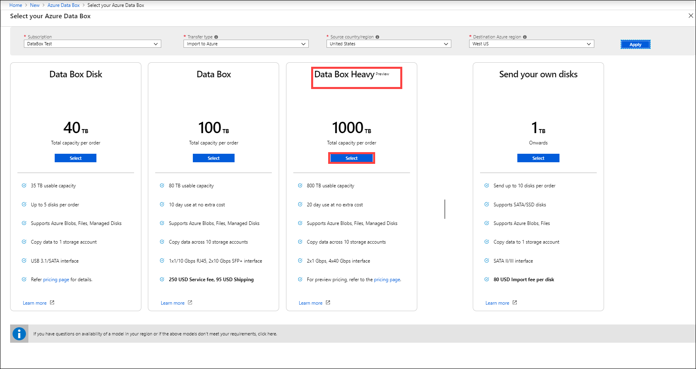
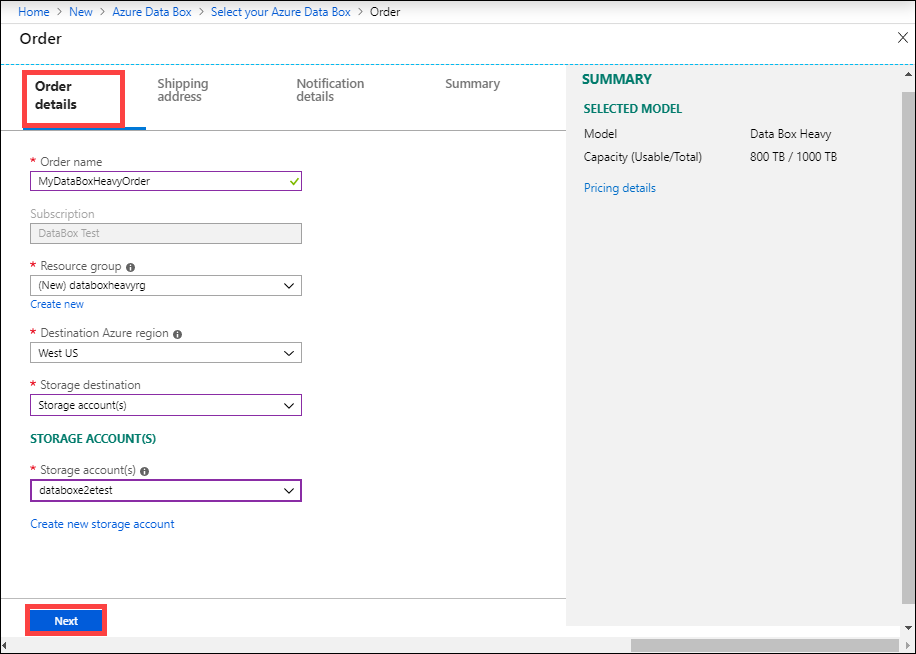
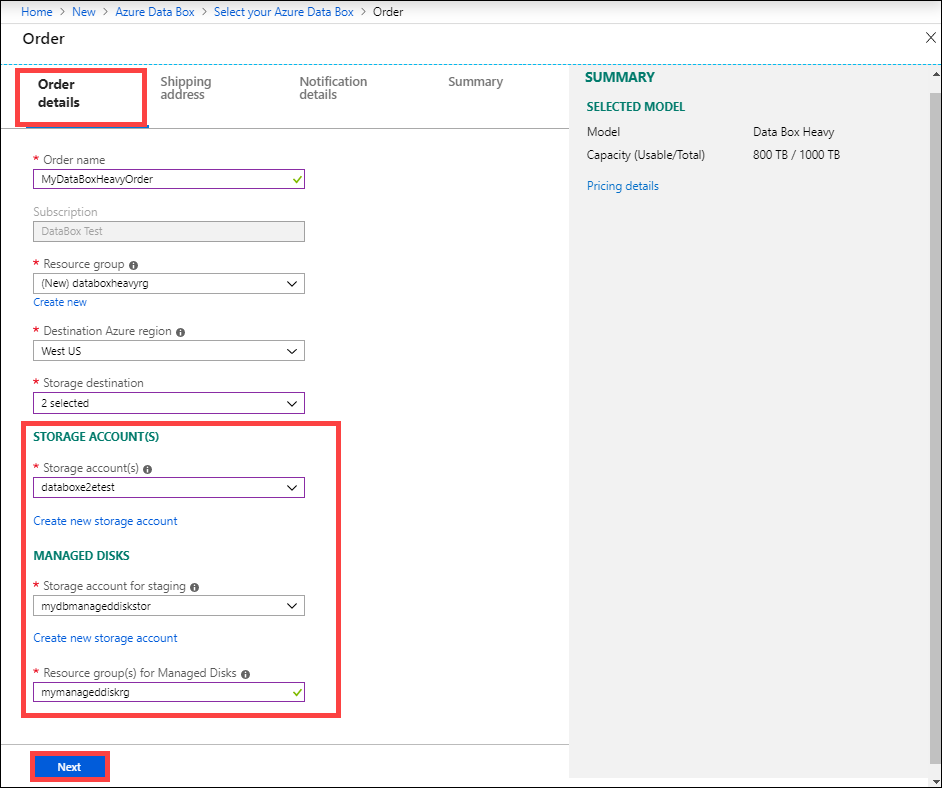

# Tutorial: Order Azure Data Box Heavy

Azure Data Box Heavy is a hybrid solution that allows you to import your on-premises data into Azure in a quick, easy, and reliable way. You transfer your data to a Microsoft-supplied 770 TB (approximate usable capacity) storage device and then ship the device back. This data is then uploaded to Azure.

This tutorial describes how you can order an Azure Data Box Heavy. In this tutorial, you learn about:

> [!div class="checklist"]
> * Prerequisites for Data Box Heavy
> * Order a Data Box Heavy
> * Track the order
> * Cancel the order

## Prerequisites

Complete the following configuration prerequisites for Data Box service and device before you deploy the device.

### For installation site

Before you begin, make sure that:

- The device fits through standard doorways and entryways. However, do make sure that the device can fit through all your entryways. Device dimensions are: width: 26" length: 48" height: 28".
- If installed on a floor other than the ground floor, you need access for the device via an elevator or a ramp. The device weighs approximately ~500 lbs.
- Make sure that you have a flat site in the datacenter with proximity to an available network connection that can accommodate a device with this footprint.

### For service

[!INCLUDE [Data Box service prerequisites](../../includes/data-box-supported-subscriptions.md)]

### For device

Before you begin, make sure that:
- Your device is unpacked.
- You should have a host computer connected to the datacenter network. Data Box Heavy will copy the data from this computer. Your host computer must run a supported operating system as described in [Azure Data Box Heavy system requirements](data-box-system-requirements.md).
- You need to have a laptop with RJ-45 cable to connect to the local UI and configure the device. Use the laptop to configure each node of the device once.
- Your datacenter needs to have high-speed network. We strongly recommend that you have at least one 10 GbE connection.
- You need one 40 Gbps or 10 Gbps cable per device node. Choose cables that are compatible with the [Mellanox MCX314A-BCCT](https://store.mellanox.com/products/mellanox-mcx314a-bcct-connectx-3-pro-en-network-interface-card-40-56gbe-dual-port-qsfp-pcie3-0-x8-8gt-s-rohs-r6.html) network interface:

    - For the 40 Gbps cable, device end of the cable needs to be QSFP+.
    - For the 10 Gbps cable, you need an SFP+ cable that plugs into a 10 G switch on one end, with a QSFP+ to SFP+ adapter (or the QSA adapter) for the end that plugs into the device.
    - The power cables are included with the device.

## Order Data Box Heavy

Perform the following steps in the Azure portal to order a device.

1. Use your Microsoft Azure credentials to sign in at this URL: [https://portal.azure.com](https://portal.azure.com).
2. Select **+ Create a resource** and search for *Azure Data Box*. Select **Azure Data Box**.
    
   

3. Select **Create**.

4. Check if the Data Box service is available in your region. Enter or select the following information and select **Apply**.

    |Setting  |Value  |
    |---------|---------|
    |Subscription     | Select an EA, CSP, or Azure sponsorship subscription for Data Box service.   The subscription is linked to your billing account.       |
    |Transfer type     | Select **Import to Azure**.        |
    |Source country/region     | Select the country/region where your data currently resides.         |
    |Destination Azure region     | Select the Azure region where you want to transfer data.        |

    

5. Select **Data Box Heavy**. The maximum usable capacity for a single order is 770 TB.

    [

6. In **Order**, specify the **Order details**. Enter or select the following information and select **Next**.
    
    |Setting  |Value  |
    |---------|---------|
    |Name     | Provide a friendly name to track the order.   The name can have between 3 and 24 characters that can be letters, numbers, and hyphens.   The name must start and end with a letter or a number.      |
    |Resource group     | Use an existing or create a new one.   A resource group is a logical container for the resources that can be managed or deployed together.         |
    |Destination Azure region     | Select a region for your storage account.   For more information, go to [region availability](https://azure.microsoft.com/global-infrastructure/services/?products=databox).        |
    |Storage destination     | Choose from storage account or managed disks or both.   Based on the specified Azure region, select one or more storage accounts from the filtered list of an existing storage account.  Data Box Heavy can be linked with up to 10 storage accounts.   You can also create a new **General-purpose v1**, **General-purpose v2**, or **Blob storage account**.  See the [storage accounts supported with your device](data-box-heavy-system-requirements.md#supported-storage-accounts).  Storage accounts with virtual networks are supported. To allow Data Box service to work with secured storage accounts, enable the trusted services within the storage account network firewall settings. For more information, see how to [Add Azure Data Box service as a trusted service](../storage/common/storage-network-security.md#exceptions).|

    If using storage account as the storage destination, you see the following screenshot:

    

    If in addition to storage account as the storage destination, you are also using Data Box Heavy to create managed disks from the on-premises VHDs, you need to provide the following information:

    |Setting  |Value  |
    |---------|---------|
    |Resource groups     | Create new resource groups if you intend to create managed disks from on-premises VHDs. You can use an existing resource group only if the resource group was created previously when creating a Data Box Heavy order for managed disk by Data Box service.   Specify multiple resource groups separated by semi-colons. A maximum of 10 resource groups are supported.|

    

    The storage account specified for managed disks is used as a staging storage account. The Data Box service uploads the VHDs as page blobs to the staging storage account before converting it into managed disks and moving it to the resource groups. For more information, see [Verify data upload to Azure](data-box-deploy-picked-up.md#verify-data-upload-to-azure).

7. In the **Shipping address**, provide your first and last name, name and postal address of the company, and a valid phone number. Select **Validate address**. 

    The service validates the shipping address for service availability. If the service is available for the specified shipping address, you receive a notification to that effect. Select **Next**.

8. In the **Notification details**, specify email addresses. The service sends email notifications regarding any updates to the order status to the specified email addresses.

    We recommend that you use a group email so that you continue to receive notifications if an admin in the group leaves.

9. Review the information **Summary** related to the order, contact, notification, and privacy terms. Check the box corresponding to the agreement to privacy terms.

10. Select **Order**. The order takes a few minutes to be created.

## Track the order

After you have placed the order, you can track the status of the order from Azure portal. Go to your Data Box Heavy order and then go to **Overview** to view the status. The portal shows the order in **Ordered** state.

If the device is not available, you receive a notification. If the device is available, Microsoft identifies the device for shipment and prepares the shipment. During device preparation, following actions occur:

- SMB shares are created for each storage account associated with the device.
- For each share, access credentials such as username and password are generated.
- Device password that helps unlock the device is also generated.
- The Data Box Heavy is locked to prevent unauthorized access to the device at any point.

When the device preparation is complete, the portal shows the order in **Processed** state.

Microsoft then prepares and dispatches your device via a regional carrier. You receive a tracking number once the device is shipped. The portal shows the order in **Dispatched** state.

## Cancel the order

To cancel this order, in the Azure portal, go to **Overview** and click **Cancel** from the command bar.

After placing an order, you can cancel it at any point before the order status is marked processed.
 
To delete a canceled order, go to **Overview** and click **Delete** from the command bar.

## Next steps

In this tutorial, you learned about Azure Data Box Heavy topics such as:

> [!div class="checklist"]
> * Prerequisites
> * Order Data Box Heavy
> * Track the order
> * Cancel the order

Advance to the next tutorial to learn how to set up your Data Box Heavy.

> [!div class="nextstepaction"]
> [Set up your Azure Data Box Heavy](./data-box-heavy-deploy-set-up.md)
