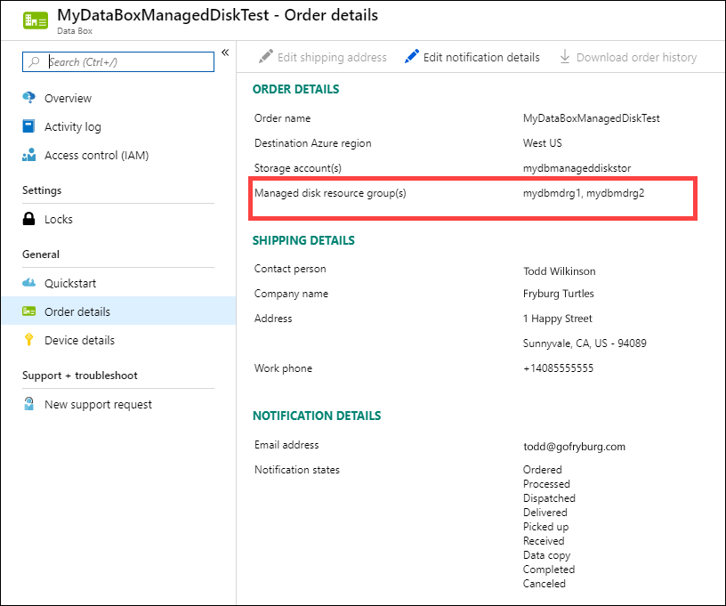

::: zone target = "docs"

# Tutorial: Return Azure Data Box Heavy and verify data upload to Azure

::: zone-end

::: zone target = "chromeless"

## Return Azure Data Box Heavy and verify data upload to Azure

::: zone-end

::: zone target = "docs"

This tutorial describes how to return Azure Data Box Heavy and verify the data uploaded to Azure.

In this tutorial, you will learn about topics such as:

> [!div class="checklist"]
> * Prerequisites
> * Prepare to ship
> * Ship Data Box Heavy to Microsoft
> * Verify data upload to Azure
> * Erasure of data from Data Box Heavy

## Prerequisites

Before you begin, make sure:

- You've completed the [Tutorial: Copy data to Azure Data Box and verify](data-box-heavy-deploy-copy-data.md).
- Copy jobs are complete. Prepare to ship can't run if copy jobs are in progress.

## Prepare to ship

[!INCLUDE [data-box-heavy-prepare-to-ship](../../includes/data-box-heavy-prepare-to-ship.md)]

::: zone-end

::: zone target = "chromeless"

## Prepare to ship

Before you prepare to ship, make sure that copy jobs are complete.

1. Go to Prepare to ship page in the local web UI and start the ship preparation.
2. Turn off the device from the local web UI. Remove the cables from the device.

You are now ready to ship your device back.

::: zone-end

## Ship Data Box Heavy back

1. Ensure that the device is powered off and all the cables are removed. Spool and securely place the 4 power cords in the tray that you can access from the back of the device.
2. The device ships LTL freight via FedEx in the US and DHL in the EU

    1. Reach out to [Data Box Operations](mailto:DataBoxOps@microsoft.com) to inform regarding the pickup and to get the return shipping label.
    2. Call the local number for your shipping carrier to schedule the pickup.
    3. Ensure that the shipping label is displayed prominently on the exterior of the shipment.
    4. Make sure that the old shipping labels from the previous shipment are removed from the device.
3. Once the Data Box Heavy is picked up and scanned by your carrier, the order status in the portal updates to **Picked up**. A tracking ID is also displayed.

::: zone target = "docs"

## Verify data upload to Azure

When Microsoft receives and scans the device, order status is updated to **Received**. The device then undergoes physical verification for damage or signs of tampering.

After the verification is complete, the Data Box Heavy is connected to the network in the Azure datacenter. The data copy starts automatically. Depending upon the data size, the copy operation may take a few hours to days to complete. You can monitor the copy job progress in the portal.

Once the copy is complete, order status updates to **Completed**.

Verify that your data is uploaded to Azure before you delete it from the source. Your data can be in:

- Your Azure Storage account(s). When you copy the data to Data Box, depending on the type, the data is uploaded to one of the following paths in your Azure Storage account.

  - For block blobs and page blobs: `https://<storage_account_name>.blob.core.windows.net/<containername>/files/a.txt`
  - For Azure Files: `https://<storage_account_name>.file.core.windows.net/<sharename>/files/a.txt`

    Alternatively, you could go to your Azure storage account in Azure portal and navigate from there.

- Your managed disk resource group(s). When creating managed disks, the VHDs are uploaded as page blobs and then converted to managed disks. The managed disks are attached to the resource groups specified at the time of order creation. 

    - If your copy to managed disks in Azure was successful, you can go to the **Order details** in the Azure portal and make a note of the resource groups specified for managed disks.

        

        Go to the noted resource group and locate your managed disks.

        

    - If you copied a VHDX, or a dynamic/differencing VHD, then the VHDX/VHD is uploaded to the staging storage account as a page blob but the conversion of VHD to managed disk fails. Go to your staging **Storage account > Blobs** and then select the appropriate container - Standard SSD, Standard HDD, or Premium SSD. The VHDs are uploaded as page blobs in your staging storage account.
    
::: zone-end

::: zone target = "chromeless"

## Verify data upload to Azure

When the Data Box Heavy device is connected to the Azure datacenter network, the data upload to Azure starts automatically. Data Box service notifies you that the data copy is complete via the Azure portal.

- Check error logs for any failures and take appropriate actions.
- Verify that your data is in the storage account(s) before you delete it from the source.

::: zone-end

## Erasure of data from Data Box Heavy
 
Once the upload to Azure is complete, the Data Box erases the data on its disks as per the [NIST SP 800-88 Revision 1 guidelines](https://csrc.nist.gov/News/2014/Released-SP-800-88-Revision-1,-Guidelines-for-Medi). After the erasure is complete, you can [Download the order history](data-box-portal-admin.md#download-order-history).

::: zone target = "docs"

## Next steps

In this tutorial, you learned about Azure Data Box topics such as:

> [!div class="checklist"]
> * Prerequisites
> * Prepare to ship
> * Ship Data Box Heavy to Microsoft
> * Verify data upload to Azure
> * Erasure of data from Data Box Heavy

Advance to the following article to learn how to manage Data Box Heavy via the local web UI.

> [!div class="nextstepaction"]
> [Use local web UI to administer Azure Data Box](./data-box-local-web-ui-admin.md)

::: zone-end

