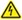
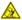
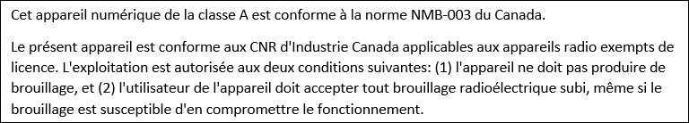
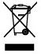
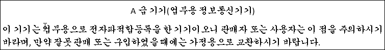

# Safely install and operate your Azure Data Box Heavy

This article contains the safety information for your Azure Data Box Heavy.

 **Read all instructions first**

Read all the safety information in this article before you use your Azure Data Box Heavy. Failure to follow instructions could result in fire, electric shock, or other injuries, or damage to your properties.

## Safety icon conventions
Here are the icons that you will find when you review the safety precautions to be observed when setting up and running your Data Box.

| Icon | Description |
|:--- |:--- |
|  **DANGER!** |Indicates a hazardous situation that, if not avoided, will result in death or serious injury. This signal word is to be limited to the most extreme situations. |
|  **WARNING!** |Indicates a hazardous situation that, if not avoided, could result in death or serious injury. |
|  **CAUTION!** |Indicates a hazardous situation that, if not avoided, could result in minor or moderate injury. |
|  **NOTICE:** |Indicates information considered important, but not hazard-related. |
|  **Electrical shock hazard** |High voltage. |
|  **Heavy weight** | |
|  **No user serviceable parts** |Do not access unless properly trained. |
|  **Read all instructions first** | |
|  **Tip hazard** | |
|  **Overload tip hazard** | |
|  **Multiple power sources** | |

## Handling precautions

 **WARNING!**

* Proper equipment (for example, pallet jack) and Personal Protective Equipment (for example, gloves) must be used when moving and handling the crate.
* Ramp must be secured to the crate with provided bolts before you remove the device to avoid injuries or property damage.

  **Tip hazard**

* Place the equipment on a flat, hard and stable surface to avoid a potential tip or crushing hazard.
* Verify the casters are locked before you inspect, turn on, and operate the equipment.

  **CAUTION!** 

* Inspect the *as-received* device for damages. If the device enclosure is damaged, contact [Microsoft Support](data-box-disk-contact-microsoft-support.md) to obtain a replacement. Do not attempt to operate the device. 
* The device is equipped with tamper-proof screws. If you suspect the device is malfunctioning, [Microsoft Support](data-box-disk-contact-microsoft-support.md) to obtain a replacement. Do not attempt to service the device. 
* The device contains no user-serviceable parts. Hazardous voltage, current, and energy levels are present inside. Do not open. Return the device to Microsoft for servicing.

  **WARNING!** 

* A fully configured enclosure can weigh up to 326 kg (719 lbs); do not try to lift it by yourself.
* Do not attempt to lift the equipment without proper mechanical aid. Be aware that any attempts to lift this weight can cause severe injuries.
* Conform to local occupational health and safety requirements when moving and lifting this equipment.
* Use mechanical assistance or other suitable assistance when moving and lifting equipment.

   **WARNING!**
* Data Box Heavy is not to be used as a table or workspace. Adding any type of load can create a potential hazard which could lead to injury or property damage.
* Rack-mounted equipment is not to be used as shelves or work spaces. Do not place the Data Box Heavy on top of rack-mounted equipment. Adding any type of load to an extended rack-mounted unit can create a potential tip hazard that could lead to injury, death, or product damage.

 **WARNING!**

* The system is designed to operate in a typical office environment. Choose a site that is:

    - Well-ventilated and away from sources of heat including direct sunlight and radiators.
    - Away from sources of vibration or physical shock.
    - Isolated from strong electromagnetic fields produced by electrical devices.
    - Provided with properly grounded wall outlets.
    - Provided with sufficient space to access the power supply cord(s), because they serve as the product's main power disconnect.

* Set up the device in a work area allowing for adequate air circulation around the device.
* Install the device in a temperature-controlled indoor area free of conductive contaminants and allow for adequate air circulation around the device.
* Keep the device away from sources of liquid and excessively humid environments.

## Electrical precautions

  **WARNING!**

* Provide a safe electrical earth connection to the power supply cord. The AC cord has a three-wire grounding plug (a plug that has a grounding pin). This plug fits only a grounded AC outlet. Do not defeat the purpose of the grounding pin.
* Given that the plug on the power supply cord is the main disconnect device, ensure that the socket outlets are located near the device and are easily accessible.
* Unplug the power cord (by pulling the plug, not the cord) and disconnect all cables if any of the following conditions exist:

    - The power cord or plug becomes frayed or otherwise damaged.
    - You spill something into the device casing.
    - The device is exposed to rain or excess moisture.
    - The device was dropped and the device casing is damaged.
    - You suspect the device needs service or repair.
* Permanently unplug the unit before you move it or if you think it has become damaged in any way.
* Provide a suitable power source with electrical overload protection to meet the following power specifications:

    - Voltage: 100 V AC to 240 V AC
    - Current: 6 A to 10 A, maximum per power cord. Four power cords are provided.
    - Frequency: 50 Hz to 60 Hz
* Do not attempt to modify or use AC power cord(s) other than the ones provided with the equipment. The power cord(s) must meet the following criteria:
    - The power cord must have an electrical rating that is greater than that of the electrical current rating marked on the product.
    - The power cord must have safety ground pin or contact that is suitable for the electrical outlet.

    **WARNING!**

* Unplug all AC power cord(s) to completely remove the AC power from the equipment.

 **CAUTION!**

* This device contains coin cell batteries. Do not attempt to service the device. Batteries in this device are not user serviceable. 
* **For service personnel only**: Risk of explosion if battery is replaced by an incorrect type. Dispose of the used batteries according to instructions.
* Laser peripherals or devices are present. To avoid risk or radiation exposure and/or personal injury, do not open the enclosure of any laser peripheral or device. Laser peripherals or devices are not serviceable. Only use certified and rated Laser Class I for optical transceiver product.

 **NOTICE:**

For the proper operation of your device and to prevent product damage:

* Ensure that the front and back doors are fully open while the device is running.

## Regulatory information

This section contains regulatory information for Azure Data Box Heavy, regulatory model number DB020.

This device is:

- Evaluated as Information Technology Equipment (ITE), designed to operate in a typical data room environment. The suitability of this product for other environments may require further evaluation.
- Designed for use with NRTL Listed (UL, CSA, ETL, etc.), and IEC/EN 60950-1 or IEC/EN 62368-1 compliant (CE marked) Information Technology equipment.
- Designed to operate in the following environment. 
    - Operating temperature: 41° to 95° F (5° to 35° C)
    - Storage temperature: -40° to 149° F (-40° to 65° C)
    - Relative humidity: 20% to 85% (noncondensing) 
    - Operating altitude: Tested up to 6,560 feet (up to 2000 meters)

For electrical supply ratings, refer to the device rating label provided with the unit. 

 **NOTICE:** 

Changes or modifications made to the device not expressly approved by Microsoft may void the user’s authority to operate the device.

**Canada and USA:**

 **NOTICE:** 

This equipment has been tested and found to comply with the limits for a Class A digital device, pursuant to part 15 of the FCC Rules. These limits are designed to provide reasonable protection against harmful interference when the equipment is operated in a commercial environment. This equipment generates, uses, and can radiate radio frequency energy and, if not installed and used in accordance with the instruction manual, may cause harmful interference to radio communications. Operation of this equipment in a residential area is likely to cause harmful interference in which case the user will be required to correct the interference at their own expense.

This device complies with part 15 of the FCC Rules and Industry Canada license-exempt RSS standard(s). Operation is subject to the following two conditions: 

- This device may not cause harmful interference.
- This device must accept any interference received, including interference that may cause undesired operation of the device.

CAN ICES-3(A)/NMB-3(A)
Microsoft Corporation, One Microsoft Way, Redmond, WA 98052, USA.
United States: (800) 426-9400
Canada: (800) 933-4750

**European Union:**

[Request](mailto:CSI_Compliance@microsoft.com) a copy of the EU Declaration of Conformity.

 **WARNING!** 

This is a class A product. In a domestic environment, this product may cause radio interference in which case the user may be required to take adequate measures.

**Disposal of waste batteries and electrical and electronic equipment:**

This symbol on the product or its batteries or its packaging means that this product and any batteries it contains must not be disposed of with your household waste. Instead, it is your responsibility to hand this over to an applicable collection point for the recycling of batteries and electrical and electronic equipment. This separate collection and recycling will help to conserve natural resources and prevent potential negative consequences for human health and the environment due to the possible presence of hazardous substances in batteries and electrical and electronic equipment, which could be caused by inappropriate disposal. For more information about where to drop off your batteries and electrical and electronic waste, please contact your local city/municipality office, your household waste disposal service, or the shop where you purchased this product. Contact *erecycle\@microsoft.com* for additional information on WEEE.

This product contains coin cell battery(ies).

Microsoft Ireland Sandyford Ind Est Dublin D18 KX32 IRL
Telephone number: +353 1 295 3826
Fax number: +353 1 706 4110 

<!--**Japan**

-->

<!--**South Korea**

-->

After you have reviewed these safety notices, you can set up and cable your device.

## Next steps

* [Cable and connect your Data Box Heavy](data-box-heavy-deploy-set-up.md)

