# Use the local web UI to administer your Data Box and Data Box Heavy

This article describes some of the configuration and management tasks that can be performed on the Data Box and Data Box Heavy devices. You can manage the Data Box and Data Box Heavy devices via the Azure portal UI and the local web UI for the device. This article focuses on the tasks that you can perform using the local web UI.

Local web UI for the Data Box and Data Box Heavy is used for the initial configuration of the device. You can also use the local web UI to shut down or restart the device, run diagnostic tests, update software, view copy logs, and generate a log package for Microsoft Support. On a Data Box Heavy device with two independent nodes, you can access two separate local web UIs corresponding to each node of the device.

This article includes the following tutorials:

- Generate a Support package
- Shut down or restart your device
- Download BOM or manifest files
- View available capacity of the device
- Skip checksum validation

## Generate Support package

If you experience any device issues, you can create a Support package from the system logs. Microsoft Support uses this package to troubleshoot the issue. To generate a Support package, take the following steps:

1. In the local web UI, go to **Contact Support** and click **Create Support package**.

    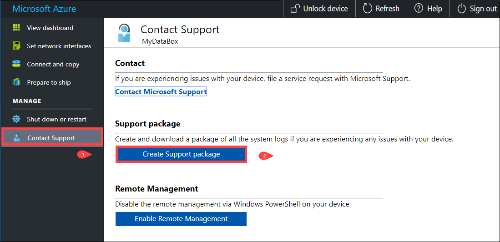

2. A Support package is gathered. This operation takes a few minutes.

    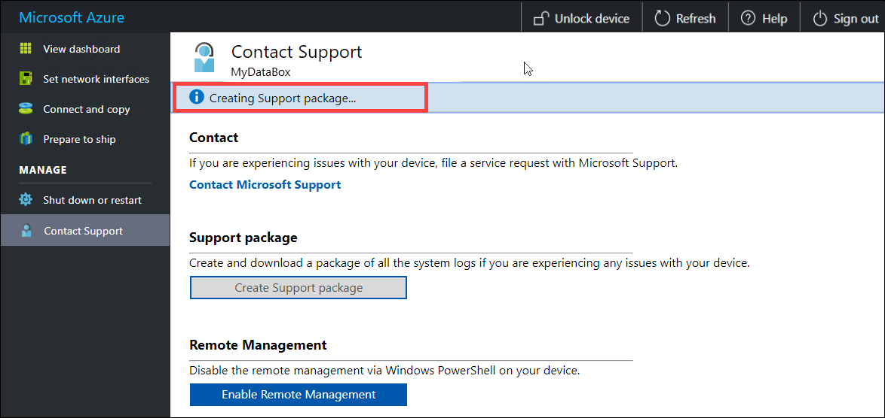

3. Once the Support package creation is complete, click **Download Support package**. 

    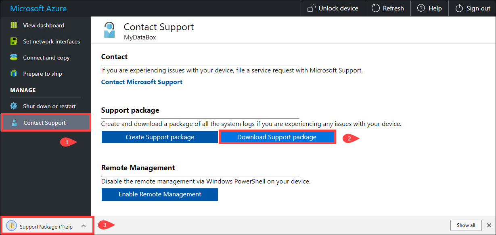

4. Browse and choose the download location. Open the folder to view the contents.

    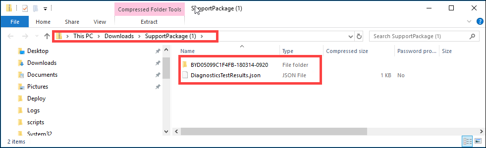


## Shut down or restart your device

You can shut down or restart your device using the local web UI. We recommend that before you restart, take the shares offline on the host and then the device. This minimizes any possibility of data corruption. Ensure that data copy is not in progress when you shut down the device.

To shut down your device, take the following steps.

1. In the local web UI, go to **Shut down or restart**.
2. Click **Shut down**.

    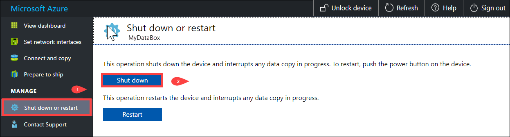

3. When prompted for confirmation, click **OK** to proceed.

    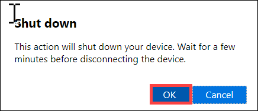

Once the device is shut down, use the power button on the front panel to turn on the device.

To restart your Data Box, perform the following steps.

1. In the local web UI, go to **Shut down or restart**.
2. Click **Restart**.

    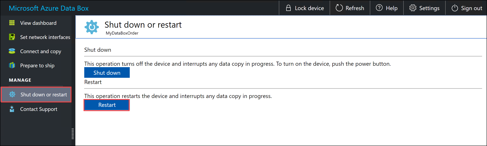

3. When prompted for confirmation, click **OK** to proceed.

   The device shuts down and then restarts.

## Download BOM or manifest files

The Bill of Material (BOM) or the manifest files contain the list of the files that are copied to the Data Box or Data Box Heavy. These files are generated when you prepare the device to ship.

Before you begin, make sure that your device has completed **Prepare to ship** step. Follow these steps to download BOM or manifest files:

1. Go to the local web UI for your device. You will see that the device has completed the prepare to ship. When the device preparation is complete, your device status is displayed as **Ready to ship**.

    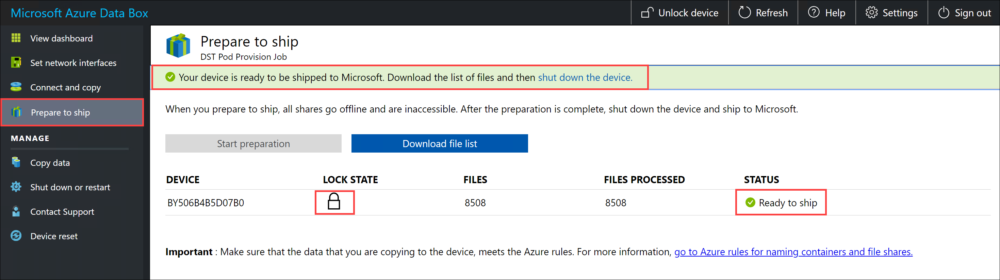

2. Click **Download list of files** to download the list of files that were copied on your Data Box.

    

3. In File Explorer, you will see that separate list of files are generated depending on the protocol used to connect to the device and the Azure Storage type used.

    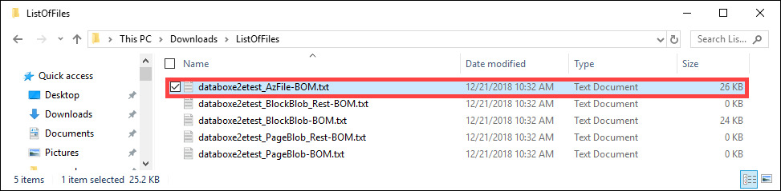

   The following table maps the file names to the Azure Storage type and the connection protocol used.

    |File name  |Azure Storage type  |Connection protocol used |
    |---------|---------|---------|
    |databoxe2etest_BlockBlob.txt     |Block blobs         |SMB/NFS         |
    |databoxe2etest_PageBlob.txt     |Page blobs         |SMB/NFS         |
    |databoxe2etest_AzFile-BOM.txt    |Azure Files         |SMB/NFS         |
    |databoxe2etest_PageBlock_Rest-BOM.txt     |Page blobs         |REST        |
    |databoxe2etest_BlockBlock_Rest-BOM.txt    |Block blobs         |REST         |
    |mydbmdrg1_MDisk-BOM.txt    |Managed Disk         |SMB/NFS         |
    |mydbmdrg2_MDisk-BOM.txt     |Managed Disk         |SMB/NFS         |

You use this list to verify the files uploaded into the Azure Storage account after the Data Box returns to the Azure datacenter. A sample manifest file is shown below.

> [!NOTE]
> On a Data Box Heavy, two sets of list of files (BOM files) are present corresponding to the two nodes on the device.

```xml
<file size="52689" crc64="0x95a62e3f2095181e">\databox\media\data-box-deploy-copy-data\prepare-to-ship2.png</file>
<file size="22117" crc64="0x9b160c2c43ab6869">\databox\media\data-box-deploy-copy-data\connect-shares-file-explorer2.png</file>
<file size="57159" crc64="0x1caa82004e0053a4">\databox\media\data-box-deploy-copy-data\verify-used-space-dashboard.png</file>
<file size="24777" crc64="0x3e0db0cd1ad438e0">\databox\media\data-box-deploy-copy-data\prepare-to-ship5.png</file>
<file size="162006" crc64="0x9ceacb612ecb59d6">\databox\media\data-box-cable-options\cabling-dhcp-data-only.png</file>
<file size="155066" crc64="0x051a08d36980f5bc">\databox\media\data-box-cable-options\cabling-2-port-setup.png</file>
<file size="150399" crc64="0x66c5894ff328c0b1">\databox\media\data-box-cable-options\cabling-with-switch-static-ip.png</file>
<file size="158082" crc64="0xbd4b4c5103a783ea">\databox\media\data-box-cable-options\cabling-mgmt-only.png</file>
<file size="148456" crc64="0xa461ad24c8e4344a">\databox\media\data-box-cable-options\cabling-with-static-ip.png</file>
<file size="40417" crc64="0x637f59dd10d032b3">\databox\media\data-box-portal-admin\delete-order1.png</file>
<file size="33704" crc64="0x388546569ea9a29f">\databox\media\data-box-portal-admin\clone-order1.png</file>
<file size="5757" crc64="0x9979df75ee9be91e">\databox\media\data-box-safety\japan.png</file>
<file size="998" crc64="0xc10c5a1863c5f88f">\databox\media\data-box-safety\overload_tip_hazard_icon.png</file>
<file size="5870" crc64="0x4aec2377bb16136d">\databox\media\data-box-safety\south-korea.png</file>
<file size="16572" crc64="0x05b13500a1385a87">\databox\media\data-box-safety\taiwan.png</file>
<file size="999" crc64="0x3f3f1c5c596a4920">\databox\media\data-box-safety\warning_icon.png</file>
<file size="1054" crc64="0x24911140d7487311">\databox\media\data-box-safety\read_safety_and_health_information_icon.png</file>
<file size="1258" crc64="0xc00a2d5480f4fcec">\databox\media\data-box-safety\heavy_weight_hazard_icon.png</file>
<file size="1672" crc64="0x4ae5cfa67c0e895a">\databox\media\data-box-safety\no_user_serviceable_parts_icon.png</file>
<file size="3577" crc64="0x99e3d9df341b62eb">\databox\media\data-box-safety\battery_disposal_icon.png</file>
<file size="993" crc64="0x5a1a78a399840a17">\databox\media\data-box-safety\tip_hazard_icon.png</file>
<file size="1028" crc64="0xffe332400278f013">\databox\media\data-box-safety\electrical_shock_hazard_icon.png</file>
<file size="58699" crc64="0x2c411d5202c78a95">\databox\media\data-box-deploy-ordered\data-box-ordered.png</file>
<file size="46816" crc64="0x31e48aa9ca76bd05">\databox\media\data-box-deploy-ordered\search-azure-data-box1.png</file>
<file size="24160" crc64="0x978fc0c6e0c4c16d">\databox\media\data-box-deploy-ordered\select-data-box-option1.png</file>
<file size="115954" crc64="0x0b42449312086227">\databox\media\data-box-disk-deploy-copy-data\data-box-disk-validation-tool-output.png</file>
<file size="6093" crc64="0xadb61d0d7c6d4deb">\databox\data-box-cable-options.md</file>
<file size="6499" crc64="0x080add29add367d9">\databox\data-box-deploy-copy-data-via-nfs.md</file>
<file size="11089" crc64="0xc3ce6b13a4fe3001">\databox\data-box-deploy-copy-data-via-rest.md</file>
<file size="9126" crc64="0x820856b5a54321ad">\databox\data-box-overview.md</file>
<file size="10963" crc64="0x5e9a14f9f4784fd8">\databox\data-box-safety.md</file>
<file size="5941" crc64="0x8631d62fbc038760">\databox\data-box-security.md</file>
<file size="12536" crc64="0x8c8ff93e73d665ec">\databox\data-box-system-requirements-rest.md</file>
<file size="3220" crc64="0x7257a263c434839a">\databox\data-box-system-requirements.md</file>
<file size="2823" crc64="0x63db1ada6fcdc672">\databox\index.yml</file>
<file size="4364" crc64="0x62b5710f58f00b8b">\databox\data-box-local-web-ui-admin.md</file>
<file size="3603" crc64="0x7e34c25d5606693f">\databox\TOC.yml</file>
```

This file contains the list of all the files that were copied on the Data Box or Data Box Heavy. In this file, *crc64* value relates to the checksum generated for the corresponding file.

## View available capacity of the device

You can use the device dashboard to view the available and used capacity of the device.

1. In the local web UI, go to **View dashboard**.
2. Under the **Connect and copy**, the free and used space on the device is shown.

    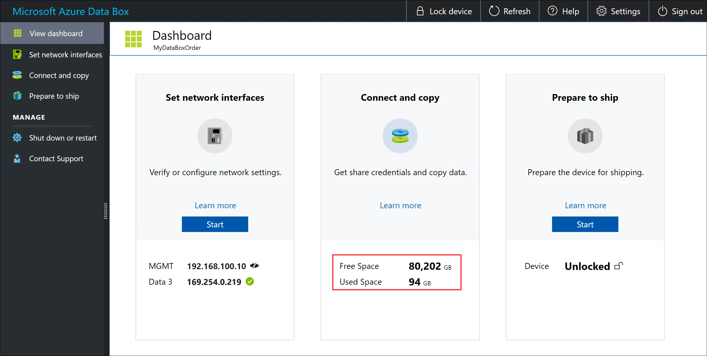

## Skip checksum validation

Checksums are generated for your data by default when you prepare to ship. In certain rare cases, depending on the data type (small file sizes), the performance may be slow. In such instances, you can skip checksum.

We strongly recommend that you do not disable checksum unless the performance is severely impacted.

1. In the top-right corner of the local web UI of your device, go to **Settings**.

    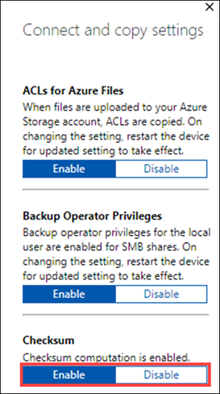

2. **Disable** checksum validation
3. Click **Apply**.

## Next steps

- Learn how to [Manage the Data Box and Data Box Heavy via the Azure portal](data-box-portal-admin.md).

