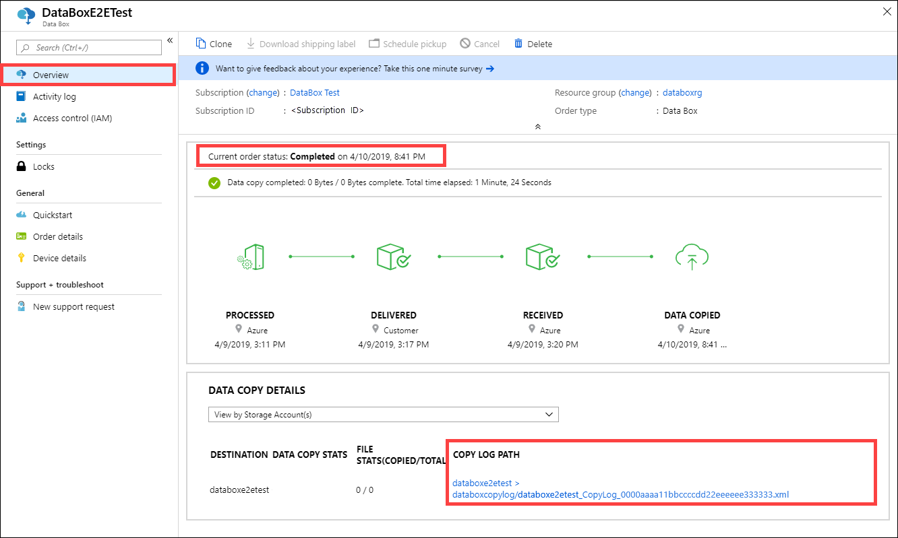
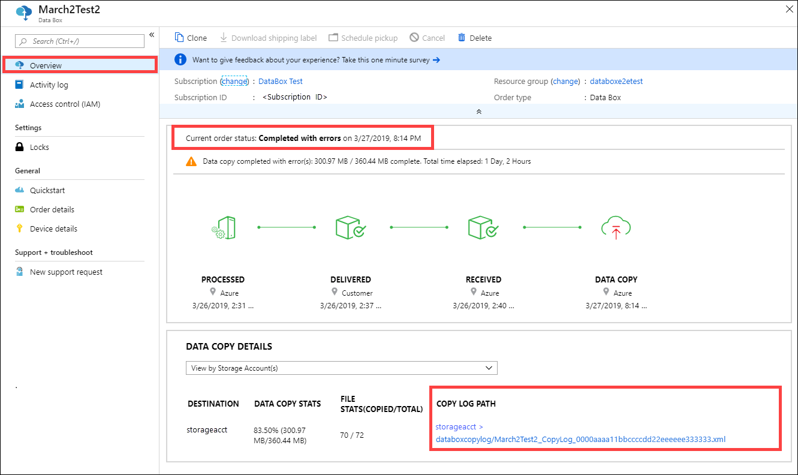
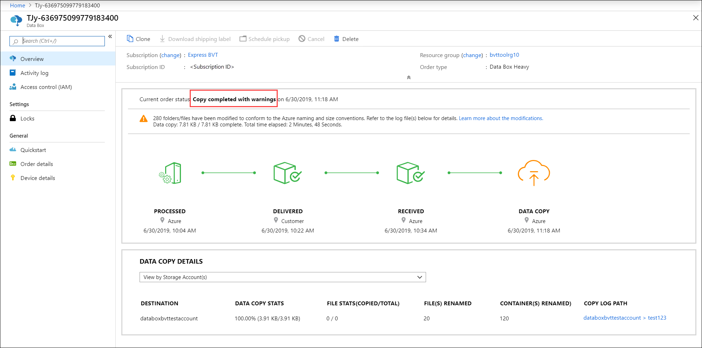

# Tracking and event logging for your Azure Data Box and Azure Data Box Heavy

A Data Box or Data Box Heavy order goes through the following steps: order, set up, data copy, return, upload to Azure and verify, and data erasure. Corresponding to each step in the order, you can take multiple actions to control the access to the order, audit the events, track the order, and interpret the various logs that are generated.

The following table shows a summary of the Data Box or Data Box Heavy order steps and the tools available to track and audit the order during each step.

| Data Box order stage       | Tool to track and audit                                                                        |
|----------------------------|------------------------------------------------------------------------------------------------|
| Create order               | [Set up access control on the order via RBAC](#set-up-access-control-on-the-order)                                                    |
| Order processed            | [Track the order](#track-the-order) through <ul><li> Azure portal </li><li> Shipping carrier website </li><li>Email notifications</ul> |
| Set up device              | Device credentials access logged in [Activity logs](#query-activity-logs-during-setup)                                              |
| Data copy to device        | [View *error.xml* files](#view-error-log-during-data-copy) for data copy                                                             |
| Prepare to ship            | [Inspect the BOM files](#inspect-bom-during-prepare-to-ship) or the manifest files on the device                                      |
| Data upload to Azure       | [Review copy logs](#review-copy-log-during-upload-to-azure) for errors during data upload at Azure datacenter                         |
| Data erasure from device   | [View chain of custody logs](#get-chain-of-custody-logs-after-data-erasure) including audit logs and order history                |

This article describes in detail the various mechanisms or tools available to track and audit Data Box or Data Box Heavy order. The information in this article applies to both, Data Box and Data Box Heavy. In the subsequent sections, any references to Data Box also apply to Data Box Heavy.

## Set up access control on the order

You can control who can access your order when the order is first created. Set up Role-based Access Control (RBAC) roles at various scopes to control the access to the Data Box order. An RBAC role determines the type of access – read-write, read-only, read-write to a subset of operations.

The two roles that can be defined for the Azure Data Box service are:

- **Data Box Reader** - have read-only access to an order(s) as defined by the scope. They can only view details of an order. They can’t access any other details related to storage accounts or edit the order details such as address and so on.
- **Data Box Contributor** - can only create an order to transfer data to a given storage account *if they already have write access to a storage account*. If they do not have access to a storage account, they can't even create a Data Box order to copy data to the account. This role does not define any Storage account related permissions nor grants access to storage accounts.  

To restrict access to an order, you can:

- Assign a role at an order level. The user only has those permissions as defined by the roles to interact with that specific Data Box order only and nothing else.
- Assign a role at the resource group level, the user has access to all the Data Box orders within a resource group.

For more information on suggested RBAC use, see [Best practices for Azure RBAC](../role-based-access-control/best-practices.md).

## Track the order

You can track your order through the Azure portal and through the shipping carrier website. The following mechanisms are in place to track the Data Box order at any time:

- To track the order when the device is in Azure datacenter or your premises, go to your **Data Box order > Overview** in Azure portal.

    

- To track the order while the device is in transit, go to the regional carrier website, for example, UPS  website in US. Provide the tracking number associated with your order.
- Data Box also sends email notifications anytime the order status changes based on the emails provided when the order was created. For a list of all the Data Box order statuses, see [View order status](data-box-portal-admin.md#view-order-status). To change the notification settings associated with the order, see [Edit notification details](data-box-portal-admin.md#edit-notification-details).

## Query activity logs during setup

- Your Data Box arrives on your premises in a locked state. You can use the device credentials available in the Azure portal for your order.  

    When a Data Box is set up, you may need to know who all accessed the device credentials. To figure out who accessed the **Device credentials** blade, you can query the Activity logs.  Any action that involves accessing **Device details > Credentials** blade is logged into the activity logs as `ListCredentials` action.

    

- Each sign into the Data Box is logged real time. However, this information is only available in the [Audit logs](#audit-logs) after the order is successfully completed.

## View error log during data copy

During the data copy to Data Box or Data Box Heavy, an error file is generated if there are any issues with the data being copied.

### Error.xml file

Make sure that the copy jobs have finished with no errors. If there are errors during the copy process, download the logs from the **Connect and copy** page.

- If you copied a file that is not 512 bytes aligned to a managed disk folder on your Data Box, the file isn't uploaded as page blob to your staging storage account. You will see an error in the logs. Remove the file and copy a file that is 512 bytes aligned.
- If you copied a VHDX, or a dynamic VHD, or a differencing VHD (these files are not supported), you will see an error in the logs.

Here is a sample of the *error.xml* for different errors when copying to managed disks.

```xml
<file error="ERROR_BLOB_OR_FILE_TYPE_UNSUPPORTED">\StandardHDD\testvhds\differencing-vhd-022019.vhd</file>
<file error="ERROR_BLOB_OR_FILE_TYPE_UNSUPPORTED">\StandardHDD\testvhds\dynamic-vhd-022019.vhd</file>
<file error="ERROR_BLOB_OR_FILE_TYPE_UNSUPPORTED">\StandardHDD\testvhds\insidefixedvhdx-022019.vhdx</file>
<file error="ERROR_BLOB_OR_FILE_TYPE_UNSUPPORTED">\StandardHDD\testvhds\insidediffvhd-022019.vhd</file>
```

Here is a sample of the *error.xml* for different errors when copying to page blobs.

```xml
<file error="ERROR_BLOB_OR_FILE_SIZE_ALIGNMENT">\PageBlob512NotAligned\File100Bytes</file>
<file error="ERROR_BLOB_OR_FILE_SIZE_ALIGNMENT">\PageBlob512NotAligned\File786Bytes</file>
<file error="ERROR_BLOB_OR_FILE_SIZE_ALIGNMENT">\PageBlob512NotAligned\File513Bytes</file>
<file error="ERROR_BLOB_OR_FILE_SIZE_ALIGNMENT">\PageBlob512NotAligned\File10Bytes</file>
<file error="ERROR_BLOB_OR_FILE_SIZE_ALIGNMENT">\PageBlob512NotAligned\File500Bytes</file>
```


Here is a sample of the *error.xml* for different errors when copying to block blobs.

```xml
<file error="ERROR_CONTAINER_OR_SHARE_NAME_LENGTH">\ab</file>
<file error="ERROR_CONTAINER_OR_SHARE_NAME_ALPHA_NUMERIC_DASH">\invalid dns name</file>
<file error="ERROR_CONTAINER_OR_SHARE_NAME_LENGTH">\morethan63charactersfortestingmorethan63charactersfortestingmorethan63charactersfortestingmorethan63charactersfortestingmorethan63charactersfortestingmorethan63charactersfortesting</file>
<file error="ERROR_CONTAINER_OR_SHARE_NAME_ALPHA_NUMERIC_DASH">\testdirectory-~!@#$%^&amp;()_+{}</file>
<file error="ERROR_CONTAINER_OR_SHARE_NAME_ALPHA_NUMERIC_DASH">\test__doubleunderscore</file>
<file error="ERROR_CONTAINER_OR_SHARE_NAME_IMPROPER_DASH">\-startingwith-hyphen</file>
<file error="ERROR_CONTAINER_OR_SHARE_NAME_ALPHA_NUMERIC_DASH">\Starting with Capital</file>
<file error="ERROR_CONTAINER_OR_SHARE_NAME_ALPHA_NUMERIC_DASH">\_startingwith_underscore</file>
<file error="ERROR_CONTAINER_OR_SHARE_NAME_IMPROPER_DASH">\55555555--4444--3333--2222--111111111111</file>
<file error="ERROR_CONTAINER_OR_SHARE_NAME_LENGTH">\1</file>
<file error="ERROR_CONTAINER_OR_SHARE_NAME_ALPHA_NUMERIC_DASH">\11111111-_2222-_3333-_4444-_555555555555</file>
<file error="ERROR_CONTAINER_OR_SHARE_NAME_IMPROPER_DASH">\test--doublehyphen</file>
<file error="ERROR_BLOB_OR_FILE_NAME_CHARACTER_ILLEGAL" name_encoding="Base64">XEludmFsaWRVbmljb2RlRmlsZXNcU3BjQ2hhci01NTI5Ni3vv70=</file>
<file error="ERROR_BLOB_OR_FILE_NAME_CHARACTER_ILLEGAL" name_encoding="Base64">XEludmFsaWRVbmljb2RlRmlsZXNcU3BjQ2hhci01NTMwMS3vv70=</file>
<file error="ERROR_BLOB_OR_FILE_NAME_CHARACTER_ILLEGAL" name_encoding="Base64">XEludmFsaWRVbmljb2RlRmlsZXNcU3BjQ2hhci01NTMwMy3vv70=</file>
<file error="ERROR_BLOB_OR_FILE_NAME_CHARACTER_CONTROL">\InvalidUnicodeFiles\Ã.txt</file>
<file error="ERROR_BLOB_OR_FILE_NAME_CHARACTER_ILLEGAL" name_encoding="Base64">XEludmFsaWRVbmljb2RlRmlsZXNcU3BjQ2hhci01NTMwNS3vv70=</file>
<file error="ERROR_BLOB_OR_FILE_NAME_CHARACTER_ILLEGAL" name_encoding="Base64">XEludmFsaWRVbmljb2RlRmlsZXNcU3BjQ2hhci01NTI5OS3vv70=</file>
<file error="ERROR_BLOB_OR_FILE_NAME_CHARACTER_ILLEGAL" name_encoding="Base64">XEludmFsaWRVbmljb2RlRmlsZXNcU3BjQ2hhci01NTMwMi3vv70=</file>
<file error="ERROR_BLOB_OR_FILE_NAME_CHARACTER_ILLEGAL" name_encoding="Base64">XEludmFsaWRVbmljb2RlRmlsZXNcU3BjQ2hhci01NTMwNC3vv70=</file>
<file error="ERROR_BLOB_OR_FILE_NAME_CHARACTER_ILLEGAL" name_encoding="Base64">XEludmFsaWRVbmljb2RlRmlsZXNcU3BjQ2hhci01NTI5OC3vv70=</file>
<file error="ERROR_BLOB_OR_FILE_NAME_CHARACTER_ILLEGAL" name_encoding="Base64">XEludmFsaWRVbmljb2RlRmlsZXNcU3BjQ2hhci01NTMwMC3vv70=</file>
<file error="ERROR_BLOB_OR_FILE_NAME_CHARACTER_ILLEGAL" name_encoding="Base64">XEludmFsaWRVbmljb2RlRmlsZXNcU3BjQ2hhci01NTI5Ny3vv70=</file>
```

Here is a sample of the *error.xml* for different errors when copying to Azure Files.

```xml
<file error="ERROR_BLOB_OR_FILE_SIZE_LIMIT">\AzFileMorethan1TB\AzFile1.2TB</file>
<file error="ERROR_CONTAINER_OR_SHARE_NAME_ALPHA_NUMERIC_DASH">\testdirectory-~!@#$%^&amp;()_+{}</file>
<file error="ERROR_CONTAINER_OR_SHARE_NAME_IMPROPER_DASH">\55555555--4444--3333--2222--111111111111</file>
<file error="ERROR_CONTAINER_OR_SHARE_NAME_IMPROPER_DASH">\-startingwith-hyphen</file>
<file error="ERROR_CONTAINER_OR_SHARE_NAME_ALPHA_NUMERIC_DASH">\11111111-_2222-_3333-_4444-_555555555555</file>
<file error="ERROR_CONTAINER_OR_SHARE_NAME_IMPROPER_DASH">\test--doublehyphen</file>
<file error="ERROR_CONTAINER_OR_SHARE_NAME_LENGTH">\ab</file>
<file error="ERROR_CONTAINER_OR_SHARE_NAME_ALPHA_NUMERIC_DASH">\invalid dns name</file>
<file error="ERROR_CONTAINER_OR_SHARE_NAME_ALPHA_NUMERIC_DASH">\test__doubleunderscore</file>
<file error="ERROR_CONTAINER_OR_SHARE_NAME_LENGTH">\morethan63charactersfortestingmorethan63charactersfortestingmorethan63charactersfortestingmorethan63charactersfortestingmorethan63charactersfortestingmorethan63charactersfortesting</file>
<file error="ERROR_CONTAINER_OR_SHARE_NAME_ALPHA_NUMERIC_DASH">\_startingwith_underscore</file>
<file error="ERROR_CONTAINER_OR_SHARE_NAME_LENGTH">\1</file>
<file error="ERROR_CONTAINER_OR_SHARE_NAME_ALPHA_NUMERIC_DASH">\Starting with Capital</file>
```

In each of the above cases, resolve the errors before you proceed to the next step. For more information on the errors received during data copy to Data Box via SMB or NFS protocols, go to [Troubleshoot Data Box and Data Box Heavy issues](data-box-troubleshoot.md). For information on errors received during data copy to Data Box via REST, go to [Troubleshoot Data Box Blob storage issues](data-box-troubleshoot-rest.md).

## Inspect BOM during prepare to ship

During prepare to ship, a list of files known as the Bill of Materials (BOM) or manifest file is created.

- Use this file to verify against the actual names and the number of files that were copied to the Data Box.
- Use this file to verify against the actual sizes of the files.
- Verify that the *crc64* corresponds to a non-zero string. <!--A null value for crc64 indicates that there was a reparse point error)-->

For more information on the errors received during prepare to ship, go to [Troubleshoot Data Box and Data Box Heavy issues](data-box-troubleshoot.md).

### BOM or manifest file

The BOM or manifest file contains the list of all the files that are copied to the Data Box device. The BOM file has file names and the corresponding sizes as well as the checksum. A separate BOM file is created for the block blobs, page blobs, Azure Files, for copy via the REST APIs, and for the copy to managed disks on the Data Box. You can download the BOM files from the local web UI of the device during the prepare to ship.

These files also reside on the Data Box device and are uploaded to the associated storage account in the Azure datacenter.

### BOM file format

BOM or manifest file has the following general format:

`<file size = "file-size-in-bytes" crc64="cyclic-redundancy-check-string">\folder-path-on-data-box\name-of-file-copied.md</file>`

Here is a sample of a manifest generated when the data was copied to the block blob share on the Data Box.

```
<file size="10923" crc64="0x51c78833c90e4e3f">\databox\media\data-box-deploy-copy-data\connect-shares-file-explorer1.png</file>
<file size="15308" crc64="0x091a8b2c7a3bcf0a">\databox\media\data-box-deploy-copy-data\get-share-credentials2.png</file>
<file size="53486" crc64="0x053da912fb45675f">\databox\media\data-box-deploy-copy-data\nfs-client-access.png</file>
<file size="6093" crc64="0xadb61d0d7c6d4deb">\databox\data-box-cable-options.md</file>
<file size="6499" crc64="0x080add29add367d9">\databox\data-box-deploy-copy-data-via-nfs.md</file>
<file size="11089" crc64="0xc3ce6b13a4fe3001">\databox\data-box-deploy-copy-data-via-rest.md</file>
<file size="7749" crc64="0xd2e346a4588e307a">\databox\data-box-deploy-ordered.md</file>
<file size="14275" crc64="0x260296e5d1b1608a">\databox\data-box-deploy-copy-data.md</file>
<file size="4077" crc64="0x2bb0a170225bceec">\databox\data-box-deploy-picked-up.md</file>
<file size="15447" crc64="0xcec0ca8527720b3c">\databox\data-box-portal-admin.md</file>
<file size="9126" crc64="0x820856b5a54321ad">\databox\data-box-overview.md</file>
<file size="10963" crc64="0x5e9a14f9f4784fd8">\databox\data-box-safety.md</file>
<file size="5941" crc64="0x8631d62fbc038760">\databox\data-box-security.md</file>
<file size="12536" crc64="0x8c8ff93e73d665ec">\databox\data-box-system-requirements-rest.md</file>
<file size="3220" crc64="0x7257a263c434839a">\databox\data-box-system-requirements.md</file>
```

The BOM or manifest files are also copied to the Azure storage account. You can use the BOM or manifest files to verify that files uploaded to the Azure match the data that was copied to the Data Box.

## Review copy log during upload to Azure

During the data upload to Azure, a copy log is created.

### Copy log

For each order that is processed, the Data Box service creates copy log in the associated storage account. The copy log has the total number of files that were uploaded and the number of files that errored out during the data copy from Data Box to your Azure storage account.

A Cyclic Redundancy Check (CRC) computation is done during the upload to Azure. The CRCs from the data copy and after the data upload are compared. A CRC mismatch indicates that the corresponding files failed to upload.

By default, logs are written to a container named `copylog`. The logs are stored with the following naming convention:

`storage-account-name/databoxcopylog/ordername_device-serial-number_CopyLog_guid.xml`.

The copy log path is also displayed on the **Overview** blade for the portal.



### Upload completed successfully 

The following sample describes the general format of a copy log for a Data Box upload that completed successfully:

```
<?xml version="1.0"?>
-<CopyLog Summary="Summary">
<Status>Succeeded</Status>
<TotalFiles>45</TotalFiles>
<FilesErrored>0</FilesErrored>
</CopyLog>
```

### Upload completed with errors 

Upload to Azure may also complete with errors.



Here is an example of a copy log where the upload completed with errors:

```xml
<ErroredEntity Path="iso\samsungssd.iso">
  <Category>UploadErrorCloudHttp</Category>
  <ErrorCode>409</ErrorCode>
  <ErrorMessage>The blob type is invalid for this operation.</ErrorMessage>
  <Type>File</Type>
</ErroredEntity><ErroredEntity Path="iso\iSCSI_Software_Target_33.iso">
  <Category>UploadErrorCloudHttp</Category>
  <ErrorCode>409</ErrorCode>
  <ErrorMessage>The blob type is invalid for this operation.</ErrorMessage>
  <Type>File</Type>
</ErroredEntity><CopyLog Summary="Summary">
  <Status>Failed</Status>
  <TotalFiles_Blobs>72</TotalFiles_Blobs>
  <FilesErrored>2</FilesErrored>
</CopyLog>
```
### Upload completed with warnings

Upload to Azure completes with warnings if your data had container/blob/file names that didn't conform to Azure naming conventions and the names were modified to upload the data to Azure.



Here is an example of a copy log where the containers that did not conform to Azure naming conventions were renamed during the data upload to Azure.

The new unique names for containers are in the format `DataBox-GUID` and the data for the container are put into the new renamed container. The copy log specifies the old and the new container name for container.

```xml
<ErroredEntity Path="New Folder">
   <Category>ContainerRenamed</Category>
   <ErrorCode>1</ErrorCode>
   <ErrorMessage>The original container/share/blob has been renamed to: DataBox-3fcd02de-bee6-471e-ac62-33d60317c576 :from: New Folder :because either the name has invalid character(s) or length is not supported</ErrorMessage>
  <Type>Container</Type>
</ErroredEntity>
```

Here is an example of a copy log where the blobs or files that did not conform to Azure naming conventions, were renamed during the data upload to Azure. The new blob or file names are converted to SHA256 digest of relative path to container and are uploaded to path based on destination type. The destination can be block blobs, page blobs, or Azure Files.

The `copylog` specifies the old and the new blob or file name and the path in Azure.

```xml
<ErroredEntity Path="TesDir028b4ba9-2426-4e50-9ed1-8e89bf30d285\Ã">
  <Category>BlobRenamed</Category>
  <ErrorCode>1</ErrorCode>
  <ErrorMessage>The original container/share/blob has been renamed to: PageBlob/DataBox-0xcdc5c61692e5d63af53a3cb5473e5200915e17b294683968a286c0228054f10e :from: Ã :because either name has invalid character(s) or length is not supported</ErrorMessage>
  <Type>File</Type>
</ErroredEntity><ErroredEntity Path="TesDir9856b9ab-6acb-4bc3-8717-9a898bdb1f8c\Ã">
  <Category>BlobRenamed</Category>
  <ErrorCode>1</ErrorCode>
  <ErrorMessage>The original container/share/blob has been renamed to: AzureFile/DataBox-0xcdc5c61692e5d63af53a3cb5473e5200915e17b294683968a286c0228054f10e :from: Ã :because either name has invalid character(s) or length is not supported</ErrorMessage>
  <Type>File</Type>
</ErroredEntity><ErroredEntity Path="TesDirf92f6ca4-3828-4338-840b-398b967d810b\Ã">
  <Category>BlobRenamed</Category>
  <ErrorCode>1</ErrorCode>
  <ErrorMessage>The original container/share/blob has been renamed to: BlockBlob/DataBox-0xcdc5c61692e5d63af53a3cb5473e5200915e17b294683968a286c0228054f10e :from: Ã :because either name has invalid character(s) or length is not supported</ErrorMessage>
  <Type>File</Type>
</ErroredEntity>
```

## Get chain of custody logs after data erasure

After the data is erased from the Data Box disks as per the NIST SP 800-88 Revision 1 guidelines, the chain of custody logs are available. These logs include the audit logs and the order history. The BOM or manifest files are also copied with the audit logs.

### Audit logs

Audit logs contain information on how to power on and access shares on the Data Box or Data Box Heavy when it is outside of Azure datacenter. These logs are located at: `storage-account/azuredatabox-chainofcustodylogs`

Here is a sample of the audit log from a Data Box:

```
9/10/2018 8:23:01 PM : The operating system started at system time ‎2018‎-‎09‎-‎10T20:23:01.497758400Z.
9/10/2018 8:23:42 PM : An account was successfully logged on.
Subject:
	Security ID:		S-1-5-18
	Account Name:		WIN-DATABOXADMIN
	Account Domain:	Workgroup
	Logon ID:		0x3E7
Logon Information:
	Logon Type:		3
	Restricted Admin Mode:	-
	Virtual Account:		No
	Elevated Token:		No
Impersonation Level:		Impersonation
New Logon:
	Security ID:		S-1-5-7
	Account Name:		ANONYMOUS LOGON
	Account Domain:	NT AUTHORITY
	Logon ID:		0x775D5
	Linked Logon ID:	0x0
	Network Account Name:	-
	Network Account Domain:	-
	Logon GUID:		{00000000-0000-0000-0000-000000000000}
Process Information:
	Process ID:		0x4
	Process Name:		
Network Information:
	Workstation Name:	-
	Source Network Address:	-
	Source Port:		-
Detailed Authentication Information:
	Logon Process:		NfsSvr
	Authentication Package:MICROSOFT_AUTHENTICATION_PACKAGE_V1_0
	Transited Services:	-
	Package Name (NTLM only):	-
	Key Length:		0
This event is generated when a logon session is created. It is generated on the computer that was accessed. 
The subject fields indicate the account on the local system which requested the logon. This is most commonly a service such as the Server service, or a local process such as Winlogon.exe or Services.exe. 
The logon type field indicates the kind of logon that occurred. The most common types are 2 (interactive) and 3 (network).
The New Logon fields indicate the account for whom the new logon was created, i.e. the account that was logged on.
The network fields indicate where a remote logon request originated. Workstation name is not always available and may be left blank in some cases.
The impersonation level field indicates the extent to which a process in the logon session can impersonate.
The authentication information fields provide detailed information about this specific logon request.
	- Logon GUID is a unique identifier that can be used to correlate this event with a KDC event.
	- Transited services indicate which intermediate services have participated in this logon request.
	- Package name indicates which sub-protocol was used among the NTLM protocols.
	- Key length indicates the length of the generated session key. This will be 0 if no session key was requested.
9/10/2018 8:25:58 PM : An account was successfully logged on.
```


## Download order history

Order history is available in Azure portal. If the order is complete and the device cleanup (data erasure from the disks) is complete, then go to your device order and navigate to **Order details**. **Download order history** option is available. For more information, see [Download order history](data-box-portal-admin.md#download-order-history).

If you scroll through the order history, you see:

- Carrier tracking information for your device.
- Events with *SecureErase* activity. These events correspond to the erasure of the data on the disk.
- Data Box log links. The paths for the *audit logs*, *copy logs*, and *BOM* files are presented.

Here is a sample of the order history log from Azure portal:

```
-------------------------------
Microsoft Data Box Order Report
-------------------------------
Name                                               : gus-poland                              
StartTime(UTC)                              : 9/19/2018 8:49:23 AM +00:00                       
DeviceType                                     : DataBox                                           
-------------------
Data Box Activities
-------------------
Time(UTC)                 | Activity                       | Status          | Description

9/19/2018 8:49:26 AM      | OrderCreated                   | Completed       |
10/2/2018 7:32:53 AM      | DevicePrepared                 | Completed       |
10/3/2018 1:36:43 PM      | ShippingToCustomer             | InProgress      | Shipment picked up. Local Time : 10/3/2018 1:36:43 PM at AMSTERDAM-NLD                                                                                
10/4/2018 8:23:30 PM      | ShippingToCustomer             | InProgress      | Processed at AMSTERDAM-NLD. Local Time : 10/4/2018 8:23:30 PM at AMSTERDAM-NLD                                                                        
10/4/2018 11:43:34 PM     | ShippingToCustomer             | InProgress      | Departed Facility in AMSTERDAM-NLD. Local Time : 10/4/2018 11:43:34 PM at AMSTERDAM-NLD
10/5/2018 8:13:49 AM      | ShippingToCustomer             | InProgress      | Arrived at Delivery Facility in BRIGHTON-GBR. Local Time : 10/5/2018 8:13:49 AM at LAMBETH-GBR                                                         
10/5/2018 9:13:24 AM      | ShippingToCustomer             | InProgress      | With delivery courier. Local Time : 10/5/2018 9:13:24 AM at BRIGHTON-GBR                                                                               
10/5/2018 12:03:04 PM     | ShippingToCustomer             | Completed       | Delivered - Signed for by. Local Time : 10/5/2018 12:03:04 PM at BRIGHTON-GBR                                                                          
1/25/2019 3:19:25 PM      | ShippingToDataCenter           | InProgress      | Shipment picked up. Local Time : 1/25/2019 3:19:25 PM at BRIGHTON-GBR                                                                                       
1/25/2019 8:03:55 PM      | ShippingToDataCenter           | InProgress      | Processed at BRIGHTON-GBR. Local Time : 1/25/2019 8:03:55 PM at LAMBETH-GBR                                                                            
1/25/2019 8:04:58 PM      | ShippingToDataCenter           | InProgress      | Departed Facility in BRIGHTON-GBR. Local Time : 1/25/2019 8:04:58 PM at BRIGHTON-GBR                                                                    
1/25/2019 9:06:09 PM      | ShippingToDataCenter           | InProgress      | Arrived at Sort Facility LONDON-HEATHROW-GBR. Local Time : 1/25/2019 9:06:09 PM at LONDON-HEATHROW-GBR                                                
1/25/2019 9:48:54 PM      | ShippingToDataCenter           | InProgress      | Processed at LONDON-HEATHROW-GBR. Local Time : 1/25/2019 9:48:54 PM at LONDON-HEATHROW-GBR                                                            
1/25/2019 10:30:20 PM     | ShippingToDataCenter           | InProgress      | Departed Facility in LONDON-HEATHROW-GBR. Local Time : 1/25/2019 10:30:20 PM at LONDON-HEATHROW-GBR
1/28/2019 7:11:35 AM      | ShippingToDataCenter           | InProgress      | Arrived at Delivery Facility in AMSTERDAM-NLD. Local Time : 1/28/2019 7:11:35 AM at AMSTERDAM-NLD                                                     
1/28/2019 9:07:57 AM      | ShippingToDataCenter           | InProgress      | With delivery courier. Local Time : 1/28/2019 9:07:57 AM at AMSTERDAM-NLD                                                                             
1/28/2019 1:35:56 PM      | ShippingToDataCenter           | InProgress      | Scheduled for delivery. Local Time : 1/28/2019 1:35:56 PM at AMSTERDAM-NLD                                                                            
1/28/2019 2:57:48 PM      | ShippingToDataCenter           | Completed       | Delivered - Signed for by. Local Time : 1/28/2019 2:57:48 PM at AMSTERDAM-NLD
1/29/2019 2:18:43 PM      | PhysicalVerification           | Completed       |
1/29/2019 3:49:50 PM      | DeviceBoot                     | Completed       | Appliance booted up successfully.
1/29/2019 3:49:51 PM      | AnomalyDetection               | Completed       | No anomaly detected.
2/12/2019 10:37:03 PM     | DataCopy                       | Resumed         |
2/13/2019 12:05:15 AM     | DataCopy                       | Resumed         |
2/15/2019 7:07:34 PM      | DataCopy                       | Completed       | Copy Completed.
2/15/2019 7:47:32 PM      | SecureErase                    | Started         |
2/15/2019 8:01:10 PM      | SecureErase                    | Completed       | Azure Data Box:<Device-serial-no> has been sanitized according to NIST 800-88 Rev 1.
------------------
Data Box Log Links
------------------
Account Name         : gusacct
Copy Logs Path       : databoxcopylog/gus-poland_<Device-serial-no>_CopyLog_<GUID>.xml
Audit Logs Path      : azuredatabox-chainofcustodylogs\<GUID>\<Device-serial-no>
BOM Files Path       : azuredatabox-chainofcustodylogs\<GUID>\<Device-serial-no>
```

## Next steps

- Learn how to [Troubleshoot issues on your Data Box and Data Box Heavy](data-box-troubleshoot.md).
