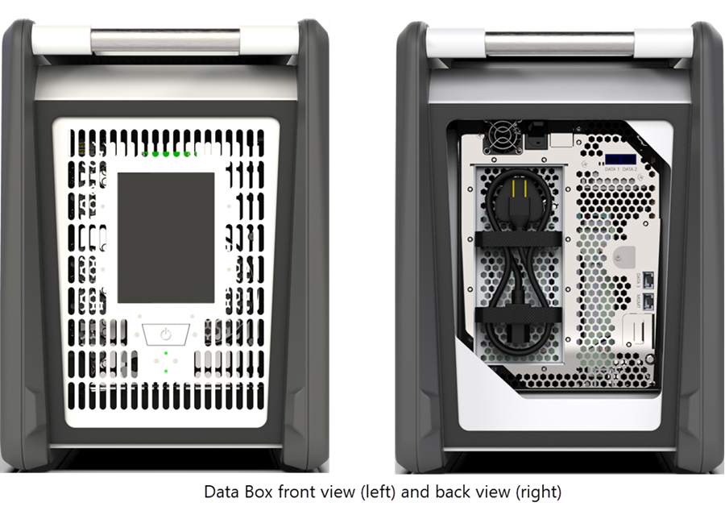

# What is Azure Data Box?

The Microsoft Azure Data Box cloud solution lets you send terabytes of data into Azure in a quick, inexpensive, and reliable way. The secure data transfer is accelerated by shipping you a proprietary Data Box storage device. Each storage device has a maximum usable storage capacity of 80 TB and is transported to your datacenter through a regional carrier. The device has a rugged casing to protect and secure data during the transit.

You can order the Data Box device via the Azure portal. Once the device is received, you can quickly set it up using the local web UI. Copy the data from your servers to the device and ship the device back to Azure. In the Azure datacenter, your data is automatically uploaded from the device to Azure. The entire process is tracked end-to-end by the Data Box service in the Azure portal.

## Use cases

Use Data Box to transfer TBs of data in scenarios with no to limited network connectivity. The data movement can be one-time, periodic, or an initial bulk data transfer followed by periodic transfers. Here are the various scenarios where Data Box can be used for data transfer.

 - **One time migration** - when large amount of on-premises data is moved to Azure. For example, moving data from offline tapes to archival data in Azure cool storage.

 - **Incremental transfer** - when an initial bulk transfer is done using Data Box Disk (seed) followed by incremental transfers over the network. For example, Commvault and Data Box Disk are used to move backup copies to Azure. This migration is followed by copying incremental data via network to Azure storage.

- **Periodic uploads** - when large amount of data is generated periodically and needs to be moved to Azure. For example in energy exploration, where video content is generated on oil rigs and windmill farms.      

## Features and specifications

The Data Box device has the following features in this release.

| Specifications                                          | Description              |
|---------------------------------------------------------|--------------------------|
| Weight                                                  | ~ 50 lbs.                |
| Dimensions                                              | Device - Width: 344 mm Height: 307 mm Length: 389 mm   Case - Width: 483 mm Height: 356 mm Length: 483 mm |            
| Rack space                                              | 7 U when placed in the rack (cannot be rack-mounted)|
| Cables                                                  | 1 X Power cable   2 X 1 Gbps RJ45 cables   2 X 10 Gbps SFP+ copper cables|
| Components                                              | Built-in power supply unit (PSU)|
| Storage capacity                                        | 100 TB   80 TB usable capacity after RAID 5 protection|
| Network interfaces                                      | 2 X 1 GbE interface  - 1 interface dedicated to management, not user configurable, used for initial setup. The other interface is for data, is user configurable and is DHCP by default. These network interfaces can work as 10 GbE as well.   2 X 10 GbE interface - DHCP (default) or static, user configurable, both are data interfaces. |
| Data transfer media                                     | RJ45, SFP+ copper 10 GbE Ethernet.  |
| Security                                                | Combination lock.   Tamper-evident rugged device casing.|
| Data transfer rate                                      | Up to 80 TB in a day over 10 GbE network interface.        |
| Management                                              | Local web UI - one-time initial setup and configuration   Azure portal - day-to-day device management        |

## Data Box components

The Data Box includes the following components:

* **Data Box device** - a physical device that provides primary storage, manages communication with cloud storage, and helps to ensure the security and confidentiality of all data that is stored on the device. The Data Box device has a usable storage capacity of 80 TB. 

    

    
* **Data Box service** – an extension of the Azure portal that lets you manage a Data Box device from a web interface that you can access from different geographical locations. Use the Data Box service to perform daily administration of your Data Box device. The service tasks include how to create and manage orders, view and manage devices and alerts, and manage shares.  

    

    For more information, go to [Use the Data Box service to administer your Data Box device](azure-data-box-portal-ui-admin.md).

* **Local web user interface** – a web-based UI that is used to configure the device so that it can connect to the local network, and then register the device with the Data Box service. Use the local web UI also to shut down and restart the Data Box device, view copy logs, and contact Microsoft Support to file a service request.

    

    For information about using the web-based UI, go to [Use the web-based UI to administer your Data Box](azure-data-box-web-ui-admin.md).

## The workflow

A typical flow includes the following steps:

1. **Order** - Create an order in the Azure portal, provide shipping information, and the destination Azure storage account for your data. If the device is available, Azure prepares and ships the device with a shipment tracking ID.

2. **Receive** - Once the device is delivered, cable the device for network and power using specified cables. Turn on and connect to the device. Configure the device network and mount shares on the host computer from where you want to copy the data.

3. **Copy data** - Copy data to Data Box shares.

4. **Return** - Prepare, turn off, and ship the device back to the Azure datacenter.

5. **Upload** - Data is automatically copied from the device to Azure. The device disks are securely erased as per the National Institute of Standards and Technology (NIST) guidelines.

Throughout this process, you are notified via email on all status changes. For more information about the detailed flow, go to [Deploy Data Box in Azure portal](data-box-deploy-ordered.md).

## Region availability

Data Box can tranfer data to the following Azure regions:

- Service availability - For this release, the Data Box service is available all of US and Europe. 
- Device availability
- Destination Storage accounts - The storage accounts that store the data are available in all Azure regions for public cloud. The regions where the storage accounts that store Data Box data should be located for optimum performance.
    We strongly recommend that you create storage accounts in the same region or very close to the region where the device is deployed. A storage account located far from the device will result in long latencies and slower performance. 

## Next steps

- Review the Data Box system requirements.
- Understand the Data Box limits.
- Quickly deploy [Azure Data Box](data-box-quickstart-portal.md) in Azure portal.

<!---Move this to a security doc

## Security considerations

Data Box provides a secure solution for data protection by ensuring that only authorized entities can view, modify, or delete your data. The security features for this solution are for the device and for the associated service ensuring the security of the data stored on them. 

### Data Box device protection

The Data Box device is protected by the following features:

- A rugged case that withstands shocks, adverse transportation, and environmental conditions. 
- Tamper-evident seals to indicate any device tampering during transit.
- Hardware and software tampering detection that prevents further device operations.
- Run only Data Box-specific software.
- Boot up in a locked state and control access via device password.
- Access credentials to copy data in and out of the device.
 
### Data Box service protection

The Data Box service is protected by the following features:

- An Azure subscription enabled for Data Box.
- Azure security features.
- Stores device password in the Azure portal. 
- Stores order details and status in the Azure portal.

### Data Box data protection

The data that flows in and out of Data Box is stored by the following features:

- AES 256-bit encryption for Data-at-rest. 
- Encrypted protocols can be used for data-in-flight.
- Secure erasure of data from device once upload to Azure is complete. -->

