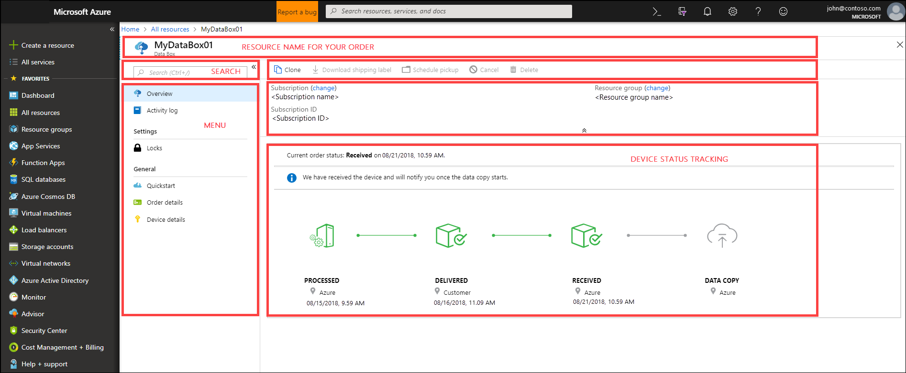
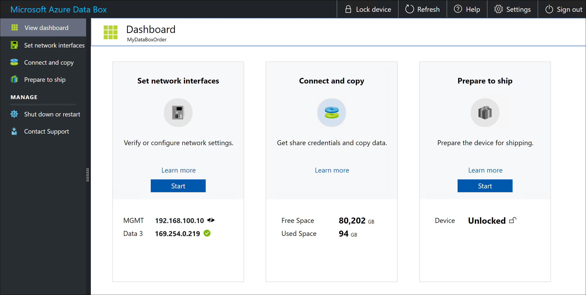

# What is Azure Data Box?

The Microsoft Azure Data Box cloud solution lets you send terabytes of data into Azure in a quick, inexpensive, and reliable way. The secure data transfer is accelerated by shipping you a proprietary Data Box storage device. Each storage device has a maximum usable storage capacity of 80 TB and is transported to your datacenter through a regional carrier. The device has a rugged casing to protect and secure data during the transit.

You can order the Data Box device via the Azure portal. Once the device is received, you can quickly set it up using the local web UI. Copy the data from your servers to the device and ship the device back to Azure. In the Azure datacenter, your data is automatically uploaded from the device to Azure. The entire process is tracked end-to-end by the Data Box service in the Azure portal.

## Use cases

Data Box is ideally suited to transfer data sizes larger than 40 TBs in scenarios with no to limited network connectivity. The data movement can be one-time, periodic, or an initial bulk data transfer followed by periodic transfers. Here are the various scenarios where Data Box can be used for data transfer.

 - **One time migration** - when large amount of on-premises data is moved to Azure. 
     - Moving a media library from offline tapes into Azure to create an online media library.
     - Migrating your VM farm, SQL server, and applications to Azure
     - Moving historical data to Azure for in-depth analysis and reporting using HDInsight

 - **Initial bulk transfer** - when an initial bulk transfer is done using Data Box (seed) followed by incremental transfers over the network. 
     - For example, backup solutions partners such as Commvault and Data Box are used to move initial large historical backup to Azure. Once complete, the incremental data is transferred via network to Azure storage.

- **Periodic uploads** - when large amount of data is generated periodically and needs to be moved to Azure. For example in energy exploration, where video content is generated on oil rigs and windmill farms.      

## Benefits

Data Box is designed to move large amounts of data to Azure with little to no impact to network. The solution has the following benefits:

- **Speed** - Data Box uses 1 Gbps or 10 Gbps network interfaces to move up to 80 TB of data into Azure.

- **Secure** - Data Box has built-in security protections for the device, data, and the service.
  - The device has a rugged casing secured by tamper-resistant screws and tamper-evident stickers. 
  - The data on the device is secured with an AES 256-bit encryption at all times.
  - The device can only be unlocked with a password provided in the Azure portal.
  - The service is protected by the Azure security features.
  - Once your data is uploaded to Azure, the disks on the device are wiped clean, in accordance with NIST 800-88r1 standards.
    
    For more information, go to [Azure Data Box security and data protection](data-box-security.md).

## Features and specifications

The Data Box device has the following features in this release.

| Specifications                                          | Description              |
|---------------------------------------------------------|--------------------------|
| Weight                                                  | < 50 lbs.                |
| Dimensions                                              | Device - Width: 309.0 mm Height: 430.4 mm Depth: 502.0 mm |            
| Rack space                                              | 7 U when placed in the rack on its side (cannot be rack-mounted)|
| Cables required                                         | 1 X power cable (included)   2 RJ45 cables   2 X SFP+ Twinax copper cables|
| Storage capacity                                        | 100 TB device has 80 TB usable capacity after RAID 5 protection|
| Power rating                                            | The power supply unit is rated for 700 W.   Typically, the unit draws 375 W.|
| Network interfaces                                      | 2 X 1 GbE interface - MGMT, DATA 3.   MGMT - for management, not user configurable, used for initial setup   DATA3 - for data, user configurable, and is dynamic by default   MGMT and DATA 3 can also work as 10 GbE   2 X 10 GbE interface - DATA 1, DATA 2   Both are for data, can be configured as dynamic (default) or static |
| Data transfer media                                     | RJ45, SFP+ copper 10 GbE Ethernet  |
| Security                                                | Rugged device casing with tamper-proof custom screws   Tamper-evident stickers placed at the bottom of the device|
| Data transfer rate                                      | Up to 80 TB in a day over 10 GbE network interface        |
| Management                                              | Local web UI - one-time initial setup and configuration   Azure portal - day-to-day device management        |

## Data Box components

The Data Box includes the following components:

* **Data Box device** - a physical device that provides primary storage, manages communication with cloud storage, and helps to ensure the security and confidentiality of all data that is stored on the device. The Data Box device has a usable storage capacity of 80 TB. 

    

    
* **Data Box service** – an extension of the Azure portal that lets you manage a Data Box device from a web interface that you can access from different geographical locations. Use the Data Box service to perform daily administration of your Data Box device. The service tasks include how to create and manage orders, view and manage alerts, and manage shares.  

    

    For more information, go to [Use the Data Box service to administer your Data Box device](data-box-portal-ui-admin.md).

* **Local web user interface** – a web-based UI that is used to configure the device so that it can connect to the local network, and then register the device with the Data Box service. Use the local web UI also to shut down and restart the Data Box device, view copy logs, and contact Microsoft Support to file a service request.

    

    For information about using the web-based UI, go to [Use the web-based UI to administer your Data Box](data-box-portal-ui-admin.md).

## The workflow

A typical flow includes the following steps:

1. **Order** - Create an order in the Azure portal, provide shipping information, and the destination Azure storage account for your data. If the device is available, Azure prepares and ships the device with a shipment tracking ID.

2. **Receive** - Once the device is delivered, cable the device for network and power using the specified cables. Turn on and connect to the device. Configure the device network and mount shares on the host computer from where you want to copy the data.

3. **Copy data** - Copy data to Data Box shares.

4. **Return** - Prepare, turn off, and ship the device back to the Azure datacenter.

5. **Upload** - Data is automatically copied from the device to Azure. The device disks are securely erased as per the National Institute of Standards and Technology (NIST) guidelines.

Throughout this process, you are notified via email on all status changes. For more information about the detailed flow, go to [Deploy Data Box in Azure portal](data-box-deploy-ordered.md).

## Region availability

Data Box can transfer data based on the region in which service is deployed, country/region to which the device is shipped, and the target Azure storage account where you transfer the data. 

- **Service availability** - For this release, the Data Box service is available in the following regions:
    - All regions in the United States - West Central US, West US2, West US, South Central US, Central US, North Central US, East US, and East US2.
    - European Union - West Europe and North Europe.
    - UK - UK South and UK West.
    - France - France Central and France South.
    - Japan - Japan East and Japan West.
    - Australia - Australia East and Australia Southeast.
    - Canada - Canada East and Canada Central.

- **Destination Storage accounts** - The storage accounts that store the data are available in all Azure regions where the service is available.  

## Next steps

- Review the [Data Box system requirements](data-box-system-requirements.md).
- Understand the [Data Box limits](data-box-limits.md).
- Quickly deploy [Azure Data Box](data-box-quickstart-portal.md) in Azure portal.

