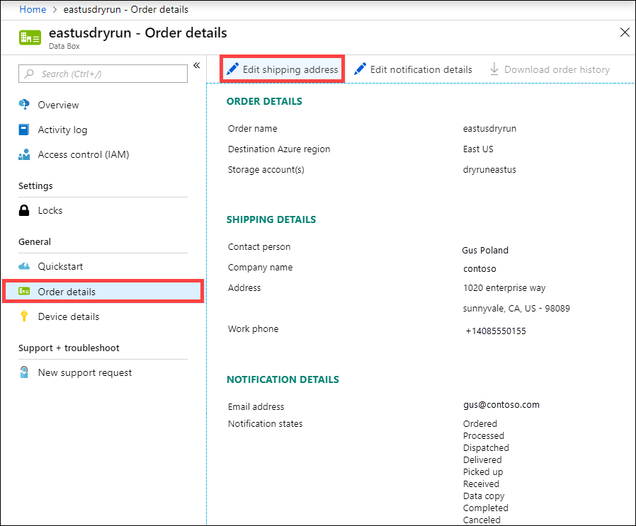
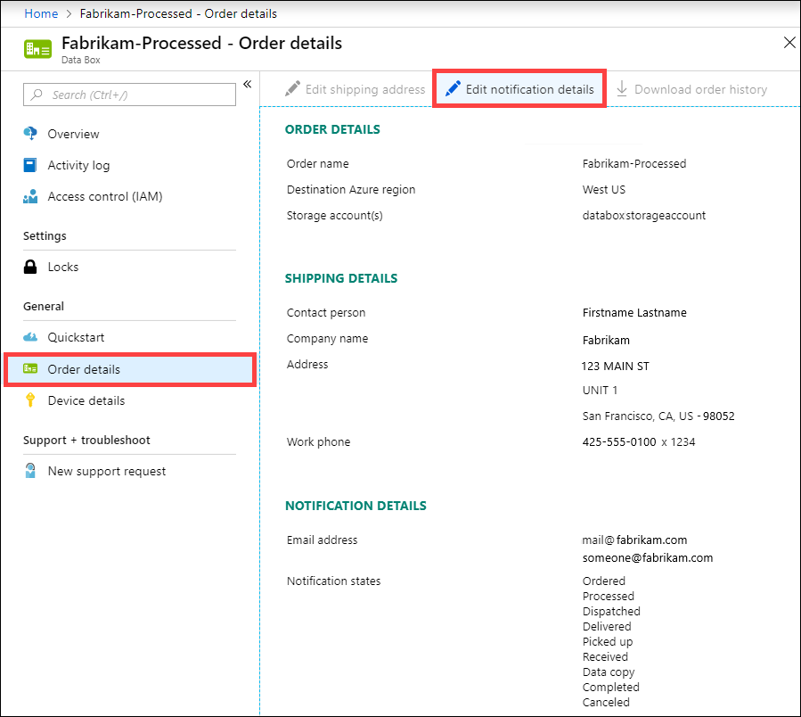
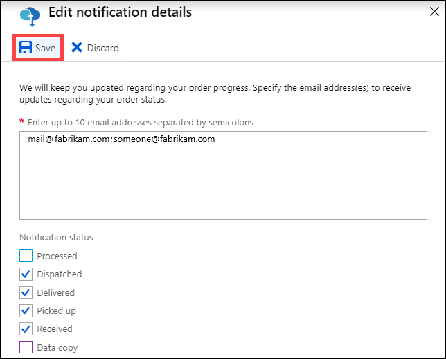

# Use the Azure portal to administer your Azure Data Box and Azure Data Box Heavy

This article applies to both Azure Data Box and Azure Data Box Heavy. This article describes some of the complex workflows and management tasks that can be performed on the Azure Data Box device. You can manage the Data Box device via the Azure portal or via the local web UI.

This article focuses on the tasks that you can perform using the Azure portal. Use the Azure portal to manage orders, manage Data Box device, and track the status of the order as it proceeds to completion.

## Cancel an order

You may need to cancel an order for various reasons after you place it.

For both import and export orders, you can only cancel the order before it's processed. Once your order is processed and the Data Box device is prepared, you can't cancel the order.

Perform the following steps to cancel an order.

1.	Go to **Overview > Cancel**.

    

2.	Fill out a reason for canceling the order.  

    

3.	Once the order is canceled, the portal updates the status of the order and displays it as **Canceled**.

## Clone an order

Cloning is useful in certain situations. For example, you've used Data Box to transfer some data. As more data is generated, you need to use another Data Box device to transfer that data into Azure. In this case, you can just clone the same order.

Perform the following steps to clone an import order.

1.	Go to **Overview > Clone**. 

    

2.	All the details of the order stay the same, except for the contact person and work phone. The contact person and work phone are removed from completed or canceled orders, and won't be cloned. The order name is the original order name appended by *-Clone*. Select the checkbox to confirm that you've reviewed the privacy information. Select **Create**.

The clone is created in a few minutes and the portal updates to show the new order.


## Delete order

You may want to delete an order when the order is complete. The order contains your personal information such as name, address, and contact information. This personal information is deleted when the order is deleted.

You can only delete orders that are completed or canceled. Perform the following steps to delete an order.

1. Go to **All resources**. Search for your order.

2. Select the order you want to delete and go to **Overview**. From the command bar, click **Delete**.

    

3. Enter the name of the order when prompted to confirm the order deletion. Click **Delete**.

## Download shipping label

You may need to download the shipping label if the E-ink display of your Data Box isn't working and doesn't display the return shipping label. There's no E-ink display on Data Box Heavy, so this workflow doesn't apply to Data Box Heavy.

Perform the following steps to download a shipping label.

1.	Go to **Overview > Download shipping label**. This option is available only after the device has shipped. 

    

2.	This downloads the following return shipping label. Save the label and print it out. Fold and insert the label into the clear sleeve on the device. Ensure that the label is visible. Remove any stickers that are on the device from previous shipping.

    

## Edit shipping address

You may need to edit the shipping address once the order is placed. This is only available until the device is dispatched. Once the device is dispatched, this option is no longer available.

Perform the following steps to edit the order.

1. Go to **Order details > Edit shipping address**.

    

2. Edit and validate the shipping address and then save the changes.

    

## Edit notification details

You may need to change the users who receive the order status emails. For instance, a user needs to be informed when the device is delivered or picked up. Another user may need to be informed when the data copy is complete so they can verify the data is in the Azure storage account before deleting it from the source. In these instances, you can edit the notification details.

Perform the following steps to edit notification details.

1. Go to **Order details > Edit notification details**.

    

2. You can now edit the notification details and then save the changes.
 
    


## Download order history

Once the Data Box order is complete, the data on the device disks is erased. When the device cleanup is complete, you can download the order history in the Azure portal.

Perform the following steps to download the order history.

1. In your Data Box order, go to **Overview**. Ensure that the order is complete. If the order is complete and the device cleanup is complete, then go to **Order details**. **Download order history** option is available.

    

2. Click **Download order history**. The downloaded history includes a record of carrier tracking logs. There will be two sets of log corresponding to the two nodes on a Data Box Heavy device. If you scroll down to the bottom of this log, you can see the links to:
    
   - **Copy logs** - have the list of files that errored out during the data copy from the Data Box to your Azure storage account (import order) or from your storage account to the Data Box (export order).
   - **Audit logs** - contain information on how to power on the Data Box and access shares on it when the Data Box is outside the Azure datacenter.
   - **BOM files in import order** - have the list of files (also known as the file manifest) that you can download during **Prepare to ship** and has file names, file sizes, and the file checksums.
   - **Verbose logs in export order** - have the list of files with file names, file sizes, and checksum computation when the data was copied from the Azure Storage accounts to the Data Box.

   Here's a sample of an order history from an import order.

    ```output
    -------------------------------
    Microsoft Data Box Order Report
    -------------------------------
    Name                                               : DataBoxTestOrder                              
    StartTime(UTC)                                     : 10/31/2018 8:49:23 AM +00:00                       
    DeviceType                                         : DataBox                                           
    -------------------
    Data Box Activities
    -------------------
    Time(UTC)                 | Activity                       | Status          | Description  
    
    10/31/2018 8:49:26 AM     | OrderCreated                   | Completed       |                                                   
    11/2/2018 7:32:53 AM      | DevicePrepared                 | Completed       |                                                   
    11/3/2018 1:36:43 PM      | ShippingToCustomer             | InProgress      | Shipment picked up. Local Time : 11/3/2018 1:36:43        PM at AMSTERDAM-NLD                                                                                
    11/4/2018 8:23:30 PM      | ShippingToCustomer             | InProgress      | Processed at AMSTERDAM-NLD. Local Time : 11/4/2018        8:23:30 PM at AMSTERDAM-NLD                                                                        
    11/4/2018 11:43:34 PM     | ShippingToCustomer             | InProgress      | Departed Facility in AMSTERDAM-NLD. Local Time :          11/4/2018 11:43:34 PM at AMSTERDAM-NLD                                                               
    11/5/2018 1:38:20 AM      | ShippingToCustomer             | InProgress      | Arrived at Sort Facility LEIPZIG-DEU. Local Time :        11/5/2018 1:38:20 AM at LEIPZIG-DEU                                                                
    11/5/2018 2:31:07 AM      | ShippingToCustomer             | InProgress      | Processed at LEIPZIG-DEU. Local Time : 11/5/2018          2:31:07 AM at LEIPZIG-DEU                                                                            
    11/5/2018 4:05:58 AM      | ShippingToCustomer             | InProgress      | Departed Facility in LEIPZIG-DEU. Local Time :            11/5/2018 4:05:58 AM at LEIPZIG-DEU                                                                    
    11/5/2018 4:35:43 AM      | ShippingToCustomer             | InProgress      | Transferred through LUTON-GBR. Local Time :              11/5/2018 4:35:43 AM at LUTON-GBR                                                                         
    11/5/2018 4:52:15 AM      | ShippingToCustomer             | InProgress      | Departed Facility in LUTON-GBR. Local Time :              11/5/2018 4:52:15 AM at LUTON-GBR                                                                        
    11/5/2018 5:47:58 AM      | ShippingToCustomer             | InProgress      | Arrived at Sort Facility LONDON-HEATHROW-GBR.            Local Time : 10/5/2018 5:47:58 AM at LONDON-HEATHROW-GBR                                                
    11/5/2018 6:27:37 AM      | ShippingToCustomer             | InProgress      | Processed at LONDON-HEATHROW-GBR. Local Time :            11/5/2018 6:27:37 AM at LONDON-HEATHROW-GBR                                                            
    11/5/2018 6:39:40 AM      | ShippingToCustomer             | InProgress      | Departed Facility in LONDON-HEATHROW-GBR. Local          Time : 11/5/2018 6:39:40 AM at LONDON-HEATHROW-GBR                                                    
    11/5/2018 8:13:49 AM      | ShippingToCustomer             | InProgress      | Arrived at Delivery Facility in LAMBETH-GBR. Local        Time : 11/5/2018 8:13:49 AM at LAMBETH-GBR                                                         
    11/5/2018 9:13:24 AM      | ShippingToCustomer             | InProgress      | With delivery courier. Local Time : 11/5/2018            9:13:24 AM at LAMBETH-GBR                                                                               
    11/5/2018 12:03:04 PM     | ShippingToCustomer             | Completed       | Delivered - Signed for by. Local Time : 11/5/2018        12:03:04 PM at LAMBETH-GBR                                                                          
    1/25/2019 3:19:25 PM      | ShippingToDataCenter           | InProgress      | Shipment picked up. Local Time : 1/25/2019 3:19:25        PM at LAMBETH-GBR                                                                                       
    1/25/2019 8:03:55 PM      | ShippingToDataCenter           | InProgress      | Processed at LAMBETH-GBR. Local Time : 1/25/2019          8:03:55 PM at LAMBETH-GBR                                                                            
    1/25/2019 8:04:58 PM      | ShippingToDataCenter           | InProgress      | Departed Facility in LAMBETH-GBR. Local Time :            1/25/2019 8:04:58 PM at LAMBETH-GBR                                                                    
    1/25/2019 9:06:09 PM      | ShippingToDataCenter           | InProgress      | Arrived at Sort Facility LONDON-HEATHROW-GBR.            Local Time : 1/25/2019 9:06:09 PM at LONDON-HEATHROW-GBR                                                
    1/25/2019 9:48:54 PM      | ShippingToDataCenter           | InProgress      | Processed at LONDON-HEATHROW-GBR. Local Time :            1/25/2019 9:48:54 PM at LONDON-HEATHROW-GBR                                                            
    1/25/2019 10:30:20 PM     | ShippingToDataCenter           | InProgress      | Departed Facility in LONDON-HEATHROW-GBR. Local          Time : 1/25/2019 10:30:20 PM at LONDON-HEATHROW-GBR                                                   
    1/26/2019 2:17:10 PM      | ShippingToDataCenter           | InProgress      | Arrived at Sort Facility BRUSSELS-BEL. Local Time        : 1/26/2019 2:17:10 PM at BRUSSELS-BEL                                                              
    1/26/2019 2:31:57 PM      | ShippingToDataCenter           | InProgress      | Processed at BRUSSELS-BEL. Local Time : 1/26/2019        2:31:57 PM at BRUSSELS-BEL                                                                          
    1/26/2019 3:37:53 PM      | ShippingToDataCenter           | InProgress      | Processed at BRUSSELS-BEL. Local Time : 1/26/2019        3:37:53 PM at BRUSSELS-BEL                                                                          
    1/27/2019 11:01:45 AM     | ShippingToDataCenter           | InProgress      | Departed Facility in BRUSSELS-BEL. Local Time :          1/27/2019 11:01:45 AM at BRUSSELS-BEL                                                                 
    1/28/2019 7:11:35 AM      | ShippingToDataCenter           | InProgress      | Arrived at Delivery Facility in AMSTERDAM-NLD.            Local Time : 1/28/2019 7:11:35 AM at AMSTERDAM-NLD                                                     
    1/28/2019 9:07:57 AM      | ShippingToDataCenter           | InProgress      | With delivery courier. Local Time : 1/28/2019            9:07:57 AM at AMSTERDAM-NLD                                                                             
    1/28/2019 1:35:56 PM      | ShippingToDataCenter           | InProgress      | Scheduled for delivery. Local Time : 1/28/2019            1:35:56 PM at AMSTERDAM-NLD                                                                            
    1/28/2019 2:57:48 PM      | ShippingToDataCenter           | Completed       | Delivered - Signed for by. Local Time : 1/28/2019        2:57:48 PM at AMSTERDAM-NLD                                                                         
    1/29/2019 2:18:43 PM      | PhysicalVerification           | Completed       |                                              
    1/29/2019 3:49:50 PM      | DeviceBoot                     | Completed       | Appliance booted up successfully                  
    1/29/2019 3:49:51 PM      | AnomalyDetection               | Completed       | No anomaly detected.                               
    1/29/2019 4:55:00 PM      | DataCopy                       | Started         |                                                 
    2/2/2019 7:07:34 PM       | DataCopy                       | Completed       | Copy Completed.                                   
    2/4/2019 7:47:32 PM       | SecureErase                    | Started         |                                                  
    2/4/2019 8:01:10 PM       | SecureErase                    | Completed       | Azure Data Box:DEVICESERIALNO has been sanitized          according to NIST 800-88 Rev 1.                                                                       

    ------------------
    Data Box Log Links
    ------------------

    Account Name         : Gus                                                       
    Copy Logs Path       : databoxcopylog/DataBoxTestOrder_CHC533180024_CopyLog_73a81b2d613547a28ecb7b1612fe93ca.xml
    Audit Logs Path      : azuredatabox-chainofcustodylogs\7fc6cac9-9cd6-4dd8-ae22-1ce479666282\chc533180024
    BOM Files Path       : azuredatabox-chainofcustodylogs\7fc6cac9-9cd6-4dd8-ae22-1ce479666282\chc533180024      
    ```

    You can then go to your storage account and view the copy logs.

   

   You can also view the chain of custody logs, which include the audit logs and the BOM files.

   

## View order status

When the device status changes in the portal, you're notified via an email.

### Statuses for import order

Here are the statuses for an import order.

|Order status |Description |
|---------|---------|
|Ordered     | Successfully placed an order. <br>If the device is available, Microsoft identifies a device for shipment and prepares the device. <br> If the device isn't available immediately, the order will be processed when the device becomes available. The order could take several days to a couple months to process. If the order can't be fulfilled in 90 days, the order is canceled and you're notified.         |
|Processed     | Order processing is complete. As per your order, the device is prepared for shipment in the datacenter.         |
|Dispatched     | Order has shipped. Use the tracking ID displayed in your order in the portal to track the shipment.        |
|Delivered     | Shipment was delivered to the address specified in the order.        |
|Picked up     |Your return shipment was picked up and scanned by the carrier.         |
|Received     | Your device is received and scanned at the Azure datacenter. <br> Once the shipment is inspected, device upload will start.      |
|Data copy     | Data copy is in progress. Track the copy progress for your order in Azure portal. <br> Wait until the data copy is complete. |
|Completed       |Successfully completed the order.<br> Verify your data is in Azure before you delete the on-premises data from servers.         |
|Completed with errors| Data copy was completed but errors occurred during the copy. <br> Review the copy logs using the path provided in the Azure portal. See [examples of copy logs when upload completed with errors](./data-box-logs.md#upload-completed-with-errors).   |
|Completed with warnings| Data copy was completed but your data was modified. The data had non-critical blob or file name errors that were fixed by changing the file or blob names. <br> Review the copy logs using the path provided in the Azure portal. Make a note to the modifications in your data. See [examples of copy logs when upload completed with warnings](./data-box-logs.md#upload-completed-with-warnings).   |
|Canceled            |Order is canceled. <br> Either you canceled the order or the service canceled the order after an error occurred. If the order can't be fulfilled in 90 days, the order is also canceled and you're notified.     |
|Clean up | The data on the device disks is erased. The device cleanup is considered complete when the order history is available for download in the Azure portal.|

### Statuses for export order

Here are the statuses for an export order.

|Order status |Description |
|---------|---------|
|Ordered     | Successfully placed an export order. <br>If the device is available, Microsoft identifies a device for shipment and prepares the device. <br> If the device isn't available immediately, order will be processed when the device becomes available. The order could take several days to a couple months to process. If the order can't be fulfilled in 90 days, the order is canceled and you're notified.         |
|Canceled            |Order is canceled. <br> Either you canceled the order (you can cancel only before the order is processed) or an error was encountered and the service canceled the order. If the order can't be fulfilled in 90 days, the order is also canceled and you're notified.     |
|Processed     | Order processing is complete. As per your order, the device is prepared for data copy in the datacenter. Device shares are created.         |
|Data copy in progress     | Data copy from the specified Azure Storage accounts to the device is in progress. Track the copy progress for your order in Azure portal. <br> Wait until the data copy is complete. |
|Copy completed     | Data copy from the specified Azure Storage accounts to the device is complete. A verbose log file (if the option was enabled in the order) and a copy log are created in your storage account. The verbose log contains the information on all the files (name, path, computation checksum) that are copied to the device. The copy log contains the summary of the copy process including a list of files that couldn't be copied because of any errors. <br> The storage account data stays as is. |
|Copy completed with errors| Data copy was completed but errors occurred during the copy. <br> Review the copy logs in the Azure Storage account using the path provided in the Azure portal. See [examples of copy logs when download completed with errors](./data-box-logs.md#upload-completed-with-errors).   |
|Copy completed with warnings| Data copy from Azure Storage account was completed but the data had non-critical errors. <br> Review the copy logs using the path provided in the Azure portal. Make a note of the non-critical errors. See [examples of copy logs when download completed with warnings](./data-box-logs.md#upload-completed-with-warnings).   |
|Copy failed with errors| Data copy from Azure Storage account failed, and the order is terminated. A device won't be shipped. <br> Review the copy logs in the Azure Storage account using the path provided in the Azure portal. See [examples of copy logs when download failed with errors](./data-box-logs.md#upload-completed-with-errors).   |
|Dispatched     |Order has shipped. Use the tracking ID displayed in your order in the portal to track the shipment.        |
|Delivered     |Shipment was delivered to the address specified in the order.        |
|Picked up     |Your return shipment was picked up and scanned by the carrier.         |
|Received     | Your device is received and scanned at the Azure datacenter. <br> The shipment is inspected.      |
|Completed           |Order is complete.     |
|Clean up | The data on the device disks is erased. The device cleanup is considered complete when the order history is available for download in the Azure portal.|

> [!NOTE]
> If the copy job to export data from Azure Storage accounts to Data Box completes with errors or warnings, the device still ships. Only in case of a copy failure, the order is terminated and the device does not ship out.


If you're using self-managed shipping, after the copy is complete and before you receive the device, you'll see the following states (instead of the ones mentioned in the preceding table):

|Order status |Description |
|---------|---------|
|Ready for pickup at Azure datacenter      |The device is ready to be picked up at the Azure datacenter.        |
|Picked up    |You've picked up the device.         |
|Ready to receive at Azure datacenter     |The device is ready to be received at the Azure datacenter.        |
|Received     |The device has been received at the Azure datacenter.      |

## Get device password

When you order your device, you can choose to use the default system-generated device password or your own password. Either way, the device password is set at the factory and can't be changed. 

You can find out the device password by viewing your order in the Azure portal.

[!INCLUDE [data-box-get-device-password](../../includes/data-box-get-device-password.md)]

> [!NOTE]
> After several failed login attempts using an incorrect password, your admin account will be locked out of the device. The account lock will clear after a few minutes, and you can connect again.  
> - Data Box 4.1 and later: The account is locked for 15 minutes after 5 failed login attempts. 
> - Data Box 4.0 and earlier: The account is locked for 30 minutes after 3 failed login attempts.


## Next steps

- Learn how to [Troubleshoot Data Box and Data Box Heavy issues](data-box-troubleshoot.md).