# Use Azure portal to administer your Data Box (Preview)

The tutorials in this article apply to the Microsoft Azure Data Box running Preview release. This article describes some of the complex workflows and management tasks that can be performed on the Data Box and Data Box Disk. 

You can manage the Data Box using the Data Box service UI (referred to as the portal UI) and the local web UI for the device. Data Box Disk can only be managed via the Azure portal. This article focuses on the tasks that you can perform using the Azure portal. Use the Azure portal to manage orders, manage devices, and track the status of the order as it proceeds to the terminal stage.

This article includes the following tutorials:

- Cancel an order
- Clone an order
- Download shipping label
- Edit shipping address
- Edit notification details
- View order status

> [!IMPORTANT]
> Data Box is in preview. Review the [Azure terms of service for preview](https://azure.microsoft.com/support/legal/preview-supplemental-terms/) before you deploy this solution.

## Cancel an order

You may need to cancel an order for various reasons after you have placed the order. You can only cancel the order while the Data Box device is being prepared. Once the device is prepared and dispatched, it is not possible to cancel the order. 

Perform the following steps to cancel a order.

1.	Go to **Overview > Cancel**. 

    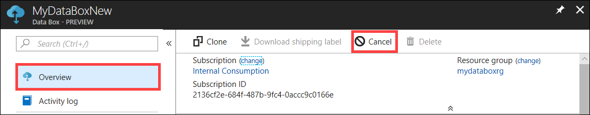

2.	Fill out a reason for canceling the order.  

    

3.	Once the order is canceled, the portal updates the status of the order and displays it as **Canceled**.

    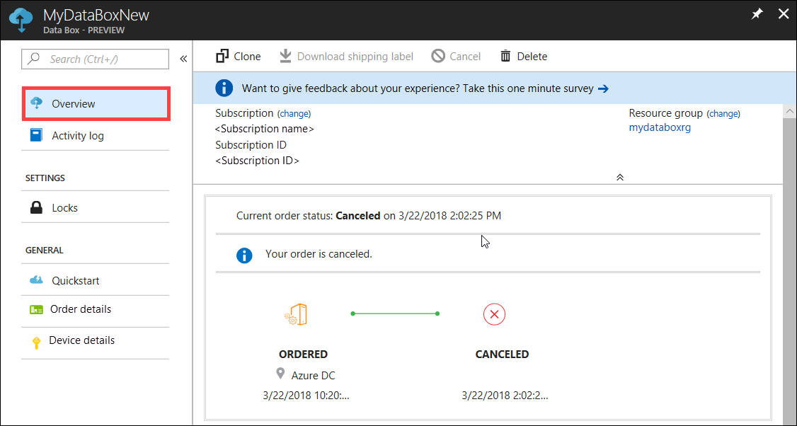

You do not receive an email notification when the order is canceled.

## Clone an order

Cloning is useful in certain situations. For example, a user has used Data Box device to transfer some data. As more data is generated, there is a need for more devices to transfer that data into Azure. In this case, the same order can be just cloned over.

Perform the following steps to clone an order.

1.	Go to **Overview > Clone**. 

    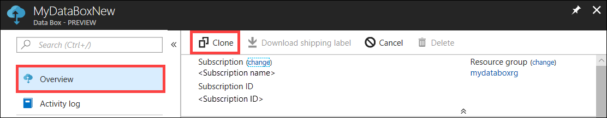

2.	All the details of the order stay the same. The order name is the original order name appended by *-Clone*. Select the checkbox to confirm that you have reviewed the privacy information. Click **Create**. 

    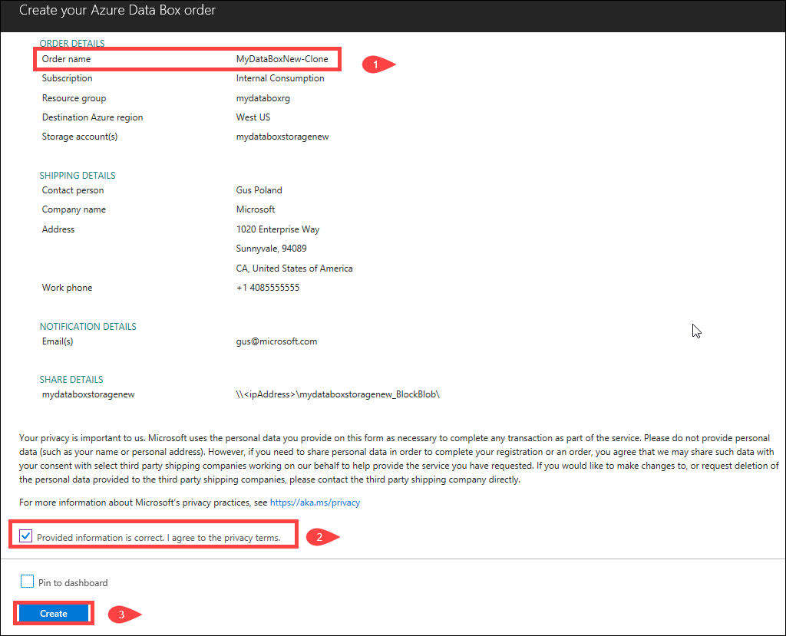 

The clone will be created in a few minutes and the portal will update to show the new order.

[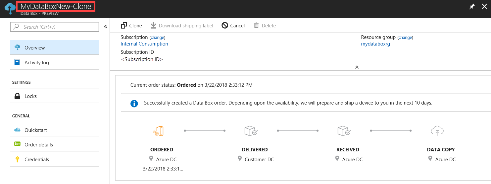](media/data-box-portal-ui-admin/clone-order3.png#lightbox) 

## Delete order

You may want to delete an order when the order is complete. The order contains your personal information such as name, address, and contact information. This personal information is deleted when the order is deleted.

You can only delete orders that are completed or canceled. Perform the following steps to delete an order.

1. Go to **All resources**. Search for your order.

    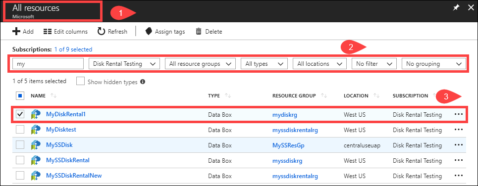

2. Click the order you want to delete and go to **Overview**. From the command bar, click **Delete**.

    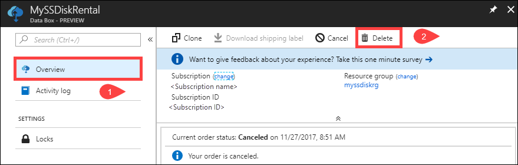

3. Enter the name of the order when prompted to confirm the order deletion. Click **Delete**.

     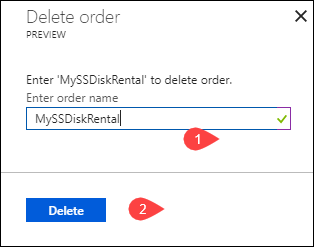

## Download shipping label

You may need to download the shipping label if the the return shipping label shipped with your device is misplaced or lost. You may also need a shipping label if the e-ink display of your device is not functioning.

Perform the following steps to download a shipping label.
1.	Go to **Overview > Download shipping label**. This option is available only after the device is shipped. 

    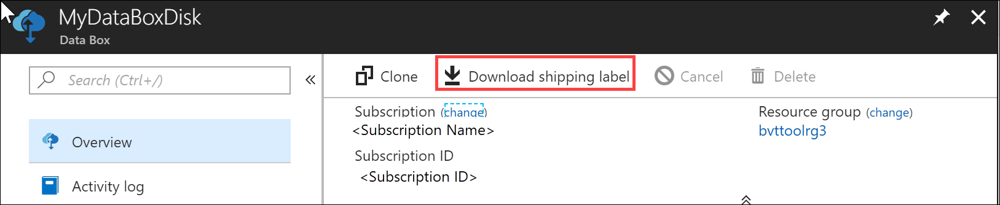

2.	This downloads the following return shipping label. Save the label, print it out, and affix to the return shipment.

    

## Edit shipping address

You may need to edit the shipping address once the order is placed. This is only available until the device is dispatched. Once the device is dispatched, this option will no longer be available.

Perform the following steps to edit the order.

1. Go to **Order details > Edit shipping address**.

    

2. You can now edit the shipping address and then save the changes.

    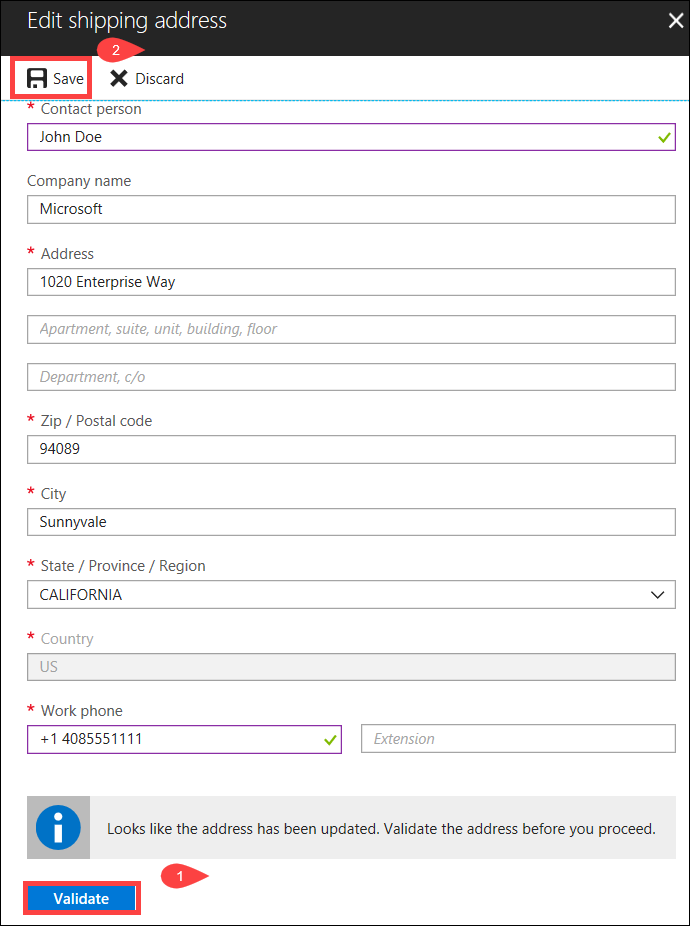

## Edit notification details

You may need to change the users whom you want to recieve the order status emails. For instance, a user needs to be informed when the device is delivered or picked up. Another user may need to be informed when the data copy is complete so he can verify the data is in the Azure storage account before deleting it from the source. In these instances, you can edit the notification details.

Perform the following steps to edit notification details.

1. Go to **Order details > Edit notification details**.

    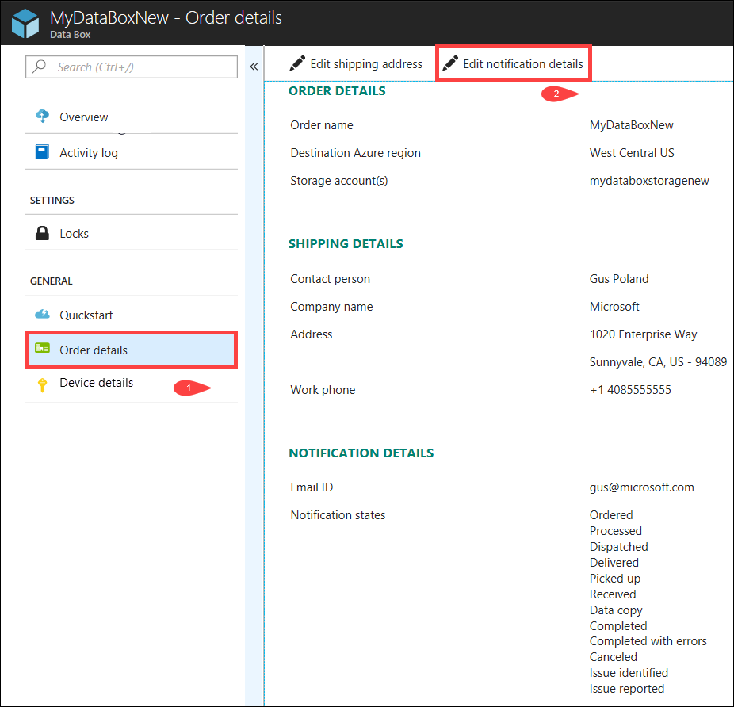

2. You can now edit the notification details and then save the changes.
 
    

## View order status

|Order status |Description |
|---------|---------|
|Ordered     | Successfully placed an order.   If the disks are not available, you receive a notification.  If the disks are available, Microsoft identifies a device for shipment and prepares the device package.        |
|Processed     | Order processing is complete.   During order processing, following actions occur:<li>Disks are encrypted using AES-128 BitLocker encryption. </li> <li>The Data Box Disk are locked to prevent anyone from accessing the disks while in transit.</li><li>The passkey that unlocks the disks is generated during this process.</li>        |
|Dispatched     | Order has shipped. You should receive the order in 1-3 days.        |
|Delivered     | Order was delivered to the address specified in the order.  You have 3 days of free use to copy data on to the disks. For more information, go to [Pricing](data-box-disk-overview.md#pricing).        |
|Picked up     |Your return shipment was picked up.   Once the shipment is recieved at Azure datacenter, data will be automatically uploaded to Azure.         |
|Received     | Your disks were received at the Azure datacenter. Data copy will start soon.        |
|Data copied     |Data copy is in progress.  Wait until the data copy is complete.         |
|Completed       |Successfully completed the order.  Verfiy your data is in Azure before you delete the on-premises data from servers.         |
|Completed with errors| Data copy was completed but errors were received.   Review the copy logs using the path provided in the **Overview**. For more information, go to [Download diagnostic logs](data-box-disk-troubleshoot.md#download-diagnostic-logs).   |
|Canceled            |Order is canceled.   Either you canceled the order or an error was encountered and the service canceled the order.     |

## Next steps

- Learn how to [Troubleshoot Data Box Disk issues](data-box-disk-troubleshoot.md).
