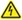
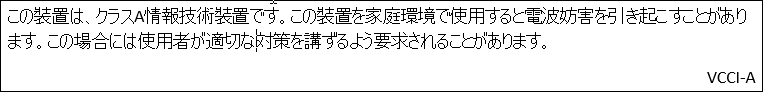
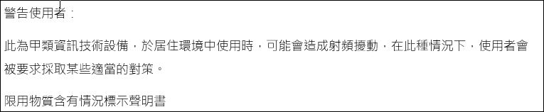

# Safely install and operate your Azure Data Box

 **READ SAFETY AND HEALTH INFORMATION**

Read all the safety information in this article before you use Azure Data Box. Failure to follow instructions could result in fire, electric shock, or other injuries, or damage to your properties.

## Safety icon conventions
Here are the icons that you will find when you review the safety precautions to be observed when setting up and running your Data Box.

| Icon | Description |
|:--- |:--- |
|  **DANGER!** |Indicates a hazardous situation that, if not avoided, will result in death or serious injury. This signal word is to be limited to the most extreme situations. |
|  **WARNING!** |Indicates a hazardous situation that, if not avoided, could result in death or serious injury. |
|  **CAUTION!** |Indicates a hazardous situation that, if not avoided, could result in minor or moderate injury. |
|  **NOTICE:** |Indicates information considered important, but not hazard-related. |
|  **Electrical Shock Hazard** |High voltage. |
|  **Heavy Weight** | |
|  **No User Serviceable Parts** |Do not access unless properly trained. |
|  **Read All Instructions First** | |
|  **Tip Hazard** | |

## Handling precautions

  **CAUTION** 

* Inspect the *as-received* device for damages. If the device enclosure is damaged, contact Microsoft Support to obtain a replacement. Do not attempt to operate the device. 
* The device is equipped with tamper-proof screws. If you suspect the device is malfunctioning, contact Microsoft Support  to obtain a replacement. Do not attempt to service the device. 
* The device contains no user-serviceable parts. Hazardous voltage, current, and energy levels are present inside. Do not open. Return the device to Microsoft for servicing.

  **WARNING!** 

* A fully configured enclosure can weigh up to 22.7 kg (50 lbs); do not try to lift it by yourself.
* Before moving the enclosure, always ensure that two people are available to handle the weight. Be aware that one person attempting to lift this weight can sustain injuries.

  **WARNING!**
* Place the device on a flat, hard, and stable surface to avoid a potential tip hazard.
* Rack-mounted equipment is not to be used as shelves or work spaces. Do not place the Data Box on top of rack-mounted equipment. Adding any type of load to an extended rack-mounted unit can create a potential tip hazard that could lead to injury, death, or product damage.

 **WARNING!**

* Set up the device in a work area allowing for adequate air circulation around the device.
* Install the device in a temperature-controlled indoor area free of conductive contaminants and allow for adequate air circulation around the device.
* Keep the device away from sources of liquid and excessively humid environments.

## Electrical precautions

  **WARNING!**

* Provide a safe electrical earth connection to the power supply cord. The AC cord has a three-wire grounding plug (a plug that has a grounding pin). This plug fits only a grounded AC outlet. Do not defeat the purpose of the grounding pin.
* Given that the plug on the power supply cord is the main disconnect device, ensure that the socket outlets are located near the device and are easily accessible.
* Unplug the power cord (by pulling the plug, not the cord) and disconnect all cables if any of the following conditions exist:

    - The power cord or plug becomes frayed or otherwise damaged.
    - You spill something into the device casing.
    - The device is exposed to rain or excess moisture.
    - The device was dropped and the device casing is damaged.
    - You suspect the device needs service or repair.
* Permanently unplug the unit before you move it or if you think it has become damaged in any way.
* Provide a suitable power source with electrical overload protection to meet the following power specifications:

    - Voltage: 100 V AC to 240 V AC
    - Current: 6 A, maximum
    - Frequency: 50 Hz to 60 Hz

 **CAUTION:**

* This device contains coin cell batteries. Do not attempt to service the device. Batteries in this device are not user serviceable. 
* **For service personnel only**: Risk of Explosion if battery is replaced by an incorrect type. Dispose of the used batteries according to instructions.

 **NOTICE:**

For the proper operation of your device and to prevent product damage:

* Ensure that the front and back doors are fully open while the device is running.

## Regulatory information

This section contains regulatory information for Azure Data Box, regulatory model number DB010.

This device is:

- Evaluated as Information Technology Equipment (ITE), designed to operate in a typical data room environment. The suitability of this product for other environments may require further evaluation.
- Designed for use with NRTL Listed (UL, CSA, ETL, etc.), and IEC/EN 60950-1 or IEC/EN 62368-1 compliant (CE marked) Information Technology equipment.
- Designed to operate in the following environment. 
    - Operating temperature: 50° to 95° F (10° to 35° C)
    - Storage temperature: -4° to 122° F (-20° to 50° C)
    - Relative humidity: 15% to 85% (noncondensing) 
    - Operating altitude: Tested up to 6500 feet (0 meters to 2000 meters)

For electrical supply ratings, refer to the device rating label provided with the unit. 

 **NOTICE:** 

Changes or modifications made to the device not expressly approved by Microsoft may void the user’s authority to operate the device.

**CANADA and USA:**

 **NOTICE:** 

This equipment has been tested and found to comply with the limits for a Class A digital device, pursuant to part 15 of the FCC Rules. These limits are designed to provide reasonable protection against harmful interference when the equipment is operated in a commercial environment. This equipment generates, uses, and can radiate radio frequency energy and, if not installed and used in accordance with the instruction manual, may cause harmful interference to radio communications. Operation of this equipment in a residential area is likely to cause harmful interference in which case the user will be required to correct the interference at their own expense.

This device complies with part 15 of the FCC Rules and Industry Canada license-exempt RSS standard(s). Operation is subject to the following two conditions: (1) this device may not cause harmful interference, and (2) this device must accept any interference received, including interference that may cause undesired operation of the device.

CAN ICES-3(A)/NMB-3(A)

Microsoft Corporation, One Microsoft Way, Redmond, WA 98052, USA.

United States: (800) 426-9400

Canada: (800) 933-4750

**EUROPEAN UNION:**

A copy of the EU Declaration of Conformity is available here.

 **WARNING:** 

This is a class A product. In a domestic environment, this product may cause radio interference in which case the user may be required to take adequate measures.

**Disposal of waste batteries and electrical and electronic equipment:**

This symbol on the product or its batteries or its packaging means that this product and any batteries it contains must not be disposed of with your household waste. Instead, it is your responsibility to hand this over to an applicable collection point for the recycling of batteries and electrical and electronic equipment. This separate collection and recycling will help to conserve natural resources and prevent potential negative consequences for human health and the environment due to the possible presence of hazardous substances in batteries and electrical and electronic equipment, which could be caused by inappropriate disposal. For more information about where to drop off your batteries and electrical and electronic waste, please contact your local city/municipality office, your household waste disposal service, or the shop where you purchased this product. Contact *erecycle\@microsoft.com* for additional information on WEEE.

This product contains coin cell battery(ies).

Microsoft Ireland Sandyford Ind Est Dublin D18 KX32 IRL

Telephone number: +353 1 295 3826

Fax number: +353 1 706 4110 

**Japan**

<!--**South Korea**

**China RoHS Hazardous Substances Table**

**Taiwan**

-->

After you have reviewed these safety notices, you can set up and cable your device.

## Next steps

* [Cable and connect your Data Box](data-box-deploy-set-up.md)

