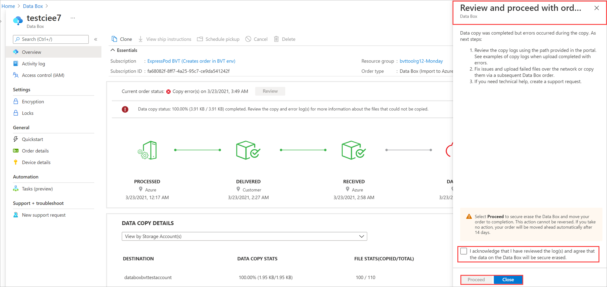

# Troubleshoot errors that pause a data upload in Azure Data Box and Azure Data Box Heavy

This article details information on how to troubleshoot errors that cause a data copy to pause while data is being uploaded to the cloud from an Azure Data Box or Azure Data Box Heavy device.

The following notification appears in the Azure portal. To resume the data copy, you must confirm you want to proceed after reviewing the errors in the copy log. Or you can cancel the data copy. For more information, see [Return Azure Data Box and verify data upload to Azure](data-box-deploy-picked-up.md?tabs=in-us-canada-europe#verify-data-upload-to-azure-8). 

The information in this article does not apply to export orders created for Data Box.

## Error classes

Data configuration errors that pause a data upload to the cloud from a Data Box and Data Box Heavy device are summarized as follows.

These errors can't be fixed during the data copy. Evaluate each error to decide whether to proceed with the data copy or cancel it and create a new import order.

| Error category        | Description           | Recommended action        |
|-----------------------|-----------------------|---------------------------|
|                       |                       |                           | 

For information about other types of copy log entries, see [Tracking and event logging for your Azure Data Box and Azure Data Box Heavy import order](data-box-logs.md).

## Container or share name errors (Example category)

These are errors related to container and share names.

### Error description (title)

**Error code:** xxx 

**Suggested resolution:** xxx 

## Next steps

- [Verify a data upload to Azure](data-box-deploy-picked-up.md?tabs=in-us-canada-europe#verify-data-upload-to-azure-8)
