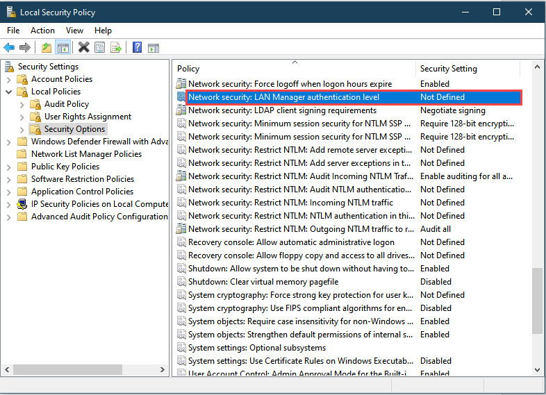
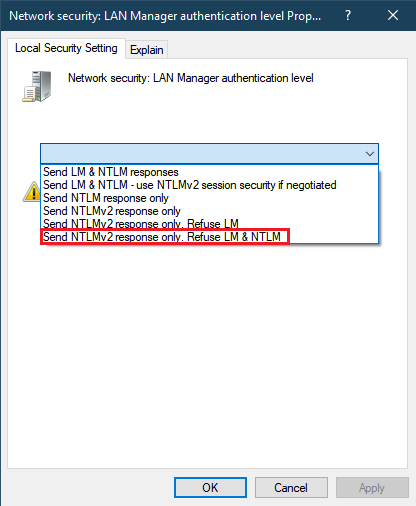
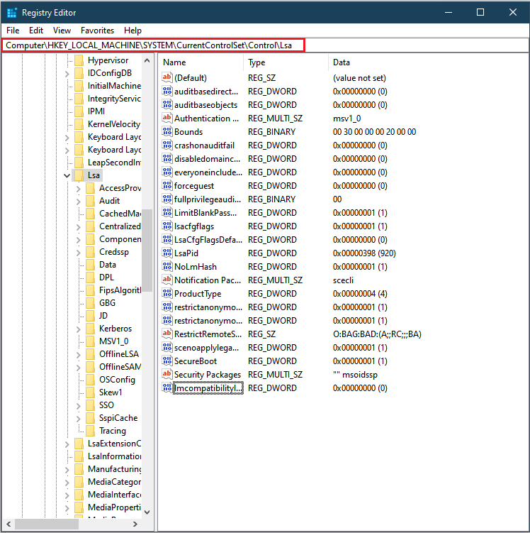
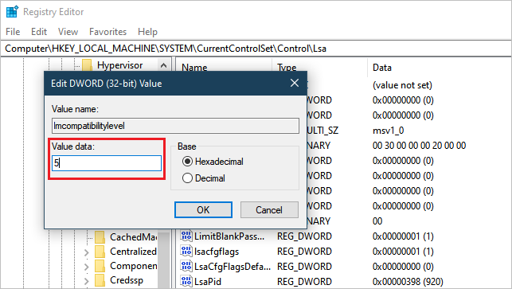

# Troubleshoot lost connection to Azure Data Box

<!--[!INCLUDE [<title>](<filepath>)] - Will a SKU tag be needed?-->

This article describes how to troubleshoot network issues when you can't connect to your Azure Data Box device.<!--Source KB is for Data Box, Data Box Gateway, and Azure Stack Edge devices. Make an include?-->

## Unable to connect to Data Box device

### Possible causes

The most common causes of a lost connection to a Data Box include:

- a domain issue
- a group policy is preventing a connection
- a permissions issue<!--What about certificates?-->


### Check for a domain issue

1. Check for a domain issue. Use one of the following formats to sign in to your device:<!--1) Step 1 is to open the device by typing "https://<device IP>" in their browser? Use RDC? Or do we assume -->

   - `<device IP address>\<user name>`
   - `\<user name>`

   If the credentials don't work in either format, the problem isn't a domain issue.

1. To check whether a group policy is preventing the connection, move the client/host machine to an organizational unit (OU) that doesn't have any group policies applied if possible. LINK TO INSTRUCTIONS.

1. If you can't connect to the device in the new OU, you need to run diagnostics:

   1. [Run diagnostics and collect device logs](azure-stack-edge-gpu-troubleshoot.md) to identify other issues that might be preventing a connection:

   1. Review the `Smbserver.Security` event logs in the `etw` folder for an error similar to one of the errors identified (in bold) in the following sample entry.<!--Different format to get bold or highlights?-->
   
      ```powershell
      SMB Session Authentication Failure
      Client Name: \\<ClientIP>
      Client Address: <ClientIP:Port>
      User Name:
      Session ID: 0x100000000021
      Status: *The attempted logon is invalid. This is either due to a bad username or authentication information.* (0xC000006D)
      SPN: session setup failed before the SPN could be queried
      SPN Validation Policy: SPN optional / no validation
      Guidance:
      You should expect this error when attempting to connect to shares using incorrect credentials.
      This error does not always indicate a problem with authorization, but mainly authentication. It is more common with non-Windows clients.
      This error can occur when using incorrect usernames and passwords with NTLM, mismatched LmCompatibility settings between client and server, an incorrect service principal name, duplicate Kerberos service principal names, incorrect Kerberos ticket-granting service tickets, or Guest accounts without Guest access enabled.
      You may also find the following error in the Smbserver.Security event logs :
      *LmCompatibilityLevel value is different from the default.*
      *Configured LM Compatibility Level: 5*
      *Default LM Compatibility Level: 3*
      Guidance:
      LAN Manager (LM) authentication is the protocol used to authenticate Windows clients for network operations. This includes joining a domain, accessing network resources, and authenticating users or computers. This determines which challenge/response authentication protocol is negotiated between the client and the server computers. Specifically, the LM authentication level determines which authentication protocols the client will try to negotiate or the server will accept. The value set for LmCompatibilityLevel determines which challenge/response authentication protocol is used for network logons. This value affects the level of authentication protocol that clients use, the level of session security negotiated, and the level of authentication accepted by servers.
      Value (Setting) - Description
      0 (Send LM & NTLM responses) - Clients use LM and NTLM authentication and never use NTLMv2 session security. Domain controllers accept LM, NTLM, and NTLMv2 authentication.
      1 (Send LM & NTLM - use NTLMv2 session security if negotiated) - Clients use LM and NTLM authentication, and use NTLMv2 session security if the server supports it. Domain controllers accept LM, NTLM, and NTLMv2 authentication.
      2 (Send NTLM response only) - Clients use NTLM authentication only and use NTLMv2 session security if the server supports it. Domain controllers accept LM, NTLM, and NTLMv2 authentication.
      3 (Send NTLM v2 response only) - Clients use NTLMv2 authentication only and use NTLMv2 session security if the server supports it. Domain controllers accept LM, NTLM, and NTLMv2 authentication.
      4 (Send NTLMv2 response only/refuse LM) - Clients use NTLMv2 authentication only and use NTLMv2 session security if the server supports it. Domain controllers refuse LM and accept only NTLM and NTLMv2 authentication.
      5 (Send NTLM v2 response only/refuse LM & NTLM) - Clients use NTLMv2 authentication only and use NTLMv2 session security if the server supports it. Domain controllers refuse LM and NTLM and accept only NTLMv2 authentication.
      Incompatibly configured LmCompatibility levels between a client and server (such as 0 on a client and 5 on a server) prevent access to the server. Non-Microsoft clients and servers also provide these configuration settings.
      ```     

 1.  If you find either of these errors in the `Smbserver.Security` event logs, do the following steps to resolve the issue:
 
     1. Run `secpol.msc.`

     1. Go to **Local Policies** > **Security Options** > **Network Security: LAN Manager authentication level**.

        

      1. Change the LAN manager authentication level to **Send NTLMv2 response only. Refuse LM & NTLM**.

        

1. If you can't change the LAN Manager authentication level using `secpol`, use the Registry Editor to update the Registry directly:

    1. To open the Registry Editor, open a command prompt, and run `regedt32`.

    1. Go to HKEY_LOCAL_MACHINE > SYSTEM > CurrentControlSet > Control > LSA.

       

    1. In the **LSA** folder, select and click **LMCompatibilityLevel** to open a window for editing the value data.

    1. Change the **Value data** setting to 5.

        

    1. Restart the system so that the Registry changes take effect.<!--They are restarting the client computer?-->

1. Connect to your Data Box device. LINK TO PROCEDURE.

## Next steps

- [Copy data via SMB](data-box-deploy-copy-data.md)<!--Other options: via REST, via NFS, To managed disks-->
- [Copy data via network-attached storage (NAS)](data-box-deploy-copy-data-via-copy-service)