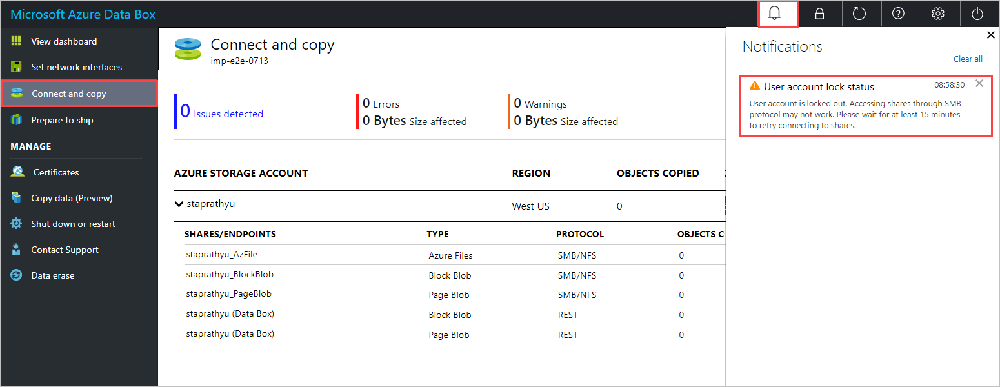
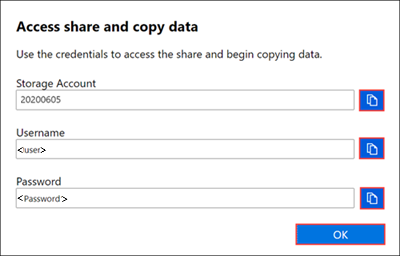
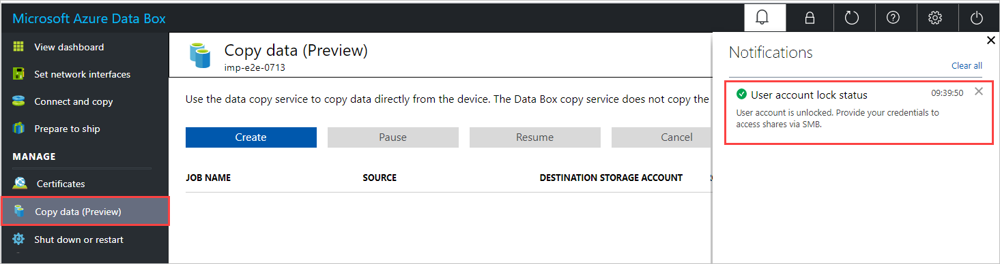
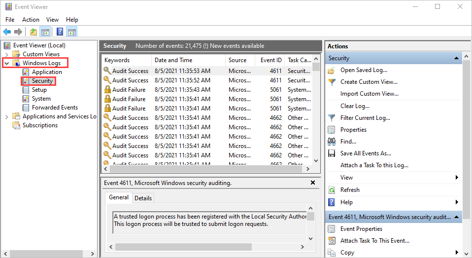
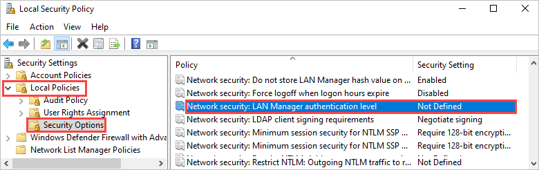
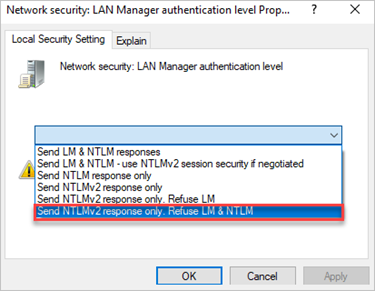
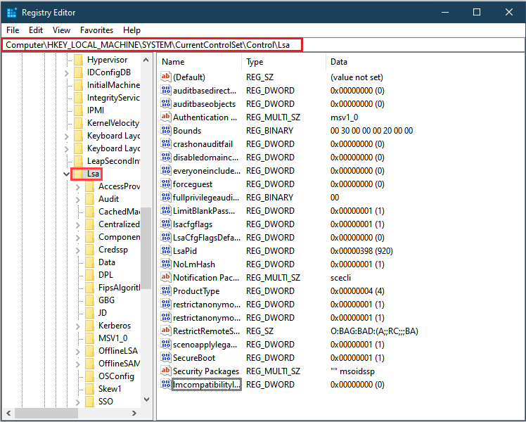
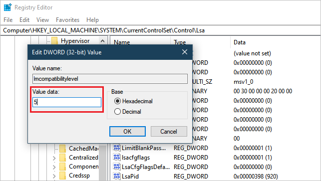

# Troubleshoot share connection failure during data copy to Azure Data Box

This article describes what to do when you can't connect to an SMB share on your Azure Data Box device because of a network issue.

The most common reasons for being unable to connect to a share on your device are:

- [a domain issue](#check-for-a-domain-issue)
- [account is locked out of the share](#account-locked-out-of-share)
- [a group policy is preventing a connection](#check-for-a-blocking-group-policy)
- [a permissions issue](#check-for-permissions-issues)

## Check for a domain issue

To find out whether a domain issue is preventing a share connection:

- Try to connect to the device, and use one of the following formats to enter your user name:

    - `<device IP address>\<user name>`
    - `\<user name>`

If you can connect to the device, a domain issue isn't preventing your share connection.

## Account locked out of share

After five failed attempts to connect to a share with an incorrect password, the share will be locked, and you won't be able to connect for 15 minutes.
 
The failed connection attempts may include background processes, such as retries, which you may not be aware of.

> [!NOTE]
> If you have an older device with Data Box version 4.0 or earlier, the account is locked for 30 minutes after 3 failed login attempts.

**Error description.** You'll see one of the following errors, depending on how you're accessing the share:

- If you're trying to connect from your host computer via SMB, you'll see this error: "The referenced account is currently locked out and may not be logged on to."

  The following example shows the output from one such connection attempt.

  ```
  C:\Users\Databoxuser>net use \\10.100.100.10\mydbresources_BlockBlob /u:10.100.100.10\mydbresources
  Enter the password for '10.100.100.10\mydbresources' to connect to '10.100.100.10':
  System error 1909 has occurred.
  
  The referenced account is currently locked out and may not be logged on to.
  ```

- If you're using the data copy service, you'll get the following notification in the local web UI of your device:

  


**Suggested resolution.** To connect to an SMB share after a share account lockout, do these steps:

1. If the dashboard status indicates the device is locked, unlock the device from the top command bar and retry the connection.

    :::image type="content" source="media/data-box-troubleshoot-share-access/dashboard-locked.png" alt-text="Screenshot of the dashboard locked status.":::

1. If you are still unable to connect to an SMB share after unlocking your device, verify the SMB credentials for the share. In the local web UI of your device, go to **Connect and copy**, and select **SMB** for the share. You'll see the following dialog box.

    

1. After the lockout period ends (either 15 minutes or half an hour), the lock will clear. You can now connect to the share.

   - To connect to the share from your host computer via SMB, run the following command. For a procedure, see [Copy data to Data Box via SMB](data-box-deploy-copy-data.md#connect-to-data-box).
  
     `net use \\<IP address of the device>\<share name> /u:<IP address of the device>\<user name for the share>`

   - To connect to a share using the data copy service, check for a notification that indicates the user account has been unlocked, as shown below. On the **Copy data** pane, you can now [copy data to the Data Box](data-box-deploy-copy-data-via-copy-service.md#copy-data-to-data-box).

     


## Check for a blocking group policy

Check whether a group policy on your client/host computer is preventing you from connecting to the share. If possible, move your client/host computer to an organizational unit (OU) that doesn't have any Group Policy objects (GPOs) applied.

To ensure that no group policies are preventing your access to shares on the Data Box:

* Ensure that your client/host computer is in its own OU for Active Directory.

* Make sure that no GPOs are applied to your client/host computer. You can block inheritance to ensure that the client/host computer (child node) doesn't automatically inherit any GPOs from the parent. For more information, see [block inheritance](/previous-versions/windows/it-pro/windows-server-2008-R2-and-2008/cc731076(v=ws.11)).

## Check for permissions issues

If there's no domain issue, and no group policies are blocking your access to the share, check for permissions issues on your device by reviewing audit logs and security event logs.

### Review security event logs

Review Windows security event logs on the device for errors that indicate an authentication failure.

You can review the `Smbserver.Security` event logs in the `etw` folder or view security errors in Event Viewer.

To review Windows Security event logs in Event Viewer, do these steps:

1. To open the Windows Event Viewer, on the **Start screen**, type **Event Viewer**, and press Enter.

1. In the Event Viewer navigation pane, expand **Windows Logs**, and select the **Security** folder.

    

3. Look for one of the following errors:

    Error 1:

    ```xml
    SMB Session Authentication Failure
    Client Name: \\<ClientIP>
    Client Address: <ClientIP:Port>
    User Name:
    Session ID: 0x100000000021
    Status: The attempted logon is invalid. This is either due to a bad username or authentication information. (0xC000006D)
    SPN: session setup failed before the SPN could be queried
    SPN Validation Policy: SPN optional / no validation
    ```
      
    Error 2:
    ```xml
     LmCompatibilityLevel value is different from the default.
    Configured LM Compatibility Level: 5
    Default LM Compatibility Level: 3   
    ```

    Either error indicates that you need to change the LAN Manager authentication level on your device.
 
### Change LAN Manager authentication level
 
To change the LAN Manager authentication level on your device, you can either [use Local Security Policy](#use-local-security-policy) or [update the registry directly](#update-the-registry).

#### Use Local Security Policy

To change LAN Manager authentication level using Local Security Policy, do these steps:
 
1. To open Local Security Policy, on the **Start** screen, type `secpol.msc`, and then press Enter.

1. Go to **Local Policies** > **Security Options**, and open **Network Security: LAN Manager authentication level**.

    

1. Change the setting to **Send NTLMv2 response only. Refuse LM & NTLM**.

    

#### Update the registry

If you can't change the LAN Manager authentication level in Local Security Policy, update the registry directly.

To update the registry directly, do these steps:

1. To open Registry Editor (regedit32.exe), on the **Start** screen, type `regedt32`, and then press Enter.

1. Navigate to: HKEY_LOCAL_MACHINE > SYSTEM > CurrentControlSet > Control > LSA.

    

1. In the LSA folder, open the LMCompatibilityLevel registry key, and change its value to 5.

    

1. Restart your computer so that the registry changes take effect.

## Next steps

- [Copy data via SMB](data-box-deploy-copy-data.md).
- [Troubleshoot data copy issues in Data Box](data-box-troubleshoot.md).
- [Contact Microsoft support](data-box-disk-contact-microsoft-support.md).